# #flaskconf19

> 原文：<https://dev.to/heymarkkop/flaskconf19-322i>

9 月 7 日和 8 日，在巴西 Florianópolis - SC 举行了一次技术会议。即使是以 Flask(Python 的微框架)为主题，演讲也是非常多样化的。在这篇文章中，我将描述一些我在参加它时学到的东西。

[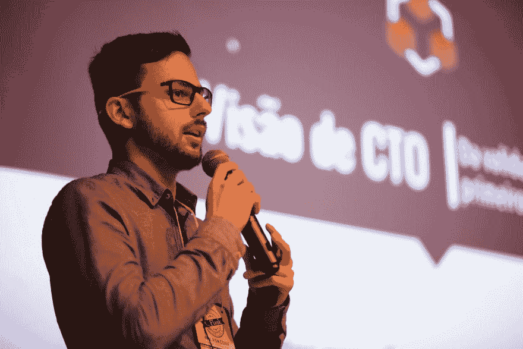](https://res.cloudinary.com/practicaldev/image/fetch/s--C1ouVHcP--/c_limit%2Cf_auto%2Cfl_progressive%2Cq_auto%2Cw_880/https://live.staticflickr.com/65535/48727142262_b495e37404_k.jpg)

● **一个 CTO 的愿景**
*Lucas Vieira May*

Lucas 谈到了一个开发者的企业家愿景，并展示了一个好的 MVP(最低价值产品)的重要性，重点是它的核心特性和持续部署。他还引用了雷德·霍夫曼(LinkedIn 的联合创始人)的话:“如果你对你产品的第一个版本不感到尴尬，那你就推出得太晚了。”

[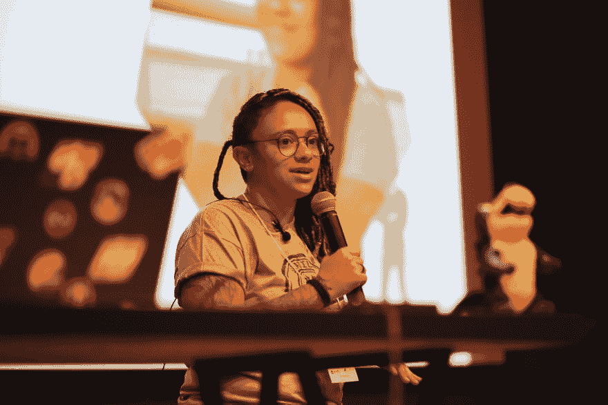](https://res.cloudinary.com/practicaldev/image/fetch/s--I4v8HYfU--/c_limit%2Cf_auto%2Cfl_progressive%2Cq_auto%2Cw_880/https://live.staticflickr.com/65535/48727131262_7c4a745dbe_k.jpg)

● **用烧瓶部署机器学习**
*Nana ray THz*

Nana 展示了使用 Docker、Flask 和 Jupyter 部署机器学习应用程序的一些步骤，该应用程序可以预测给定国家的糖尿病发病率。

[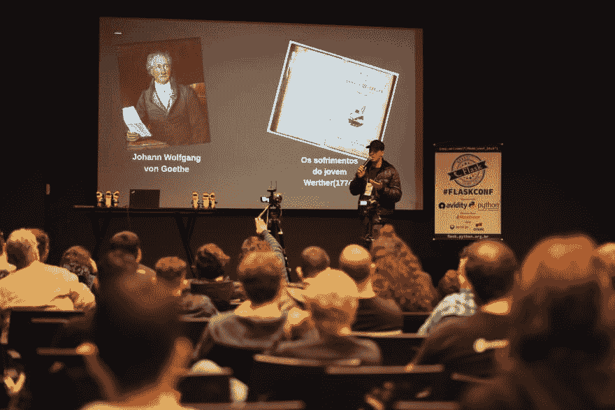](https://res.cloudinary.com/practicaldev/image/fetch/s--cO3pk7z6--/c_limit%2Cf_auto%2Cfl_progressive%2Cq_auto%2Cw_880/https://live.staticflickr.com/65535/48726602393_6a0b978a96_k.jpg)

● **信息保存**
*作者马塞洛·安德里奥利*

马塞洛谈到了一个公众健康问题，这个问题越来越严重，却没有被讨论:一个人结束了自己的生命。他解释了这种禁忌的起源(少年维特之烦恼- 1774)，并分享了世界卫生组织建议的一些应对这种情况的方法。

● **主题演讲:体验**
*比安卡·罗莎*

Bianca 谈到了天才和特权是如何联系在一起的，女性如何在她的童年时代激励她，以及尊重和多样性在任何团队中的重要性。

[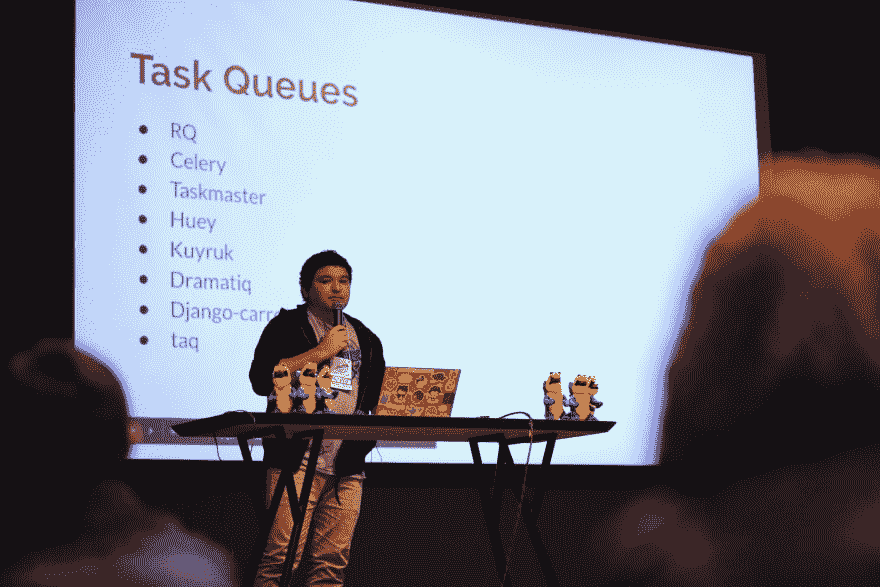](https://res.cloudinary.com/practicaldev/image/fetch/s--4CW_JotI--/c_limit%2Cf_auto%2Cfl_progressive%2Cq_auto%2Cw_880/https://live.staticflickr.com/65535/48726576043_ce00c4dcc9_k.jpg)

● **高射炮后台的异步任务**
*菲利普·冈萨加*

Philippe 解释了在 Flask 应用程序中使用后台运行的异步任务的一些概念和动机，这在音频/视频处理、webscrapping、繁重计算等情况下很常见。在他的演讲中，他使用 Redis 作为消息代理，使用芹菜作为任务队列。

[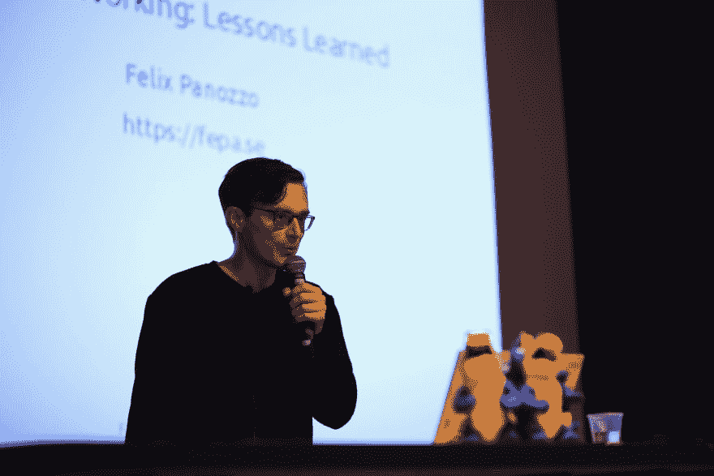](https://res.cloudinary.com/practicaldev/image/fetch/s--2TPrxD3k--/c_limit%2Cf_auto%2Cfl_progressive%2Cq_auto%2Cw_880/https://live.staticflickr.com/65535/48727097571_f755cb1c2c_k.jpg)

● **远程工作**
*菲利克斯·帕诺佐*

Felix 分享了一些提高远程工作效率的技巧。他给出了从团队成员那里收集意见和经验的建议，并鼓励进行试验和反思，作为一种自我提高的学习。一些实用的建议是:不要总是在线，将透明度作为一个目标，有效地使用仪表板，并亲自参加会议。

[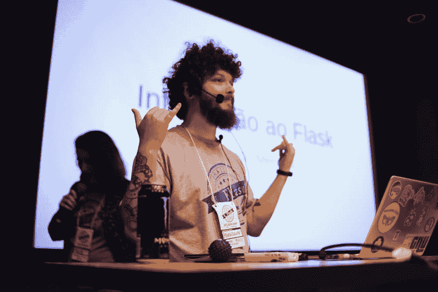](https://res.cloudinary.com/practicaldev/image/fetch/s--Bnjpl5xG--/c_limit%2Cf_auto%2Cfl_progressive%2Cq_auto%2Cw_880/https://live.staticflickr.com/65535/48727022407_3403ffa52e_k.jpg)

● **爱德华多·门德斯对烧瓶**
*的介绍*

爱德华多将 flask 呈现为一个 python 的微框架，并讲述了背后的历史(这是一个 4 月 1 日的恶作剧)。他还解释了它与 Jinja、Werkzeug 等的工作原理。

[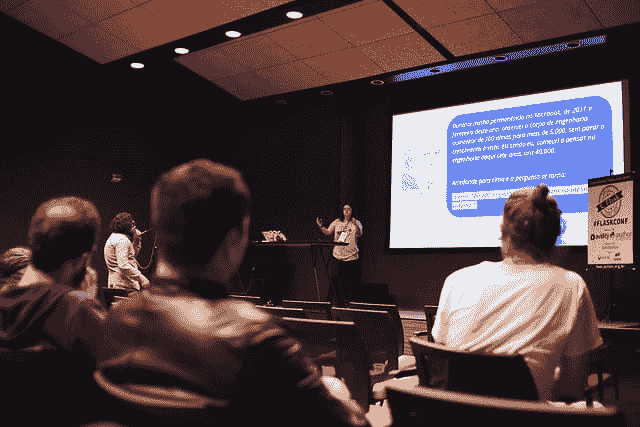](https://res.cloudinary.com/practicaldev/image/fetch/s--3kFI23bx--/c_limit%2Cf_auto%2Cfl_progressive%2Cq_auto%2Cw_880/https://live.staticflickr.com/65535/48726869251_f209d18199_z.jpg)

● **测试& &提交||回复**
*由波林·洛蒂恩*

Poline 通过用 TCR 推广 Dojo 来吸引观众:`test && commit || revert`-TDD 的实验性实践。这是一种非常有趣的开发方式，关注测试，如果测试失败，立即提交或放弃更改。一定要试试这个。

[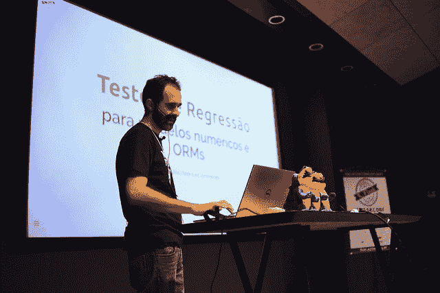](https://res.cloudinary.com/practicaldev/image/fetch/s--XazExpyG--/c_limit%2Cf_auto%2Cfl_progressive%2Cq_auto%2Cw_880/https://live.staticflickr.com/65535/48726748388_caafcda40a_z.jpg)

● **回归测试**
*伊戈尔·吉西*

根据 Igor 的说法，回归测试背后的意图是能够通过使用 fixtures 更容易和更有效地进行测试。这种技术解决了一些问题，比如在测试时创建临时文件，以及检查几个相似的资产。

[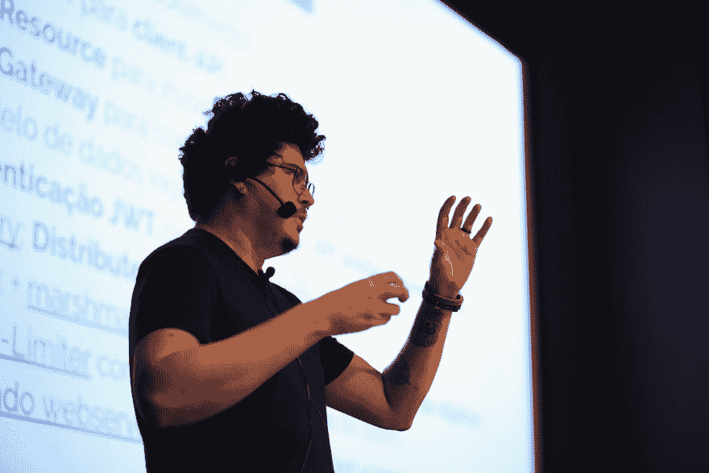](https://res.cloudinary.com/practicaldev/image/fetch/s--Kb73iLXI--/c_limit%2Cf_auto%2Cfl_progressive%2Cq_auto%2Cw_880/https://live.staticflickr.com/65535/48726738563_9642981d6f_k.jpg)

● **赖安·帕迪哈的《烧瓶中的分布式应用架构**

 *Ryan 解释了微服务背后的概念，并谈到了在开发项目时可以应用的一些不同的结构。

[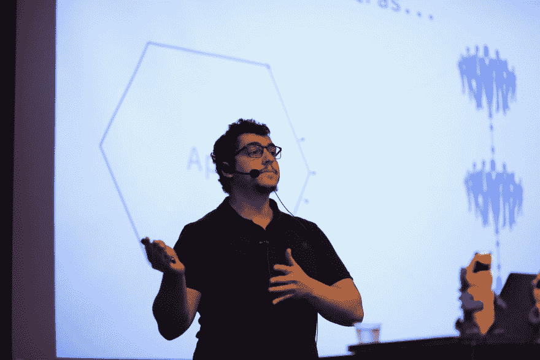](https://res.cloudinary.com/practicaldev/image/fetch/s--HyS0cZIl--/c_limit%2Cf_auto%2Cfl_progressive%2Cq_auto%2Cw_880/https://live.staticflickr.com/65535/48726736663_c3c6ecb9c5_k.jpg)

●**feli PE Alcantara 生产的带烧瓶、Envoy 和 Kubernets**
*的弹性应用*

仍然在谈论分布式应用，Felipe 展示了这些概念背后的一些幻想，以及 Envoy 如何通过应用一些弹性模式(如负载平衡、断路器和自动重试)来帮助 Kurbenetes。

[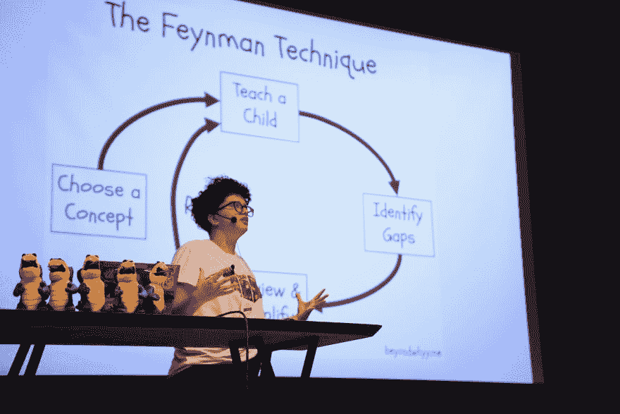](https://res.cloudinary.com/practicaldev/image/fetch/s--vFcj0oxW--/c_limit%2Cf_auto%2Cfl_progressive%2Cq_auto%2Cw_880/https://live.staticflickr.com/65535/48726724368_d1e3114d3e_k.jpg)

● **主题演讲:学会学习**
*米盖尔·苏亚雷斯*

Miguel 分享了他们在开始开发生涯时学到的一些东西。他们讨论了如何处理每天的任务，如何将我们的精力适当地花在专注和思考上。米格尔应用了费曼技术，并多次处理了冒名顶替综合症。他们还记日记，这有助于记录他们的学习进度。

[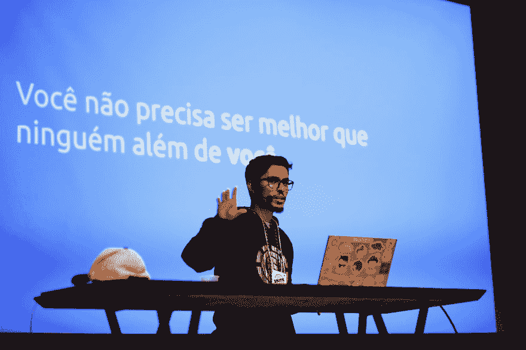](https://res.cloudinary.com/practicaldev/image/fetch/s--wCJyDvCn--/c_limit%2Cf_auto%2Cfl_progressive%2Cq_auto%2Cw_880/https://live.staticflickr.com/65535/48727166877_39701465d5_k.jpg)

● **主题演讲:焦虑**
*威廉·奥利维拉*

通过解释焦虑是我们身体的一种自然反应，它可以随着恐惧、怀疑和期望而发生，威廉分享了一些更好地应对它的好习惯。运动、调解、健康饮食和少喝咖啡是他的专业建议。

[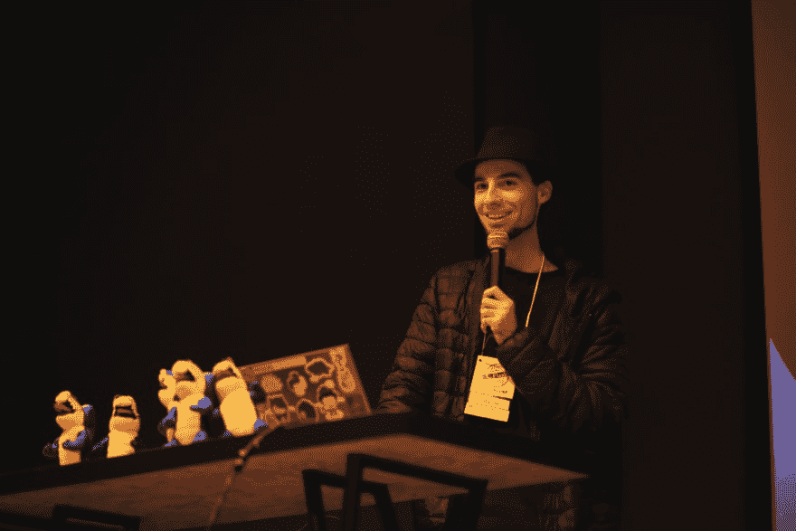](https://res.cloudinary.com/practicaldev/image/fetch/s--63x8OIxx--/c_limit%2Cf_auto%2Cfl_progressive%2Cq_auto%2Cw_880/https://live.staticflickr.com/65535/48726781023_0b0ee36d03_k.jpg)

● **闪电对话:Habitica**
*由我！*

我借此机会做了一个关于 Habitica 的演讲，Habitica 是一个习惯追踪应用程序，它把你的目标当作一个角色扮演游戏。它帮助我组织我的生活，激励我自己去完成目标。

下次 Flask Conf 再见！

[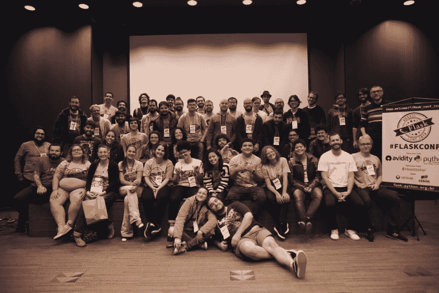](https://res.cloudinary.com/practicaldev/image/fetch/s--Z3OdrBZa--/c_limit%2Cf_auto%2Cfl_progressive%2Cq_auto%2Cw_880/https://thepracticaldev.s3.amazonaws.com/i/5i6ez7wz21c8pijk4z33.jpg)

照片由 **[卡罗莱娜·阿鲁达](https://instagram.com/_carolinaarruda)** 拍摄。*