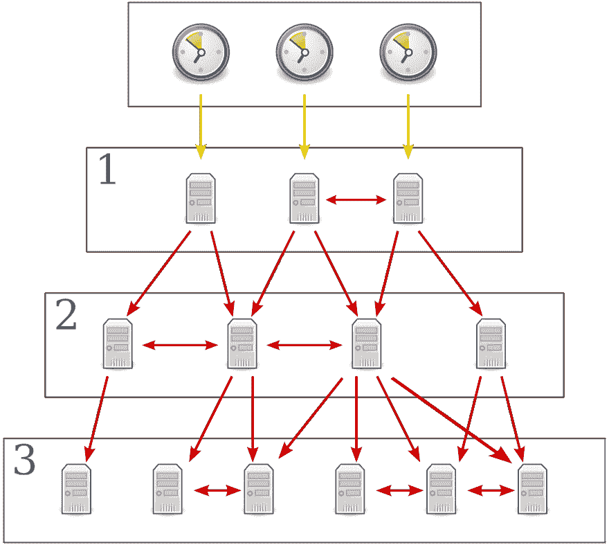

# NTP 池项目:如何使用和贡献

> 原文：<https://dev.to/piraces/the-ntp-pool-project-how-to-use-and-contribute-58gl>

# 简介

NTP 池项目是一个大型虚拟服务器场，为任何人提供 T2 NTP 服务。该项目由一个 DNS 系统组成，该系统可平衡世界各地设备(平板电脑、智能手机、电脑、路由器)的数百万次时间同步查询负载...).像 Ubuntu、[这样的供应商也为其所有的客户使用这项服务](https://help.ubuntu.com/lts/serverguide/NTP.html)(它也普遍用于许多其他的 Linux 发行版)。实际目标是为这些设备提供真实而准确的时间同步，这要归功于大量的服务器，使用它们来分配池中的负载。

实际上，这个池有大约 4000 台服务器，分布在不同的*层*，在它们之间同步时间，并提供时间同步服务。

这些服务器位于不同的*层*中，遵循 NTP 层次结构:

<figure>

[](https://res.cloudinary.com/practicaldev/image/fetch/s--PmbjXsnF--/c_limit%2Cf_auto%2Cfl_progressive%2Cq_auto%2Cw_880/https://upload.wikimedia.org/wikipedia/commons/thumb/c/c9/Network_Time_Protocol_servers_and_clients.svg/1920px-Network_Time_Protocol_servers_and_clients.svg.png)

<figcaption>Hierarchy of an NTP system</figcaption>

</figure>

要了解更多关于不同层和每个层服务器的特点，你可以看看[这里](https://en.wikipedia.org/wiki/Network_Time_Protocol#Clock_strata)。

# 使用池

如果你有兴趣使用这个令人敬畏的服务，请按照官方页面上的指示:[我如何使用 pool.ntp.org？](https://www.ntppool.org/en/use.html)

这基本上将您的 NTP 服务器更改为指向池中的服务器:

<figure>

```
server 0.pool.ntp.org
server 1.pool.ntp.org
server 2.pool.ntp.org
server 3.pool.ntp.org 
```

<figcaption>The 0, 1, 2 and 3.pool.ntp.org names point to a random set of servers that will change every hour</figcaption>

</figure>

# 投稿

> “就个人而言，我们是一滴水。合在一起，我们就是一片海洋。”
> ——龙之介·萨多罗

贡献是非常容易的，所以如果你想贡献，只需遵循以下步骤。

## 我可以投稿吗？

贡献你只需要一个静态的 IP 和永久的公共网络接入。如果你满足了这些要求，试着按照教程为这个项目做贡献吧！

*注意:请仔细阅读官方页面加入泳池，然后再继续([https://www.pool.ntp.org/en/join.html](https://www.pool.ntp.org/en/join.html))*

## 设置服务器

下面的说明是针对 Linux 发行版的，特别是针对 Ubuntu/Debian，但是软件包和配置文件在所有发行版中几乎是一样的。此外，我们将配置一台 stratum 3 服务器，但对于 stratum 4 或 stratum 2 服务器，说明几乎是相同的。

### 1。安装 NTP 守护程序

只需执行安装命令:
`sudo apt-get install ntp`

### 2。选择静态 NTP 服务器

首先，我们必须搜索要同步的第二层服务器。
**选择至少 4 台** *stratum 2 服务器*很重要，这些服务器在地理上离我们的服务器很近(至少在同一个国家)。

可以在这个官方列表中搜索服务器:[http://support . NTP . org/bin/view/Servers/StratumTwoTimeServers](http://support.ntp.org/bin/view/Servers/StratumTwoTimeServers)

如果你想配置一个 stratum 2 服务器，从 Stratum 1 列表中选择一些服务器:
[http://support . NTP . org/bin/view/Servers/StratumOneTimeServers](http://support.ntp.org/bin/view/Servers/StratumOneTimeServers)

*注意:仅选择“OpenAccess”服务器，除非您已经获得选择其他类型服务器的批准。*

一旦我们有了服务器，我们必须知道它的 IPv4 和 IPv6 地址。有时它的 IP 地址在列表中被通知，但是如果不是或者你想要确认 IP，我们可以通过执行一个基本的 *dig* 命令来提取这个信息。例如:

`dig 6.ntp.snails.email ANY`

它产生以下输出:

```
;; ANSWER SECTION:
6.ntp.snails.email. 5999    IN  A   139.162.170.219
6.ntp.snails.email. 5999    IN  AAAA 2a01:7e01::f03c:91ff:fe8b:e9e0 
```

### 3。配置 NTP 守护程序

一旦我们获得了所选服务器的所有 IP 地址，我们就可以配置 NTP 守护程序了。

修改 NTP 的配置文件，通常位于`/etc/ntp.conf`中。删除默认情况下以 *pool* 单词开头的所有行，然后按照以下格式逐行粘贴服务器:

`server ntp_server_1 iburst`

其中*‘NTP _ server _ 1’*是服务器的 IP 地址(每行一个地址)。

另外，确保您的配置文件有一个`driftfile`并且`noquery`选项出现在配置文件的限制行中。

`driftfile`选项有助于获得稳定准确的时间，存储频率偏移和所需频率，以保持与正确时间同步。

`noquery`选项不允许管理查询，这有助于防止攻击或易受可能修改服务器状态的查询的攻击。

最终的配置文件应该是这样的:

```
driftfile /var/lib/ntp/ntp.drift

server ntp_server_1 iburst
server ntp_server_2 iburst
server ntp_server_3 iburst
server ntp_server_4 iburst
server ntp_server_5 iburst

# By default, exchange time with everybody, but don't allow configuration.
restrict -4 default kod notrap nomodify nopeer noquery limited
restrict -6 default kod notrap nomodify nopeer noquery limited

# Local users may interrogate the ntp server more closely.
restrict 127.0.0.1
restrict ::1 
```

服务器后面的`iburst`选项是因为 NTP 池建议而存在的。使用此选项，如果服务器不可达，这将发送八个包而不是一个包(仅第一次)。

### 4。重新启动 NTP 守护程序并测试配置

配置完成后，我们只需重启服务来加载新的配置:

`sudo systemctl restart ntp`

重启服务后，等待 5 分钟左右，直到时间源稳定，确保 123 端口(UDP)打开，然后[测试](https://servertest.online/ntp)。您还可以使用命令`ntpq -p`测试服务，或者使用`ntpdate -q SERVER_IP`从其他服务器测试服务。

### 5。将服务器添加到 NTP 池中

这是最后一步。我们的服务器正在运行并且配置正确，所以让我们将它添加到池中。

*   进入[ntppool.org](https://www.ntppool.org)，点击[“管理服务器”](https://manage.ntppool.org/manage)。
*   注册(如果您已经有帐户，请登录)。
*   写下 NTP 服务器的主机名或其 IPv4 / IPv6 静态地址之一。
*   提交吧！

如果您也有一个 IPv6 地址，那么在添加服务器时也提交它。

完成后，您的服务器必须出现在[“您的服务器”](https://manage.ntppool.org/manage/servers)列表中，在这里您可以调整服务器的网速以满足要求。

最后，您的服务器的当前得分将随着时间的推移而提高。最初，您的服务器可能会有负的或低于 10 分的分数，这意味着它将被排除在池外。但是，让服务从源同步时间，它将被添加到池中。

### 6。恭喜你。

您的服务器是池的一部分，正在帮助同步几个设备的时间。

感谢您的贡献！！🎉

[](https://i.giphy.com/media/d7c56SbLa9PRC/giphy.gif)

*原发于我的个人博客:[https://piraces . dev/posts/the-NTP-pool-project-how-to-use-and-contribute/](https://piraces.dev/posts/the-ntp-pool-project-how-to-use-and-contribute/)T3】*