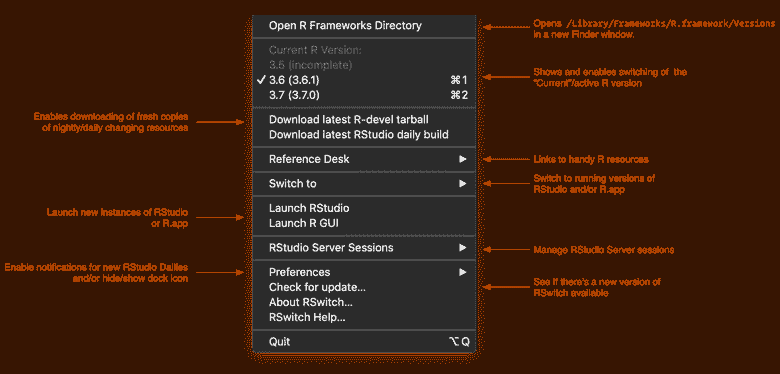
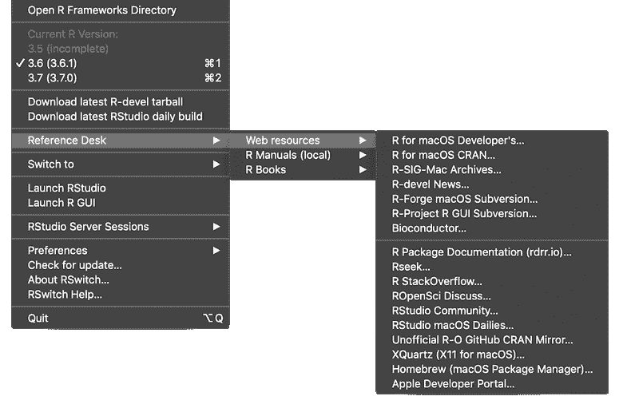
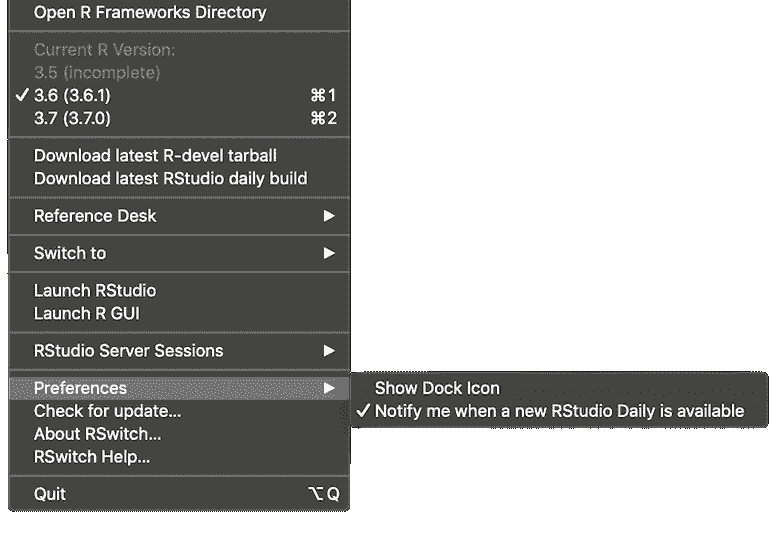

# RSwitch 1.5.0 版本现在还控制 RStudio 服务器连接

> 原文:[https://dev . to/hrbrmstr/r switch-1-5-0-release-now-also-corrals-r studio-server-connections-gbj](https://dev.to/hrbrmstr/rswitch-1-5-0-release-now-also-corrals-rstudio-server-connections-gbj)

RSwitch 是一个 macOS menubar 应用程序，可以在 macOS 10.14+上运行，为在 macOS 上使用 R 进行开发提供了便捷的快捷方式。版本 1.5.0 带来了重新组织的菜单系统以及管理和连接 RStudio 服务器实例的能力。下面是对新设置的快速浏览:

[T2】](https://i1.wp.com/rud.is/b/wp-content/uploads/2019/09/menu-info.png?ssl=1)

所有书籍、链接和其他参考资源都在单个子菜单系统下:

[T2】](https://i1.wp.com/rud.is/b/wp-content/uploads/2019/09/rswitch-1.5.0-resources-reorg.png?ssl=1)

如果你想添加资源，请点击[主 RSwitch 网站](https://rud.is/rswitch/)上的链接，在你最方便的地方提交 PRs。

您还可以设置新 RStudio 样片可用时的自动检查和通知(您仍然可以手动检查，默认情况下此检查功能处于关闭状态):

[T2】](https://i1.wp.com/rud.is/b/wp-content/uploads/2019/09/rswitch-1.5.0-prefs.png?ssl=1)

但是，最大的新功能是能够直接从 RSwitch 管理和启动 RStudio 服务器连接:

[点击观看幻灯片。](https://rud.is/b/2019/09/14/rswitch-1-5-0-release-now-also-corrals-rstudio-server-connections/#gallery-12497-1-slideshow)

这些 RStudio 服务器浏览器连接与您的互联网浏览保持分离，并且只需一个菜单选项。RSwitch 还会记住 RStudio 服务器会话窗口的大小和位置，因此一切都应该在您想要/需要/期望的位置。这在某种程度上是一个实验性的特性，所以如果你遇到任何问题或者希望事情以不同的方式进行，一定要提交问题。

### 鳍

踢踢轮胎，提出问题或要求，如果你愿意，让我知道你喜欢 RSwitch！