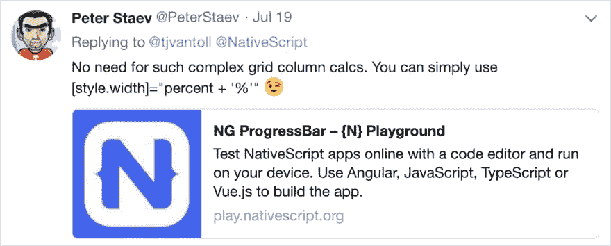

# 如何构建自定义 NativeScript 进度条

> 原文:[https://dev . to/digitalix/how-to-build-a-custom-native script-progress-bar-284n](https://dev.to/digitalix/how-to-build-a-custom-nativescript-progress-bar-284n)

在这一系列的书面和视频教程中，我将逐步改进进度条(看我在那里做了什么？)通过将 JavaScript 动画添加到其运动中，然后使用 RxJS 来制作动画。

TJ VanToll 写了一篇关于在 NativeScript Angular 应用程序中只用 JavaScript 和 CSS 构建一个简单进度条的[优秀帖子](https://www.nativescript.org/blog/building-a-simple-progressbar-for-your-nativescript-app)。帖子发布后，[彼得·斯塔夫](https://twitter.com/PeterStaev)在推特上说模板也可以简化一点。

> ## [](#then-it-hit-me-this-must-be-animated)Then it hit me; This must be an animation!

有两种动画方法我已经使用了一段时间，我想用进度条来展示:

1.  普通(强力)JavaScript 动画
2.  使用 RxJS 的动画

因此，我在这篇文章中写下了这些方法，并制作了所有方法的视频记录。你可以在这里的

之间跳转

1.  [TJ 的方法被修改](#TJs-Approach-Modified)
2.  [彼得的简化模板](#Peters-Simplified-Template)
3.  [Alex 的 JavaScript 动画新增](#Alexs-JavaScript-Animation-Added)
4.  [Alex 的 RxJS 动画新增](#Alexs-RxJS-Animation-Added)
5.  [阿历克斯在烟斗里的动画](#Alexs-Animation-in-a-Pipe)(更新！)

> ***注意**每一节都有每种方法的视频，所有代码都可以在 [GitHub](https://github.com/alexziskind1/tnsscratch/tree/master/progressbar) 上找到。

## [](#tjs-approach-modified)TJ 的方法修改了

TJ 方法中的进度条效果很好。然而，所有更新都以稳定的速率到达，并且更新很小。这看起来不错，但并不代表进度条在现实世界中可能经历的真正压力。一个更真实的进度条会跳到随机的点，并不时更新。

我使用一个独立的函数模拟了这种情况，该函数返回当前进度和 100%之间的随机进度更新。除此之外，TypeScript 代码的其余部分与 [TJ 的文章](https://www.nativescript.org/blog/building-a-simple-progressbar-for-your-nativescript-app)中的几乎相同。

### [T1】util . ts](#utilts)

```
export function getNewPercentValue(startingFrom: number): number {
  const newVal = Math.floor(Math.random() * 10) + startingFrom + 10;
  if (newVal > 100) {
    return 100;
  } else {
    return newVal;
  }
} 
```

哦，在 CSS 中我没有使用`background`，而是使用了`background-color`，以使 CSS 属性与旧版本的 NativeScript 更加兼容。在这个视频中，你可以看到我从头开始构建这个进度条:

## [](#peters-simplified-template)彼得的简化模板

Peter Staev 提出了一种更简化的模板方法。

[T2】](https://res.cloudinary.com/practicaldev/image/fetch/s--3xAtpHpr--/c_limit%2Cf_auto%2Cfl_progressive%2Cq_auto%2Cw_880/https://thepracticaldev.s3.amazonaws.com/i/z4vglfw2dasf4pr89tpt.png)

我们不需要绑定到`GridLayout`的`columns`属性，我们必须做一个疯狂的字符串连接来计算新的列宽，我们可以直接将内部`StackLayout`的`style.width`属性绑定到百分比，并在绑定中使用如下表达式:

```
<GridLayout  class="progressbar">
    <StackLayout col="0" class="progressbar-value" [style.width]="percent + '%'"></StackLayout>
</GridLayout> 
```

这里有一个短片展示了这种新的、更简单的方法:

## [](#alexs-javascript-animation-added)亚历克斯的 JavaScript 动画补充

这就是动画出现的地方。首先，我想展示一个我一直在使用的简单粗暴的 JavaScript 动画技术。这利用了一个可重用的`animate`函数，它包含一个`easing`函数、一个`step`函数(稍后会详细介绍)和一个用于动画的`duration`。

可重用的`animate`函数可以用于**任何** JavaScript 动画，而不仅仅是进度条，它可以是一组实用函数的一部分。但是在这里，我只是把它放在我的组件文件中。

```
function animate(
  easing: (p: number) => number,
  step: (delta: number) => void,
  duration: number
) {
  var start = new Date();
  var id = setInterval(function() {
    var timePassed = new Date().valueOf() - start.valueOf();
    var progress = timePassed / duration;

    if (progress > 1) progress = 1;

    var delta = easing(progress);

    step(delta);

    if (progress == 1) {
      clearInterval(id);
    }
  }, 10);
} 
```

这个函数只是一个动画循环，计算我们当前在动画中的位置。然后，它通过缓动功能运行我们的动画进度。最后它执行我们传入的步骤函数。step 函数为动画的每个片段对我们的 UI 进行可视化更新。因为 animate 函数并不关心我们正在更新什么，所以传递 step 函数来更新 UI 是组件的责任。在我们的例子中，阶跃函数只更新百分比。

下面是更新的组件`ngOnInit`函数，它有我们的百分比更新循环:

```
public ngOnInit(): void {
        let percentCurrent = 0;

        let intervalId = setInterval(() => {
            const oldPercent = percentCurrent;
            percentCurrent = getNewPercentValue(percentCurrent);

            animate(
                d3.easeQuadOut,
                (delta) => {
                    const newWidth = amountFromTo({ from: oldPercent, to: percentCurrent })(delta);
                    this.percent = newWidth;
                },
                300);

            if (percentCurrent >= 100) {
                clearInterval(intervalId);
            }
        }, 1000);
    } 
```

请注意，我们正在更新 step 函数中的百分比，我们将它作为参数传递给了`animate`函数。
完整的代码清单在这里，解释这一切的视频在这里:

## [](#alexs-rxjs-animation-added)亚历克斯的 RxJS 动画补充

如今，大多数角度应用都利用了 RxJS。我们将 RxJS 用于内部应用商店，正如我在 Angular Pro 教程的 [NativeScript 的应用状态章节中所示。我们还使用 RxJS 进行 HTTP 调用，等等。](https://nativescripting.com/course/nativescript-with-angular-pro/)

由于 RxJS 在我们的应用中如此普遍，我们也可以利用它制作动画！在下面的视频中，我会带你添加基于 RxJS 的可重用动画函数，并用它们来制作我们的进度条。

这里有一组可重用的 RxJS 高阶函数，可以用来制作任何东西的动画！他们受到本·莱什[这个精彩演讲](https://www.youtube.com/watch?v=X_RnO7KSR-4)的启发。

```
const distance = (d: number) => (t: number) => t * d;

const msElapsed = (scheduler = asyncScheduler) =>
  defer(() => {
    const start = scheduler.now();
    return interval(0, scheduler).pipe(map(t => scheduler.now() - start));
  });

const duration = (ms, scheduler = asyncScheduler) =>
  msElapsed(scheduler).pipe(
    map(elapsedMs => elapsedMs / ms),
    takeWhile(t => t <= 1)
  );

const prevAndCurrent = (initialValue: number) => (
  source$: Observable<number>
) =>
  source$.pipe(
    startWith(initialValue),
    bufferCount(2, 1)
  );

const tween = (ms: number, easing: (t: number) => number) => (
  source$: Observable<number>
) =>
  source$.pipe(
    prevAndCurrent(0),
    takeWhile(([p, n]) => n <= 100),
    switchMap(([p, n]) =>
      duration(ms).pipe(
        map(easing),
        map(distance(n - p)),
        map(v => n + v)
      )
    )
  ); 
```

现在我们的初始进度更新循环只需要更新一个叫做`percent$`
的`BehaviorSubject`

```
let percentCurrent = 0;
let intervalId = setInterval(() => {
  percentCurrent = getNewPercentValue(percentCurrent);
  this.percent$.next(percentCurrent);
  if (percentCurrent >= 100) {
    clearInterval(intervalId);
  }
}, 1000); 
```

我们的`StackLayout`的`[style.width]`属性使用自动订阅的异步管道绑定到一个名为`percentAnimated$`的新的`Observable`。

```
<GridLayout rows="50,50" class="progressbar">
    <StackLayout #pbVal col="0" class="progressbar-value" [style.width]="(percentAnimated$ | async) + '%'"></StackLayout>
    <Button text="go" row="1" (tap)="onTap()"></Button>
</GridLayout> 
```

当我们初始化我们的组件时，我们可以从`percent$`行为主体中派生出新的`percentAnimated$`可观察对象，并通过`tween`动画函数对其进行处理。

```
 public ngOnInit(): void {
        this.percentAnimated$ = this.percent$.pipe(
            tween(400, d3.easeQuadOut)
        );
    } 
```

> ***注意**我在样式上做了一些其他的更新，我添加了一个按钮来触发进度。所以请看这里的[完整代码清单](https://github.com/alexziskind1/tnsscratch/blob/master/progressbar/app/progress4-rx-animated/progress-rx-animated.component.ts)。

你可以看到我在这个视频中添加了 RxJS 动画实现:

## [](#abstracting-to-angular-pipe)抽象成有角的管子

既然我们已经有了所有的代码，那么创建一个可重用的“东西”来插入任何我们想要“补间”的 RxJS 可观察对象不是很好吗？碰巧的是，Angular 附带了一个名为`Pipe`的内置概念，它只是一个实现了`PipeTransform`接口的类，并与模块中的其他组件一起声明。如果你不知道管道，我建议[仔细阅读](https://angular.io/guide/pipes)，然后回到这里看下面的视频。

在这个额外的视频中，我将向你展示如何抽象出我们在这篇文章和进度条系列的前几个视频中所写的代码。代码被抽象成一个有角度的管道，使得它更容易使用。

如果你喜欢这种风格的视频教程，你可能会喜欢我们的课程。最新的[UI 实践课程](https://nativescripting.com/course/nativescript-hands-on-ui)对于那些开始学习 NativeScript 和如何使用 UI 的人来说是一个非常受欢迎的起点。【T2

让我知道你是否喜欢 Twitter 上的这个简短教程: [@digitalix](https://twitter.com/digitalix) ，以及你还想在这些教程中看到什么。