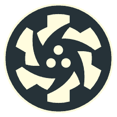
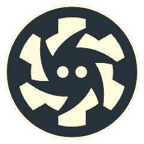
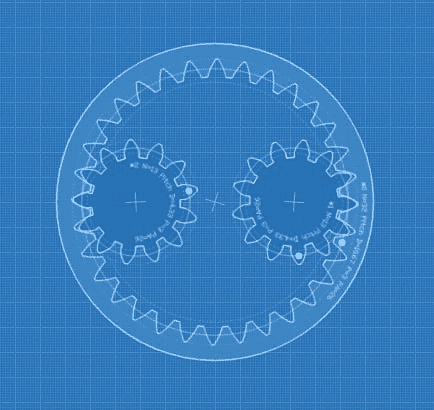
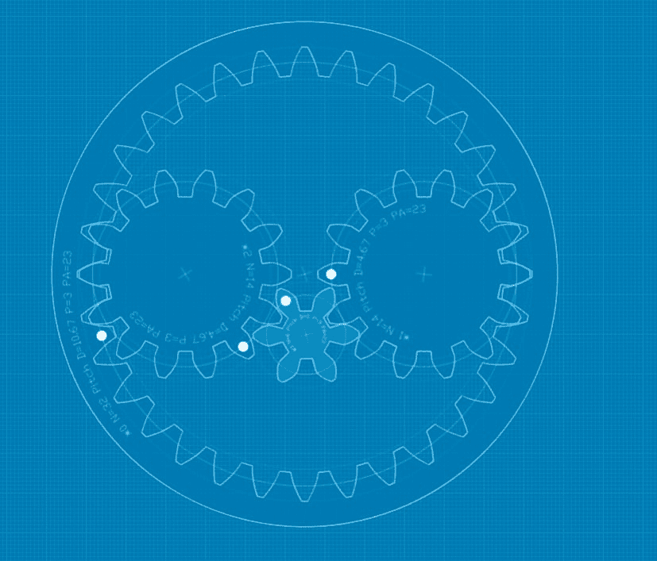
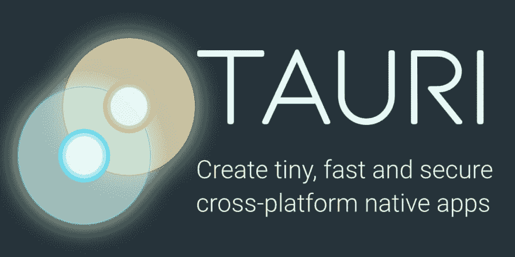

# 品牌和品牌重塑

> 原文:[https://dev.to/tauri/branding-and-rebranding-1mmo](https://dev.to/tauri/branding-and-rebranding-1mmo)

> Tauri 做过几次整容，但我们认为这次我们做到了。

## 质子

Tauri 的第一个名字是质子，因为我们想与电子对抗。(顺便说一句，我们不再这样做了。电子还是超级牛逼的！)

当时我们是在类星体框架下孵化的，所以从类星体标志中提取出来是有意义的。这是我们所拥有的:

[T2】](https://res.cloudinary.com/practicaldev/image/fetch/s--azUdTywI--/c_limit%2Cf_auto%2Cfl_progressive%2Cq_auto%2Cw_880/https://thepracticaldev.s3.amazonaws.com/i/ztw5mx8pk9u6cd0wj4dw.png)

因此，不幸的是，物理学中的每一个粒子都已经有了一个与之相关的 javascript 项目，令我们沮丧的是，原来质子原生也是一个东西。

## 类星体——金牛座

于是我们花了大约一周的时间讨论一个新名字，想出了 Tauri，以双星类型命名。

这是有意义的，因为我们正计划构建 Tauri 应用程序。所以我们去掉了质子标志中的一个亚粒子，最终得到了这个漂亮的小家伙。

[T2】](https://res.cloudinary.com/practicaldev/image/fetch/s--1pHDKYBG--/c_limit%2Cf_auto%2Cfl_progressive%2Cq_auto%2Cw_880/https://thepracticaldev.s3.amazonaws.com/i/lls1xh56a8d2gbty3rnv.png)

来自社区的评论之一是，这个标志看起来像是从生锈的齿轮上撕下来的，这很酷。这完全是无意的，因为 Quasar 的标志是一个纯粹的 JS 项目，而“齿轮”更多的是一个风格化的漩涡。

## 后类星体

无论如何，在我们离开孵化器去建立自己的组织后，我们不得不制作另一个标志，因为我们无法证明使用以前的设计基础是正确的。早期的想法之一是制作一个更具“咬合力”的标志，所以我用一个我在 https://geargenerator.com[做原型的](https://geargenerator.com)[真实齿轮组](https://geargenerator.com/index.php#475,425,50,2,1,2,367363.9000002474,3,1,32,10.666666666666666,3,26,0,1,0,0,0,0,0,13,4.333333333333333,3,26,-130,0,0,0,0,0,0,13,4.333333333333333,3,26,50,0,0,0,0,0,1,3,239)做了一个例子——作者 Abel Vincze 甚至给了我们一个下载。(有趣的事实:Rust 标志的牙齿数量与健康的成年人和长颈鹿一样:32 颗。)

[T2】](https://res.cloudinary.com/practicaldev/image/fetch/s--TWwwFipE--/c_limit%2Cf_auto%2Cfl_progressive%2Cq_auto%2Cw_880/https://thepracticaldev.s3.amazonaws.com/i/uo80fbokizqu1blx22ak.png)

但是两个内齿轮只是让它看起来太激进了，然后增加了第三个齿轮:

[T2】](https://res.cloudinary.com/practicaldev/image/fetch/s--7F3ecSyA--/c_limit%2Cf_auto%2Cfl_progressive%2Cq_auto%2Cw_880/https://thepracticaldev.s3.amazonaws.com/i/dtajksc77rrjkp1mjuut.png)

但这一切看起来有点不对劲。因此，经过大约一周的讨论和对金牛座这个名字的一些深入思考，我们最终得到了一个图形化的 [Theta Tauri](https://en.wikipedia.org/wiki/Theta_Tauri) ，一个真正的双星，其缩写为`θ Tau`。

我喜欢的是，theta 符号可能是设计的一个推动力，所以我在 Hyades 星团中找到了一张 [Theta-Tauri](https://upload.wikimedia.org/wikipedia/commons/b/b0/Hyades_cluster.jpg) 的图像，在媒体工作组中反复讨论之后，我们最终得到了这个，我们的最新设计:

[T2】](https://res.cloudinary.com/practicaldev/image/fetch/s--XSe1lkot--/c_limit%2Cf_auto%2Cfl_progressive%2Cq_auto%2Cw_880/https://thepracticaldev.s3.amazonaws.com/i/13vwxhbld21kn0oafhvp.png)

## 外卖

提出设计是一项艰巨的工作。重新设计似乎需要更多的时间，尤其是当有很多利益相关者的时候。但这仍然是团队沟通和透明度的一个有价值的练习。

## 取得联系

Tauri 应用程序还没有准备好迎接黄金时代，要达到这一点，在代码库和治理结构方面还有很多工作要做。然而，在我们寻求透明度和社区参与的过程中，我们借此机会邀请 Rust、Appsec 和 Dev 社区的所有人前来了解项目的进展情况，以及如何参与工作组。

Tauri 是一个致力于遵循 SFOSC [原则](https://sfosc.org/docs/principles/)最佳实践的组织。我们很荣幸也有责任邀请您访问我们的公共 [GitHub 项目页面](https://github.com/tauri-apps)，在我们的 [Discord 聊天服务器](https://discord.gg/SpmNs4S)上闲逛，在我们的[开放集体](https://opencollective.com/tauri)页面上捐款，或者只是关注我们的 [Tweets](https://twitter.com/tauriapps) 。

##### 关于作者

丹尼尔·汤普森-伊弗托特是 Tauri 背后的首席架构师和安全工程师。在过去的 13 年里，他一直是一名开源倡导者，也是可持续自由开源社区( [SFOSC](https://sfosc.org) )的活跃成员。