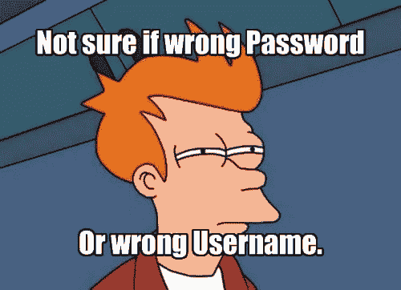

# 良好实践:PHP 安全，如何管理密码

> 原文：<https://dev.to/anastasionico/good-practices-php-security-how-to-manage-password-18bm>

脸书-剑桥分析公司，2016 年美国民主党电子邮件泄露，2018 年谷歌数据泄露，2012 年雅虎语音黑客只是过去一二十年影响我们的数据泄露的一部分。

世界上的信息以前所未有的方式为我们所用，如果我们不小心，我们的信息(甚至更私人的信息)会以相反的方式传播。

无论你是为儿童开发开源游戏，还是为财富 500 强企业工作，作为一名 web 开发人员，你有责任确保所有平台的安全性。

我不怪你。

**安全很难，**

一个很好的起点是在使用密码时采用良好的实践。

幸运的是，PHP 提供了几个工具和函数，我们可以用它们来保证应用程序的安全。

在这篇文章中，你将会发现让你的应用无懈可击所需要知道的一切。

## 

## 

## 密码安全的三大法则

### 永远不知道用户密码

我仍然记得我作为 PHP 开发人员的第一天，我创建的第一个应用程序之一是一个与我的朋友一起管理一支梦幻足球队的游戏。

我们每个人都可以登录我们的帐户，添加玩家，每周为新游戏部署人员。

我还记得我创建了基本帐户，

是的，我为他们添加了用户名和密码，并通过电子邮件向他们发送了需要使用的凭证。

就在几个月前，我了解并意识到这是多么的愚蠢，更糟糕的是，是多么的危险。

作为一般规则:

你不仅不应该知道你的用户的密码，而且你也不应该能够知道他们

这是一件严肃的事情，可能意味着很多很多的法律责任。

根据经验，您不希望以纯文本形式存储密码或使用可解密的密码。

### 

### 不限制密码

让我们玩个游戏，

猜猜下面的密码:

**********

很难不是吗？

让我们再试一次:

P*r***e***

现在你知道中间有一个大写字母和几个小写字母

数字呢？

P*r***e911

既然你知道这个单词包括一个大写字母，小写字母和数字，那么猜测起来就容易多了。

当限制用户对密码的选择时，也会发生同样的情况。

如果你的应用程序的需求之一是遵循一个明确的模式，你就提供了一些恶意用户可以用来对付你的暗示。

使用最少数量的字符是可以的，因为密码的长度会影响找出密码所需的时间，但是最好了解算法和哈希算法是如何工作的

对了，谜底是“保时捷 911”。

### 

### 永远不要在邮件中清除密码

正如我在上面的小故事中所写的，作为一名 web 开发人员，我犯的第一个错误就是没有早点学会如何管理密码。

这是在我遇到好的实践之前，我正在(并且仍然在)解决这个编程问题。

在现代 PHP 中，Josh Lockhart 写了关于这个问题的文章，并举例说明了如何在几秒钟内失去对开发人员的信任。

假设你是一个客户，雇佣了一个网络开发人员为你的企业创建一个漂亮的电子商务网站，

现在，

想象一下，你从你的开发者那里收到一封电子邮件，邮件中包含了你的网站的密码。

一个简单的例子，但请继续关注…

你现在了解了你朋友的三件事，

他知道你的密码；

他以明文形式存储你的密码，几乎没有加密；

他对通过互联网发送密码毫不关心

你应该寄给他的下一封信应该是一份解雇通知。

作为一名网站开发者，你应该这样做:

在您的 web 应用程序上创建一个页面，允许在用户忘记密码时插入他/她的电子邮件，以便请求一个新的密码

您的应用程序现在生成一个惟一的令牌，并将这个令牌与发出请求的用户关联起来([我个人在这种情况下使用 UUID](https://en.wikipedia.org/wiki/Universally_unique_identifier)

然后，您的应用程序向用户发送一封电子邮件，其中包含一个包含令牌的链接

**一旦用户访问 URL，您的应用程序验证令牌并允许用户更改其密码**

更改密码后，令牌将被删除

通过这些简单的步骤，应用程序的安全性提高了多少？

这就是所谓的良好实践。

如果我们愿意，我们甚至可以通过在请求新密码和提交新密码之间添加时间限制来提高安全级别。

## 

## 

## 如何散列用户的密码

先来个肯定。

您应该散列您的 web 应用程序的密码，而不是加密它们。

这让我挣扎了一段时间，

两者的区别在于加密是一种双向算法，你先加密一个字符串，然后你可以解密并恢复你的字符串，这主要用于 allied 发送或接收信息时的情报。

散列是不同的，散列的字符串不能返回到纯文本，或者至少这是最终目标。

有许多算法是为不同的目的而设计的，有些需要很快，有些则非常安全。

这是一项不断变化的技术，仅在最近几年就有了很大的改进。

我们将按时间顺序来看三个最受欢迎的。

### 

### Sha-1

这是第一个散列函数

SHA1 代表安全散列算法，它是由国家安全局开发的。

它非常著名，也是 PHP 世界中使用最多的一个函数，产生一个 20 字节的十六进制字符串，40 位数长。

SSL 行业选择 SHA1 进行数字签名已经有几年了，直到经过几个弱点之后，Google 决定是时候升级到 SHA-2 了

该算法的第一个版本已于 2005 年“弃用”，其他新版本已被设计出来 (SHA-2、SHA-3 和 SHA-256)，目前正在使用。

### 

### 

### Bcrypt

Bcrypt 不是 SHAs 的自然进化，但他的安全性吸引了更多的观众。

它被设计得非常慢，并能产生最安全的散列字符串。

它会进行多次迭代，对数据进行哈希处理，用专业术语来说，这叫做工作因子，

工作系数越高，黑客获取密码的成本就越高。

好消息是，将来当我们拥有更强大的机器时，我们可以进行更多的迭代。

我会在 auth0 留下一个关于 Bcrypt 的惊人链接。

### 

### 

### Argon2

这是哈希世界中全新的闪亮之物，由卢森堡大学的 Alex Biryukov、Daniel Dinu 和 Dmitry Khovratovich 设计，并在 2015 年赢得了密码哈希比赛。

Argon2 分为 3 个版本:

*   Argon2d 访问存储器阵列，它降低了时间-存储器折衷的可能性，但是它具有可能的旁路攻击；
*   Argon2i 则完全相反，它针对旁道攻击进行了优化，以与密码无关的顺序访问内存；
*   Argon2id 由两个版本混合组成，

这个函数本身有 6 个参数:密码字符串、salt、内存开销、时间开销、并行因子(允许的最大并行线程数)和散列长度。

您将在下面看到如何利用内置函数在 PHP 中使用这个散列。

另外，我已经在一年前 PHP 7.3 发布的时候写过这个散列法。

## 

## 

## 在 PHP 7 中散列和验证密码

### 用 password_hast 散列密码

这个函数根据我们决定传递给它的参数创建一个密码散列。

它使用单向算法。

**我们可以通过插入我们选择的常数来决定我们想要使用哪种类型的算法**，可用的常数有:

*   PHP 5.5 中的 PASSWORD_DEFAULT 使用 Bcrypt 算法作为默认算法，但是，它会随着新的更安全的算法的发现或其他因素而改变。
*   PASSWORD_BCRYPT 产生一个 CRYPT()散列，它通常有 60 个字符长，您可以通过它的标识符来识别它，类似于“$2y$”
*   密码-ARGON2I Argon2 是目前可用的最安全的散列之一，只有当你的 PHP 已经用 Argon2 编译时，这个算法才可用
*   PASSWORD_ARGON2ID 属于 Argon2 家族的另一个散列算法，它使用 ARGON2ID 版本而不是 I。它也需要用 Argon2 编译 PHP 才能工作。

这个函数还有一个可选参数，它由一个关联数组组成，根据我们选择使用的算法接受几个键。

如果您更喜欢使用 Bcrypt，那么这个数组的关键字将是 cost(一个表示扩展迭代计数为 2 的幂的整数)。

如果您选择使用 Argon2 算法，那么关联数组的关键字将是:memory_cost(一个整数，表示计算散列所需的最大内存)、time_cost(一个整数，表示计算散列所需的最大时间)和 thread(另一个整数，表示计算散列时要使用的线程数)。

不要在 PHP 7.0 中提供 salt，这样做会产生一个反对警告。

现在我们知道了使用 password_hash()函数所需的所有元素，让我们看看如何编写它，

```
echo password_hash("ThisIsAPassword", PASSWORD_DEFAULT);
$2y$10$.vGA1O9wmRjrwAVjuoshdyenNpDczlqm3Jq7KnEd1rVAGv3Fykk1a

$options = [
    'cost' => 12,
];
echo password_hash("ThisIsAPassword", PASSWORD_BCRYPT, $options);
$2y$12$QjSH496pcT5CEbzjD/vtVeH03tfHKFy36d4J0Ltp3lRtee9HDxY3K

echo password_hash('rasmuslerdorf', PASSWORD_ARGON2I);
$argon2i$v=19$m=1024,t=2,p=2$YzJBSzV4TUhkMzc3d3laeg$zqU/1IN0/AogfP4cmSJI1vc8lpXRW9/S0sYY2i2jHT0 
```

Enter fullscreen mode Exit fullscreen mode

建议您在服务器上测试该函数，并调整成本参数，以便在交互式系统上执行该函数的时间少于 100 毫秒。

上例中的脚本将帮助您为硬件选择一个好的成本值。

[另外，看看官方手册对 password_hash 的说法](https://secure.php.net/manual/en/function.password-hash.php)

## 

## 

## 验证用户的密码

你已经允许用户注册到你的全新应用程序，他们可以输入他们的密码，你惊人地处理它们，

根据最新的安全趋势对它们进行哈希处理，你不用明文存储任何东西，你的服务器藏在地下 10 米(英语读者为 32 英尺)的地下室里。

### 

### 现在怎么样了？

现在，您实际上需要允许用户登录到您的应用程序。

为此，PHP 提供了一个内置函数来验证密码是否与散列字符串匹配。

这个函数叫做 *password_verify()* 。

它有两个参数，都必须是字符串类型，第一个参数是用户在登录表单中输入的密码，它必须是一个纯文本密码，第二个参数是我们需要验证的实际哈希。

**结果是一个布尔值，我们可以在条件操作**中使用它，让用户登录，或者告诉他错误的地方

[](https://res.cloudinary.com/practicaldev/image/fetch/s--35ecHO5---/c_limit%2Cf_auto%2Cfl_progressive%2Cq_auto%2Cw_880/http://anastasionico.uk/img/1/download.jpeg)

这个函数之所以有效，是因为在上一步中，当我们散列密码时，从 password_hast 返回的值包括算法、成本和我们使用的 salt。

因此， *password_verify()* 需要的所有信息都已经可用。

这里有一个例子:

```
// See the password_hash() example to see where this came from.
$hash = '$2y$07$BCryptRequires22Chrcte/VlQH0piJtjXl.0t1XkA8pw9dMXTpOq';

if (password_verify('rasmuslerdorf', $hash)) {
    echo 'Password is valid!';
} else {
    echo 'Invalid password.';
} 
```

Enter fullscreen mode Exit fullscreen mode

需要注意的是，在使用 *$hash* 字符串时不能使用双引号，因为你可以看到变量中有几个美元符号，因此它们将被求值而不是被解析。

官方手册也有一页是关于密码验证的。

## 

## 

## 如何在 PHP 中创建用户注册系统

我希望你现在了解 PHP 开发人员在处理密码时是如何管理安全实践的([如果你还有任何疑问，请在我们的社区上提问](http://anastasionico.uk/community))。

我们已经看到了这些内置函数在理论上是如何工作的，**现在我们将看到如何在创建一个基本的注册和登录系统时实际使用**它们。

### 

### 第一步:使用 SQL 语言创建数据库表

```
CREATE TABLE IF NOT EXISTS `users` (
    `id` int(11) NOT NULL AUTO_INCREMENT,
    `username` varchar(50) NOT NULL,
    `email` varchar(50) NOT NULL,
    `password` varchar(50) NOT NULL,
    PRIMARY KEY (`id`)
 ); 
```

Enter fullscreen mode Exit fullscreen mode

上面的代码不是 PHP 而是 MySql，它将创建一个名为 users 的表，我们将在其中存储我们需要的用户数据。

数据库语言和查询超出了本教程的范围，[如果你对刚才看到的感到困惑，你可以看看这个关于 mysql 的教程](https://www.tutorialspoint.com/mysql/index.htm)

### 

第二步；创建注册或登记表 signup.php

```
< form action="signup.php" method="POST" >
    < input name="username" required="" type="text" /> 
    < input name="email" required="" type="text" />
    < input name="password" required="" type="password" /> 
    < input name="submit" type="submit" value="Register" />
< /form > 
```

Enter fullscreen mode Exit fullscreen mode

上面的代码代表了一个非常基本的 HTML 表单，它向页面*signup.php*发送一个 post 请求，post 中的所有字段都是必需的，目标是发送和阐述表单中提供的信息，以便用户注册和登录。

### 

### 第三步；注册用户

```
if(isset($_POST[submit])){
    $username=$_POST['username'];
    $email=$_POST['email'];
    $password=password_hash($_POST['password'], PASSWORD_DEFAULT);

    $checkQuery="SELECT * FROM users where (username=:username ||  email=:email)";
    $check = $dbh -> prepare($checkQuery);
    $check->bindParam(':uemail',$email,PDO::PARAM_STR);
    $check->bindParam(':uname',$username,PDO::PARAM_STR);
    $check->execute();
    $results = $check->fetchAll(PDO::FETCH_OBJ);

    if($check->rowCount() == 0) {
        $sql="INSERT INTO users (username, email, password) VALUES(:username, :email, :password)";
        $query = $dbh->prepare($sql);
        $query->bindParam(':username',$username,PDO::PARAM_STR);
        $query->bindParam(':email',$email,PDO::PARAM_STR);
        $query->bindParam(':password',$password,PDO::PARAM_STR);
        $query->execute();
        $lastInsertId = $dbh->lastInsertId();
        If ($lastInsertId) {
            $msg="You have signup Successfully";
        } else {
            $error="Something wrong here. Try again";
        }
    } else {
        $error="User already exist. Try again";
    }
} 
```

Enter fullscreen mode Exit fullscreen mode

在检查了表单已经更新之后，上面的截图收集了用户提交的所有信息，并使用 *PASSWORD_DEFAULT* 作为选择的算法对密码进行哈希运算( **BCrypt 是 PHP7** 中内置的)，我们准备并执行一条语句，在这条语句中，我们检查用户是否已经存在于我们的数据库中，如果不存在，我们插入他的数据。

有几个权宜之计可以让这段代码更加安全，[看看这个关于良好实践的系列的第一集——输入验证](http://anastasionico.uk/blog/good-practices-how-to-sanitize-validate-and-escape-in-php)

### 

### 第四步:创建登录表单

```
< form action="login.php" method="POST">
    < input name="username" required="" type="text" />
    < input name="password" required="" type="password" />
    < input name="login" type="submit" value="Login" />
< /form> 
```

Enter fullscreen mode Exit fullscreen mode

另一个非常简单的表单，在用户填写字段并提交表单后，将向 login.php 页面发送 post 请求，该页面将评估数据并授予用户访问权限。

### 第五步:允许用户访问 web 应用程序

```
session_start();

if(isset($_POST["login"])) {
    $username=$_POST['username'];
    $password=password_hash($_POST['password'], PASSWORD_DEFAULT);

    $sql ="SELECT username, email, password FROM users WHERE (username=:username) and (password=:password)";
    $query= $dbh -> prepare($sql);
    $query-> bindParam(':username', $username, PDO::PARAM_STR);
    $query-> bindParam(':password', $password, PDO::PARAM_STR);
    $query-> execute();
    $results=$query->fetchAll(PDO::FETCH_OBJ);

    if($query->rowCount() > 0) {
        $result = $query>fetch();
        if (password_verify($_POST["password"], $result['password'])) {
            $_SESSION["username"] = $_POST["username"];
            exit(header("location:home.php"));
        } else {
            echo "'Invalid Details'";
        } 
    } else {  
        echo "'Invalid Details'";
    }  
} 
```

Enter fullscreen mode Exit fullscreen mode

这里您可以看到函数 *password_verify()* 的运行。

我们首先检查页面是否有 post 请求，然后选择并统计与提交的输入相匹配的用户数量。

如果一切正常，这个数字应该是 1，**，然后我们验证密码并将用户**重定向到主页，否则我们需要 Javascript 的一点帮助来显示一个带有错误消息的警告框。

点击下图首先获取所有新帖子
[](http://eepurl.com/dIZqjf)

## 

## 

## 结论

“PHP 开发人员的良好实践”系列的另一部分已经结束，

在了解了如何在 PHP 中管理输入、如何净化、验证和转义之后，您现在已经了解了如何保证 web 应用程序的安全以及如何正确管理您的密码。

请记住，遵循良好实践并不是你需要遵循的一系列标准，而是你应该享受的一条道路。

每天都这样做学习新的技术，就像你刚刚对上面的代码所做的那样，添加一些额外的功能，并对你的代码进行实验，最终将使你成为 web 开发的黑带，无论你是在使用 PHP 还是更喜欢发现其他语言所提供的东西。