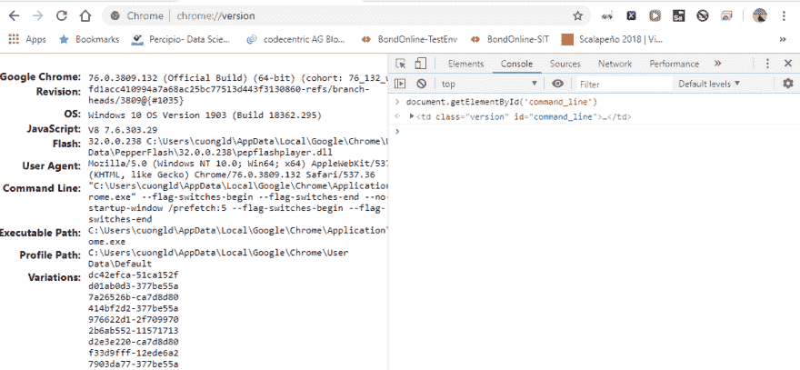
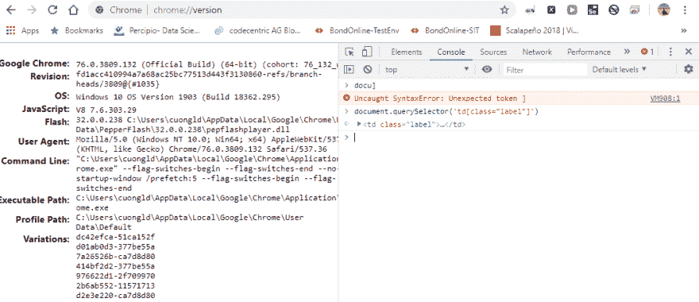
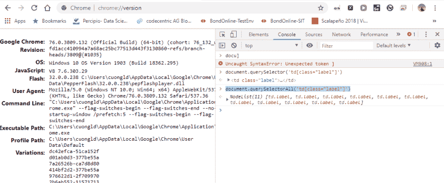
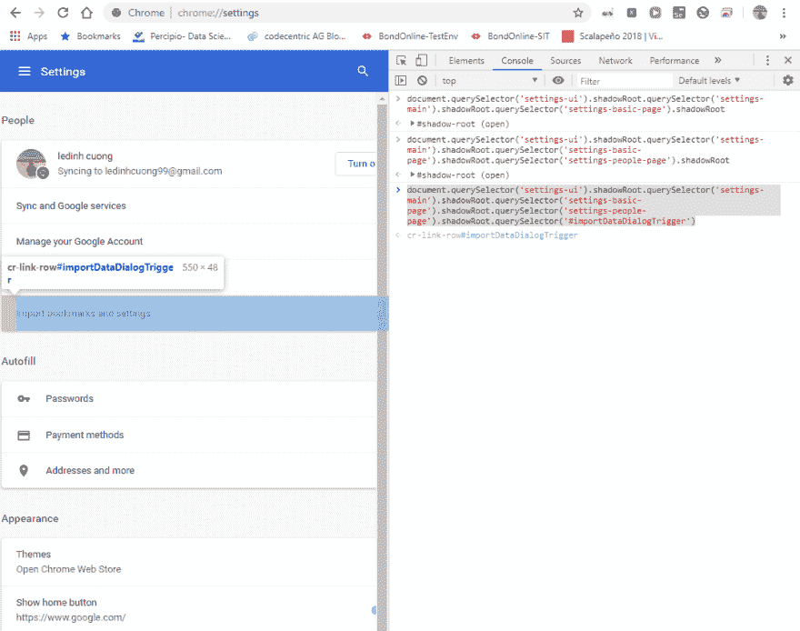
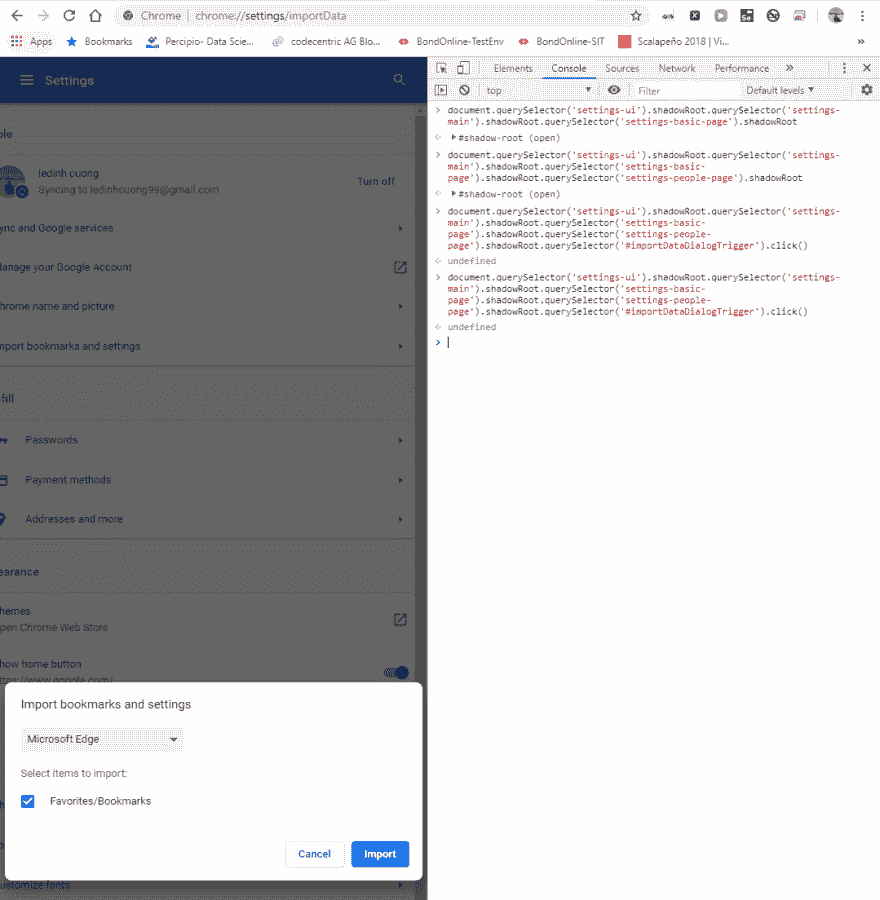
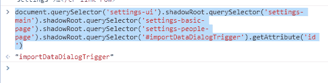

# 硒进一步移动

> 原文:[https://dev.to/cuongld2/selenium-moving-further-3i49](https://dev.to/cuongld2/selenium-moving-further-3i49)

```
I. Work with web elements by JavaScript in Selenium
    1.Find element by JavaScript
    2.Work with Shadow DOM
    3.Interact with elements by javascript
II. Handle basic web elements (drop-down list, radio-button)
III. Switch between windows
IV. Combine Selenium with image recognition tools (PyAutoGUI) 
```

I .在 Selenium 中通过 JavaScript 使用 web 元素

更多细节可以参考这个 javascript-selenium-webdriver

一般来说，从 selenium 调用 javascript execute 有两种方法:

执行脚本:

element = driver . execute _ script(script _ string，*args)
element = driver . execute _ async _ script(script _ string，* args)

注意:如果你想得到元素值，你的脚本应该有' return '比如:' return arguments[0]。“影子根”

1.通过 JavaScript 查找元素

```
- Get element by ID: 
```

document . getelementbyid(' command _ line ')

[T2】](https://res.cloudinary.com/practicaldev/image/fetch/s--X5K-Axn0--/c_limit%2Cf_auto%2Cfl_progressive%2Cq_auto%2Cw_880/https://thepracticaldev.s3.amazonaws.com/i/hbertbz0ep4r5eixinj8.PNG)

```
- Get elements by class name (return list of elements) 
```

document . getelementsbyclassname()

```
- Get elements by tag name (return list of elements) 
```

document.getElementsByTagName

```
- Get element by querySelector 
```

document . query selector-文件查询选取器

[T2】](https://res.cloudinary.com/practicaldev/image/fetch/s--5_gyfax2--/c_limit%2Cf_auto%2Cfl_progressive%2Cq_auto%2Cw_880/https://thepracticaldev.s3.amazonaws.com/i/am9gscnltqoi1a3s661c.PNG)

```
- Get elements by querySelectorAll 
```

document . query select all(' TD[class = " label "]')

[T2】](https://res.cloudinary.com/practicaldev/image/fetch/s--AvE1oKU3--/c_limit%2Cf_auto%2Cfl_progressive%2Cq_auto%2Cw_880/https://thepracticaldev.s3.amazonaws.com/i/l0y50o41iohdki7nfrhx.PNG)

2.使用阴影 DOM

关于影子 DOM 的更多细节，你可以参考这个影子 DOM

简而言之，他们使用影子 DOM 来避免不同 css、界面风格的冲突

→为了在编写自动化脚本时处理这些问题，我们需要从外到内提取每个 dom

示例:

[T2】](https://res.cloudinary.com/practicaldev/image/fetch/s--xixJeimC--/c_limit%2Cf_auto%2Cfl_progressive%2Cq_auto%2Cw_880/https://thepracticaldev.s3.amazonaws.com/i/hs3wcmh5jxy32rb8voox.PNG)

document . query selector(' settings-ui '). shadow root . query selector(' settings-main '). shadow root . query selector(' settings-basic-page '). shadow root . query selector(' settings-people-page '). shadow root . query selector(' # importatadialog trigger ')。

3.通过 javascript 与元素交互

有时，您不能直接与 web 元素交互(比如，如果您单击，它不会被 direct selenium API 识别)

在这些情况下，您可能想尝试使用 javascript 点击函数:

例如:

[T2】](https://res.cloudinary.com/practicaldev/image/fetch/s--Yhg9CqNm--/c_limit%2Cf_auto%2Cfl_progressive%2Cq_auto%2Cw_880/https://thepracticaldev.s3.amazonaws.com/i/d05jyrrss5oxg14il9mc.PNG)

document . query selector(' settings-ui '). shadow root . query selector(' settings-main '). shadow root . query selector(' settings-basic-page '). shadow root . query selector(' settings-people-page '). shadow root . query selector(# importatadialog trigger ')。单击()

或者您可能希望从元素中获取属性:

[T2】](https://res.cloudinary.com/practicaldev/image/fetch/s--QPBpG05b--/c_limit%2Cf_auto%2Cfl_progressive%2Cq_auto%2Cw_880/https://thepracticaldev.s3.amazonaws.com/i/1t7ju7yw4e3so2rnu6ut.PNG)

document . query selector(' settings-ui '). shadowroot . query selector(' settings-main '). shadowroot . query selector(' settings-basic-page '). shadowroot . query selector(' settings-people-page '). shadowroot . query selector(' # importDataDialogTrigger ')。getAttribute('id')
II。处理基本 web 元素(下拉列表、单选按钮)

1.下拉列表:
def choose _ date _ birthday(self，driver，index):
Select _ date = Select(self . start _ page _ elems . find _ birthday _ date _ drop _ down _ elem(driver))
return Select _ date . Select _ by _ index(index)

2.单选按钮:
def choose_female_sex(self，driver):
self . start _ page _ elems . find _ female _ sex _ radio _ button(driver)。点击()
三世。在窗口之间切换

有时，为了执行测试，您需要处理多个窗口。

Selenium 为您提供了做这些事情的方法(甚至使用 iframe 或 active element..)

下面是救世主手机弹出窗口之间的处理示例。
def handle_store_button(self，browser，text _ assert):
list _ windows = browser . window _ handles
if len(list _ windows)
browser . switch _ to . window(list _ windows[1])
elif len(list _ windows)= = 3:
browser . switch _ to . window(list _ windows[2])
assert text _ assert in browser . current _ URL
browser . close()
browser . switch _ to . window(list 将 Selenium 与图像识别工具相结合(PyAutoGUI)

有些元素 selenium 无法点击，在这种情况下我们需要图像识别工具来处理。

我将通过一个简单的例子来说明 PyAutoGUI:
def test _ Facebook _ icon(self，set _ up _ browser):
time . sleep(3)
coords = PyAutoGUI . locateonscreen(' Facebook _ icon。PNG ')
pyautogui . click(coords)