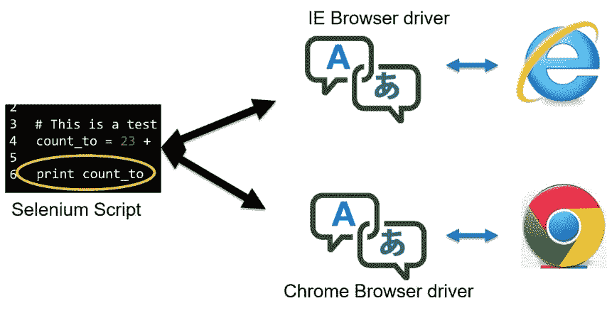
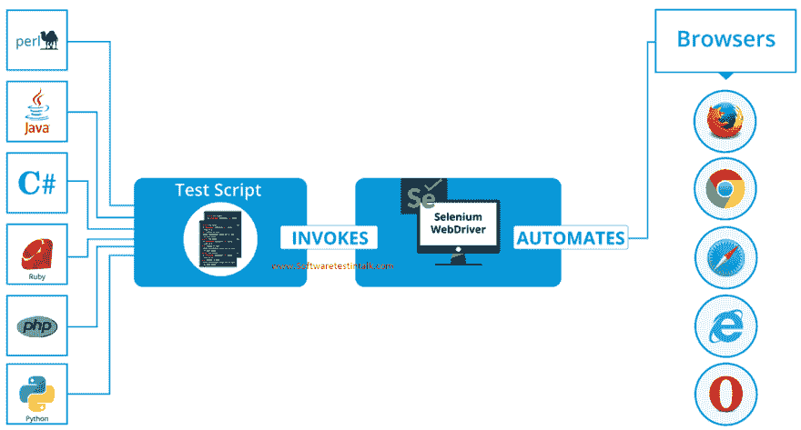
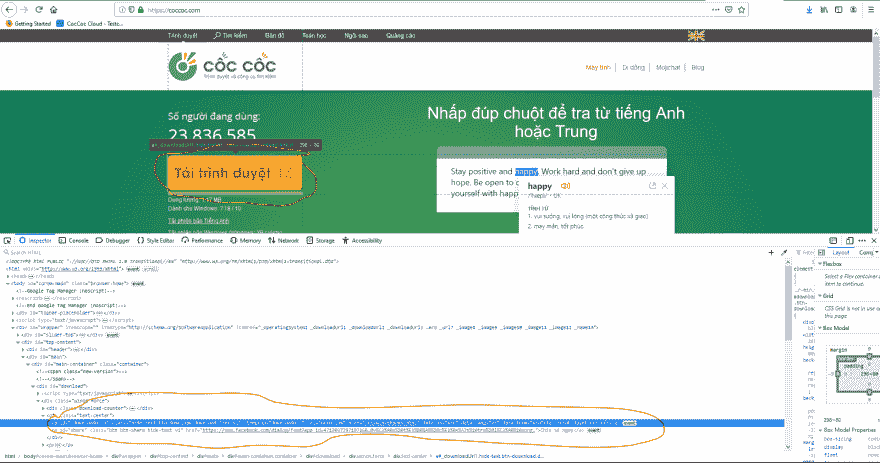

# 硒简介

> 原文：<https://dev.to/cuongld2/introduction-to-selenium-19j6>

```
I. Selenium overview
    1\. How selenium works
    2\. What is a selenium web driver
    3\. What are web elements:
    4.Selenium Remote Controller
    5.Selenium Grid
II. Locate element in selenium
    1\. By Id
    2\. By name
    3\. By css selector
    4\. By xpath
    5\. By javascript executor
    6\. How to assert element not exist
III. Selenium models
    1.Page locators
    2.Page elements
    3.Page objects 
```

一.硒概述

*   硒是如何工作的

[](https://res.cloudinary.com/practicaldev/image/fetch/s--CYvAEap2--/c_limit%2Cf_auto%2Cfl_progressive%2Cq_auto%2Cw_880/https://thepracticaldev.s3.amazonaws.com/i/sqfqnq6kbcmtqi23yaml.jpg)

```
- Selenium web driver
- Browser Driver
- Browser application 
```

为了在特定的浏览器中执行测试，我们需要具备以上所有条件。

简而言之，我们通过 selenium web 驱动程序与浏览器应用程序通信。然后 selenium web 驱动程序会通过浏览器驱动程序将这些请求发送给浏览器本身。

这就是为什么我们需要下载浏览器驱动程序(chromedriver，coccocdriver)

请记住，为了使用 coccococ，您需要将 coccocdriver 重命名为 chromedriver。

*   什么是 selenium web 驱动

详情请参考官方链接中的 selenium webdriver

简而言之，Selenium WebDriver 是一个开源 API 的集合，用于自动化 web 应用程序的测试。

[](https://res.cloudinary.com/practicaldev/image/fetch/s--LY1FZyTS--/c_limit%2Cf_auto%2Cfl_progressive%2Cq_auto%2Cw_880/https://thepracticaldev.s3.amazonaws.com/i/lpy8xfyt17act9pccg48.png)

*   什么是 web 元素:

它可以是文本框、单选按钮、文本字段、下拉列表，甚至是 url

使用 web 元素可以是这样的任务:导航到 url，在文本框中填充一些文本，从下拉列表中选择选项

→通过检查显示一些网络元素

[](https://res.cloudinary.com/practicaldev/image/fetch/s--FRbXmLIc--/c_limit%2Cf_auto%2Cfl_progressive%2Cq_auto%2Cw_880/https://thepracticaldev.s3.amazonaws.com/i/64zaj0rj2zxte651r42u.PNG)

*   硒遥控器

更多详情，请访问:Selenium RC

```
In short, it is used before the Selenium Webdriver.
Complicated than selenium webdriver (use selenium server and selenium client)
Can interact with element even that element is disabled ( not mimic real usage of user) 
```

*   硒栅

它允许在分布式测试执行环境中运行您的测试。

例如，指定一台机器为主机器

将其他机器配置为其节点

在其他机器上运行测试，并在主机上进行控制。

教程可以参考这个:硒格教程- Zalenium
二。在硒中定位元素

*   按 Id

这是定位元素的最佳方式

示例:

SEARCH_BOX = (By。ID，“搜索”)

*   名叫

第二个最好的方法:d

SEARCH_BOX = (By。姓名，“搜索”)

*   按 css 选择器

二十四 _H_VIDEO_ITEM = (By。CSS_SELECTOR，'[class="v-24h-media-player"]')

*   通过 xpath

SHADOW_ROOT_CONTENT = (By。XPATH，'(//div[starts-with(@data-hveid，" 4))]//div[@ class = " s "]//div)[6]')

*   由 javascript 执行器执行

有时，我们不能在 selenium 中通过这些方法定位元素(例如使用 Shadow DOM)

→我们需要做 javascript 执行器

例如:

element = browser . execute _ script(' return arguments[0])。shadowRoot '，选择器)

```
whereas arugments[0] is a locator 
```

*   如何断言元素不存在

_ 可以使用 find_elements 并断言 len = 0

_ 或者您可以使用等待超时范围内的某个元素，如果没有出现→元素不存在(这将很耗时)

三。Selenium 模型

对于最佳实践，我们应该分离元素定位器、web 元素和页面对象，以便更好地管理和维护代码

*   页面定位器

    商店元素定位器

例如:

SAVIOR _ EXTENSIONS _ WRAPPER _ ID = ' jdfkmiabjpfjacifcmihfdjhpnjpiick '

REMEMBER _ LAST _ CHOSEN _ OPTION =(By。ID，“首选最后质量”)

*   页面元素

使用定位器或 javascript 查询查找元素。

```
For find element with locator 
```

def find _ profile _ path _ element(self，driver):
wait = web driver wait(driver，20)
return wait . until(
EC . presence _ of _ element _ located(version page locators。轮廓 _ 路径 _ 元素))

```
For find element with javascript query: 
```

def select _ shadow _ element _ by _ CSS _ selector(browser，selector):
element = browser . execute _ script(' return arguments[0])。shadowRoot '，选择器)
返回元素

*   页面对象

    用于与网页交互的存储功能

def stop _ seeding _ from _ out _ side _ BTN(self，driver):
stop _ seeding _ BTN = self . downloads _ elem . find _ stop _ seeding _ button _ out _ side _ displayed(driver)
stop _ seeding _ BTN . click()

或者

def verify _ torrent _ seed _ up _ arrow _ not _ displayed(self，driver):
elements = self . downloads _ elem . should _ torrent _ seed _ arrow _ up _ not _ displayed(driver)
assert len(elements)= = 0