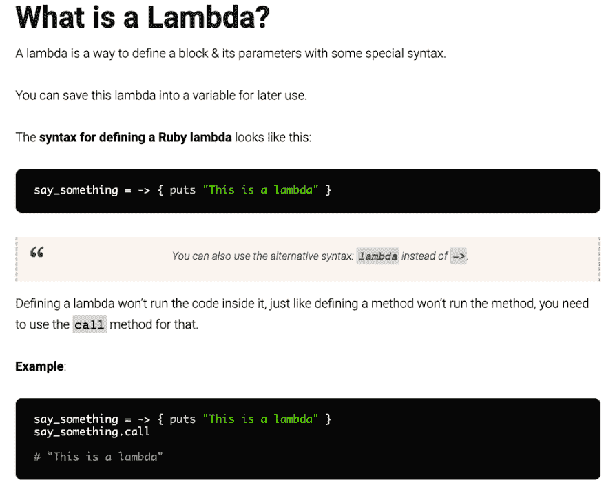

# Ruby Lambda 何时以及如何？？？？？？

> 原文:[https://dev.to/ss220993/ruby-lambda-when-and-how-61e](https://dev.to/ss220993/ruby-lambda-when-and-how-61e)

我们中的大多数人可能已经看过“n”个关于如何使用 lambda 的帖子(我已经看过至少 10+个帖子)，但最终会以编写通用方法而告终。我从来没有使用过块调用或屈服，因为它看起来像一个复杂的特性，我的大脑从来不想学习它(“为什么要把事情复杂化！:D”)。

不幸的是，我不得不在工作中使用它，以避免重复问题。然后我告诉自己，如果不是现在，那是什么时候？

在开始编写代码之前，我们应该知道什么是 lambda 及其语法。

 

<figure>

<figcaption>出处:[https://www.rubyguides.com/2016/02/ruby-procs-and-lambdas/](https://www.rubyguides.com/2016/02/ruby-procs-and-lambdas/)</figcaption>

</figure>

*注:‘->’相当于 lambda 字面意思*