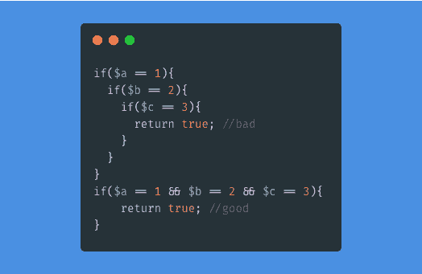
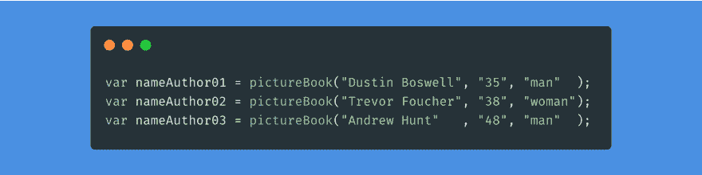
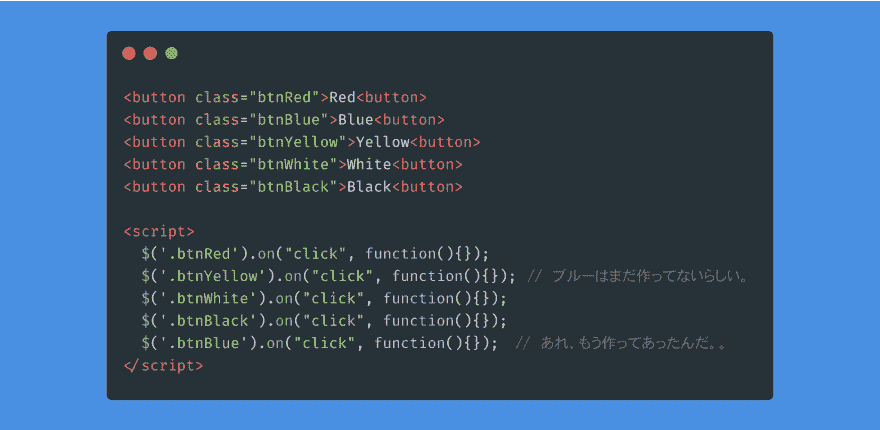
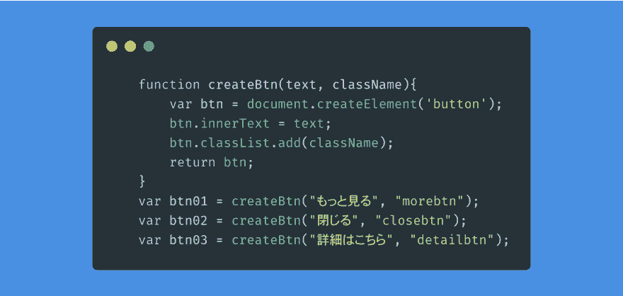
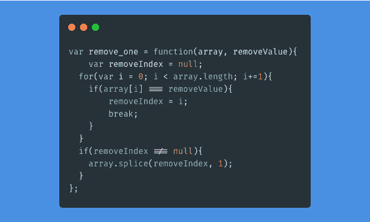

# 前台工程师的可读取代码#2 代码的美丽

> 原文:[https://dev.to/shibandd/2-4538](https://dev.to/shibandd/2-4538)

本文介绍了代码的两个美。 “可动性”和“最短处理”。 可动性是意识到代码的外观，编写开发者容易阅读的代码。 最短处理是避免写无用的处理、同样的处理(双重化的错误)。 意识到“[DRY 原则](https://ja.wikipedia.org/wiki/Don't_repeat_yourself)”的哲学吧。

#### #2 代码的美丽

要提高可动性，就要依靠缩进和空格。 大多数可动性都可以通过自动对齐功能解决。 编辑器的 SublimeText 标记为 HTML-CSS-JS Prettify，在 Atom 中标记为标准的 Auto indent。 在 Google Chrome 开发人员工具的 sources 选项卡中，站点的源代码确认也包含自动对齐功能。

但是，大多数开发人员都会自己调整嵌套。 嵌套越深，可动性越低。 在嵌套变深之前，让我给你回处理的答案(返回)。

[T2】](https://res.cloudinary.com/practicaldev/image/fetch/s--y7lmQs23--/c_limit%2Cf_auto%2Cfl_progressive%2Cq_auto%2Cw_880/https://thepracticaldev.s3.amazonaws.com/i/cs8iwti9kgj24q0zoxkh.png)

嵌套越深，给开发者带来的压力越大。 因为，我记不住了。 如果条件分支为五重六重，就会忘记最初的条件分支。 返回很远的代码，我不想读。

也注意一下代码的竖线吧。 即使三个参数的字符数不同，注意逗号位置的竖线也能使代码更容易阅读。

[T2】](https://res.cloudinary.com/practicaldev/image/fetch/s--Q6RAxiCf--/c_limit%2Cf_auto%2Cfl_progressive%2Cq_auto%2Cw_880/https://thepracticaldev.s3.amazonaws.com/i/dzxh9r8t19ymgw5w3j8x.png)

标记语言 HTML 无法调换源的顺序。 让 JavaScript 和 CSS 适应 HTML 的顺序。

[T2】](https://res.cloudinary.com/practicaldev/image/fetch/s--5tyn8f4g--/c_limit%2Cf_auto%2Cfl_progressive%2Cq_auto%2Cw_880/https://thepracticaldev.s3.amazonaws.com/i/ln0rv62n1uao090x3yua.png)

实际上，更复杂。 在示例中，虽然在同一个 HTML 中进行了描述，但实际上是不同的文件。 另外，一个个的点击活动无法用一行来容纳。 通过意识到顺序，可以防止双重化，成为容易看到的代码吧。

上面的点击事件是容易双重化的代码。 通过改进顺序，防止了事件本身的双重化，但有时会在事件内发生双重化。 按下按钮，网站的背景颜色会发生变化。 各活动的区别只有**颜色为**。

[T2】](https://res.cloudinary.com/practicaldev/image/fetch/s--Q7DZTuAp--/c_limit%2Cf_auto%2Cfl_progressive%2Cq_auto%2Cw_880/https://thepracticaldev.s3.amazonaws.com/i/pq8nqrd8vlfbrot0rpam.png)

用于创建按钮的 JavaScript 代码。 创建按钮的区别在于文本和类名。 调用时，可以通过提供文本和类名(作为函数的参数)来创建每个按钮。 把握不同点，不要写同样的处理。 将相同的处理合并在一起，也可以将代码的修改点合并在一起。

最后是无用的代码。 从数组中删除值的函数。 在第 1 参数中放入数组，在第 2 参数中放入数组内要删除的元素。

[T2】](https://res.cloudinary.com/practicaldev/image/fetch/s--cXStGIRq--/c_limit%2Cf_auto%2Cfl_progressive%2Cq_auto%2Cw_880/https://thepracticaldev.s3.amazonaws.com/i/tnobjkx5deayyblj2s0d.png)

removeIndex 是一个无用的变量。 在 for 语句内，最好直接用 splice 删除，而不是存储在变量中。 让任务快点完成吧。

[T2】](https://res.cloudinary.com/practicaldev/image/fetch/s--pf8fbgOG--/c_limit%2Cf_auto%2Cfl_progressive%2Cq_auto%2Cw_880/https://thepracticaldev.s3.amazonaws.com/i/zne3kmuivzzbnyxmp21h.png)

介绍了代码美的“可动性”和“最短处理”。 虽然介绍了很多，但根据环境的不同，也有要求双重化的情况。 关于不得已的“双重化错误”，请参阅参考书籍《[达人程序员](https://www.amazon.co.jp/%E6%96%B0%E8%A3%85%E7%89%88-%E9%81%94%E4%BA%BA%E3%83%97%E3%83%AD%E3%82%B0%E3%83%A9%E3%83%9E%E3%83%BC-%E8%81%B7%E4%BA%BA%E3%81%8B%E3%82%89%E5%90%8D%E5%8C%A0%E3%81%B8%E3%81%AE%E9%81%93-Andrew-Hunt/dp/427421933X)》。 让我们客观地看代码，而不是主观地看。

※上次的前端工程师的可读写代码为“用前端工程师的可读写代码#1 变量名传达信息”。 请一定也读一下那里。

 [## 用前端工程师的可读取代码#1 变量名传达信息

### 柴山博树 9 月 9 日 191 分钟阅读

#javascript #jquery #readablecode](/shibandd/-3a40)
※参考書籍「[達人のプログラマー](https://www.amazon.co.jp/%E6%96%B0%E8%A3%85%E7%89%88-%E9%81%94%E4%BA%BA%E3%83%97%E3%83%AD%E3%82%B0%E3%83%A9%E3%83%9E%E3%83%BC-%E8%81%B7%E4%BA%BA%E3%81%8B%E3%82%89%E5%90%8D%E5%8C%A0%E3%81%B8%E3%81%AE%E9%81%93-Andrew-Hunt/dp/427421933X)」
※参考書籍「[リーダブルコード ―より良いコードを書くためのシンプルで実践的なテクニック](https://www.oreilly.co.jp/books/9784873115658/)」