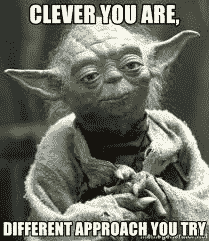
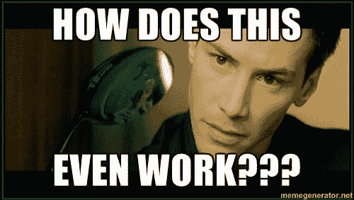

# 棱角风格封装:你做错了

> 原文:[https://dev . to/peterdavidcarter/angular-style-encapsulation-you-re-do-it-wrong-3ol 9](https://dev.to/peterdavidcarter/angular-style-encapsulation-you-re-doing-it-wrong-3ol9)

样式封装是一个好主意...我的意思是，我们正在摒弃共享全球中所有那些疯狂的冲突，只是把你的风格放在你真正需要它们的地方，对吗？

😂

事实是，在任何企业规模的项目中，你都可能以大杂烩的方式结束，一些东西在共享的全局中，一些在组件中，一些传递到类绑定中，甚至在特殊情况下作为动态生成和注入的自定义 s/css 对象。这并不一定是坏事，但实际上往往如此。

[T2】](https://res.cloudinary.com/practicaldev/image/fetch/s--pIUyP4jE--/c_limit%2Cf_auto%2Cfl_progressive%2Cq_auto%2Cw_880/https://thepracticaldev.s3.amazonaws.com/i/c4q6elw3n7ef3hgiaf8e.jpg)

对于那些将封装视为灵丹妙药的人来说，问题是它绝对不会这样做。如果你懒惰，不从全局的角度考虑你的策略，它会咬你的屁股。反反复复。你也不会享受这个过程。你必须严格，你必须严格，你必须预料到打开封装不仅不会减少你的认知开销，实际上还可能增加它。这是因为你不能把你的样式放在每个场景都需要它们的组件中。有很多很多不同的情况，每种情况都需要不同的方法。

[T2】](https://res.cloudinary.com/practicaldev/image/fetch/s--TorFL17Y--/c_limit%2Cf_auto%2Cfl_progressive%2Cq_auto%2Cw_880/https://thepracticaldev.s3.amazonaws.com/i/z61jpym3dt6nzqihxdh3.jpg)

首先，我希望这一点对每个人来说都是显而易见的:如果一个样式真正应用于整个应用程序，特别是如果你希望在全球范围内改变它，它属于某个共享的地方。现在，你*可以*为此使用共享的全局 css/scss 文件。您也可以在中创建包含样式的共享组件。从很多方面来说，后者更好，因为您可以获得所有这些可爱的重用好处，但在这样做时要考虑的是:每次您想要在每页的基础上定制组件时，您都必须处理输入变量和绑定，在一个真正大型的应用程序中，这些变量和绑定可能多达 3 或 4 层，甚至更多层。你要定制多少，通过这种方式做事情，相对于在应用程序的一部分或多个部分上共享 s/css 的老派方法，你会给自己带来多少麻烦？这是特定于您的应用程序的，作为一名专业开发人员，您应该知道在每种情况下什么是最好的方法。如果你想让你的应用程序正确伸缩，你*有*经历这个心理过程。

第二，你可能认为你正在制作的小组件只是为你所在的页面准备的，但真的是这样吗？如果你想在其他地方使用这些风格，它们现在被锁在一个盒子里。你真的想那么做吗？也许你有。如果你确定，那么将它们封装成一个单独的、每页一个的组件是正确的选择。尽管如此，你需要理解完整的设计，而不仅仅是你正在做的一小部分。

第三，可能也是最重要的一点，使用样式封装没有绝对的规则可以遵循，但是你绝对不能*随意地做事情，并抱最好的希望。你最终得到的将不仅仅是一团意大利面，而是一个积极迫使你制造一团意大利面的系统，而且一次比一次糟糕。*

[T2】](https://res.cloudinary.com/practicaldev/image/fetch/s--WIcYDI4B--/c_limit%2Cf_auto%2Cfl_progressive%2Cq_auto%2Cw_880/https://thepracticaldev.s3.amazonaws.com/i/5jkkflwi2zmdu2g2nbpj.jpg)

不要那样做。

如果你从这篇文章中学到了什么的话，那就是每次你打电话决定在哪里放置一种风格时，你应该从所有可能的角度考虑这将意味着什么。