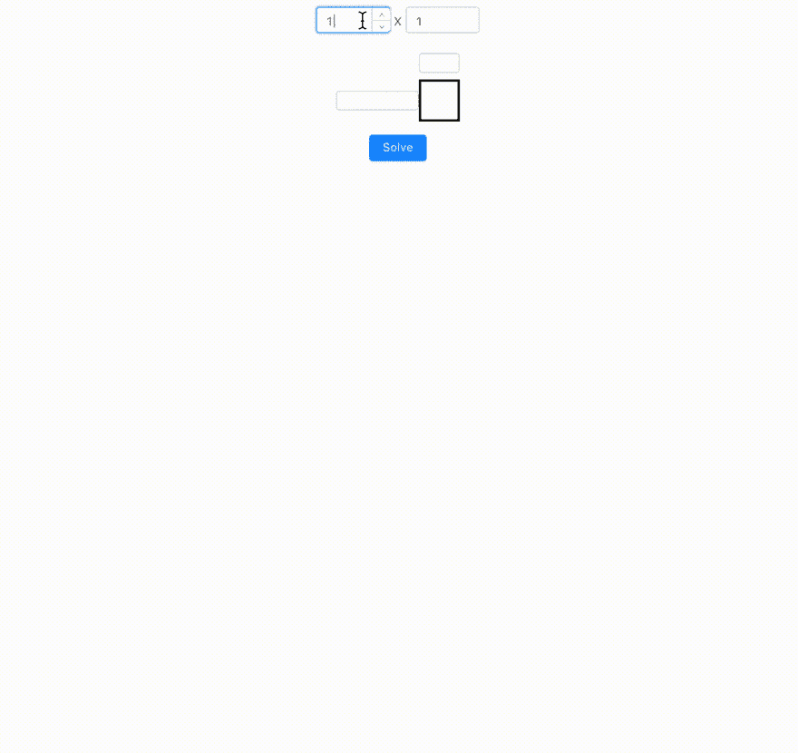
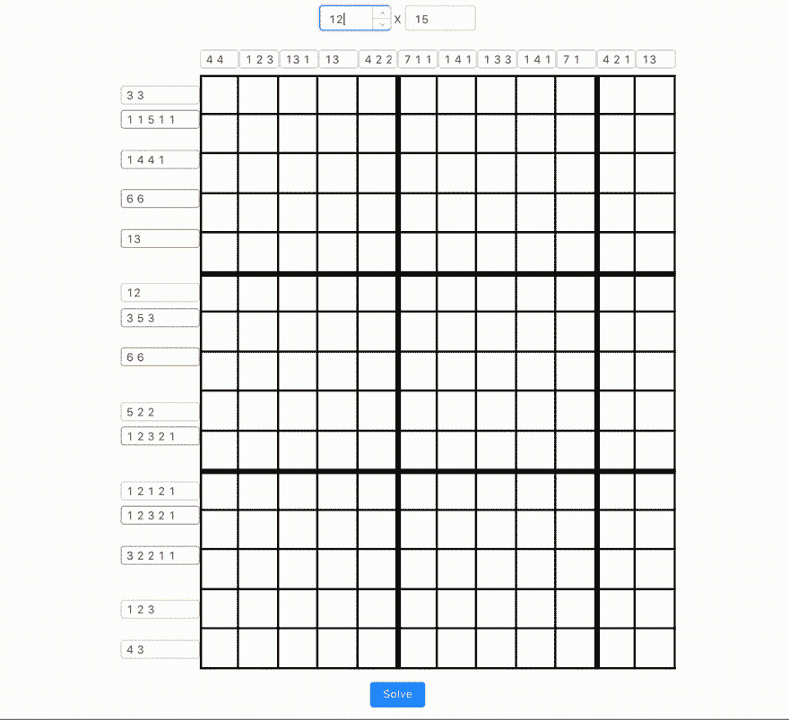
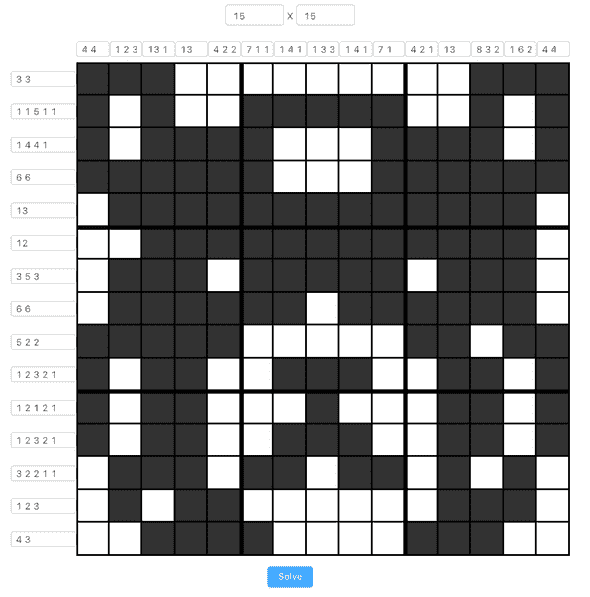

# 用代码解决字母组合

> 原文：<https://dev.to/tanhauhau/solving-nonogram-with-code-1kfj>

## 背景

上周，我在午餐时间玩 [nonogram](https://play.google.com/store/apps/details?id=com.easybrain.nonogram) 。

*“我现在沉迷于这个游戏，”*我对我的同事*说，“如果我能想出一个程序来解决这个问题，我就不再玩它了”*然后我们开始讨论算法、机器学习和计算机视觉...

我不记得我们的话题是怎么从一个话题转到另一个话题的。但是有一件事粘在我头上， ***我需要写软件来解我的 nonogram！*T3】**

## nonogram

[nonogram](https://en.wikipedia.org/wiki/Nonogram)是一个 n×n 网格的益智游戏，其中的单元格必须根据网格边上的数字来填充或留空。该数字描述了给定行或列中填充单元格的连续行数。例如，`"2 4 3"`表示有两个、四个和三个填充单元格的集合，在连续的组之间至少有一个空白单元格。

## 前端

我是一名前端开发人员，所以，我无法抗拒用我的前端锤子把一切都当成钉子的诱惑。

所以我做的第一件事就是`create-react-app`并启动一个普通的`React`应用程序。

接下来，我必须创建 nonogram 网格。最初，我是在玩 div 的`display: inline-block`，直到我意识到，*嘿，这是一个适合 [CSS 网格](https://css-tricks.com/snippets/css/complete-guide-grid/)* 的好案例！

[](https://res.cloudinary.com/practicaldev/image/fetch/s--aUGy7GXS--/c_limit%2Cf_auto%2Cfl_progressive%2Cq_66%2Cw_880/https://lihautan.com/size-1732de3105f655cc0a4f690f4fe39138.gif)T3】

```
// dynamically generate grid template
<div
  style={{
    gridTemplate: getGridTemplate(
      width,
      height,
      blockSize,
      labelXSize,
      labelYSize
    ),
    width: blockSize * width + labelXSize,
    margin: '16px auto',
  }}
>
  {labels}
  {grids}
</div>;

function getGridTemplate(width, height, blockSize, labelXSize, labelYSize) {
  return `${labelYSize}px ${` ${blockSize}px`.repeat(
    height
  )} / ${labelXSize}px ${` ${blockSize}px`.repeat(width)}`;
} 
```

<svg width="20px" height="20px" viewBox="0 0 24 24" class="highlight-action crayons-icon highlight-action--fullscreen-on"><title>Enter fullscreen mode</title></svg> <svg width="20px" height="20px" viewBox="0 0 24 24" class="highlight-action crayons-icon highlight-action--fullscreen-off"><title>Exit fullscreen mode</title></svg>

CSS grid 很酷的一点是，我不再受网格布局中元素顺序的限制，我可以通过指定`grid-column`和`grid-row`来定位任何我想要的网格。所以在这里你可以看到我可以先构建`labels`，然后构建`grids`，这样我就不用按照行和列来构建 html 结构了。

接下来自然是允许用户(只有我)键入非语法的约束。为了确保我键入的内容有意义，我在输入中添加了验证:

[](https://res.cloudinary.com/practicaldev/image/fetch/s--SNb2erW9--/c_limit%2Cf_auto%2Cfl_progressive%2Cq_66%2Cw_880/https://lihautan.com/constraint-848386b5dec239c31cc6d7936793d891.gif)T3】

```
function getError(text, max) {
  if (!/^[0-9 ]*$/.test(text)) {
    return 'Invalid characters';
  }
  if (!validateSum(text, max)) {
    return 'Sum exceeded limit';
  }
  return null;
} 
```

<svg width="20px" height="20px" viewBox="0 0 24 24" class="highlight-action crayons-icon highlight-action--fullscreen-on"><title>Enter fullscreen mode</title></svg> <svg width="20px" height="20px" viewBox="0 0 24 24" class="highlight-action crayons-icon highlight-action--fullscreen-off"><title>Exit fullscreen mode</title></svg>

## 算法

我想出的算法是穷举搜索和回溯。通俗地说，这意味着尝试每一种可能的组合，验证每一步的棋盘，并在没有可能前进的时候尽快停下来:

```
function findSolution(i, j) {
  if (i === height) return true;

  const [nextI, nextJ] = getNextStep(i, j);

  // try to mark the cell with `true` (filled) first
  board[i][j] = true;
  if (verify(board, i, j) && findSolution(nextI, nextJ)) {
    return true;
  }

  // if not possible, mark it with `false` (blank)
  board[i][j] = false;
  if (verify(board, i, j) && findSolution(nextI, nextJ)) {
    return true;
  }

  // if still no solution
  // end this, no possible step moving forward
  return false;
}

findSolution(0, 0); 
```

<svg width="20px" height="20px" viewBox="0 0 24 24" class="highlight-action crayons-icon highlight-action--fullscreen-on"><title>Enter fullscreen mode</title></svg> <svg width="20px" height="20px" viewBox="0 0 24 24" class="highlight-action crayons-icon highlight-action--fullscreen-off"><title>Exit fullscreen mode</title></svg>

该算法的主要要点在于`verify`函数，以下是我在编写`verify`函数时的一些考虑:

*   我从左到右，从上到下填充黑板
*   我在填充时验证了棋盘，所以我需要确保我在单元格中进行的移动仍然在单元格的行/列的约束范围内
*   如果我填充单元格，我不应该创建不必要的更多的线组
*   如果我填充单元格，我不会使当前的线组比必要的更长
*   如果我将单元格留空，我就不会使当前的行组比必要的要短
*   当我完成一个行/列时，我需要确保当前的行/列要求都得到满足

我不想在这里用完整的代码来烦你，如果你足够好奇，你可以在 [my Github repo](https://github.com/tanhauhau/nonogram/blob/dev/src/utils.js#L25-L78) 上阅读。

[](https://res.cloudinary.com/practicaldev/image/fetch/s--dF6qLl8d--/c_limit%2Cf_auto%2Cfl_progressive%2Cq_auto%2Cw_880/https://lihautan.com/static/277ac809de46a701e6498a7c483c030b/623ee/solution.png) 
*Nonogram 解*

## 动画

我构建并发布了[我的 nonogram solver](https://lihautan.com/nonogram/) ，并和我的同事吹嘘它。

几天后，另一个想法出现在我的脑海中，在 UI 上显示 nonogram 求解步骤怎么样。那会比直接解决它更酷！

我能想到两种方法:

*   在每一步拍摄网格快照，以动画形式重放快照
*   记录每一步采取的行动，重放这些行动以制作动画

第二种方法听起来像`redux`，通过重放动作，你可以穿越到你的 UI 的任何状态。

我留意了第二种方法，结果相当不错:

[](https://res.cloudinary.com/practicaldev/image/fetch/s--uQbLRIMv--/c_limit%2Cf_auto%2Cfl_progressive%2Cq_66%2Cw_880/https://lihautan.com/solution-with-animation-5e2c6cc8d337d8c173c8a87ea886491d.gif)T3】

```
// recording the steps
// highlight-next-line
const steps = [];
function findSolution(i, j) {
  if (i === height) return true;

  const [nextI, nextJ] = getNextStep(i, j);

  // try to mark the cell with `true` (filled) first
  board[i][j] = true;
  // highlight-next-line
  steps.push({ mark: true, i, j });
  if (verify(board, i, j) && findSolution(nextI, nextJ)) {
    return true;
  }

  // if not possible, mark it with `false` (blank)
  board[i][j] = false;
  // highlight-next-line
  steps.push({ mark: false, i, j });
  if (verify(board, i, j) && findSolution(nextI, nextJ)) {
    return true;
  }
  return false;
}

// replaying the steps
// highlight-start
for (const step of steps) {
  const nextSolution = getNextSolution(solution, step);
  setSolution(nextSolution);
}

function getNextSolution(state, { mark, i, j }) {
  return [
    ...state.slice(0, i),
    [...state[i].slice(0, j), mark, ...state[i].slice(j + 1)],
    ...state.slice(i + 1),
  ];
} 
```

<svg width="20px" height="20px" viewBox="0 0 24 24" class="highlight-action crayons-icon highlight-action--fullscreen-on"><title>Enter fullscreen mode</title></svg> <svg width="20px" height="20px" viewBox="0 0 24 24" class="highlight-action crayons-icon highlight-action--fullscreen-off"><title>Exit fullscreen mode</title></svg>

## 接下来是什么？

计算机视觉识别网格，所以我不需要手动输入数字？

自动机械臂按在屏幕上，这样我就不用手动填写解决方案了？

_ _ (茨) _ /

好吧，我会把这些留到下一天。