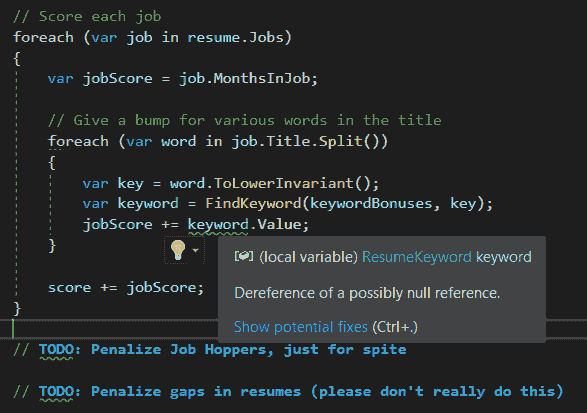
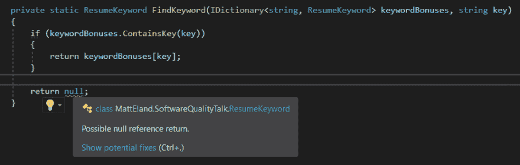

# 使用 C# 8 非空引用类型的更安全的代码

> 原文:[https://dev . to/integerman/safer-code-with-c-8-non-null-reference-types-4f2c](https://dev.to/integerman/safer-code-with-c-8-non-null-reference-types-4f2c)

空引用异常是中最常见的错误之一。NET 应用程序。尽管这个框架非常强大，但它是围绕一个核心假设构建的，即[引用类型](https://docs.microsoft.com/en-us/dotnet/csharp/language-reference/keywords/reference-types)可以指向 null，因此任何使用引用类型的代码都需要知道对象不是 null，或者进行显式检查。

因为对象为空通常只在非常罕见的情况下出现，所以在开发甚至测试过程中很容易捕捉不到这些类型的错误。这意味着。NET Framework 和 C#语言的结构围绕着一些东西，这使得错误很容易隐藏在代码深处。

我们需要的是语言在这些问题发生之前告诉我们。

C# 8 的[可空引用类型特性](https://docs.microsoft.com/en-us/dotnet/csharp/tutorials/nullable-reference-types)旨在解决这个问题。

# [](#what-are-nonnull-reference-types)什么是非空引用类型？

首先，声明一下——我们有可空引用类型已经有一段时间了。这就是问题所在。新特性实际上是我们必须使用的**非空引用类型**，但是文档更喜欢将新特性称为**可空引用类型**。

可为空的引用类型功能接受每个现有的引用类型，并假定它在编辑器级别默认为非空。有风险的代码仍然可以编译，但是你会得到关于初始化为空、可能为空等等的警告。

[T2】](https://res.cloudinary.com/practicaldev/image/fetch/s--uzRoJavg--/c_limit%2Cf_auto%2Cfl_progressive%2Cq_auto%2Cw_880/https://thepracticaldev.s3.amazonaws.com/i/5rjqe20ucb5beerc6hu0.png)

因为 null 仍然是一个重要的概念，你仍然能够表示潜在的 null 类型，但是**你必须明确地说类型可以是 null，因为默认情况下引用类型被认为是非 null 的。**

如果您熟悉 TypeScript 中的可空性，这与[TypeScript 如何工作](https://www.typescriptlang.org/docs/handbook/release-notes/typescript-2-0.html#optional-parameters-and-properties)有些相似。

# [](#enabling-nonnull-reference-types)启用非空引用类型

要打开这个特性，至少在撰写本文时，您必须手动编辑您的。每个项目的 csproj 文件。您还需要使用 Visual Studio 2019 或。网芯 3.0 或更高版本。

具体来说，您将需要向任何`PropertyGroup` : `LangVersion`和`Nullable` :
添加两个新属性

```
 <PropertyGroup>
    <TargetFramework>netstandard2.0</TargetFramework>
    <AssemblyName>MattEland.SoftwareQualityTalk</AssemblyName>
    <RootNamespace>MattEland.SoftwareQualityTalk</RootNamespace>      

    <LangVersion>8.0</LangVersion>
    <Nullable>enable</Nullable> 

  </PropertyGroup> 
```

<svg width="20px" height="20px" viewBox="0 0 24 24" class="highlight-action crayons-icon highlight-action--fullscreen-on"><title>Enter fullscreen mode</title></svg> <svg width="20px" height="20px" viewBox="0 0 24 24" class="highlight-action crayons-icon highlight-action--fullscreen-off"><title>Exit fullscreen mode</title></svg>

LangVersion 告诉 C#使用 C# 8 编译器。

Nullable 告诉 C#默认情况下假定所有声明的引用类型都是非空的。

# [](#what-does-this-get-us)这给我们带来了什么？

当您激活可空引用类型时，您将在 Visual Studio 中看到许多警告，指出各种值可能为空或返回空。

具体来说，您将会看到许多类似这样的警告:

[T2】](https://res.cloudinary.com/practicaldev/image/fetch/s--wLBWOqET--/c_limit%2Cf_auto%2Cfl_progressive%2Cq_auto%2Cw_880/https://thepracticaldev.s3.amazonaws.com/i/gelvusr2vmf25ylk86g3.png)

这是指出上面的方法声明它返回一个`ResumeKeyword`返回类型。以前默认情况下，这是一个可空的引用类型，现在除非另外指定，否则假定它是非空的。为了解决这个问题，我们将返回类型改为`ResumeKeyword?`，用`?`表示实例可能不存在。

正确的代码如下:

```
private static ResumeKeyword? FindKeyword(IDictionary<string, ResumeKeyword> keywordBonuses, string key)
{
    if (keywordBonuses.ContainsKey(key)) 
    {
        return keywordBonuses[key];
    }

    return null;
} 
```

<svg width="20px" height="20px" viewBox="0 0 24 24" class="highlight-action crayons-icon highlight-action--fullscreen-on"><title>Enter fullscreen mode</title></svg> <svg width="20px" height="20px" viewBox="0 0 24 24" class="highlight-action crayons-icon highlight-action--fullscreen-off"><title>Exit fullscreen mode</title></svg>

另一件你会看到很多警告的事情是非空属性和变量没有被初始化。要解决这个问题，您可以给它们分配一个好的初始值，或者您可以使用我们上面使用的`?`操作符来更改它们的变量类型，以指示值可以是 null。

理解**非空引用类型不会以任何方式从根本上改变生成的代码**是很重要的，因为它们只是为了方便开发。但是简单的代码带来的附加值是巨大的，值得投资。

# [](#migrating-to-nullable-reference-types)迁移到可空引用类型

当第一次打开可空引用类型时，您可能会在代码中看到大量类似上面的警告。

如果您需要一点一点地迁移，您可以通过使用新的`#nullable disable`预处理器指令在代码的某些部分恢复到旧的行为，如下例所示:

```
#nullable disable
public class KeywordData
{
    public int Id { get; set; }
    public string Keyword { get; set; }
    public int Modifier { get; set; }
}
#nullable restore 
```

<svg width="20px" height="20px" viewBox="0 0 24 24" class="highlight-action crayons-icon highlight-action--fullscreen-on"><title>Enter fullscreen mode</title></svg> <svg width="20px" height="20px" viewBox="0 0 24 24" class="highlight-action crayons-icon highlight-action--fullscreen-off"><title>Exit fullscreen mode</title></svg>

或者(这也是 Microsoft 推荐的方式)，您不能为项目启用可空引用类型，除非您已经迁移到支持它们的类中。在这种情况下，您使用`#nullable enable`而不是`disable`。这有助于一点一点地迁移代码，但代价是整个代码中可能会有大量可空的指令。

该代码将如下所示:

```
#nullable enable
public class KeywordData
{
    public int Id { get; set; }
    public string? Keyword { get; set; }
    public int Modifier { get; set; }
}
#nullable restore 
```

<svg width="20px" height="20px" viewBox="0 0 24 24" class="highlight-action crayons-icon highlight-action--fullscreen-on"><title>Enter fullscreen mode</title></svg> <svg width="20px" height="20px" viewBox="0 0 24 24" class="highlight-action crayons-icon highlight-action--fullscreen-off"><title>Exit fullscreen mode</title></svg>

* * *

参见[微软的升级指南](https://docs.microsoft.com/en-us/dotnet/csharp/tutorials/upgrade-to-nullable-references)以获得关于升级现有代码以使用可空引用类型的更全面的信息。

# [](#conclusion)结论

我强烈建议在小规模实验中尝试一下这个功能，看看你有什么想法。通过鼓励您明确代码的行为来消除缺陷的潜力是巨大的。

如果你想要一个更有力的方法，在编译器级别强制可空性，阅读我的文章[关于使用 Language-Ext 库中的 Option 类在编译器级别捕获问题](https://dev.to/integerman/eliminating-nulls-in-c-with-functional-programming-iaa)，但是注意语法比 C# 8 非空引用类型要麻烦得多。

如果您喜欢使用属性来注释参数和属性的可空性，请查看我在 JetBrains 上的文章。注释包。

* * *

总的来说，我喜欢 C# 8 中非空引用类型的简单性，我将继续使用它们，直到我找到更好的东西。如果你想了解更多，请阅读官方文档。

如果你在构建高质量软件的过程中发现了其他更好的方法，我很乐意听到，因为我一直在寻找更好的方法来[消除整类软件缺陷](https://dev.to/integerman/making-defects-impossible-16c)。

[](/integerman) [## 使缺陷成为不可能

### matt Eland Aug 31 ' 195min read

#testing #dotnet #javascript #codequality](/integerman/making-defects-impossible-16c)