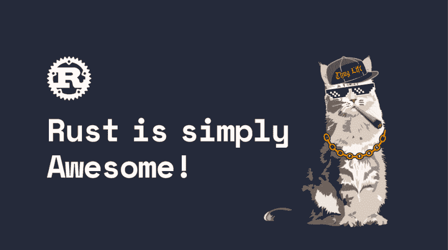

# 01 铁锈简直太棒了

> 原文:[https://dev.to/sathish/01-rust-is-simply-awesome-386j](https://dev.to/sathish/01-rust-is-simply-awesome-386j)

[T2】](https://res.cloudinary.com/practicaldev/image/fetch/s--6aU7ftc1--/c_limit%2Cf_auto%2Cfl_progressive%2Cq_auto%2Cw_880/https://www.skcript.com/svrmedia/heroes/rust-is-simply-awesome%401.5x.png)

大家好。这是爱用 Node JS & Ruby 编程的 Skcript 开发者 [Sathish](https://twitter.com/SathishCodes) 。我把学习 Rust Lang 作为一种爱好，并考虑每周写一系列博客文章，介绍我在其中发现的有趣内容。我们将讨论我遇到的概念。铁锈是迷人的！所以，我们会聊天，我们会编码，我们会一起学习。

让我们来看看这个无聊的样板问题——“什么是[在这里填写任何内容]？”

### 什么是铁锈？

Rust 是一种系统编程语言，它提供线程安全的内存效率和安全的并发性。如果有一点点可能在运行时失败，你的代码将无法编译。它有一个友好的编译器，可以帮助你调试，如果有任何编译时错误，建议更好的解决方法。它还提供了更好的 IDE 支持。据说它可以很容易地与其他编程语言集成。Mozilla 是 Rust 的第一个投资者，并继续赞助开源项目的工作。

Rust 不像其他通用编程语言那样有垃圾收集器，也不需要像其他系统级编程语言(例如 C++)那样手动分配和释放内存。Rust 有一个独特的特性叫做**所有权**，这是本系列的下一个。

### 铁锈能做什么？

从编写 [Web 应用程序](https://rocket.rs/)到[操作系统](https://github.com/redox-os/redox)，你可以用 Rust 构建任何东西。是的，你没听错！

##### 铁锈的生态系统

Cargo 是 Rust 的包管理器，它管理依赖项和板条箱。当您构建 Rust 代码时，它会创建一个可以在任何机器上运行的二进制文件，而无需在目标机器上安装 Rust 生态系统。是啊，和 Java 的“一次编写，随处运行”差不多。

##### 生产中生锈

Dropbox 的文件存储系统在生产中使用 Rust。

火狐几乎是用 Rust 改写的。想知道 Firefox 是如何做到快速和内存高效的吗？是铁锈伙计们！！

Firefox 的 CSS 引擎 Stylo 是用 Rust 重写的，Rust 之前是用 C++写的。通过并行性，LOC 从 1，60，000 减少到 85，000，firefox 团队试图用 C++实现两次，但两次尝试都失败了。这将页面加载速度提高了 30%。

NPM 将其授权服务从节点 JS 切换到 Rust，这在以前是一个性能瓶颈。

天秤座，脸书许可的区块链数字货币是用铁锈制造的。

VS 代码的搜索用 rust 重新实现，由 [ripgrep](https://github.com/BurntSushi/ripgrep) 提供动力。

### 我在未来的岗位上会做些什么？

我在大学写的最后一个系统级编程是 C & C++它让我对指针和动态内存分配感到沮丧。现在我的手都生锈了，我不必处理动态内存分配。作为一个初学者，当我从外面看的时候，Rust 就像卢浮宫博物馆一样迷人。迫不及待地想看到和探索它的核心！我将通过一些解决问题的练习来谈论我在本周学到的东西。每周六**留意我的博文。**

在本系列的下一篇文章中，我将讨论 Rust 中的动态内存分配，以及是什么让它如此酷。看到 Rust 如何管理动态内存分配是如此有趣，我很高兴与你们分享它！下周见，宝贝！

页（page 的缩写）如果你用 Rust 编码，并且对我有什么建议，请在下面留下评论😀