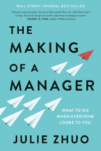

# 《一个管理者的形成》，这是我极力推荐的一本书，也是我最喜欢的部分

> 原文:[https://dev . to/maxkatz/the-making-of-a-manager-a-book-I-highly-recommend-some-of-my favorite-parts-310 a](https://dev.to/maxkatz/the-making-of-a-manager-a-book-i-highly-recommend-and-some-of-my-favorite-parts-310a)

有成千上万本关于如何成为一名经理的书，我相信其中很多都非常好。我刚刚读完[朱莉·周](https://juliezhuo.com/)的[《一个管理者的形成](https://juliezhuo.com/book/manager.html)》。我喜欢这本书，并强烈推荐给新经理，而不是新经理和有一天可能想成为经理的人。

[T2】](https://juliezhuo.com/book/manager.html)

许多管理书籍给了你很多关于如何成为一名管理者的理论建议，或者只是一些不适用于现实世界的建议。我喜欢朱莉的书是因为它充满了非常实用的建议和提示。你可以今天就拿去用。我喜欢 Julie 不害怕分享她害怕过很多次，她不确定她是否做出了正确的决定，犯错误是正常的(实际上是有益的，因为这是我们成长的方式)，因为我们都是人。读这本书的时候，我说了很多次“哦，是的，这就是我的感受”和“哦，我也处于完全相同的情况”。这种联系使这本书成为我极力推荐阅读的一本好书。看到朱莉如何应对各种挑战并成长为脸书的设计副总裁，是一次很好的学习经历。

我想分享一些我最喜欢的部分/引言，摘自《经理人的形成》一书。

> 作为经理，你的工作是让一群人一起工作，取得更好的结果。

解释任何经理工作的伟大名言。

> 作为经理，你工作的第一大部分是确保你的团队知道成功是什么样的，并关心如何实现它。

团队不知道或不理解成功是什么样子的情况并不少见。如果没有对成功的清晰理解，团队可能会做一些不重要的工作。

> 作为经理，你的职责不是亲自去做工作，即使你是最擅长的，因为那只会让你走得更远。你的角色是改进你的团队的目的、人员和过程，以尽可能地提高集体成果的乘数效应。

作为一名新经理，你可能会犹豫是否放弃一些工作。你可能会想，如果你放下工作，他们为什么还需要你呢？作为经理，你的目标是培养团队成员。一旦你给了工作，你就可以接受新的挑战，继续成长。你不太可能找不到另一个项目去做——总有更多的工作和更大的挑战需要你去应对。这很好地引出了下一个引语。

> 我所知道的最好的经理都同意一件事:发展伟大的团队意味着你不断地寻找方法来取代你目前正在做的工作。

我觉得这是一个优秀管理者的核心能力之一。

> 今天，我的工作看起来和我开始工作时大不相同。每次我送出一部分，我都会发现还有更多的东西需要接受。只要你继续被你的目标所激励，只要你的抱负超出了你的团队目前的能力，只要你能看到地平线上的新挑战，那么你就有机会产生更大的影响。通常，这意味着做你还不太擅长的新事物。

成长你的团队和自己接受新挑战的另一个组成部分。

> 但做管理者的意义不是满足你的自我；这是为了提高你的团队的成果

我想知道有多少经理明白这一点。

> 领导力是一种品质，而不是一份工作

简单却如此真实。

> “如果你今天没有带走任何东西，”他告诉我们，“记住这一点:管理就是关怀。

你必须相信并关心你的团队。没办法作假。

> 作为经理，你的工作不是给出建议或“拯救世界”——而是让你的报告自己找到答案。

这就是你如何授权和发展你的团队(并避免微观管理)。

> 经理的工作是。。。建立一个合作良好的团队，支持成员实现他们的职业目标，并创建流程以顺利高效地完成工作。

定义经理工作的绝佳方式。

> 这就是管理的关键:它是一种信念，即一个团队比一个人单干能取得更大的成就。它是一种认识，即你不必事事亲力亲为，不必事事亲力亲为，甚至不必知道如何做好每一件事

作为一名经理，你也希望能够从你的团队中学习，因为如上所述，你不知道如何做所有的事情。

> 最好的结果来自激励人们去行动，而不是告诉他们该做什么。

最好的留到最后。

这只是一个很小的样本。这本书非常好，所以我再次[强烈推荐你阅读它](https://juliezhuo.com/book/manager.html)。如果你是一个新的管理者，已经做了一段时间的管理者，对于今天是个人贡献者的人，有一天想成为管理者或者只是想学习什么是好的管理者和领导者，这是一本很棒的书。