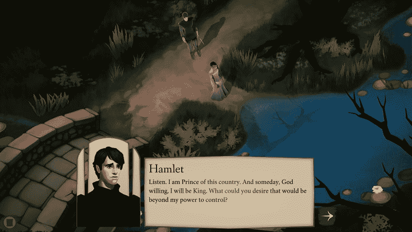

# 三个极其晦涩的视频游戏让我成为了一个更好的开发者

> 原文:[https://dev . to/ryancmcconnell/three-extremely-obscent-video-games-that-make-me-a-better-developer-3d K9](https://dev.to/ryancmcconnell/three-extremely-obscure-video-games-that-made-me-a-better-developer-3dk9)

像所有艺术形式一样，电子游戏可以帮助我们反思，让我们思考，并经常以我们意想不到的方式改善我们的生活。我无数次发现，手眼协调、解决问题和资源管理等品质可以在玩电子游戏时得到培养。作为一名游戏玩家，我不仅喜欢大型游戏，也喜欢默默无闻的游戏。话不多说，我展示了三个我真正喜欢的非主流游戏，也让我了解了如何成为一名更好的 web 开发人员。请注意，会有剧透，因为没有它们，很难讨论这些游戏以及它们与 web 开发的关系。

## 保存日期:徒劳和黑客

[https://www.youtube.com/embed/_l48mTOowfE](https://www.youtube.com/embed/_l48mTOowfE)

一个实验性的个人电脑免费游戏，我敢打赌很少有人听说过[拯救日期](http://paperdino.com/save-the-date/)，更不用说玩它了。我在失业期间(因此无法购买新游戏)看到了一个关于它的推荐，并试用了它。令我完全惊讶的是，它令人难以置信地发人深省。基本前提是你已经有对象了。在带她去哪里的问题上，你有几个选择，不可避免地会出现可怕的错误，比如陷入枪战，你的约会对象可怕地死去。你被送回起点，做了一个不同的选择，但新的事情发生了，比如怪物袭击，让你的约会对象淹死了。最终，在多次试图挽救她的生命后，你到了结局，并意识到也许你终究无法挽救这个约会。一颗流星坠落，你又回到了起点。

我喜欢游戏中模棱两可的结局，也喜欢那些检验徒劳想法的结局。无论你多么努力地试图“解决问题”,你都会遇到新的挑战，直到你意识到你可能赢不了。作为一名网络开发人员，这绝对是我人生中的一课。我不喜欢承认失败。尽管有时项目会失败，不管是你的错还是完全的意外，学习接受失败是生活的一大部分，更不用说 web 开发了。

这里有一个真正的大剧透:如果你进入游戏的代码，有一个秘密的结局。自述文件解释了为启用它而必须做的非常小的代码更改。这是个骗局。你得到了一个秘密的结局，一个最终是可笑和愚蠢的(想想一只不知从哪里飞来的独角兽拯救了这一天)并且完全不合适的结局。但它不适合，因为它实际上是一个黑客。有时候在 web 开发中，无论你多么努力，答案都是使用已知的黑客技术。在 CSS 中，如果你在一个有双边框的元素上使用边框半径，你会得到彩色出血。这是众所周知的，并修复它的黑客工程…如果你不想要一个边界。所以不是理想的黑！但是有时候不太理想是你所坚持的，这在生活中是真实的，在网络开发中也是如此，在保存日期中也是如此。

## 埃尔西诺:做出牺牲

[T2】](https://res.cloudinary.com/practicaldev/image/fetch/s--_flEzxJc--/c_limit%2Cf_auto%2Cfl_progressive%2Cq_auto%2Cw_880/https://i.imgur.com/t65OFHp.png)

[埃尔西诺](https://elsinore-game.com/)，最近在 PC 上发布，是我从 2019 年至今最喜欢的游戏。你扮演莎士比亚的《哈姆雷特》中的角色奥菲莉亚。欧菲莉亚在该剧的第一天醒来，发现自己被困在了时间循环中。你可以让这出戏顺其自然，或者你可以进行干预，做一些小的改变，完全改变这出戏的结构。最终你可以更好地控制时间，在你想要的时候重启这部剧，更多地了解这个世界和这个角色。有超过十种不同的结局，当你决定最终做出选择时，游戏会清楚地表明你的决定确实是最终的。事实上，一旦你决定并点击选择结尾的按钮，你的保存文件就被删除了！埃尔西诺明确表示，没有完美的结局，我们的选择和必须做出的牺牲总会有后果。

在 web 开发中，我还没有发现一个项目不需要某种牺牲。试图找到一个“黄金结局”是非常诱人的，但通常你能做的最好的事情是收集所有的要求，看看你能做出的选择的逻辑结果，然后做出决定。如果你坚持尝试太多的选项或者试图把所有东西都放进去，那么你要么会耗尽时间，耗尽资源，要么以一个半途而废的项目结束。幸运的是，在我们的领域里,“最终选择”往往不一定是最终的。我可以上传我刚刚建立的新网站，如果有小问题，我可以很快修复它。但有时我们不得不接受我们的选择，并希望我们做出的牺牲是正确的，埃尔西诺很好地反映了这一点。

## 尘世的开端:耐心和寻求帮助

[T2】](https://res.cloudinary.com/practicaldev/image/fetch/s--SRxH3Xx7--/c_limit%2Cf_auto%2Cfl_progressive%2Cq_auto%2Cw_880/https://i.imgur.com/E7kD1UZ.png)

作为一个超级任天堂粉丝，我不得不在这里放一个他们的游戏。也许你听说过 Earthbound，这款设定在 90 年代的超级任天堂 RPG？这是 1989 年任天堂娱乐系统上最初只在日本发行的前传，最终在 2015 年在 Wii U 上在更广泛的世界发行。说说晦涩！但是这个游戏，虽然很老，也有些过时，却有很多东西可以教给我们这些网络开发者。

[Earthbound Beginnings](https://www.nintendo.com/games/detail/earthbound-beginnings-wii-u/) 由一群小学生、Ninten、Ana 和 Loid 主演，他们与爆炸机器人、黑帮僵尸、由云组成的幻想世界以及绑架人类的恐怖外星人一起探索世界。这是一款大型游戏，尤其是对于一款 NES 游戏来说，它遵循了经典的龙之任务风格的 RPG 机制。这个游戏最值得注意的一点是它依赖研磨作为游戏的一个功能。游戏的结尾部分是如此的不平衡，以至于你不得不一个接一个地与敌人战斗，以便变得足够强大来打败游戏。这是游戏的一个合法缺陷，也是一个让许多人对它失去兴趣的缺陷。然而，研磨是日常工作中经常要做的事情。我们甚至称工作为“日常琐事”在 web 开发中，我经常发现自己一次又一次地投入到一个项目中，试图让它工作，或者满足需求。有时候是纯粹的数据输入——在 Drupal 中填写这个页面，使它看起来像这样，创建一个具有这些功能的表单，等等。这是最让人感到痛苦的日子。就像在地球上开始研磨一样，我发现自己经常听播客或音乐，只是勉强通过。

玩像 Earthbound Beginnings 这样的老 NES 角色扮演游戏的另一个怪癖是，从一个区域前进到另一个区域的键通常是完全迟钝的。也可能你进入的地牢是字面上的迷宫。或者在你前进之前，你必须有一个人在你的党内。有大量的秘密和广阔的世界去探索，所以有时你需要帮助。Starmen.net 有一个很棒的游戏指南，我在浏览的过程中大量使用了它。如果没有那个指南，我永远也不会有耐心完成这个游戏。同样，我工作时也有很多时候需要一个向导。如果我没有可用的 Drupal Form API 文档，我永远也不能为我的雇主设计一个定制模块解决方案。如果没有 CSS 技巧或堆栈溢出，我将仍然停留在许多其他人已经解决的基本问题上。如果您有另一个主题可以构建，甚至 Drupal 主题也更容易构建。利用手边的资源让任务变得简单并不可耻——即使这个任务是一个 40 年前的视频游戏！我最终完成了这个游戏，虽然它不是我在这个系列中最喜欢的(这是未发布的地球母亲 3 续集)，但它仍然给了我很多思考，也有很棒的音乐。

[T2】](https://res.cloudinary.com/practicaldev/image/fetch/s--o6WWZKEI--/c_limit%2Cf_auto%2Cfl_progressive%2Cq_66%2Cw_880/https://i.imgur.com/jxVv3aZ.gif)

所以这是讨论我最喜欢和不被重视的游戏的借口吗？也许吧。但对我来说，审视我的爱好和我认为有意义的媒体，并了解我学到或学到的一些东西可以应用到我生活的其他领域也很重要。如果你有一款游戏在某种程度上启发了你，请在下面告诉我！