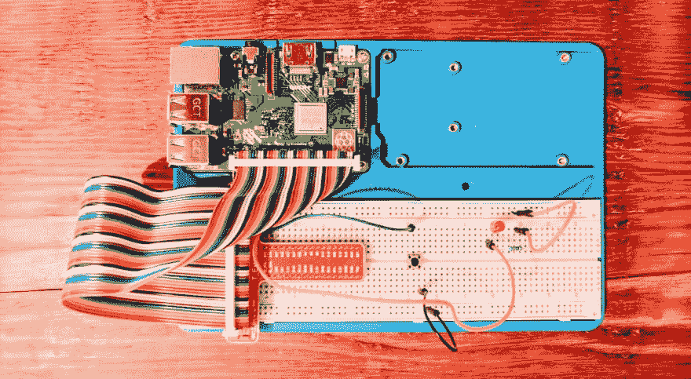

# Ruby 驱动的树莓 Pi 按钮

> 原文:[https://dev . to/codenamev/ruby-driven-raspberry-pi-buttons-5344](https://dev.to/codenamev/ruby-driven-raspberry-pi-buttons-5344)

> 这是我的 [Sunfounder Superkit 系列](https://blog.codenamev.com/tag/sunfounder-super-kit/)的第 2 部分。

闪烁 LED 太容易了！让我们让这个作品互动起来。纽扣正是我在寻找的魔力。推动它，做点什么。任何事情！让我们保持简单，建立在我们的第一个简单的 LED 连接。

<figure> 

<figcaption>配线一个按钮到一个 LED 上</figcaption>

</figure>

有了这些，再加上一点 Ruby 脚本，我们就可以在按钮中循环加入 LED 闪烁的乐趣了。