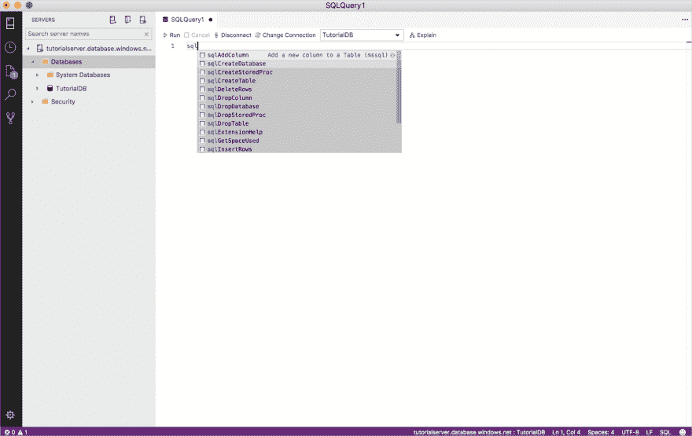
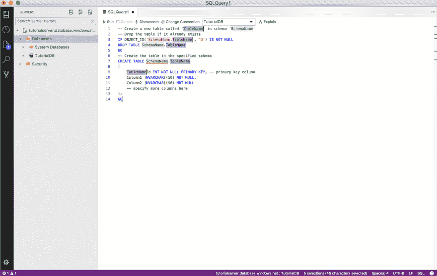
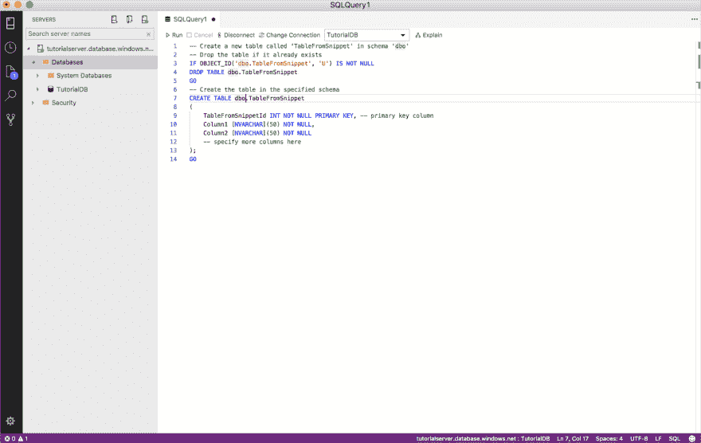

# 了解蓝色 Data Studio

> [https://dev . to/spass/azure-data studio-windows MAC OS-e-Linux 349g](https://dev.to/spassos/azure-data-studio-uma-ferramenta-leve-que-roda-em-windows-macos-e-linux-349g)上的轻型滚动工具

Microsoft 于 2017 年 11 月发布了 Azure Data Studio，这是一款开源工具，用于管理 SQL Server、SQL Azure 数据库和 Azure SQL 数据仓库。它是跨平台的，可以超越 Windows，在 MacOS 和 Linux 上运行。它是基于 VS Studio Code 构建的，该编辑器广泛用于开发 web 和移动应用程序。

## 主要特点

## **高级 T-SQL 编辑器和 intellisense**

Azure Data Studio 为 T-SQL 编码提供了定制体验，使您可以更轻松地实施脚本，例如:

*   聚焦于键盘快捷键；
*   建议并自动完成对象或关键字，提高生产力；
*   与 GIT 版本控制集成；
*   将结果导出为文本、JSON 或 Excel 格式：
*   在结果网格本身中编辑数据；
*   自订
*   直观的数据库对象导航；

## **t-SQL 编码片段**

有一些用于创建和更新数据库对象(表、视图、存储过程、函数等)的预定义 T-SQL 代码片段。此功能允许更高效的编码，使开发人员 DBA 的工作更轻松。您可以创建自己的代码段并将其用于您的任务。下面是如何使用代码片断:

1.  在编辑器中键入“sql”，将显示选项列表

1.  选择要使用的代码段，将自动生成 T-SQL 代码的结构，在下面的示例中选择了“*SQL create table*”

1.  现在只需填写方案名称、表、列和列类型即可。

## 仪表盘

建立您自己的仪表板，或使用现有的样板来监督和识别资料库中的效能问题。

## 连接管理器(服务器组)

「伺服器群组」是一项功能，可协助您组织您工作的伺服器和资料库连线。

## 终端积分

您可以在与 SQL Operations Studio 集成的终端上运行 Bash、PowerShell、sqlcmd、bcp 和 ssh 等命令，而无需打开多个命令行工具。

## 链接对位下载

[https://docs . Microsoft . com/en-us/SQL/azure-data-studio/download？view=sql-server-2017](https://docs.microsoft.com/en-us/sql/azure-data-studio/download?view=sql-server-2017)

## 参考文献

[https://docs . Microsoft . com/en-us/SQL/azure-data-studio/what-is？view=sql-server-2017](https://docs.microsoft.com/en-us/sql/azure-data-studio/what-is?view=sql-server-2017)