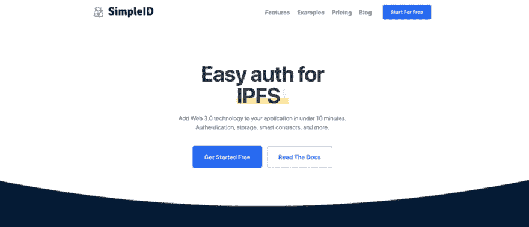
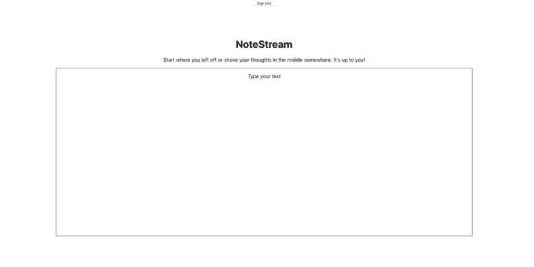

# 使用 IPFS 和块堆栈构建版本控制系统

> 原文:[https://dev . to/contaminerofminds/build-a-versioning-system-with-ipfs-and-block stack-1no 6](https://dev.to/polluterofminds/build-a-versioning-system-with-ipfs-and-blockstack-1no6)

<figure>[](https://res.cloudinary.com/practicaldev/image/fetch/s--nexq6Z6u--/c_limit%2Cf_auto%2Cfl_progressive%2Cq_auto%2Cw_880/https://cdn-images-1.medium.com/max/225/0%2AkXiYYKl3rt6KniZA) 

<figcaption>能够看到版本历史就像倒带历史</figcaption>

</figure>

版本控制有很多很好的用例。处理代码部署、文档编辑和数据库快照只是想到的几个直接用途。通常，版本控制系统是数据库中的另一个部分，但是当你从不可变数据和 DHT(分布式哈希表)技术的角度考虑它时，它可以是更多。所以，今天我们要用版本历史来搭建一个意识流笔记 app。这将不同于其他笔记应用程序，因为它只有一个笔记，用户可以随时编辑，删除信息或添加信息。但我们将包括版本，以便他们可以抓住他们的历史。我们将通过使用 Blockstack 和 IPFS 来完成所有这些工作。

[Blockstack](https://blockstack.org) 是一个分散的应用平台，让用户选择数据存储的位置。为了与本教程相似，我们将使用 Blockstack 公司提供的存储中心(它是免费的，不需要任何配置)。 [IPFS](https://ipfs.io) 一个点对点网络，允许数据基于其内容而不是其位置被提供。这意味着当数据改变时，它由不同的标识符(散列)来表示，并且旧版本的数据仍然存在，没有改变。这对版本控制系统来说是完美的。我们将通过创建一个新的 React 项目并安装一个依赖项来构建这一切: [SimpleID](https://www.simple.id.xyz/?s=med?t=vsys) 。

[T2】](https://res.cloudinary.com/practicaldev/image/fetch/s--adsJ5i9---/c_limit%2Cf_auto%2Cfl_progressive%2Cq_auto%2Cw_880/https://cdn-images-1.medium.com/max/1024/1%2AqTNxfO94yDZSAIvPRgMVog.png)

SimpleID 为去中心化的 web 提供开发者工具。简而言之，SimpleID 允许开发人员向他们的应用程序添加分散的身份验证和存储，而无需要求他们的用户经历生成种子短语和管理这些 12 个单词备份的繁琐过程。用户获得传统的用户名/密码认证流，同时仍然拥有他们的身份并获得对 Web 3.0 技术的访问。

要开始，请访问 SimpleID 和[注册一个免费的开发者账户](https://www.simpleid.xyz/#app?s=med?t=ipfs_vs)。验证您的帐户后，您将能够创建一个项目，并选择要包含在项目中的 Web 3.0 模块。让我们快速浏览一下:

1.  注册开发者账户

2.  单击电子邮件中的验证链接

3.  一旦您的帐户通过验证，您将进入帐户页面，在这里您可以创建一个新项目

4.  给这个新项目起一个名字和一个 url，在那里你可以最终托管它(只要它是基于 https 的，这个 URL 现在可以是假的)

5.  保存，然后单击查看项目

6.  复制你的 API 密匙和开发者 ID

7.  转到模块页面，为您的身份验证模块选择 Blockstack，为您的存储模块选择 Blockstack 和 Pinata

8.  单击保存

就是这样！现在，你可以开始工作了。关于 Pinata 的快速说明:他们提供 IPFS 锁定服务，因此 SimpleID 在幕后使用他们向 IPFS 网络添加内容，并锁定所述内容以确保其始终可用。点击阅读更多关于钉住[的信息。](https://docs.ipfs.io/guides/concepts/pinning/)

让我们建立一个项目。我的说明将从 MacOS 的角度出发，但是不同系统的用户应该能够使用类似的命令开始。首先，打开您的终端并创建新的 React 项目:

npx 创建-反应-应用 ipfs-块堆栈-版本控制

完成后，转到目录，然后安装 SimpleID 依赖项:

CD ipfs-块堆栈-版本控制

npm i simpleid-js-sdk

好，在你选择的文本编辑器中打开这个项目。我们不会花时间在复杂的文件夹结构上。这是一个非常基本的应用程序，旨在展示 Blockstack 和 IPFS 的强大功能。记住这一点，找到 src 文件夹并打开 App.js。在该文件的顶部，在 import css 语句的正下方添加以下内容:

```
import { createUserAccount, login, pinContent, fetchPinnedContent } from 'simpleid-js-sdk';

const config = {
  apiKey: ${yourApiKey}, //found in your SimpleID account page
  devId: ${yourDevId}, //found in your SimpleID account page
  authProviders: ['blockstack'], //array of auth providers that matches your modules selected
  storageProviders: ['blockstack', 'pinata'], //array of storage providers that match the modules you selected
  appOrigin: "https://yourapp.com", //This should match the url you provided in your dev account sign up
  scopes: ['publish\_data', 'store\_write', 'email'] //array of permission you are requesting from the user
} 
```

<svg width="20px" height="20px" viewBox="0 0 24 24" class="highlight-action crayons-icon highlight-action--fullscreen-on"><title>Enter fullscreen mode</title></svg> <svg width="20px" height="20px" viewBox="0 0 24 24" class="highlight-action crayons-icon highlight-action--fullscreen-off"><title>Exit fullscreen mode</title></svg>

好了，现在导入了 SimpleID 包和这个 config 对象(它直接来自于 [SimpleID 文档](https://docs.simpleid.xyz)，您已经准备好开始了。让我们在用户界面上下点功夫。正如我提到的，这将是一个非常简单的应用程序，所以让我们加入一个编辑器来处理我们的文档。我们将在 index.html 文件中使用脚本标记来完成这项工作，而不是通过 NPM 安装一个依赖项。你可以使用任何所见即所得的库，但我将使用被称为媒体编辑器。你可以在这里找到[。](https://github.com/yabwe/medium-editor)

您的 index.html 文件位于公共文件夹中。找到它并将其添加到标题标签之上:

```
<link rel="stylesheet" href="//cdn.jsdelivr.net/npm/medium-editor@latest/dist/css/medium-editor.min.css" type="text/css" media="screen" charset="utf-8">
    <script src="//cdn.jsdelivr.net/npm/medium-editor@latest/dist/js/medium-editor.min.js"></script>
    <title>NoteStream</title> 
```

<svg width="20px" height="20px" viewBox="0 0 24 24" class="highlight-action crayons-icon highlight-action--fullscreen-on"><title>Enter fullscreen mode</title></svg> <svg width="20px" height="20px" viewBox="0 0 24 24" class="highlight-action crayons-icon highlight-action--fullscreen-off"><title>Exit fullscreen mode</title></svg>

你会注意到，我在这里设置了我的应用程序的标题，因为我们已经在编辑文件了。请随意使用相同的名称或创建自己的名称。现在我们已经添加了所需的样式表和脚本，让我们转到位于 src 文件夹中的 App.js 文件。我们将清除这个文件中的所有内容，大部分从零开始。所以，将你的 App.js 文件更新成这样:

```
import React from 'react';
import './App.css';
import { createUserAccount, login, pinContent, fetchPinnedContent } from 'simpleid-js-sdk';

const config = {
  apiKey: ${yourApiKey}, //found in your SimpleID account page
  devId: ${yourDevId}, //found in your SimpleID account page
  authProviders: ['blockstack'], //array of auth providers that matches your modules selected
  storageProviders: ['blockstack', 'pinata'], //array of storage providers that match the modules you selected
  appOrigin: "https://yourapp.com", //This should match the url you provided in your dev account sign up
  scopes: ['publish\_data', 'store\_write', 'email'] //array of permission you are requesting from the user
}

class App extends React.Component {
  constructor(props) {
    super(props);
    this.state = {
      userSession,
      content: "", 
      versions: [],
      selectedVersionContent: "", 
      pageRoute: "signup",
      versionPane: false, 
      versionModal: false 
    }
  }
  render() {
    return (
      <div className="App">

      </div>
    );
  }
}

export default App; 
```

<svg width="20px" height="20px" viewBox="0 0 24 24" class="highlight-action crayons-icon highlight-action--fullscreen-on"><title>Enter fullscreen mode</title></svg> <svg width="20px" height="20px" viewBox="0 0 24 24" class="highlight-action crayons-icon highlight-action--fullscreen-off"><title>Exit fullscreen mode</title></svg>

我已经将 function 组件转换成了 class 组件，但是您可以将它作为一个 function 组件来完成，只需对处理状态的方式做一些小的更改。您可以看到我有四个我希望使用的状态变量:userSession(它将从我们的块堆栈验证中填充)、content(它将是实际的流注释)、versions(它将是我们的历史)、selectedVersionContent(它将用于显示过去版本的实际内容)、pageRoute(它用于处理屏幕上显示的内容)、versionPane(它确定版本窗格是否显示)和 versionModal(它确定版本模式是否打开)。

我认为我们应该做的第一件事是注册并登录屏幕渲染。在...之内

with the className of “App”, add some conditional logic with form inputs like this:

```
render() {
    const { pageRoute, userSession } = this.state;
    return (
      <div className="App">
        {
          pageRoute === "signup" && !userSession.isUserSignedIn() ? 
          <div>
            Sign Up
          </div> : 
          pageRoute === "signin" && !userSession.isUserSignedIn() ?
          <div>
            Sign In
          </div> : 
          <div>
            App Content
          </div>
        }
      </div>
    );
  } 
```

我们显然要用实际内容来填充它，但这应该有助于说明发生了什么。如果 pageRoute 状态是“注册”且用户没有登录，我们应该显示注册表单。如果 pageRoute 状态是“signin”并且用户没有登录，我们应该显示登录表单。不然就要展示 app。

现在，让我们稍微扩展一下。让我们从处理 Blockstack userSession 状态开始。这其实很简单。在我们的 App.js 文件的顶部，只需将它添加到导入语句的下面:

```
import { UserSession } from 'blockstack';
import { AppConfig } from 'blockstack'

const appConfig = new AppConfig(['store\_write', 'publish\_data', 'email']);
const userSession = new UserSession({ appConfig }); 
```

您应该将它添加到 actions.js 文件的顶部以及现有 import 语句的下面。Blockstack 随 SimpleID 一起安装，因此您不需要添加任何依赖项。好了，现在让我们将必要的登录和注册表单添加到我们的 App.js 文件:

```
class App extends React.Component {
  constructor(props) {
    super(props);
    this.state = {
      userSession,
      content: "",
      versions: [],
      selectedVersionContent: "",
      pageRoute: "signup",
      versionPane: false,
      versionModal: false,
      username: "",
      password: "",
      email: "",
      loading: false, 
      error: "    
    }
  }

  handleUsername = (e) => {
    this.setState({ username: e.target.value });
  }

  handlePassword = (e) => {
    this.setState({ password: e.target.value });
  }

  handleEmail = (e) => {
    this.setState({ email: e.target.value });
  }

  handleSignIn = (e) => {
    e.preventDefault();
  }

  handleSignUp = (e) => {
    e.preventDefault();
  }

render() {
  const { pageRoute, userSession, username, password, email, error } = this.state;
  return (
    <div className="App">
    {
      pageRoute === "signup" && !userSession.isUserSignedIn() ?
      <div>
        <form onClick={this.handleSignIn} className="auth-form">
          <input placeholder="username" id="username-sign-up" type="text" value={username} onChange={this.handleUsername} />
          <input placeholder="password" id="password-sign-up" type="password" value={password} onChange={this.handlePassword} />
          <input placeholder="email" id="password-sign-up" type="email" value={email} onChange={this.handleEmail} />
          <button type="submit">Sign In</button>
        </form>
        <p>Already have an account? <button onClick={() => this.setState({ pageRoute: "signin" })} className="button-link">Sign In.</button></p>
        <p>{error}</p>
      </div> :
      pageRoute === "signin" && !userSession.isUserSignedIn() ?
      <div>
        <form onSubmit={this.handleSignUp} className="auth-form">
          <input placeholder="username" id="username-sign-in" type="text" value={username} onChange={this.handleUsername} />
          <input placeholder="password" id="password-sign-in" type="password" value={password} onChange={this.handlePassword} />
          <button type="submit">Sign In</button>
        </form>
        <p>Need to sign up? <button onClick={() => this.setState({ pageRoute: "signup" })} className="button-link">Register.</button></p>
        <p>{error}</p>
      </div> :
      <div>
        App Content
      </div>
      }
    </div>
    );
  }
}

export default App; 
```

我们在这里添加了很多内容，但是很容易理解。我们添加了处理注册和登录流的函数。我们还添加了一个表单来处理这些输入。我们添加了一个状态切换器，这样登录表单上的人可以切换到注册表单，反之亦然。我们还在注册表单和登录表单中准备了一个段落部分，以处理注册或登录过程中可能发生的任何错误。

有了所有这些，我想我们终于可以启动我们的应用程序，看看它工作得有多好。从终端运行 npm start。

希望这对你有用。如果是的话，你会看到一个非常难看的注册表格。您可以切换到登录表单，也可以切换回来。在本教程中，我们不会接触太多的 CSS，但是我们已经有了一个功能应用程序的开始。你可能已经注意到了，我添加了一个叫做 loading 的状态变量。我们马上就要使用它了，因为我们实际上注册了一个用户并让他们登录。我们将从注册过程开始。同样，为此，我们将使用 [SimpleID 文档](https://docs.simpleid.xyz)。

找到 handleSignUp 函数，像这样填写:

```
handleSignUp = async (e) => {
  e.preventDefault();
  this.setState({ loading: true, error: "" });
  const { username, password, email } = this.state;
  const credObj = {
    id: username,
    password: password,
    hubUrl: 'https://hub.blockstack.org', //This is the default Blockstack storage hub
    email: email
  }

  try {
    const account = await createUserAccount(credObj, config);
    localStorage.setItem('blockstack-session', JSON.stringify(account.body.store.sessionData));
    window.location.reload();
  } catch(err) {
    console.log(err);
    this.setState({ loading: false, error: "Trouble signing up..."})
  }
} 
```

我们将函数设为异步，因为我们需要等待 createUserAccount 承诺解决，然后才能做其他事情。除此之外，我们只是简单地按照文档添加了一个 try/catch。如果有错误，错误状态将被更新，加载状态将被设置回 false。用户应该会在屏幕上看到错误消息。如果没有错误，Blockstack 需要的 localStorage 项被更新，我们刷新窗口。

在测试注册流程之前，我们应该做的最后一件事是添加一个加载指示器。这不会有什么特别的，但是当注册的时候，指示器会取代屏幕上的其他东西。让我们把我们的应用程序代码 JSX 更新成这样:

```
<div className="App">
  {
    loading ?
    <div>
    <h1>Loading...</h1>
    </div> :
    <div>

    {
      pageRoute === "signup" && !userSession.isUserSignedIn() ?
      <div>
        <div onSubmit={this.handleSignIn} className="auth-form">
          <input placeholder="username" id="username-sign-up" type="text" value={username} onChange={this.handleUsername} />
          <input placeholder="password" id="password-sign-up" type="password" value={password} onChange={this.handlePassword} />
          <input placeholder="email" id="password-sign-up" type="email" value={email} onChange={this.handleEmail} />
          <button type="submit">Sign In</button>
        </form>
        <p>Already have an account? <button onClick={() => this.setState({ pageRoute: "signin" })} className="button-link">Sign In.</button></p>
        <p>{error}</p>
      </div> :
      pageRoute === "signin" && !userSession.isUserSignedIn() ?
      <div>
        <form onSubmit={this.handleSignUp} className="auth-form">
          <input placeholder="username" id="username-sign-in" type="text" value={username} onChange={this.handleUsername} />
          <input placeholder="password" id="password-sign-in" type="password" value={password} onChange={this.handlePassword} />
          <button type="submit">Sign In</button>
        </form>
        <p>Need to sign up? <button onClick={() => this.setState({ pageRoute: "signup" })} className="button-link">Register.</button></p>
        <p>{error}</p>
      </div> :
      <div>
        App Content
      </div>
     }
   </div>
  }
</div> 
```

现在让我们来测试一下。继续键入用户名、密码和电子邮件，然后单击注册。假设这是可行的，你应该已经看到了加载屏幕，然后几秒钟后，用户登录并出现“应用内容”字样。不错！

但是现在呢？我们没有办理签到，用户无法注销。让我们先处理注销，因为它真的很简单。在应用程序中有“应用程序内容”字样的部分，添加一个调用 handleSignOut 函数的按钮:

```
<button onClick={this.handleSignOut}>Sign Out</button> 
```

然后确保将该功能与其他功能相加:

```
handleSignOut = () => {
  localStorage.removeItem('blockstack-session');
  window.location.reload();
} 
```

试一试，用户应该被注销。现在，我们可以登录了。我希望你记得你的用户名和密码。让我们连接 handleSignIn 函数:

```
handleSignIn = async (e) => {
  e.preventDefault();
  this.setState({ loading: true, error: "" });
  const { username, password } = this.state;
  const credObj = {
    id: username,
    password,
    hubUrl: 'https://hub.blockstack.org' //This is the default Blockstack storage hub
  }
  const params = {
    credObj,
    appObj: config,
    userPayload: {} //this can be left as an empty object
  }
  try {
    const signIn = await login(params);
    if(signIn.message === "user session created") {
      localStorage.setItem('blockstack-session', JSON.stringify(signIn.body.store.sessionData));
      window.location.reload();
    } else {
      this.setState({ loading: false, error: signIn.message })
    }
  } catch(err) {
    console.log(err);
    this.setState({ error: "Trouble signing in..."})
  }
} 
```

我们再次使用 SimpleID 文档登录，大部分代码在注册功能中重复使用。我们不需要电子邮件来登录，我们必须创建一个 params 对象，但除此之外，它基本上是相同的。有了这些，让我们试一试。

您应该已经看到了加载指示器，然后您的用户已经登录。当然，当用户登录时，我们现在只有一个注销按钮。让我们通过使用我们的中型编辑器来改变这种情况。

在 App.js 中你的构造函数下面，在你的其他函数上面，让我们添加一个 componentDidMount 方法:

```
componentDidMount() {
  var editor = new window.MediumEditor('.editable');
} 
```

这是使用 window 获取我们添加到 index.html 文件中的 MediumEditor 脚本。为了让我们看到任何内容，我们需要编辑 JSX 的应用程序内容部分。所以在你放置退出按钮的地方，让我们在下面添加一些东西来处理编辑器:

```
<div className="editor">
  <h1>NoteStream</h1>
  <p>Start where you left off or shove your thoughts in the middle somewhere. It's up to you!</p>
  <div className="editable"></div>
</div> 
```

没有任何 css 样式，这将是太难看处理。所以，让我们来解决这个问题。在同一文件夹中，但在 App.css 文件中，添加以下内容:

```
.editor {
  max-width: 85%;
  margin: auto;
  margin-top: 100px;
}

.editable {
  max-width: 85%;
  margin: auto;
  border: 1px solid #282828;
  border-radius: 3px;
  min-height: 500px;
  padding: 15px;
  text-align: left;
} 
```

我们可以在以后改变这一点，但它至少使应用程序可以看得见。您应该会看到类似这样的内容:

[T2】](https://res.cloudinary.com/practicaldev/image/fetch/s--qQ0BT23I--/c_limit%2Cf_auto%2Cfl_progressive%2Cq_auto%2Cw_880/https://cdn-images-1.medium.com/max/1024/1%2AQ3FEzjgqum_v69Ik5fzFQQ.png)

不是最漂亮的东西，但现在也可以了。我们需要能够处理对编辑器的更改，所以让我们在开始保存数据之前就从这里开始吧。在我们的 componentDidMount 生命周期事件中，让我们稍微改变一下:

```
componentDidMount() {
  var editor = new window.MediumEditor('.editable');
  //We'll load our content here soon
  editor.subscribe('editableInput', (event, editable) => {
    this.setState({ content: editor.getContent(0) });
  });
} 
```

如果您还记得，我们创建了一个名为 content 的状态变量来保存注释的内容。我们在编辑器中的每一个变化上设置那个状态。这意味着当我们准备好保存注释时，我们可以从内容状态中获取数据。让我们通过做两件事来看看这是什么样子。我们将添加一个保存按钮和一个保存内容函数。

在登出按钮的右边，添加一个保存按钮:

```
<button onClick={this.handleSignOut}>Sign Out</button>
<button onClick={this.saveContent}>Save</button> 
```

然后，使用所有其他函数，创建 saveContent 函数:

```
saveContent = () => {
  const { content, userSession } = this.state;
  console.log(content)
} 
```

我们马上就要使用 userSession 状态，所以我把它放在那里了。但是有了这个，您应该能够打开开发人员控制台，在编辑器中键入内容，然后点击 save。您将看到 html 内容。

这意味着您已经准备好保存内容并将其加载回来。不过，让我们先考虑一下。我们需要将内容保存到 Blockstack 的存储系统和 IPFS。Blockstack 的存储系统每次都会有一个覆盖功能，但对于 IPFS，我们会在网络上存储一个新版本。我们还需要能够获取 IPFS 散列，因此我们也应该将它存储到块堆栈中。在我看来，我们有两个文件要存储在 Blockstack 上:内容和版本(哈希)。但是我们必须首先保存到 IPFS，这样我们就有了散列结果。让我们开始在 saveContent 函数中将它写出来。

```
saveContent = async () => {
  const { content, userSession } = this.state;
  //First we save to IPFS
  const contentToPin = {
    pinnedContent: JSON.stringify(content)
  }

const params = {
    devId: config.devId, //your dev ID found in your SimpleID account page
    username: userSession.loadUserData().username, //you logged in user's username
    id: Date.now(), //an identifier you can use to reference your content later
    content: contentToPin, //the content we discussed previously
    apiKey: config.apiKey //the api key found in your SimpleID account page
  }

  const pinnedContent = await pinContent(params);
  console.log(pinnedContent);
} 
```

我们在函数中添加了 async 关键字，并使用了必要的参数将内容发送到 SimpleID 文档给出的 IPFS。在某些情况下，开发者需要向 Pinata 查询他们之前发布到 IPFS 的内容。这就是 id 字段的全部意义。在这种情况下，我们将使用 Blockstack 来管理我们所有的散列，所以我们并不真正关心这个标识符是什么，只关心它是唯一的(因此，Date.now())。

在我们继续之前，让我们打开控制台测试一下，看看效果如何。添加一些内容到你的编辑器，然后点击保存。如果一切顺利，您应该会在控制台中看到类似这样的内容:

```
{ message: "content successfully pinned", body: "QmbRshi9gjQ2v5tK4B8czPqm3jEQ3zGzsuQJuQLyti4oNc" } 
```

对象中的主体键是 IPFS 散列。我们希望使用它，并将其存储为带有 Blockstack 的版本。让我们接下来解决这个问题。

```
saveContent = async () => {
  const { content, userSession } = this.state;
  //First we save to IPFS
  const contentToPin = {
    pinnedContent: JSON.stringify(content)
  }

const params = {
    devId: config.devId, //your dev ID found in your SimpleID account page
    username: userSession.loadUserData().username, //you logged in user's username
    id: Date.now(), //an identifier you can use to reference your content later
    content: contentToPin, //the content we discussed previously
    apiKey: config.apiKey //the api key found in your SimpleID account page
  }

  if(pinnedContent.message === "content successfully pinned") {
    const newVersion = {
      timestamp: Date.now(),
      hash: pinnedContent.body
    }
    versions.push(newVersion);
    this.setState({ versions });
    const savedVersion = await userSession.putFile("version\_history.json", JSON.stringify(versions), {encrypt: true});
    console.log(savedVersion);
  } else {
    console.log("Error saving content");
  }
} 
```

我添加了一项检查，以确保在尝试将哈希保存到块堆栈之前，内容锁定到 IPFS 是成功的。我们需要知道版本的时间，所以我们用时间戳和散列本身构建了一个 newVersion 对象，然后将它放入 versions 数组。然后，我们将它保存到 Blockstack，在这里会发生一些很酷的事情。

您可以在 putFile 调用中看到一个名为 encrypt 的对象。我们能够如此轻松地加密数据。不相信我？下面是我用来测试这部分教程的文件:

[https://Gaia . block tack . org/hub/13 ygswduu 4 gphbquzebmq 1 LP 7 tknnbtx/version _ history . JSON](https://gaia.blockstack.org/hub/13ygSWdUeU4gPHbqUzEBvmq1LP7TKNnbtx/version_history.json)

这只是加密我们的版本历史，这很重要，但在发送到 IPFS 之前加密内容不是很酷吗？在我们处理保存内容的最后一部分之前，让我们这样做。在 saveContent 函数中，在 contentToPin 变量的右边，添加这个:

```
const encryptedContent = userSession.encryptContent(JSON.stringify(content), {publicKey: getPublicKeyFromPrivate(userSession.loadUserData().appPrivateKey)}); 
```

我们还需要导入 getPrivateKeyFromPublic 函数。因此，在带有其他导入语句的 App.js 文件的顶部，添加:

```
import { getPublicKeyFromPrivate } from 'blockstack/lib/keys'; 
```

并更新 contentToPin 变量，如下所示:

```
const contentToPin = {
  pinnedContent: JSON.stringify(encryptedContent)
} 
```

我们马上就能看到这是否可行。让我们在设置和保存版本历史之后继续。所以就在 savedVersions 行的后面，添加这个:

```
const savedVersion = await userSession.putFile("version\_history.json", JSON.stringify(versions), {encrypt: true});

const savedContent = await userSession.putFile('note.json', JSON.stringify(encryptedContent), {encrypt: false});
console.log(savedContent); 
```

下面是我通过这样做在控制台日志中得到的结果:[https://Gaia . block stack . org/hub/13 ygswdueu 4g phbquzebwvmq 1 LP 7 tknnbtx/note . JSON](https://gaia.blockstack.org/hub/13ygSWdUeU4gPHbqUzEBvmq1LP7TKNnbtx/note.json)

看来成功了！因此，概括地说，我们正在加密内容，将其存储在 IPFS 上，使用返回的 IPFS 哈希在版本数组中创建一个新条目，将其保存到 Blockstack，然后将笔记内容的当前版本保存到 Blockstack。

非常酷的东西，但我们也需要能够获取内容，对不对？最初，当应用程序加载时，我们只需要获取两个文件:当前内容(来自 note.json)和版本文件(来自 version_history.json)。我们应该在应用程序加载时就这样做，所以这需要添加到我们的 componentDidMount 生命周期事件中。像这样更新整个事件:

```
async componentDidMount() {
  const { userSession } = this.state;
  const content = await userSession.getFile('note.json', {decrypt: false});
  const decryptedContent = userSession.decryptContent(JSON.parse(content), {privateKey: userSession.loadUserData().appPrivateKey});
  this.setState({ content: JSON.parse(decryptedContent )});

  var editor = new window.MediumEditor('.editable');
  editor.subscribe('editableInput', (event, editable) => {
    this.setState({ content: editor.getContent(0) });
  });

  editor.setContent(JSON.parse(decryptedContent), 0);
} 
```

保存并返回到您的应用程序。当它重新加载时，您保存的内容现在将出现在编辑器中。我们快到了。我们还有几件事要做。我们需要加载版本历史，所以接下来让我们这样做。

在 decryptContent 变量的正下方，添加以下内容:

```
const versions = await userSession.getFile('version\_history.json', {decrypt: true});

this.setState({ content: JSON.parse(decryptedContent), versions: JSON.parse(versions) }); 
```

现在，我们可以开始享受版本的乐趣了。让我们确保可以首先呈现我们的版本历史。在编辑器下方的 JSX 的应用程序内容部分，添加以下内容:

```
<div className={versionPane ? "versionPaneOpen" : "versionPaneClosed"}>
  <ul>
  {
    versions.map(v => {
     return(
       <li key={v.timestamp}><a href="#" onClick={() => this.handleVersionModal(v.hash)}>{v.timestamp}</a></li>
     )
    })
  }
  </ul>
</div> 
```

我们正在创建一个分区来保存版本历史。您会注意到类名是以状态变量 versionPane 为条件的。这是因为我们希望能够更改该变量并打开版本历史，而不是一直打开它。让我们在退出和保存按钮上添加一个名为版本历史的按钮。

```
<button onClick={() => this.setState({ versionPane: !versionPane })}>Version History</button> 
```

让我们再一次更新我们的 CSS 来处理面板的显示:

```
.versionPaneOpen {
  position: fixed;
  top: 0;
  right: 0;
  width: 250px;
  z-index: 999;
  border-left: 2px solid #282828;
  height: 100vh;
  background: #eee;
  display: inline;
}

.versionPaneOpen {
  display: none;
} 
```

去测试一下吧。您应该至少保存了一个版本，所以点击版本历史按钮来切换窗格的打开和关闭。很丑，但是很管用。

我们需要做的最后一件事是弹出一个模态来显示过去版本的内容。让我们通过添加一个名为 handleVersionModal 的函数来解决这个问题。

```
handleVersionModal = (hash) => {
  const { userSession } = this.state;
  this.setState({ selectedVersionContent: "", versionModal: true });
  fetch(`https://gateway.pinata.cloud/ipfs/${hash}`)
  .then(function(response) {
    return response.json();
  })
  .then(function(myJson) {
    const encryptedContent = myJson.pinnedContent;

    const decryptedContent = userSession.decryptContent(JSON.parse(encryptedContent), {privateKey: userSession.loadUserData().appPrivateKey});
    this.setState({ selectedVersionContent: JSON.parse(decryptedContent)});
  });
} 
```

我们使用 JavaScript 本地获取 API 来处理对 IPFS 网关的调用，以获取特定于我们在版本窗格中选择的版本的内容。这些内容是加密的，需要正确解析和解密才能访问。但是如果您在控制台记录 decryptedContent 变量，您将会看到正在讨论的版本的内容被正确地获取。我们将该内容设置为 selectedVersionContent 状态变量，并将 versionModal 设置为 true。

让我们把这一切用于在屏幕上呈现过去的版本。在你之前写的版本页 JSX 下面，加上这个:

```
<div className={versionModal ? "versionModalOpen" : "versionModalClosed"}>
  <span onClick={() => this.setState({versionModal: false})} id="version-close">Close</span>
  {
  selectedVersionContent ?
  <div dangerouslySetInnerHTML={{\_\_html: selectedVersionContent}} />:
  <h3>Loading content for selected version...</h3>
  }
</div> 
```

现在，我们需要对其进行一点设计，以便于管理。在 App.css 中，添加这个:

```
.versionModalOpen {
  display: inline;
  position: fixed;
  text-align: left;
  left: 12.5%;
  top: 15%;
  width: 75%;
  min-height: 500px;
  margin: auto;
  z-index: 999;
  background: #eee;
  padding: 25px;
  border: 1px solid #282828;
  border-radius: 3px;
}

.versionModalClosed {
  display: none;
}

#version-close {
  position: relative;
  right: 10px;
  top: 10px;
  z-index: 1000;
  cursor: pointer;
} 
```

让我们现在试一试这个东西。打开版本历史窗格。点击过去的版本。应该会弹出一个带有该版本内容的模式供您查看。

就是这样！我们成功了。您现在可以拥有一个无止境的意识笔记系统，同时通过版本历史保持对所有过去迭代的控制。最重要的是，笔记的每个版本都用私人密钥加密，完全由你控制。

发挥你的新能力，创建其他很酷的东西，推动 Web 3.0 成为主流。

如果你想看这个教程的代码，你可以在这里找到它。

* * *