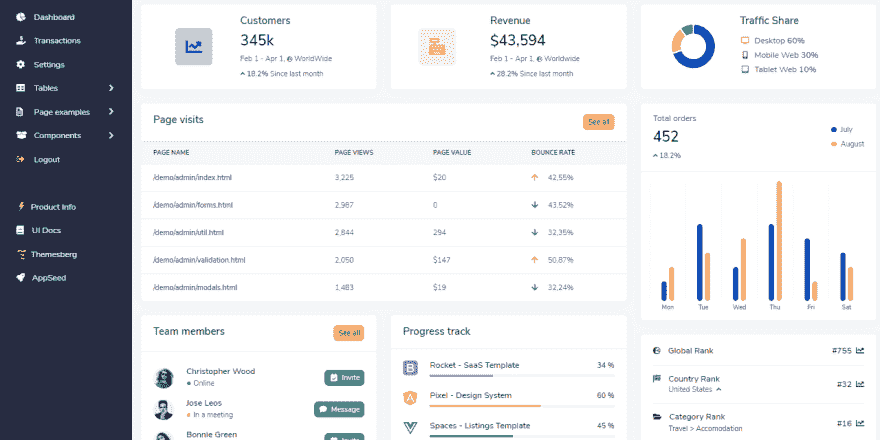
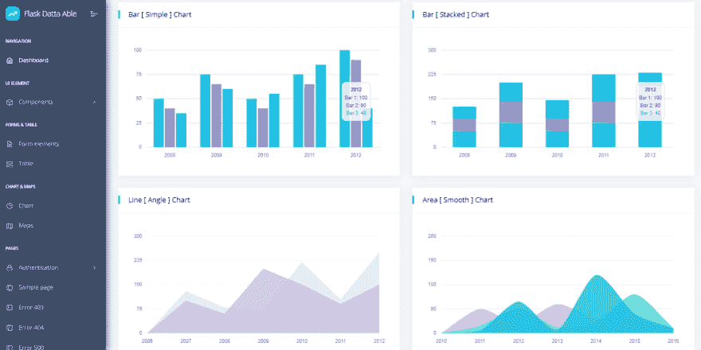
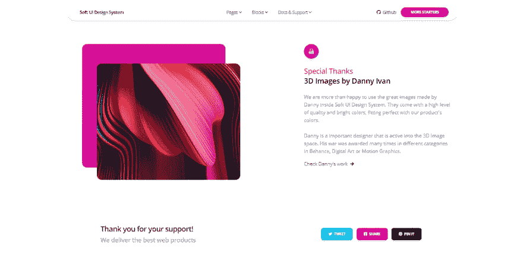
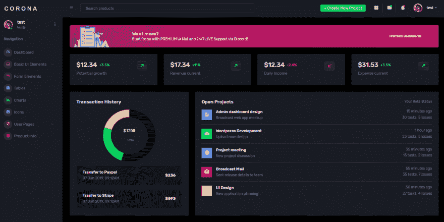

# Flask 样板——用自动化工具构建的开源应用程序

> 原文：<https://dev.to/sm0ke/flask-boilerplate-open-source-apps-built-with-automation-tools-4925>

各位编码员好，

本文介绍了一个使用自动化工作流程生成的带有[烧瓶应用程序](https://appseed.us/apps/flask/)和轻型[烧瓶仪表盘](http://appseed.us/admin-dashboards/flask/)的短列表:

*   使用一个 **HTML 解析器**解析✅平面 HTML 主题(基于引导程序)并将其转换成生产就绪的 Jinja2 模板(原生 Flask 模板引擎)
*   ✅处理过的设计被注入到一个现有的**样板代码**中，该代码用 SQLite 数据库、SqlAlchemy 助手和基本工具进行了增强。
*   ✅通过 Selenium 和木偶师自动执行最小测试集。

* * *

## [软仪表板烧瓶](https://appseed.us/product/soft-ui-dashboard/flask/) - `Latest Product`

专为那些喜欢大胆的元素和美丽的网站，软用户界面仪表板准备好帮助您创建惊人的网站和网络应用程序。**软 UI 仪表板**由 70 多个前端独立元素组成，如按钮、输入、导航条、导航标签、卡片或提醒，让您自由选择和组合- **功能**:

*   ✅ `Up-to-date Dependencies`
*   ✅ `UI Kit`:自举 5，持续**黑暗模式**
*   ✅基本认证，`OAuth via Github`
*   ✅ [API 生成器模块](https://www.youtube.com/watch?v=jrdwFsNLZfw) - `video presentation`

[](https://res.cloudinary.com/practicaldev/image/fetch/s--YJL0Qvx6--/c_limit%2Cf_auto%2Cfl_progressive%2Cq_auto%2Cw_880/https://user-images.githubusercontent.com/51070104/175773323-3345d618-0e78-4c85-83fc-f495dc3f0bb0.png)

* * *

## 什么是[烧瓶](https://appseed.us/admin-dashboards/flask/)

Flask 是一个用 Python 编写的微型 web 框架。它被归类为微框架，因为它不需要特殊的工具或库。它没有数据库抽象层、表单验证或任何其他组件，而现有的第三方库提供了通用功能。它没有数据库抽象层、表单验证或任何其他组件，而预先存在的第三方库提供了常见的功能-一些链接:

*   [烧瓶](https://palletsprojects.com/p/flask/) -官方网站
*   [烧瓶文件](https://flask.palletsprojects.com/)

* * *

## 什么是[样板代码](http://appseed.us/boilerplate-code/)

在编程中，**样板代码**是一段无需修改一行代码就可以重复使用的软件。初学者(有时是样板代码)背后的整个想法是跳过许多项目共有的那段代码。

* * *

## 设置环境

为了使用样板代码，我们需要在工作站上安装 Python 和 Flask。Python 可以从官方网站[下载](https://www.python.org/downloads/)，而[烧瓶](https://palletsprojects.com/p/flask/)可以使用`PIP`命令
轻松添加

```
$ # Test the Python install 
$ python --version
$ Python 3.7.2

$ # install Flask using PIP
$ pip install Flask 
```

Enter fullscreen mode Exit fullscreen mode

* * *

## 烧瓶样板代码库

代码库采用模块化结构组织:

```
< PROJECT ROOT >
   |
   |-- app/                      # Implements app logic
   |    |-- base/                # Base Blueprint - handles the authentication
   |    |-- home/                # Home Blueprint - serve UI Kit pages
   |    |
   |   __init__.py               # Initialize the app
   |
   |-- requirements.txt          # Development modules - SQLite storage
   |-- requirements-mysql.txt    # Production modules  - Mysql DMBS
   |-- requirements-pqsql.txt    # Production modules  - PostgreSql DMBS
   |
   |-- .env                      # Inject Configuration via Environment
   |-- config.py                 # Set up the app
   |-- run.py                    # Start the app - WSGI gateway
   |
   |-- *********************** 
```

Enter fullscreen mode Exit fullscreen mode

* * *

## 如何构建样板文件

所有的 Flask 启动器共享相同的代码库，并且所有项目的构建指令都是相同的。例如，如果我们想要构建 [Flask Dashboard Volt](https://appseed.us/admin-dashboards/flask-dashboard-volt) 样板文件，我们需要在终端窗口中编写几个简单的命令:

```
$ # Get the code
$ git clone https://github.com/app-generator/flask-dashboard-volt.git
$ cd flask-dashboard-volt
$
$ # Virtualenv modules installation 
$ virtualenv env
$ source env/bin/activate
$
$ # Install modules - SQLite Database
$ pip3 install -r requirements.txt
$ 
$ # Set the FLASK_APP environment variable
$ export FLASK_APP=run.py
$
$ # Start the application (development mode)
$ flask run
$
$ # Access the dashboard in browser: http://127.0.0.1:5000/ 
```

Enter fullscreen mode Exit fullscreen mode

> 注意:要使用该应用程序，请访问注册页面并创建一个新用户。认证后，应用程序将解锁个人网页。

* * *

[](https://res.cloudinary.com/practicaldev/image/fetch/s--nUVOlO97--/c_limit%2Cf_auto%2Cfl_progressive%2Cq_auto%2Cw_880/https://raw.githubusercontent.com/app-generator/flask-dashboard-volt/master/media/flask-dashboard-volt-screen.png)

> 相当酷！

* * *

## [烧瓶样板文件——达塔能干](https://appseed.us/admin-dashboards/flask-datta-able)

达塔能够 Bootstrap Lite 是最风格化的 Bootstrap 4 Lite 管理模板，围绕市场上所有其他 Lite/免费管理模板。它带有功能丰富的页面和组件，代码完全以开发人员为中心。在开发达塔艾布尔之前，我们的重点是性能和设计。

* * *

> **[烧瓶达塔艾布尔](https://appseed.us/admin-dashboards/flask-datta-able) -产品页面**(包含演示&来源)

* * *

[](https://res.cloudinary.com/practicaldev/image/fetch/s--QceXLPw1--/c_limit%2Cf_auto%2Cfl_progressive%2Cq_auto%2Cw_880/https://raw.githubusercontent.com/app-generator/flask-dashboard-dattaable/master/media/flask-dashboard-dattaable-screen.png)

* * *

## [烧瓶样板文件-软 UI](https://appseed.us/product/flask-soft-ui-design-system)

[软 UI 设计系统](https://appseed.us/ui-kit/soft-ui-design-system)是 Creative-Tim 为喜欢大胆元素和漂亮网站的人设计的高级 Bootstrap 5 UI 套件。 **Soft UI 设计系统 Flask** 是一个简单的 Flask starter，由 AppSeed 提供，带有模块化代码库、数据库、认证和部署脚本

* * *

> **[软 UI 设计系统烧瓶](https://appseed.us/product/flask-soft-ui-design-system) -产品页面**(包含演示&来源)

* * *

[](https://res.cloudinary.com/practicaldev/image/fetch/s--GF-TbZuM--/c_limit%2Cf_auto%2Cfl_progressive%2Cq_auto%2Cw_880/https://raw.githubusercontent.com/app-generator/flask-soft-ui-free/master/media/flask-soft-ui-free-screen-cards.png)

* * *

## [烧瓶像素 UI 套件](https://appseed.us/apps/flask-apps/flask-pixel-bootstrap-uikit)

Pixel 是一个免费的、完全响应的、现代的 Bootstrap 4 UI 套件，它将帮助您构建有创意的、专业的网站。使用我们的组件和部分，切换一些 Sass 变量来构建和安排页面，以最好地满足您的需求。Pixel Lite 附带 6 个高级示例页面，我们创建这些页面是为了向您展示可以创建的漂亮用户界面。

* * *

> **[Flask Pixel UI Kit](https://appseed.us/apps/flask-apps/flask-pixel-bootstrap-uikit) -产品页面**(包含演示&来源)

* * *

[](https://res.cloudinary.com/practicaldev/image/fetch/s--NdTZEz6S--/c_limit%2Cf_auto%2Cfl_progressive%2Cq_auto%2Cw_880/https://raw.githubusercontent.com/app-generator/flask-pixel-bootstrap-uikit/master/media/flask-pixel-bootstrap-uikit-screen.png)

* * *

## [烧瓶仪表盘氩气](https://appseed.us/admin-dashboards/flask-boilerplate-dashboard-argon)

Flask Dashboard Argon 由 Creative-Tim 制作，基于全面响应、像素完美的设计。这个作为开源项目发布的管理面板包括一个 SQLite 数据库 SQLAlchemy ORM，并完全集成到 Jinja2 模板系统中。

* * *

> **[烧瓶仪表盘氩气](https://appseed.us/admin-dashboards/flask-boilerplate-dashboard-argon) -产品页面**(包含演示&来源)

* * *

[](https://res.cloudinary.com/practicaldev/image/fetch/s--vqDHSy6E--/c_limit%2Cf_auto%2Cfl_progressive%2Cq_auto%2Cw_880/https://raw.githubusercontent.com/app-generator/flask-boilerplate-dashboard-argon/master/media/flask-boilerplate-dashboard-argon-screen.png)

* * *

## [烧瓶电晕黑暗](https://appseed.us/admin-dashboards/flask)

电晕黑暗免费管理模板有美丽的排版，简洁的设计，设计整洁的仪表板。它结合了悦目的颜色、宽敞的卡片、漂亮的排版和图形。

* * *

> **[烧瓶电晕黑暗](https://appseed.us/admin-dashboards/flask-dashboard-corona-dark) -产品页面**(包含演示&来源)

* * *

[](https://res.cloudinary.com/practicaldev/image/fetch/s--pPKSyveR--/c_limit%2Cf_auto%2Cfl_progressive%2Cq_auto%2Cw_880/https://raw.githubusercontent.com/app-generator/flask-dashboard-corona-dark/master/media/flask-dashboard-corona-dark-screen.png)

* * *

### 其他资源

*   AppSeed 提供的更多[烧瓶应用](https://appseed.us/apps/flask-apps)
*   一个带有[烧瓶仪表盘](https://appseed.us/admin-dashboards/flask)的巨大指数——免费&商业产品

* * *

> 谢谢大家！顺便说一下，我的(昵称)名字是 **Sm0ke** ，我在[推特](https://twitter.com/Sm0keDev)上也很活跃。