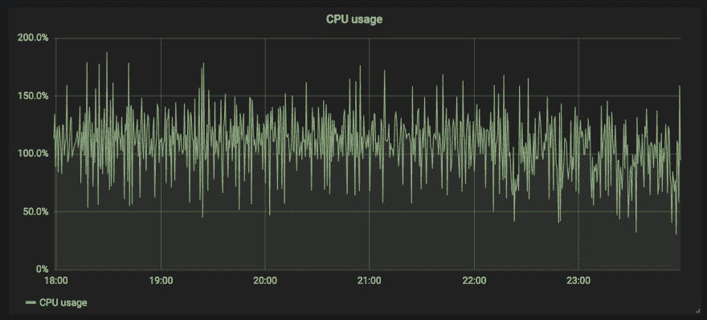
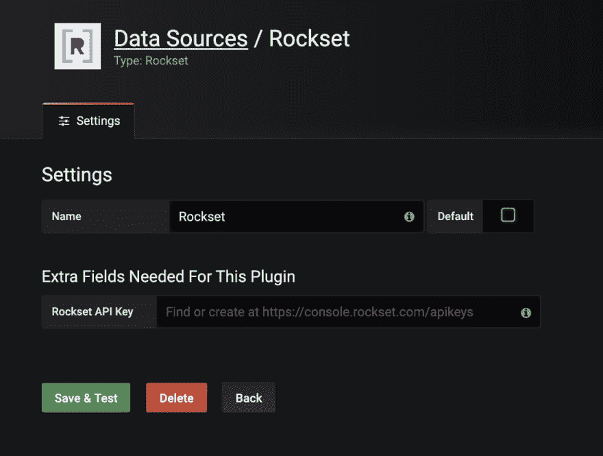
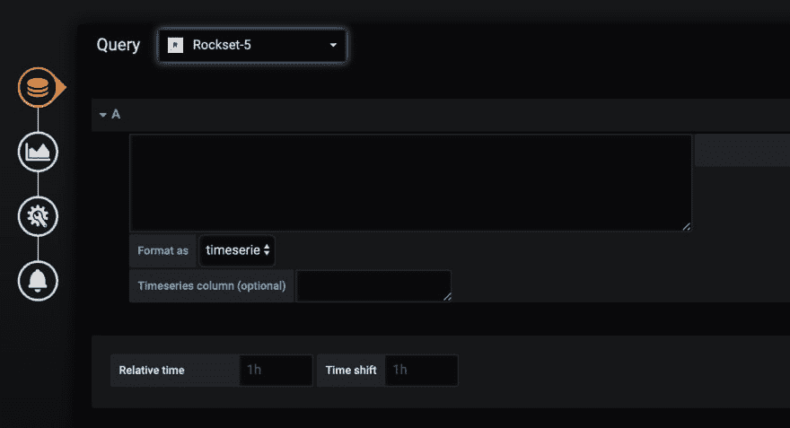
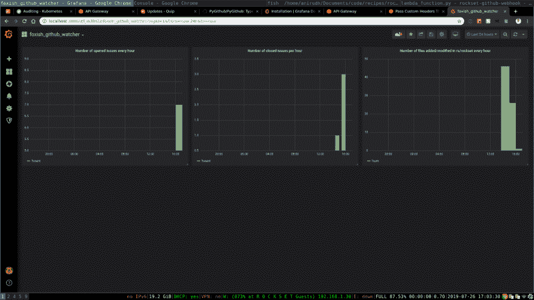
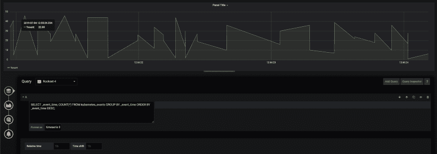

# 带有 Rockset-Grafana 插件的 Grafana 时间系列仪表板

> 原文:[https://dev . to/rockset cloud/grafana-time-series-dashboards-with-the-rockset-grafana-plugin-3n ff](https://dev.to/rocksetcloud/grafana-time-series-dashboards-with-the-rockset-grafana-plugin-3nff)

*作者为[瑞阿吉亚尔](https://www.linkedin.com/in/rui-aguiar-473b01101/)T3】*

**Grafana 是什么？**

Grafana 是一个用于时间序列分析和监控的开源软件平台。您可以将 Grafana 连接到大量数据源，从 PostgreSQL 到 Prometheus。一旦连接了数据源，就可以使用内置的查询控件或编辑器来获取数据，并从数据源构建仪表板。Grafana 经常被部署用于各种各样的用例，包括 DevOps 和 AdTech。

在 Rockset，我们主要使用 Grafana 监控我们的生产系统，以及用于开发操作。我们跟踪各种各样的指标，从查询错误的数量到生产机器的 CPU 使用率。每当图表偏离预定义的预期值范围时，我们就会触发一个警报，该警报可以连接到类似 PagerDuty integration 的东西，该东西会 ping 一个随叫随到的工程师。

[T2】](https://res.cloudinary.com/practicaldev/image/fetch/s--mqSSSEhy--/c_limit%2Cf_auto%2Cfl_progressive%2Cq_auto%2Cw_880/https://images.ctfassets.net/1d31s1aajogl/BBpexNVnfrxnuTmSgz9Pv/95f8f76778732dfec835d4d3faebfebb/Screen_Shot_2019-09-06_at_4.58.32_PM.png)

**为什么要建插件？**

作为 Grafana 的高级用户，我们很久以前就有了为 Grafana 构建 Rockset 连接器的想法。由于 Rockset 作为运营分析引擎的实时性，我们相信 Grafana 插件可以很好地解决各种问题和查询。我们意识到，我们可以开始跟踪许多时间序列指标，这将允许我们的工程实践具有更大的透明度(例如，通过跟踪我们的 GitHub 提交到 master 的脉冲)，以及我们通过 Rockset 监视的内部系统(例如我们的 Kubernetes 集群中的事件)。Rockset-Grafana 插件有用的另一个原因是，应用程序开发人员可以使用标准 SQL 通过 Rockset 获取任何类型的数据。最后，这是我们的客户之前表示感兴趣的东西。考虑到这几点，构建 Grafana 连接器似乎是 Rockset 的一个显而易见且有用的应用程序，可以增强已经非常强大的工具。

**如何构建 Grafana 连接器**

要构建一个有效的 Grafana 连接器，需要实现一组 Typescript 方法，以及一个定制的用户界面，用于从给定的数据源中检索数据。在插件实现和测试用例编写完成后，它会被 Grafana 维护团队审查并整合到插件的官方列表中。

任何 Grafana 连接器需要实现的功能是:

1.  数据源规范

当构建一个插件时，你首先需要能够获取你将要构建仪表板的数据。这通常包括让用户指定一个 API 键、密码或数据库连接 URL 来获取数据。

1.  自定义查询界面

一旦指定了数据源，用户就需要能够查询该数据源。在 Rockset 的例子中，这涉及到用 HTML 和 AngularJS 实现一个定制的查询编辑器，当用户用 Rockset 创建一个仪表板时，这个编辑器会显示给用户。

1.  通过 API 层执行查询

在用户输入查询后，数据本身需要以特定的格式被获取并传递给可视化层。这包括通过用户的查询编辑与前端进行通信，以及通过 Rockset API 执行查询和对结果进行后处理，以便以正确的 timeseries 格式将它们传递给可视化。

**构建 Rockset-Grafana 插件**

回到上面概述的步骤，当构建 Rockset 连接器时，我需要做的第一件事是实际连接 Rockset 数据源。我构建了一个表单，允许用户指定插件的名称以及 Rockset API 键。这包括在前端构建表单，以及编写一个 testDatasource 方法，通过快速调用 Rockset API 中的`/v1/orgs/self/users/self/apikeys`端点，使用对 Rockset 后端的测试查询来验证正确的 API 键，以确保 API 键本身是有效的。

[T2】](https://res.cloudinary.com/practicaldev/image/fetch/s--pIgN9qOY--/c_limit%2Cf_auto%2Cfl_progressive%2Cq_auto%2Cw_880/https://images.ctfassets.net/1d31s1aajogl/349v1ipmUDF2fw26iSIHhu/aa3e581dbb89fec0323a8548f7472d97/Screen_Shot_2019-09-06_at_5.13.37_PM.png)

一旦验证了键，就该构建查询编辑器了。在 Rockset 的例子中，我们必须允许用户在他们的任何集合中输入任意的 SQL。此外，对于语法上无效的查询或用户查询不存在的集合时，提供信息性错误消息也很重要。

[T2】](https://res.cloudinary.com/practicaldev/image/fetch/s--06qHe2H3--/c_limit%2Cf_auto%2Cfl_progressive%2Cq_auto%2Cw_880/https://images.ctfassets.net/1d31s1aajogl/5E6ju3vndflaKLzckVWVuG/61b82e0d213bf5e7a9e4dea4e87d9468/grafana_query_editor.png)

我用一个`debounce`函数实现了查询编辑器，该函数允许用户输入他们的查询，然后暂停，这样就可以通过 Rockset API 执行查询。在后端检查查询的有效性，并将错误传递给前端的用户，这样他们就可以收到信息性的错误消息。此外，如果您希望用一个随时间变化的图表来表示数据，Grafana 需要一个 timeseries 列。`Timeseries column`框允许用户在他们的 SQL 结果中指定一列，他们选择在该列上旋转图形轴。`Format as`框是一个简单的下拉框，允许用户将 Rockset 查询表示为时间序列或表格，这将改变传递给图形层的数据的格式。

在输入、验证和执行查询之后，Grafana 连接器接收数据。不幸的是，我们不能简单地将数据传递给表格或图形，并在 Grafana 仪表板中显示出来。我们需要提取用户指定的 timeseries 列，将其转换为 Unix 秒，并将一个 JSON 对象数组传递到 Grafana 的可视化层。如果用户只指定了一个类型为`datetime`的列，我们也可以明智地建议使用 timeseries 列。

最后，一旦所有的查询和验证步骤都完成了，插件的用户就可以可视化他们的数据了，在插件开发完成后，我们立即开始了这项工作。

**用例及未来工作**

一旦我们的插件完成，我们就开始用它在 Rockset 上进行有趣的查询。我们首先关注的是我们内部的 GitHub 指标。具体来说，我们开始查看我们公司每小时打开的问题数量、关闭的问题数量以及一天中添加或修改的文件数量。

[T2】](https://res.cloudinary.com/practicaldev/image/fetch/s--9VP8qxII--/c_limit%2Cf_auto%2Cfl_progressive%2Cq_auto%2Cw_880/https://images.ctfassets.net/1d31s1aajogl/5Izv5htjEUPO5njrX9QXd9/4d6a390e66441adafaea7d372c446c68/Screenshot_from_2019-07-26_17-03-30.png)

我们还开始跟踪开发集群中 Kubernetes 事件的数量等指标，以便更好地了解停机和使用高峰。

[T2】](https://res.cloudinary.com/practicaldev/image/fetch/s--H613-g2f--/c_limit%2Cf_auto%2Cfl_progressive%2Cq_auto%2Cw_880/https://images.ctfassets.net/1d31s1aajogl/3Pd4l6S3o9fEYkJOwNZXVD/11a9a56266b84c7c367aa0799e5f1ac2/Screen_Shot_2019-07-29_at_10.32.14_AM.png)

这些查询只是几个例子，说明了如何将 Rockset 与 Grafana 一起使用，以提供对任意数据集合的实时洞察，我们很高兴能够更广泛地推出这个插件，并了解我们的客户如何使用它。要查看插件的更详细视图并开始使用它，请查看[文档](https://docs.rockset.com/grafana/)。