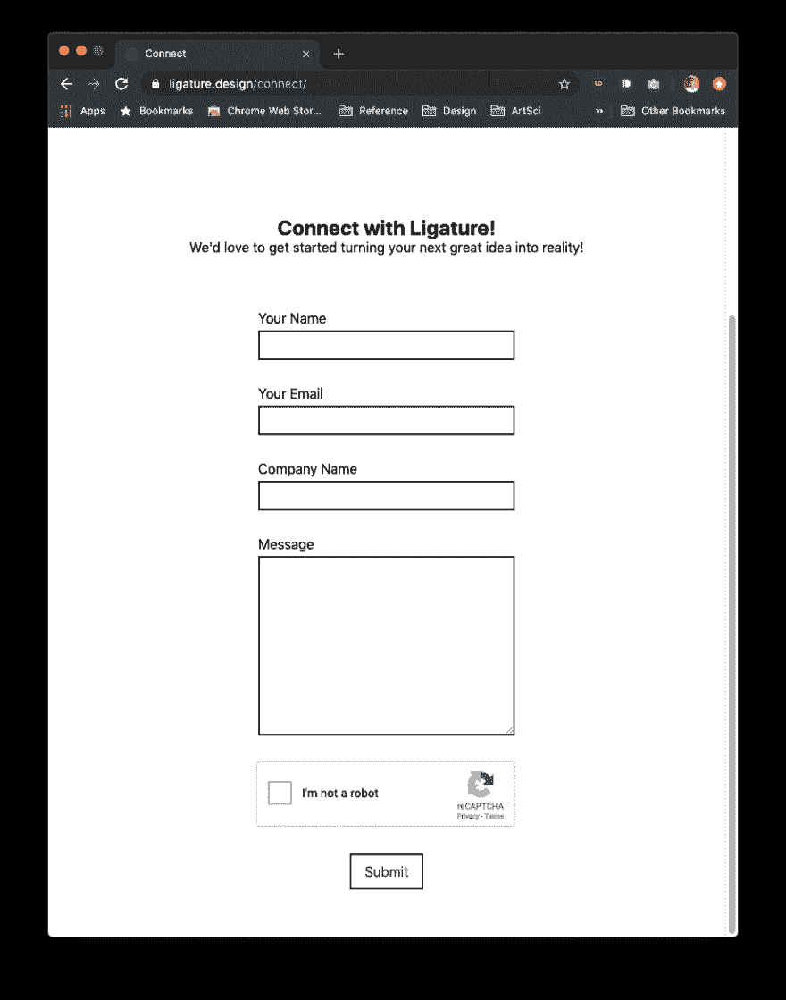

# 设计 Web 应用程序架构

> 原文：<https://dev.to/almadireddy/full-stack-101-2-designing-our-web-app-architecture-l6a>

# 项目

现在，我们已经安装了创建服务并在线部署所需的一切，我们将设计并创建主项目，该项目将教给您我承诺要教给您的一切。

让我们回顾一下我们将实际构建的内容。因为我受够了编写面试问题、课堂示例和没有意义的编码作业，所以我不会为你设计项目。相反，我们将构建一些实际有用的东西(例如，我需要使用它):一个 web 应用程序，它向用户显示一个“联系表单”，并通过电子邮件将他们填写的内容发送到虚拟公司的邮箱。(好吧，这有点做作，但就我而言，我实际上是为一家公司制作的)

下面是它的样子:

[](https://res.cloudinary.com/practicaldev/image/fetch/s--4-HK3BE3--/c_limit%2Cf_auto%2Cfl_progressive%2Cq_auto%2Cw_880/https://i.imgur.com/cztTzVi.png)

这是我公司[网站](https://ligature.design)的截图(有 web 项目？联系我们！).任何有兴趣与我们联系的人最好填写这张表格，而不是一个机器人，点击提交，然后看到一条确认消息，表明他们的消息已发送。然后，我们会在收件箱中看到该邮件。

#### 为什么不发一封邮件让他们联系你呢？

因为这样一来，我们的电子邮件就会被网页抓取器抓取，我们就会收到垃圾邮件。这隐藏了电子邮件，让我们在内部更改它。

# 建筑

在我转行做代码之前，我在高中时真的很喜欢设计真实的房子和东西。但那无关紧要。

要开始创建这样的应用程序，我们需要几个移动组件。让我们想想它们是什么，然后将它们转化为我们软件的计划。

#### 前端

首先，我们需要的最明显的东西是用户界面。这是用户能够看到并与之交互的东西，我们需要确保它很好，很漂亮，并且可用。这是应用程序的一部分，我们称之为前端。它位于应用程序的“前端”,因为这是用户可以看到并与之交互的东西。这个前端本身就是一个应用程序，部署在互联网上，通常外界可以通过访问一个 URL 来访问它。

如果应用程序是一辆汽车，那么前端将是方向盘、踏板、按钮、仪表、内部细节、座椅上的皮革等。这是一个非常好的部分，它能很好地响应用户的需求。

> 旁白:用 CSS 做一个简单的原型并使它看起来漂亮一点并不太难。我们将在这个项目中做一点，但我建议阅读一些关于 CSS 的文章，并用它设计网站。这里有一个很好的起点:[在 5 分钟内学会 CSS](https://www.freecodecamp.org/news/get-started-with-css-in-5-minutes-e0804813fc3e/)
> 
> 很多时候，原型中的一点 CSS 就意味着客户/老板是接受你的想法还是基于丑陋而拒绝它，以及“没有人会喜欢它”之间的区别

#### 后端

我们需要的下一件事是将他们填写的内容发送到我们的电子邮件地址。幸运的是，这个问题的解决方案基本上是这整个教程。计划是这样的:我们将通过构成互联网的管道将他们在联系表上填写的数据发送到我们在 Node.js 中编写的应用程序。这个应用程序需要是实时的，以便我们能够通过 URL 访问这个应用程序。我们的前端代码可以向该 URL 发送请求，并随这些请求一起发送数据。(因此是本教程的前一部分)。

我们的后端应用程序将通过互联网接受数据，确保这些数据都是安全的(大部分情况下)，然后实际发送电子邮件。因为发送和接收电子邮件本身就是一项很大的任务，所以我们将使用名为 SendGrid 的服务来为我们发送电子邮件。

这是有意的，因为我不想编写电子邮件服务，使用它将让我展示如何在我们的代码中使用第三方库。

> 事实上，让我感到震惊的是，学生们(至少在我上过的一系列课程中)直到高三才明白，人们可以使用他人的代码，而不会因为使用库而被扣分。smh。

SendGrid 是一项服务，它可以确保电子邮件得到传递，提供对电子邮件的跟踪，跟踪它们是否被传递，等等。我们的后端将与 SendGrid 服务对话，就像我们的前端与后端对话一样。(通过互联网发送数据)。

#### 你已经失去了我

看着这巨大的文字墙，我也迷茫了。所以我要给你画一幅画。因为没有一个建筑是真正设计出来的，除非有一张画有方框和线条的图纸。

```
 +------------+
                                           |            |
+-------------------------+                |  SendGrid  |
|                         <----------------+ (External) |
|     Node.js Backend     +---------------->            +-----------+
|                         |                +------------+           |
+-------^-----------------+                                         |
        ||                                                   +------v------+
        ||                                                   |             |
        ||                                                   |  Our Inbox  |
        ||                                                   |             |
        ||                                                   +-------------+
        ||
        ||
        ||
        ||
        ||
        ||          +-----------------------+
        |----------->                       |
        +-----------+     React Frontend    |
                    |                       |
                    +----------^------------+
                               ||
                               ||
                               ||
                     +----------v----------+
                     |                     |
                     |   User's Computer   |
                     |                     |
                     +---------------------+ 
```

Enter fullscreen mode Exit fullscreen mode

> (ASCII 艺术因为我们是 c o o l)

每个盒子都有自己的应用程序/服务，每个连接器都是一条通信管道，数据沿着这条管道发送。这些盒子是构成我们应用程序的“移动部件”。

总结一下:

*   用户使用他们的计算机向前端发送请求，填写表单。
*   前端在请求中向后端发送数据，如果输入是安全的，后端接受，并向 SendGrid 发送请求。
*   如果发送了邮件，SendGrid 会发回一个“成功”响应(还记得前面的`200`？).
*   后端看到这一成功，并向前端发送“成功”响应。
*   前端接着通知用户他们的消息被发送到公司。如果出现任何问题，后端将发送不成功的消息(可能有许多种，如 401、404、500 等)，用户将看到一条错误消息，告诉他们再试一次。

## 我们怎么知道要这样设置呢？

这是我第一次学习所有这些时，真正为之奋斗的工作方面。答案是你不会，而且你可能永远不会马上就这么做。我将这一部分称为“设计我们的 web 应用架构”，因为这正是我们正在做的。设计一个能满足我们需求的解决方案。像任何设计一样，当我们获得更多信息并为突发事件和未来功能做计划时，我们会投入思考，探索我们的选择，改变一些方面。

### 一些常见的架构模式

然而，有一些起点。有几种架构模式在工业中使用，我们将在这里讨论其中的两种。首先，我们这里使用的体系结构只有一个前端和一个后端，这就是我们所需要的。毕竟，通过修改后端代码，我们可以做的远不止发送电子邮件这一单一任务。我们可以添加登录/注销，这样用户就必须登录才能发送消息。我们可以添加一个博客功能，这样用户可以发布帖子并让其他人看到。突然间，我们有了一个博客平台和一个技术支持联系系统。

#### 巨石

我们设计的架构遵循 **Monolith** 模式。这是因为后端是一个“整体”,因为它在一个地方，一个代码库中做我们的应用程序需要的一切。我们可能内置的所有功能都将内置到这个后端中。

在很长很长的一段时间里，这就是应用程序的构建方式。它很简单，可以扩展，很容易理解和推理。然而，这里有一些你可能已经能看到的问题。

如果所有东西都在一个代码库中，那么在代码中的一个地方添加或更改某些东西，比如登录/注销身份验证逻辑，可能会无意中破坏一些完全不相关的东西，而这些东西在某种程度上依赖于身份验证逻辑。

为了设计一个例子，我们假设的博客系统可能使用 auth 系统中声明的一个变量来确定谁是博客文章的发布作者，这个变量可能在最后的代码合并中被重构到以太网中。现在，博客系统坏了，博客平台团队不得不花时间去修复一些本来可以避免的东西。为了避免这种情况，我们引入了下一个架构模式:

#### 微服务(重要！！)

如果你一直在阅读开发者博客，看软件标题，或者和痴迷于流行词汇的人开会，你可能听说过微服务。一个**微服务**就是那个，一个小服务。我们刚刚设计到应用程序中的后端执行一项任务:接收联系人表单内容，并触发电子邮件发送。现在想象一下，我们应用程序中的所有功能都根据它们实现的任务分解成类似的组件，并写入单独的代码库和单独部署，这样就形成了一个**微服务架构。**

您的身份验证系统可能是它自己的应用程序，部署在 AWS 上的一个大型、强大的服务器上，因为它需要处理许多人登录和退出的流量。

你的博客系统将是自己的服务，部署在一个更强大的服务器上，运行几个应用程序副本来处理来自每个人的巨大流量，包括不需要登录的试用用户。

您的联系表单(来自本教程)将是它自己的东西，部署到一个更小、更便宜的服务器上，因为与其他组件相比，它几乎看不到任何流量。

> 每个应用程序都有自己担心的问题，只要团队努力保持服务之间发送的数据一致，团队就可以完全重写一个组件并重新部署它，即使使用完全不同的语言，系统作为一个整体仍然可以不间断地工作。

不管怎么说，这是理想状态，但是就像所有事情一样，真实的世界(理解:真实的团队)并不完美，所以沟通和知识共享仍然是保持一切正常运转的关键。

微服务是一种越来越常见的新方法，许多公司正在从他们的遗留系统向微服务过渡。(这通常也与从大型机和数据中心向云服务提供商如亚马逊网络服务或谷歌云平台的转移相一致。这些提供商使得微服务之类的东西易于管理。)

> 旁白:微服务，它们与 Monoliths 的区别和相似之处，以及如何设计一个微服务，是非常重要的知识，如果你在大学期间寻找实习机会，这对招聘人员来说非常重要。

#### [这里的](https://www.youtube.com/watch?v=-UKEPd2ipEk)是关于微服务的必备之谈(在我看来)。

结束这部分教程的作业是观看视频。我甚至把它加粗了，这样你就能看到了。

#### 其他选项？

单片和微服务并不是唯一的做事方式。请随意提出你自己全新的、更好的范例，然后写一篇博文发给我，这样我就可以了解它了。

其他架构模式包括[事件驱动架构](https://docs.microsoft.com/en-us/azure/architecture/guide/architecture-styles/event-driven)，这很酷，[传奇](https://microservices.io/patterns/data/saga.html)，这我真的不知道。我会再次建议谷歌学习。

* * *

## MVP 的概念

当开发一个新的应用程序、脚本或任何东西时，最好从“MVP”或“最小可行产品”开始*(注:这是我个人使用“MVP”的含义和实践方式，公司或“官方”惯例可能略有不同)*

最低可行的产品就是。您正在构建的任何东西的一个小的、基本的概念验证或初始特性集。这通常被视为第一步，需要不到一天的时间来完成，留出时间与您的团队进行讨论。实际上，我通常用它来定义“开始”应用程序工作的含义。对于这个项目，这意味着建立一个空的 React 项目，进行我们在第 1 部分中所做的部署，并实现两者之间的通信。

你可以从一个 MVP 开始，然后以迭代的方式达到你想要的目标。你把你的目标分解成小步骤，然后把这些步骤分解成容易理解的任务，然后把这些任务分解成你可以分配给人们去完成的单个行动项目。完成每一个任务会慢慢地增加产品，随着每一个任务的实现和合并到 MVP 的初始代码库中，缓慢但稳定地完成应用程序。

这是获得一些范围的好方法，并且当你面对创建复杂或“大”的东西时，不要害怕开始。毕竟，通过实现 MVP，您已经推送了代码，并且您只是简单地一个接一个地添加东西。

## 连续部署

这种拥有一个 MVP 的模式，所有未来的特性都被添加到其中，这也将帮助我们实践连续部署。您可能见过“CI/CD”这个术语，它代表持续集成和持续部署。总的来说，这是一种在一天中多次将开发人员的代码更改合并到主文档中的实践(集成)，并且在进行这些更改时实时部署新版本的代码(部署)。

这对于我们来说是一个有用的实践，因为当我们一个接一个地完成特性时，我们可以在它们完成时实时地推动它们。实际上，这意味着在开发过程中的任何阶段，都有一个应用程序的实时工作版本，并且(理论上)从未中断。这是当今的普遍做法，有许多工具可以自动运行测试、部署，并在变更被推入代码库时通知开发人员错误。[这里的](https://www.atlassian.com/continuous-delivery/principles/continuous-integration-vs-delivery-vs-deployment)是一篇来自 Atlassian 的深度文章，更详细地解释了这个概念。

本教程的第 3 部分将为我们的应用程序创建一个 MVP，还有一个小的(冗长的)旁白来解释一些更多的基础知识，这将有助于使第 4 和第 5 部分更有意义。然后，我们将进入第 4 部分和第 5 部分，分别构建后端和前端。