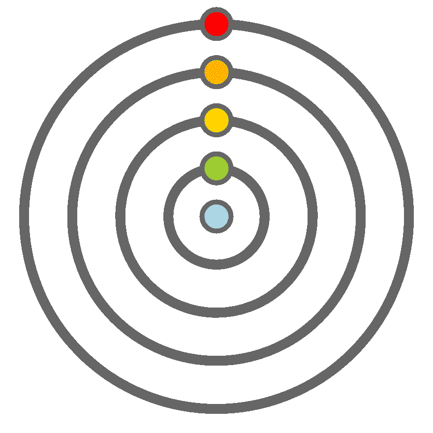

# 缩放矢量图形在网上的乐趣和？

> 原文:[https://dev . to/Jacoby/scaled-vector-graphics-on-the-web-for-fun-and-385 o](https://dev.to/jacoby/scaled-vector-graphics-on-the-web-for-fun-and-385o)

这是一个图像。

[T2】](https://res.cloudinary.com/practicaldev/image/fetch/s--rPA6eloP--/c_limit%2Cf_auto%2Cfl_progressive%2Cq_auto%2Cw_880/https://jacoby.github.img/clock.svg)

我喜欢玩钟表，这是从那个工具得到的。

这是通过**缩放矢量图形**或 **SVGs** 完成的。SVG 是一种基于文本的 XML 格式，它们看起来像这样。

```
<svg  id="neck" viewBox="0 0 900 900">
    <style>
        .loop {
            stroke: #666;
            stroke-width: 20;
            fill-opacity: 0;
            }
        #cen, #day, #hor, #min, #sec {
            stroke: #666;
            stroke-width: 10;
            }
        #cen { fill: lightblue; }
        #day { fill: yellowgreen; }
        #hor { fill: yellow; }
        #min { fill: orange; }
        #sec { fill: red; }
    </style>

    <circle id="d_loop" cx="450" cy="450" r="100" class="loop"/>
    <circle id="h_loop" cx="450" cy="450" r="200" class="loop"/>
    <circle id="m_loop" cx="450" cy="450" r="300" class="loop"/>
    <circle id="s_loop" cx="450" cy="450" r="400" class="loop"/>

    <circle id="sec" cx="450" cy="050" r="30" class="dot"/>
    <circle id="min" cx="450" cy="150" r="30" class="dot"/>
    <circle id="hor" cx="450" cy="250" r="30" class="dot"/>
    <circle id="day" cx="450" cy="350" r="30" class="dot"/>
    <circle id="cen" cx="450" cy="450" r="30" class="dot"/>
</svg> 
```

我们看到了什么？我们看到带有 **ID** 标签的东西，所以它们可以被唯一地识别，带有**类**标签的东西，所以它们可以被分组。

这意味着，在一个网络环境中，你可以独特地处理这些事情并改变它们。

```
function draw_second(seconds) {
  let deg = seconds * 6;
  let deg2 = (deg - 90) % 360;
  let sec = document.getElementById("sec");
  let xy = circleCoords(400, deg2);
  let x = 450 + xy.x;
  let y = 450 + xy.y;
  sec.setAttribute("cx", x);
  sec.setAttribute("cy", y);
}

function circleCoords(radius, degFromTop) {
  const rads = degToRad(degFromTop);
  return {
    x: radius * Math.cos(rads),
    y: radius * Math.sin(rads)
  };
}

function degToRad(deg) {
  return (deg / 360) * (Math.PI * 2);
} 
```

当然，还有更多，但是每个圆都有一个中心，由 x 和 y 坐标定义，所以`cx`是那个圆的 x 坐标，`cy`是 y 坐标。基本图像是 900x900，所以这是相对于`450,450`放置的，半径是 400，所以我们用`setAttribute`设置，就像我们在其他上下文中处理 DOM 一样。

我知道 SVG 还有另外两种用途。在 SVG 中，徽标非常棒，因为它们可以缩放，放大到海报和卡车侧面的尺寸时仍然看起来很清晰。它们对激光切割机也很有用，不同的颜色用于不同的激光强度，这样厚的黑色部分会变得更暗，但细的红线会被切穿。

但是请记住，在网络环境中，图片的各个部分就像网页上的其他内容一样是可寻址和可修改的。

#### [](#if-you-have-any-questions-or-comments-i-would-be-glad-to-hear-it-ask-me-on-twitter-or-make-an-issue-on-my-blog-repo)如果有什么问题或意见，我很乐意倾听。在[推特](https://twitter.com/jacobydave)或[上问我，在我的博客回购](https://github.com/jacoby/jacoby.github.io)上做文章。