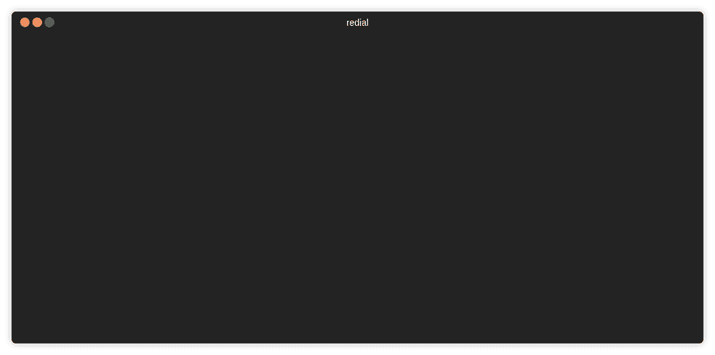

# Unix 系统下基于终端拨号的 SSH 会话管理器。

> 原文:[https://dev . to/fatihbaltaci/radial-terminal-based-ssh-session-manager-for-UNIX-systems-30nn](https://dev.to/fatihbaltaci/redial-terminal-based-ssh-session-manager-for-unix-systems-30nn)

特点:

*   添加文件夹
*   添加连接
*   浏览 mc(午夜指挥官)
*   移除连接
*   编辑连接
*   移动会话和文件夹
*   更多功能即将推出..

[https://github.com/taypo/redial](https://github.com/taypo/redial)

[T2】](https://res.cloudinary.com/practicaldev/image/fetch/s--35Z5TcBq--/c_limit%2Cf_auto%2Cfl_progressive%2Cq_66%2Cw_880/https://thepracticaldev.s3.amazonaws.com/i/852fxwbum1fj39j3115m.gif)