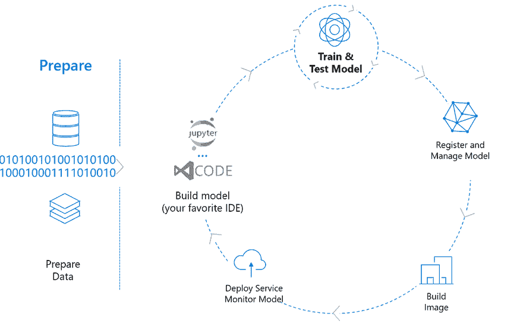
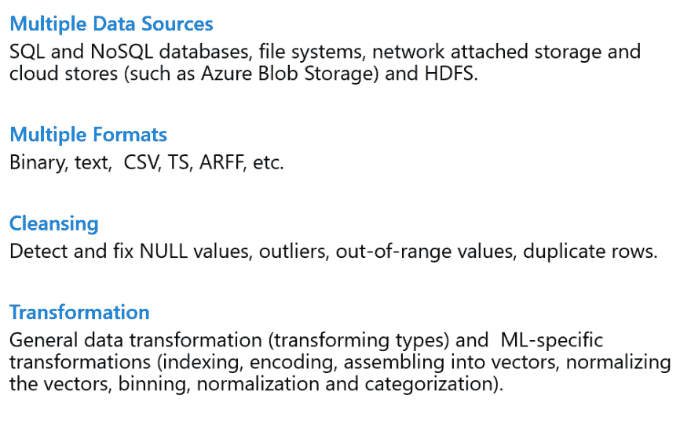
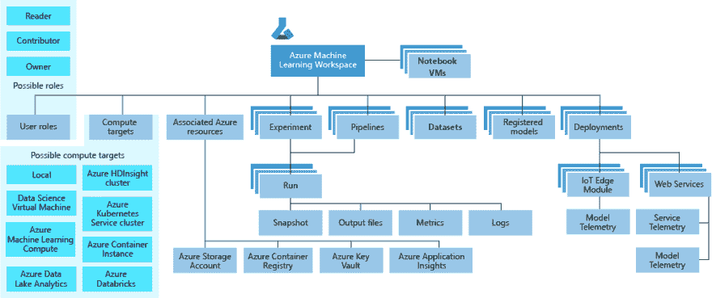
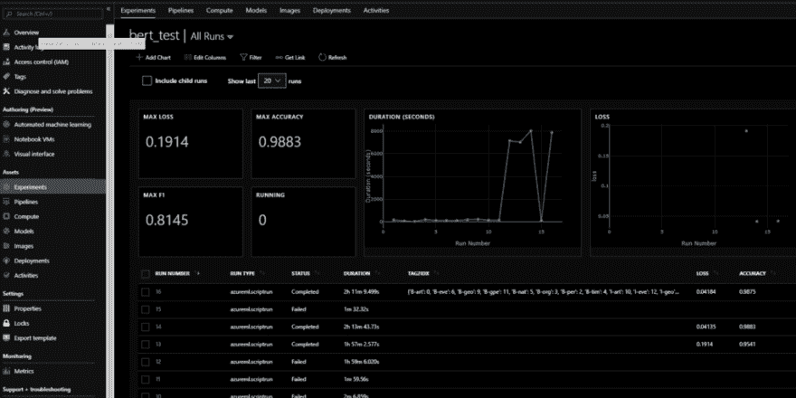
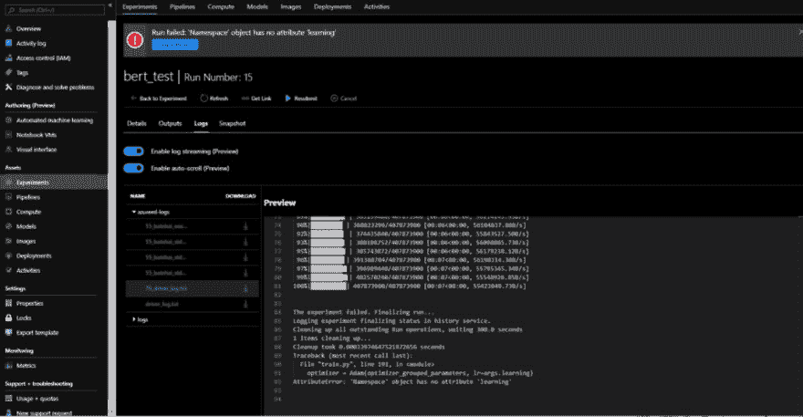
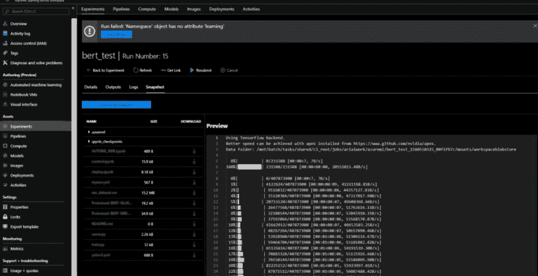
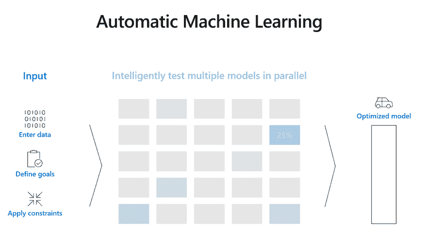
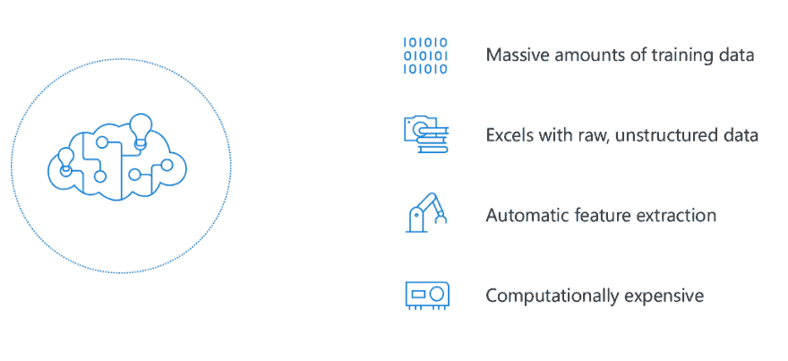
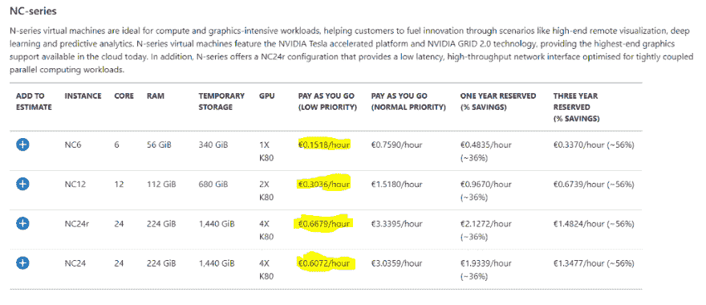

# 生产机器学习的 9 大技巧

> 原文:[https://dev . to/azure/9-advanced-tips-for-production-machine-learning-4c CG](https://dev.to/azure/9-advanced-tips-for-production-machine-learning-4ccg)

[T2】](https://res.cloudinary.com/practicaldev/image/fetch/s--1trWwVtu--/c_limit%2Cf_auto%2Cfl_progressive%2Cq_66%2Cw_880/https://cdn-images-1.medium.com/max/1024/1%2AMRAj-ClZpkfuB_u0Tfualg.gif)

TLDR；将最新的机器学习模型整合到生产应用程序中是一种有益但往往令人沮丧的体验。以下帖子提供了生产机器学习的技巧，并附有使用 Azure 机器学习服务的示例。

如果你是 Azure 的新手，你可以在这里免费订阅。

[立即创建您的 Azure 免费帐户| Microsoft Azure](https://azure.microsoft.com/en-us/free/?WT.mc_id=7tips-medium-abornst)

虽然在后面的帖子中的技巧是超越 Azure，但是 Azure 机器学习服务提供了结构化的工具，用于在生产规模上培训、部署、自动化和管理机器学习工作流。

### [T1】1)不要多此一举](#1-do-not-reinvent-the-wheel)

在写第一行人工智能代码之前，问问你正在解决的问题是否真的需要一个艺术模型？许多场景已经拥有由顶级云提供商管理和维护的现有解决方案。

[认知服务|微软 Azure](https://azure.microsoft.com/en-us/services/cognitive-services/?WT.mc_id=7tips-medium-abornst)

这些服务是受支持的、符合行业标准的、不断更新的，并且已经集成到您的客户正在使用的语言和平台中。它们中的许多可以在 docker 环境中离线运行，其中许多服务，如定制视觉、定制语音和语言理解，甚至可以定制。

在重新发明轮子之前，检查这些服务是否适合您的场景，您可能会发现，当您的公司将最先进的模型投入生产时，托管服务的性能将会赶上。

<figure>

<figcaption>80:20 法则为艾</figcaption>

</figure>

我发现有一个帕累托 80:20 规则，在这个规则中，一个公司在给定时间需要的大约 80%的人工智能工具已经在一个托管服务中。然而，虽然 80%的场景可能被认知服务覆盖，但剩下的 20%的场景往往是最具破坏性的。通过不重新发明轮子，您可以将您的生产精力集中在这些关键场景上。

### 2)集中您的数据管道

在研究中，通常会提供数据集。但是在生产管理中，保护和处理数据更具挑战性。在将下一个最先进的模型投入生产之前，理解您的数据和用例非常重要。下图概述了为生产机器学习摄取和处理数据时的注意事项。

[T2】](https://res.cloudinary.com/practicaldev/image/fetch/s--ku2WwQAw--/c_limit%2Cf_auto%2Cfl_progressive%2Cq_auto%2Cw_880/https://cdn-images-1.medium.com/max/947/1%2Ab0JwrOo1D2NcPCT05OfyzA.png)

诸如 [Azure Storage](https://docs.microsoft.com/en-us/azure/storage/common/storage-introduction?WT.mc_id=7tips-medium-abornst) 、 [Azure Event Hubs](https://docs.microsoft.com/en-us/azure/event-hubs/?WT.mc_id=7tips-medium-abornst) 和 [Azure Data Explorer](https://docs.microsoft.com/en-us/azure/data-explorer/?WT.mc_id=7tips-medium-abornst) 之类的服务支持可扩展的数据获取和处理。

Azure 机器学习服务通过 [MLOps SDK](https://docs.microsoft.com/en-us/azure/machine-learning/service/concept-model-management-and-deployment?WT.mc_id=7tips-medium-abornst) 直接与这些服务集成。在这篇文章中，我不会深入探讨这些概念，但是可以在下面的文档中找到更多关于如何集中和管理数据访问的信息。

[创建数据集以使用 azureml-datasets - Azure 机器学习服务访问数据](https://docs.microsoft.com/en-us/azure/machine-learning/service/how-to-create-register-datasets?WT.mc_id=7tips-medium-abornst)

### 3)记录你团队的工作

在研究环境中，很容易习惯于独自研究一个模型。在生产中，跟踪跨分布式团队完成的工作是一项挑战。

幸运的是，Azure 机器学习工作区使团队能够管理实验并跟踪他们的工作。

[T2】](https://res.cloudinary.com/practicaldev/image/fetch/s--59iiLgJ4--/c_limit%2Cf_auto%2Cfl_progressive%2Cq_auto%2Cw_880/https://cdn-images-1.medium.com/max/1011/0%2AnjN25URFpDYB15FR.png)

从这个工作区中，团队可以定义监控所有给定运行中的传统和定制任务指标，以跟踪一段时间内的最佳性能。

[T2】](https://res.cloudinary.com/practicaldev/image/fetch/s--YOMBMcnH--/c_limit%2Cf_auto%2Cfl_progressive%2Cq_auto%2Cw_880/https://cdn-images-1.medium.com/max/1024/1%2A9Pv0FACRAYPuys6juV1Fkg.png)

当一个团队成员陷入困境时，另一个成员可以快速访问日志，并帮助他们的团队成员回到正轨。

[T2】](https://res.cloudinary.com/practicaldev/image/fetch/s--bI3_HORI--/c_limit%2Cf_auto%2Cfl_progressive%2Cq_auto%2Cw_880/https://cdn-images-1.medium.com/max/1024/1%2Arei5V-ixNXAfV4n25dmTHw.png)

每次运行时，都会对所有代码和超级参数进行快照，以便可以立即恢复和还原工作。

[T2】](https://res.cloudinary.com/practicaldev/image/fetch/s--kHGshuRM--/c_limit%2Cf_auto%2Cfl_progressive%2Cq_auto%2Cw_880/https://cdn-images-1.medium.com/max/1024/1%2ASx1SqIUtomUwebSmUIyI1w.png)

拥有扩展团队和跟踪工作的工具，对于尽快将最先进的模型投入生产至关重要。

### 4)部署稳固的基线

[T2】](https://res.cloudinary.com/practicaldev/image/fetch/s--AQ-tskw3--/c_limit%2Cf_auto%2Cfl_progressive%2Cq_66%2Cw_880/https://cdn-images-1.medium.com/max/1024/1%2A4SMvRBvLBjxJmmIoNI0_Ew.gif)

在将复杂的最新模型部署到生产中之前，部署一个可靠的基线模型是有意义的。

拥有一个可靠的基线模型具有显著的优势。强大的基线有助于:

*   更好地理解将模型投入生产的部署过程。
*   评估给定解决方案的影响，如果您看到基线上有可量化的投资回报，那么您可以使用它来证明向更复杂的模型投入更多资源是合理的。
*   提供一个比较点——例如，如果基准在您的数据上给出 87%的 F1 分数，但是您的最先进的实现返回 85%,基准可以帮助您更好地了解在您的实现中可能有一个 bug，即使指标看起来不错。

Azure AutoML 服务有助于为许多任务生成强大的基线，甚至不需要编写一行 ML 代码。AutoML 自动执行为您的特定数据选择最佳算法的过程，因此您可以快速生成机器学习基线。要开始使用，请查看下面的 AutoML 文档，了解有关该服务如何工作的更多信息。

[创建自动化 ML 实验- Azure 机器学习服务](https://docs.microsoft.com/en-us/azure/machine-learning/service/how-to-configure-auto-train?WT.mc_id=7tips-medium-abornst)

还可以看看才华横溢的 Francesca Lazzeri 在 Auto ML 上发表的这篇文章，了解更多关于服务结果的解释。

[自动化和可解释的机器学习](https://medium.com/microsoftazure/automated-and-interpretable-machine-learning-d07975741298)

### 5)使用低优先级计算和自动缩放

[T2】](https://res.cloudinary.com/practicaldev/image/fetch/s--mQnz8ZqI--/c_limit%2Cf_auto%2Cfl_progressive%2Cq_auto%2Cw_880/https://cdn-images-1.medium.com/max/1024/1%2AZM8sD7BcttWpTA_OBGXgvQ.png)

训练大型先进模型的计算成本可能很高，但是利用低优先级计算可以节省大量成本。

[T2】](https://res.cloudinary.com/practicaldev/image/fetch/s--XGOsPLFT--/c_limit%2Cf_auto%2Cfl_progressive%2Cq_auto%2Cw_880/https://cdn-images-1.medium.com/max/1024/1%2AnXDYcSk1n0Y1MODkFniCmg.png)

此外，Azure 机器学习服务支持自动扩展，这意味着如果您的模型在任何时候耗尽了所有分配的资源，而不是崩溃并导致您失去所有工作和消耗的计算资源，它将自动根据您的需求进行扩展，然后在资源释放时再缩减。

有了这些成本节约，您可以选择训练您的模型更长的时间，或者使用比传统部署少两行代码来减少浪费。