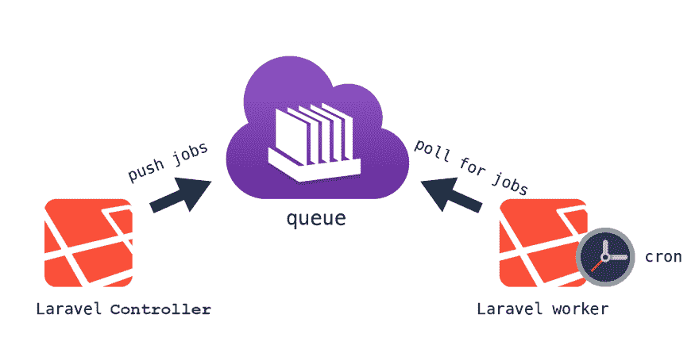
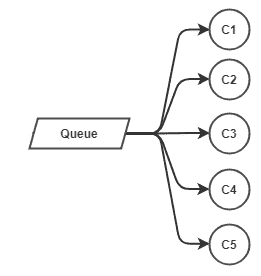
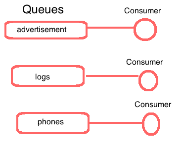
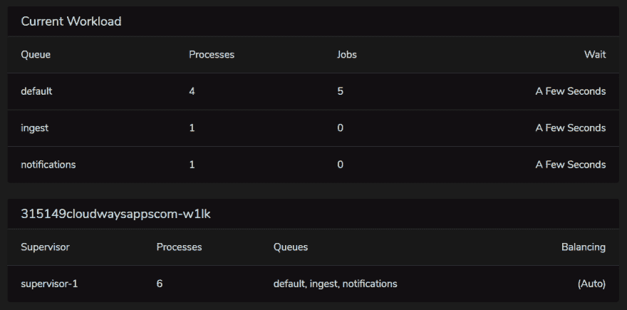

# 使用 Laravel 队列扩展您的应用—从基础到水平

> 原文：<https://dev.to/inspector/what-worked-for-me-using-laravel-queues-from-the-basics-to-horizon-343i>

大家好，我是 Valerio，Inspector 的软件工程师、创始人兼首席技术官。

本指南面向所有需要使用 Laravel 队列提高系统可伸缩性的 PHP 开发人员。

我第一次读到 Laravel 是在 2013 年末，在 5.x 版本开始的时候。当时我没有参与重大项目。现代框架的一个方面，尤其是 Laravel，对我来说听起来最神秘的是“队列”。

阅读文档时，我猜测了它的潜力，但是没有真正的开发经验，它在我的脑海中仍然是一个理论。

今天我是检查员的创造者。这是一个实时性能仪表板，每小时执行数千个作业。所以我对这个架构的了解要好得多。

## 拉瓦雷尔队列:温柔的介绍

当 PHP 应用程序收到一个传入的 HTTP 请求时，它会做两件事。代码逐步执行，直到请求的执行结束。并且响应返回给客户端(例如，用户的浏览器)。

这种同步行为直观、可预测且易于理解。我向我的端点发出一个 HTTP 请求。应用程序从数据库中检索数据，将其转换成适当的格式，执行更多的任务，然后将其发送回来。它是线性的。

队列和作业引入了打破这种线性流程的异步行为。这就是为什么一开始我觉得这有点奇怪。

但是有时，一个耗时的任务需要完成一个执行周期。例如向所有团队成员发送电子邮件通知。

这可能意味着发送六到十封电子邮件，需要四到五秒钟来完成。因此，每当用户点击那个按钮时，他们需要等待五秒钟才能继续使用该应用程序。用户数量越多，这个问题就越严重。

## “耗时的任务”是什么意思？

这是一个合理的问题。发送电子邮件是关于队列的文章中最常见的例子。但是，我想告诉你在我的经历中我需要做什么。

作为产品负责人，我需要让用户的旅程信息与我们的营销和客户支持工具保持同步。因此，基于用户操作，我们通过 API(也称为外部 HTTP 调用)将用户信息更新到各种外部软件，用于营销和客户服务目的。

我的应用程序中最繁忙的端点之一可以发送十封电子邮件并执行三个对外部服务的 HTTP 调用来完成。但是，当然，没有用户会等那么久。所以他们更有可能会停止使用我的应用程序。

多亏了队列:

*   我可以将所有这些任务封装在专用(可执行)类中；
*   向施工人员传递他们工作所需的信息；
*   并安排它们稍后在后台执行。

这允许控制器立即返回一个响应。

```
class ProjectController 
{
    public function store(Request $request)
    {
        $project = Project::create($request->all());

        // Defer NotifyMembers, TagUserActive, NotifyToProveSource 
        // passing the information needed to do their job
        Notification::queue(new NotifyMembers($project->owners));
        $this->dispatch(new TagUserAsActive($project->owners));
        $this->dispatch(new NotifyToProveSource($project->owners));

        return $project;
    }
} 
```

<svg width="20px" height="20px" viewBox="0 0 24 24" class="highlight-action crayons-icon highlight-action--fullscreen-on"><title>Enter fullscreen mode</title></svg> <svg width="20px" height="20px" viewBox="0 0 24 24" class="highlight-action crayons-icon highlight-action--fullscreen-off"><title>Exit fullscreen mode</title></svg>

我不需要等到所有这些过程完成后再返回响应。相反，我将只等待在队列中发布它们所需的时间。这个过程可能意味着 10 秒和 10 毫秒之间的差别！

## Laravel 队列:它是如何工作的！

这是一个典型的“发布者/消费者”架构。

我们已经从控制器发布了队列中的作业，所以现在我们将了解如何使用队列，并最终执行作业。

[](https://res.cloudinary.com/practicaldev/image/fetch/s--LuaTICWw--/c_limit%2Cf_auto%2Cfl_progressive%2Cq_auto%2Cw_880/https://miro.medium.com/max/1984/1%2AEvvsj-ibqWBiAemzFMHzdA.png)

要消耗一个队列，我们需要运行一个最流行的 artisan 命令:

`php artisan queue:work`

如 [Laravel 文档](https://laravel.com/docs/master/queues#running-the-queue-worker)中所述:

> Laravel 包括一个队列工作器，当新任务被推到队列中时，它将处理这些新任务。

太好了！

Laravel 提供了一个现成的接口来将作业放入队列中，并提供了一个现成的命令来从队列中取出作业并在后台执行它们。

### 主管的角色

这个策略在一开始对我来说是另一个“奇怪的东西”。然而，当发现新事物时，这是正常的。还有，我也经历过这个学习阶段。所以，我写文章帮助我组织技能。同时，我帮助其他开发人员扩展他们的知识

主管是一个过程管理系统。简而言之:如果一个进程因为任何原因崩溃，Supervisor 就会重启它。

*为什么我们应该使用主管？*

如果一个作业失败并引发异常，queue:work 命令将停止它的工作。

为了保持`queue:work`进程运行(消耗您的队列)，您应该使用一个进程监视器，比如 Supervisor。这确保了`queue:work`命令会在因异常而停止的情况下自动重启。

管理程序在命令关闭后重新启动命令，从下一个作业开始，放弃失败的作业。

作业将在您的服务器上后台执行，不再依赖于 HTTP 请求。然而，这引入了在实现作业代码时需要考虑的变化。

以下是我认为最重要的:

## 你没有这个要求

HTTP 请求没有了。相反，您的代码从 CLI 执行。

如果您需要请求参数来完成您的任务，您需要将它们传递到作业的构造函数中，以便稍后在执行过程中使用:

```
// A job class example
class TagUserJob implements ShouldQueue
{
    public $data;

    public function __construct(array $data)
    {
        $this->data = $data;
    }
}

// Put the job in the queue from your controller
$this->dispatch(new TagUserJob($request->all())); 
```

<svg width="20px" height="20px" viewBox="0 0 24 24" class="highlight-action crayons-icon highlight-action--fullscreen-on"><title>Enter fullscreen mode</title></svg> <svg width="20px" height="20px" viewBox="0 0 24 24" class="highlight-action crayons-icon highlight-action--fullscreen-off"><title>Exit fullscreen mode</title></svg>

### 你不知道登录的用户是谁

会话结束了。同理，你也不会知道登录用户的身份。因此，如果您需要用户信息来完成任务，您需要将用户对象传递给作业的构造函数:

```
// A job class example
class TagUserJob
{
    public $user;

    public function __construct(User $user)
    {
        $this->user= $user;
    }
}

// Put the job in the queue from your controller
$this->dispatch(new TagUserJob($request->user())); 
```

<svg width="20px" height="20px" viewBox="0 0 24 24" class="highlight-action crayons-icon highlight-action--fullscreen-on"><title>Enter fullscreen mode</title></svg> <svg width="20px" height="20px" viewBox="0 0 24 24" class="highlight-action crayons-icon highlight-action--fullscreen-off"><title>Exit fullscreen mode</title></svg>

## 用检查器监视后台作业

由于作业在后台运行，您无法立即看到作业是否产生错误。

您将不再有即时的反馈，例如 HTTP 请求的结果。

如果作业失败，它会默默地完成，没有人会注意到。考虑集成一个监控工具来实时检查作业执行情况，并在出现问题时通知您。

[**那就是督察**做的事情](https://inspector.dev/laravel)。

对于基于 Laravel 的应用程序，这是一个完整的监控系统。

## 了解如何缩放

不幸的是，通常这还不够。使用单一队列和消费者可能很快就会变得无用。

队列是 FIFO 缓冲区(先进先出)。如果您计划许多不同类型的作业，它们需要等待其他作业执行它们计划的任务，然后才能完成它们的任务。

有两种扩展方式:

## 多个消费者为一个队列

[](https://res.cloudinary.com/practicaldev/image/fetch/s--NYsZfqM8--/c_limit%2Cf_auto%2Cfl_progressive%2Cq_auto%2Cw_880/https://miro.medium.com/max/326/1%2AB95oVhCZoVkv_2jhV8nHew.png)

这样，五个作业将一起从队列中拉出，加快了队列的消耗。

## 专用队列

您还可以为启动的每个作业“类型”创建特定的队列。并且您可以为每个队列使用一个专用的消费者。

[](https://res.cloudinary.com/practicaldev/image/fetch/s--J3t4otUd--/c_limit%2Cf_auto%2Cfl_progressive%2Cq_auto%2Cw_880/https://miro.medium.com/max/460/1%2A1ICT3D0C0bie7Xg-wrk7gg.png)

这样，每个队列都被消耗掉，而无需等待其他类型作业的执行。

## Laravel 作业文档

根据 Laravel 文件:

> 队列工作器是长寿命的进程，将启动的应用程序状态存储在内存中。因此，他们不会注意到你的代码库在启动后的变化。因此，在部署过程中，一定要重新启动队列工作器。

另外，请记住，在任何代码更改或部署之后，都需要重新启动队列工作器。

## 熔岩层

Laravel Horizon 是一个队列管理器，可以让您完全控制想要设置的队列数量。它还提供了组织消费者的能力。它允许您将这两种策略结合成一种策略来满足您的可伸缩性需求

它从 php artisan horizon 命令开始，而不是 php artisan `queue:work`。该命令扫描您的 horizon.php 配置文件，并根据配置启动队列工作进程:

```
'production' => [
    'supervisor-1' => [
        'connection' => "redis",
        'queue' => ['adveritisement', 'logs', 'phones'],
        'processes' => 9,
        'tries' => 3,
        'balance' => 'simple', // could be simple, auto, or null
    ]
] 
```

<svg width="20px" height="20px" viewBox="0 0 24 24" class="highlight-action crayons-icon highlight-action--fullscreen-on"><title>Enter fullscreen mode</title></svg> <svg width="20px" height="20px" viewBox="0 0 24 24" class="highlight-action crayons-icon highlight-action--fullscreen-off"><title>Exit fullscreen mode</title></svg>

如上所示，Horizon 将启动三个队列，分配三个进程来消耗每个队列(总共 9 个)。

正如 Laravel 文档中提到的，Horizon 的代码驱动方法允许我的配置保持在源代码控制中。这是我的团队可以合作的地方。在使用 CI 工具时，这也是一个完美的解决方案。

通过阅读本文，详细了解[配置选项的含义。](https://medium.com/@zechdc/laravel-horizon-number-of-workers-and-job-execution-order-21b9dbec72d7)

## 我的配置

```
'production' => [
    'supervisor-1' => [
        'connection' => 'redis',
        'queue' => ['default', 'ingest', 'notifications'],
        'balance' => 'auto',
        'processes' => 15,
        'tries' => 3,
    ],
] 
```

<svg width="20px" height="20px" viewBox="0 0 24 24" class="highlight-action crayons-icon highlight-action--fullscreen-on"><title>Enter fullscreen mode</title></svg> <svg width="20px" height="20px" viewBox="0 0 24 24" class="highlight-action crayons-icon highlight-action--fullscreen-off"><title>Exit fullscreen mode</title></svg>

[检查员](https://www.inspector.dev)主要使用三个队列:

*   `ingest` -用于分析来自外部应用程序的数据的过程；
*   `notifications` -如果在数据摄取期间检测到错误，则立即安排通知；
*   `default` -对于我不想干扰*摄取*和*通知*过程的其他任务。

[](https://res.cloudinary.com/practicaldev/image/fetch/s--8d-yugj_--/c_limit%2Cf_auto%2Cfl_progressive%2Cq_auto%2Cw_880/https://miro.medium.com/max/1474/1%2AXHkernGbcjpSSjNID81Mdw.png)

使用 **balance=auto** ，Horizon 知道要激活的最大进程数是 15。它根据队列负载分配它们。

如果队列为空，Horizon 会为每个队列保持一个活动流程。如果调度了一个作业，它还使消费者准备好立即处理队列。

# 结论

如您所见，并发后台执行会导致不可预测的错误。例如[“超过 MySQL 锁等待超时”](https://inspector.dev/resolved-mysql-lock-wait-timeout-exceeded-using-laravel-queues-and-jobs/)以及进程并发性增加产生的许多其他问题。

我希望这篇文章能帮助你对他们更有信心。

## 新来的督察？

立即访问专为软件开发人员设计的监控环境，避免任何服务器或基础架构配置。

如您所知，开发人员并不总是乐于在服务器级别安装和配置软件。服务器级配置超出了软件开发生命周期，甚至由外部团队管理。

有了 Inspector，您再也不需要在服务器级别安装东西，或者在您的云基础架构中进行复杂的配置。

Inspector 使用一个轻量级软件库，您可以像安装任何其他依赖项一样将其安装在您的应用程序中。

如果是 Laravel，您可以使用官方的 [Laravel 套装](https://github.com/inspector-apm/inspector-laravel)。

更多详情请访问我们的网站:[https://inspector.dev/laravel/](https://inspector.dev/laravel/)