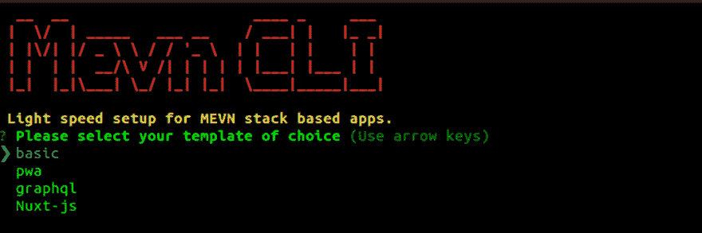

# Mevn-CLI，基于 Mevn 堆栈的应用程序的光速设置

> 原文:[https://dev . to/jamesgeorge 007/mevn-CLI-light-speed-setup-for-mevn-stack-based-apps-4j 8](https://dev.to/jamesgeorge007/mevn-cli-light-speed-setup-for-mevn-stack-based-apps-4j8)

我敢肯定，刚开始时，你们所有人都经历过设置本地环境的痛苦。从普通 JavaScript 到现代框架的过渡确实有点困难。正是这种想法促使我们创建了 Mevn-CLI

[T2】](https://res.cloudinary.com/practicaldev/image/fetch/s--Y-Lh17r4--/c_limit%2Cf_auto%2Cfl_progressive%2Cq_auto%2Cw_880/https://thepracticaldev.s3.amazonaws.com/i/s41b3zbbsz7tb0rldcxi.png)

从文档来看，它基本上是一个用于开始使用 MEVN 堆栈的 CLI 工具。它为构建基于 MEVN 堆栈的 webapp 提供了一个超级简单的样板模板和额外的实用程序。它消除了设置本地开发环境的麻烦，这可能会成为一场噩梦，尤其是对于刚刚起步的初学者。

## 快速链接

*   [GitHub 回购](https://github.com/madlabsinc/mevn-cli)
*   [文档](https://mevn.madlabs.xyz)
*   [其他指南](https://github.com/madlabsinc/mevn-cli/wiki)
*   [推特](https://twitter.com/mevn_cli)
*   [开放集体](https://opencollective.com/mevn-cli)

我们希望听到来自社区的意见。尝试一下，把你的想法写在评论区。此外，任何形式的贡献都是热烈欢迎的。请随意联系:)