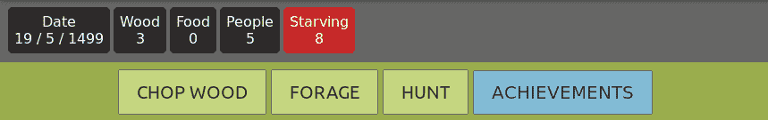
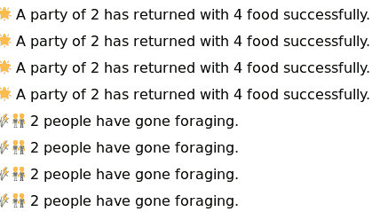
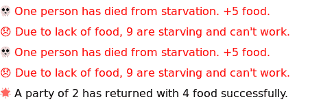
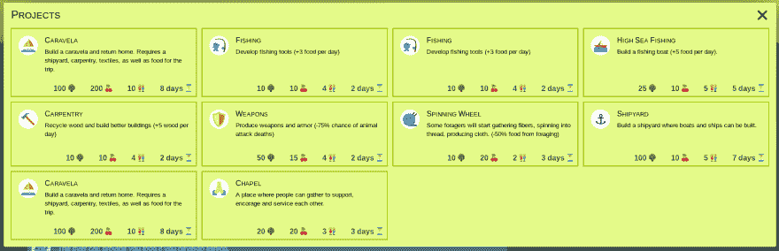
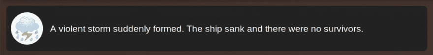
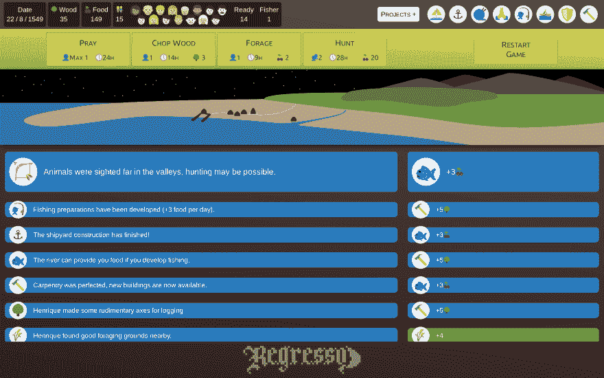
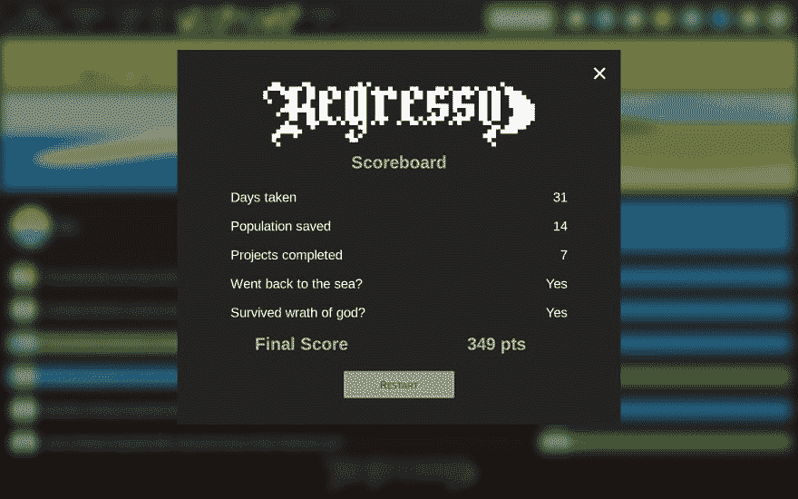

# 如何设计一个 javascript 游戏？(小于或等于 13KB)

> 原文:[https://dev . to/mrlopis/how-to-design-a-JavaScript-game-in-13kb-or-less-59kn](https://dev.to/mrlopis/how-to-design-a-javascript-game-in-13kb-or-less-59kn)

又一个 [Js13K](https://js13kgames.com/) 过去了。这是我第三次参加这个游戏。我喜欢认为我总能从这些中学到一两件事。([你可以在这里玩游戏](https://js13kgames.com/entries/regresso)

## 游戏主题

当今年的主题出来(“回来”)时，我决定要制作一个游戏，讲述一艘船上的船员在一个岛上失事并试图回家的故事。他们需要收集资源来重建这艘船，在一个混合了[饼干点击器](http://orteil.dashnet.org/cookieclicker/)、《我的世界》和古老的[成长 flash 游戏](https://www.youtube.com/watch?v=BHoT1ig9DdU)的游戏中。

## 原型制作

我立即开始制作一个岛屿生成算法的原型。它将拥有一切:海洋、沙滩、草地、树木、矿石、动物、淡水湖，甚至可能是河流(我最喜欢的原型工具是[https://codepen.io/](https://codepen.io/))。

除了我从来没有做过类似的事情。经过两天令人沮丧的结果，我放弃了游戏，上床睡觉。

第二天，我意识到我花在失败的孤岛生成器上的所有时间根本没有让我更接近我开始构建的游戏。所以我刮掉所有东西，重新开始。我打算制作什么样的*？我拿着记事本坐下来写了起来。*

 *1.  我想要一个遥控器。游戏就是点击获取资源。所以我给了它纽扣。你点一下，就明白了。
2.  我希望资源不稳定。还有，他们不可能只是免费的。所以我把它做成这样，每天，人们都会吃到这些食物。另外，每个人花几秒钟去拿食物。
3.  最后，**我要了*剧*T3。不喂人会怎么样？最终，当有人死亡时，我放弃了所有的“+5 食物”。不算食人，这个游戏已经够病态的了。你可以在这里测试我的最终原型。**
4.  我希望我的游戏的第四个组成部分是**一组“项目”**，在你最终建造这艘船之前，你必须完成这些项目。受“成长”的启发，我希望玩家完成项目的顺序能够影响最终目标。因此，举例来说，如果你在早期发展捕鱼业，你会得到更多的食物，但随后你会有更少的人准备工作，因为现在有一个人是专门的渔民。

[T2】](https://res.cloudinary.com/practicaldev/image/fetch/s--77DU7rhO--/c_limit%2Cf_auto%2Cfl_progressive%2Cq_auto%2Cw_880/https://thepracticaldev.s3.amazonaws.com/i/un0vatrtqyaec5huqx26.png)

## 平衡进度和难度

我想到的大多数项目都是试图平衡和再平衡游戏的结果。

1.  一直点击草料和狩猎，几乎没有时间阅读游戏消息和项目描述；所以我创造了捕鱼来自动采集食物。

2.  随着捕鱼项目的完成，很快储存一吨食物真的很简单；所以我创造了*野兽之死*来削弱狩猎行动。

3.  储存木材也很容易。所以我也给伐木一点动物攻击的风险。

4.  现在动物袭击是一个太大的问题！所以我用“武器”项目来应对这种情况，这减少了动物袭击死亡的几率。

5.  我还在堆放大量的木材。所以我让人们每天烧一点木头(取暖和做饭)。

6.  在这一切之后，我意识到，在游戏结束时，*没有死亡的风险。有了稳定的食物供应，输掉比赛是不可能的。所以我偷偷输入了一个“上帝之怒”的参数。如果你不给他建一个礼拜堂，多祷告，上帝会把你这艘逃跑的船弄沉的。🙏🙏🙏
    T3T5】*

## 用户界面

我已经完全刮了地图生成器的计划。但是我想要某种用户界面。我决定保留原型中的日志，并创建一个小“地图”来提示玩家正在发生的事情。我给了游戏元素和控制动画，让一切看起来更令人满意(也有点混乱，但没关系(我希望))。我用 SVG 制作了这个岛。HTML5 时代的 SVG 是福也是祸。但是在另一篇文章中会有更多的介绍。

[T2】](https://res.cloudinary.com/practicaldev/image/fetch/s--1UboVAuu--/c_limit%2Cf_auto%2Cfl_progressive%2Cq_auto%2Cw_880/https://thepracticaldev.s3.amazonaws.com/i/3kohzskoh3d1nnpqasbn.png)

这个游戏一开始很混乱。你开始玩，你的人两天后就死了，因为一切发生得太快；所以你对着屏幕大喊并刷新。你再试一次，你会在阅读项目描述时分心；每个人都在挨饿。你刷新。你再试一次。刷新页面重启一个游戏好烦。快速死亡游戏也需要快速重启。所以我添加了一个重启按钮来重置游戏。添加重置按钮也是一个非常重构的练习，因为它迫使我在相同的地方收集所有的游戏数据并正确地初始化它们。

## 计算分数

最后，我的游戏需要奖励。我觉得结果的输赢是一个悲伤的结局，也不是很吸引人。所以我开发了一个分数方程:

1.  每个没死的人都会给你很多分数

2.  你完成的每个项目也会给你加分

3.  最终分数与你完成的天数成反比

4.  分数也和上帝的愤怒成反比

5.  你离开这个岛就能得到奖金。

如果你想知道，我迄今为止的最好成绩是 349 分

[T2】](https://res.cloudinary.com/practicaldev/image/fetch/s--t7edlv9B--/c_limit%2Cf_auto%2Cfl_progressive%2Cq_auto%2Cw_880/https://thepracticaldev.s3.amazonaws.com/i/013xojnc7esj2c3bdni4.png)

我相信我成功地制作了一个有趣的小游戏，我期待着明年的挑战。让我知道你是否能在 30 天内完成！我相信有可能！

## 书呆子统计

我用 Typescript 开发了我的游戏，但是从来没有真正使用过类型。我用 gulp 来构建我的游戏和压缩我的文件。

我在 VSCode、Ubuntu 和 XPS13 上编码。

从比赛的第一天起，我每周工作 5 到 6 天，每周工作 15 个小时。

除了 gulp 项目构建器，我在没有任何库的情况下从头开始制作游戏。我还在写一篇更技术性的事后分析。*