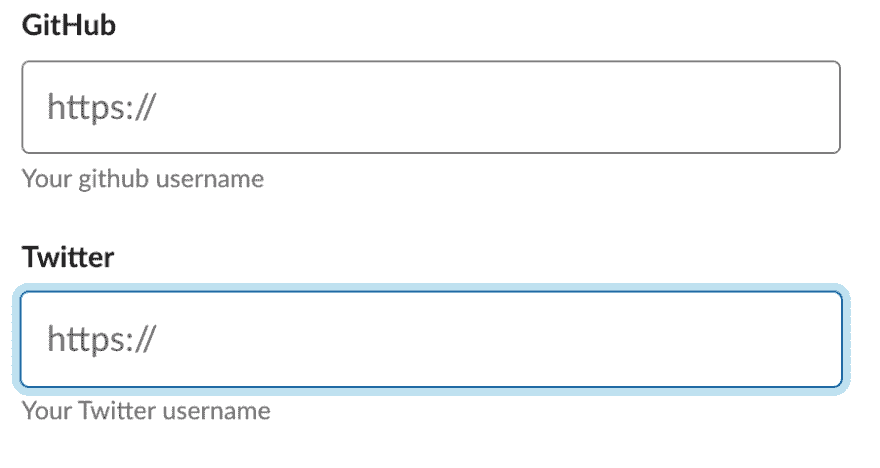
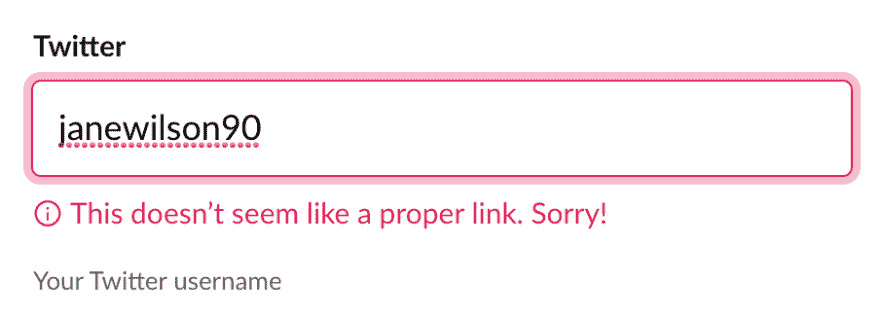
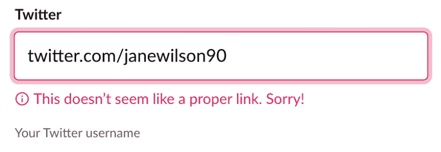

# 当帮助文本不起作用时

> 原文:[https://dev . to/janewilson 90/when-helper-text-does-help-g46](https://dev.to/janewilson90/when-helper-text-doesn-t-help-g46)

和 IT 界的大多数人一样，我在工作中使用 Slack。太棒了。有 GIFS，还有像 Google Drive、吉拉、BitBucket 和 Outlook 这样的集成(如果你愿意的话)。但是像大多数软件一样，它也有缺点。

不要介意你不能用 GIF 回复一个帖子，即使那会很神奇——今天我在它的可访问性方面偶然发现了一点失误。

## 无障碍不仅仅是盲人的专利

当我们谈论可访问性时，我们倾向于关注颜色对比、字体大小和粗细以及屏幕阅读器的 alt 标签。但这并不是因为无障碍只是针对有视觉障碍的人，无障碍是针对所有人的。

如果你想到有认知问题的人，他们在使用网站或应用程序时可能会面临许多问题。有时间限制的内容可能不会给他们足够的时间来处理要求他们做的事情，缺乏导航功能可能意味着他们无法确定他们在你的网站/应用程序中的位置，表格上混乱的说明可能会让他们无法填写。

## 您的松弛曲线

空闲时间的用户有简档。如今，你可以上传一张照片，并在你的社交媒体上添加链接，这已经是相当标准的了。我们的问题就出在这些社交媒体链接上。

[T2】](https://res.cloudinary.com/practicaldev/image/fetch/s--6aQnBn5u--/c_limit%2Cf_auto%2Cfl_progressive%2Cq_auto%2Cw_880/https://janeawilson.co.uk/wp-content/uploads/2019/08/image.png)

乍一看，这个问题可能并不明显。但是看看表格的不同部分在问你什么。占位符文本要求输入以 https://开头的 URL，但是输入下面的帮助文本只是要求输入您的用户名。这似乎是一个小问题，但对于有认知问题的人来说，这可能意味着他们真的很难填写表格。

所以今天早上我试着在喝咖啡前填写这个。花了一段时间。现在，我没有认知问题(据我所知…👀)但是这个真的把我给扔了。我知道表格的一部分错了，但不知道是哪一部分。我假设由于所有 Twitter 和 GitHub URLs 都遵循一种格式，所以表单只需要我的用户名。

[T2】](https://res.cloudinary.com/practicaldev/image/fetch/s--bQDQnmel--/c_limit%2Cf_auto%2Cfl_progressive%2Cq_auto%2Cw_880/https://janeawilson.co.uk/wp-content/uploads/2019/08/image-1.png)

好吧，所以是助手文本错了。呃。🙄

所以我试着快速地把链接放进去——所有的 URL 都以 https://开头，所以我当然不需要把它放进去，但是放进去…

[T2】](https://res.cloudinary.com/practicaldev/image/fetch/s--bccPEq7w--/c_limit%2Cf_auto%2Cfl_progressive%2Cq_auto%2Cw_880/https://janeawilson.co.uk/wp-content/uploads/2019/08/image-3.png)

好吧不。你需要输入完整的网址。即使帮助文本仍然要求您输入用户名。😔

[T2】](https://res.cloudinary.com/practicaldev/image/fetch/s--eDotgS1Z--/c_limit%2Cf_auto%2Cfl_progressive%2Cq_auto%2Cw_880/https://janeawilson.co.uk/wp-content/uploads/2019/08/image-4.png)

所以我最终到达了那里。这是表单的一个相对较小的问题，但是很容易避免！占位符文本不应该用来向用户传达重要信息。一旦用户开始输入(或者他们在框中点击的那一分钟)，它就消失了，然后用户只剩下你的帮助文本。这都是帮助用户避免犯错的一部分，不仅对那些有认知问题的人有用，对你所有的用户都有用。

不是每个人都会一次完成表格的填写，他们可能会去冲一杯咖啡，回来后会沮丧地发现他们总是做错，尽管他们遵循了所有可见的说明。这可能只是一个非关键的松弛配置文件，但如果在一个关键的表单上犯了同样的错误，你就严重地打开了你的网站/应用程序，让用户感到沮丧，并可能失去一个用户。

## 响应懈怠

所以我就是我，我已经在推特@ SlackHQ 上发了这个问题，他们回复了！

[T2】](https://res.cloudinary.com/practicaldev/image/fetch/s--V-XHd4V4--/c_limit%2Cf_auto%2Cfl_progressive%2Cq_auto%2Cw_880/https://janeawilson.co.uk/wp-content/uploads/2019/08/image-5.png)

我更喜欢一句“哦，是的，我们会马上着手解决这个问题的”,但是……一步一步来。