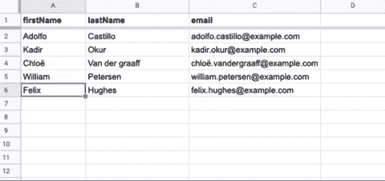
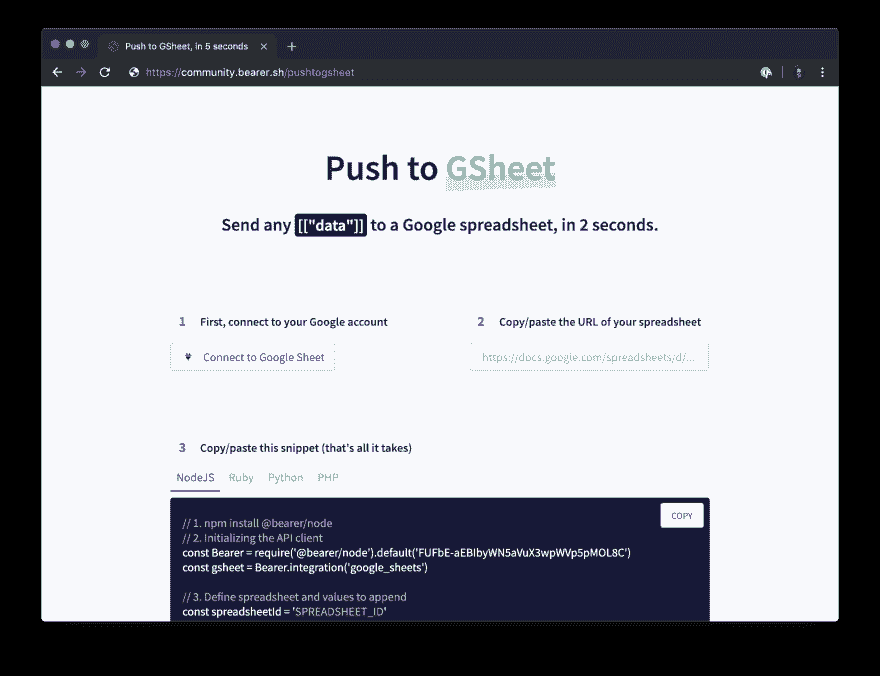

# 如何在 2 秒钟内将数据发送到谷歌电子表格？

> 原文：<https://dev.to/mailmeteor/how-to-send-data-to-a-google-spreadsheet-in-2-seconds-1h0>

**注意:** *本文中使用的“Push to GSheet”服务已经不再活跃，但是您可以使用 [Pizzly](https://github.com/Bearer/Pizzly/) 托管您自己的版本。*

我是 Google APIs 的超级粉丝。我每天都用很多。无论是在我的代码中还是通过依赖它的无数服务。

最近，我在运行一个抓取脚本，很快发现自己在 Google 工作表中做了一些可怕的复制/粘贴操作。我认为应该有一种更好的方法来动态地将数据推入电子表格:

[](https://i.giphy.com/media/lkdgvyS7701v93PeCF/giphy.gif)

快速浏览了一下 Google Sheets API 参考，我发现一个`/append`端点可以很好地完成这项工作。30 分钟后，我一边喝着柠檬水，一边在后台运行我的脚本😎

如果我没有爱上 Google APIs，我肯定会转向其他东西。但是等等，`20 minutes`发送数据到电子表格？加油！让我们试着让它变得像在谷歌上搜索一样简单。

# 我们需要什么？

**首先，了解 API。**如前所述，Google Sheets 提供了一个[方便的端点`/append`](https://developers.google.com/sheets/api/reference/rest/v4/spreadsheets.values/append) 来推送任何类型的数据。它所要求的只是二维格式的值`array` :

```
const values = [
  // First row
  ["A1","A2","A3"],
  // Second row
  ["B1","B2","B3"]
  // Third row... 
] 
```

Enter fullscreen mode Exit fullscreen mode

数据将总是被追加到工作表中。因此，如果工作表的第 1 行有一些值，新的值将被添加到第 2 行(以此类推)。

**接下来，处理认证。**像大多数访问用户数据的 API 一样，Google Sheets API 使用 OAuth2。这是一个非常强大的身份验证模式...设置复杂。

我们感兴趣的是，对 Google Sheets API 的每个请求都需要一个`access_token`——一个不可赋值的长字符串，证明请求是代表用户发出的。

谷歌提供了一个[游乐场](https://developers.google.com/oauthplayground/)来轻松检索一个。但是我将使用一个名为 [Pizzly](https://github.com/Bearer/Pizzly) 的服务，它为我安全地处理 OAuth-dance，并将处理 refresh token，这是 playground 所没有的(*声明:我帮助构建了 Pizzly* )。

**还有别的吗？**我们只是缺少数据应该附加到哪个电子表格上。根据文档，这是 [`spreadsheetID`](https://developers.google.com/sheets/api/guides/concepts#spreadsheet_id) 。每个电子表格都有一个惟一的 ID，我们可以通过查看`URL` :
找到它

```
https://docs.google.com/spreadsheets/d/{{spreadsheetId}}/edit#gid=0 
```

Enter fullscreen mode Exit fullscreen mode

# 给我看看代码！

总而言之，将数据发送到任何电子表格只需要 10 行代码。

```
// 1\. Run npm install node-fetch
// 2\. Import an HTTP client
const fetch = require("node-fetch");

// 3\. Declare spreadsheet and values to append
const spreadsheetId = 'SPREADSHEET_ID'
const data = [["firstname", "lastname"], ["John", "Doe"]]

// 4\. Send data with a POST request
const baseUrl = "https://pushtogsheet.herokuapp.com";
const query = `valueInputOption=RAW&pizzly_pkey=pope8Qy8qfYyppnHRMgLMpQ8MuEUKDGeyhfGCj`;
const url = new URL(`/proxy/google-sheets/spreadsheets/${spreadsheetId}/values/A1:append?${query}`, baseUrl);

fetch(url.href, {
    method: "POST",
    body: JSON.stringify({ values: data }),
    headers: { 'Pizzly-Auth-Id': 'CONNECT_FIRST' }
  })
  .then((res) => res.text())
  .then(console.log)
  .catch(console.error); 
```

Enter fullscreen mode Exit fullscreen mode

# 怎么用？

~~我尽最大努力让推送数据到 *gsheet* 像谷歌搜索一样简单，[为那个](https://community.bearer.sh/pushtogsheet) :~~ 制作了一个专用网站

[](https://community.bearer.sh/pushtogsheet)

本文中使用的“Push to GSheet”服务不再有效，但是您可以使用 [Pizzly](https://github.com/Bearer/Pizzly/) 托管您自己的版本。

*PS:这是 100%免费和开源的* ✌️