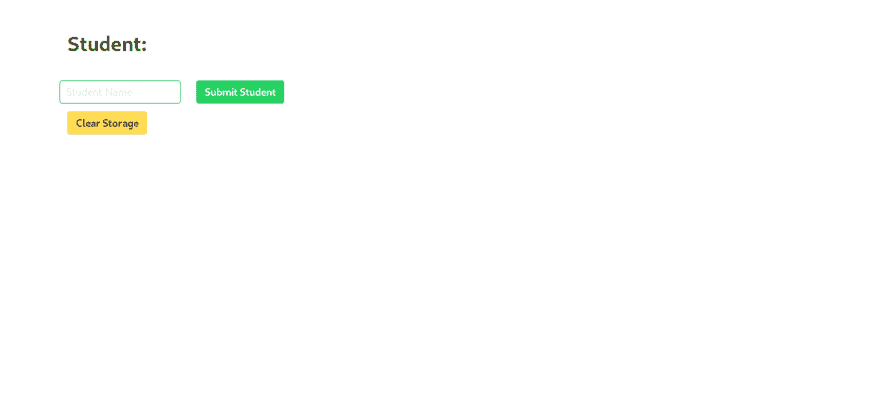

# 假人的反应状态-在反应之前是什么样的？

> 原文：<https://dev.to/mustafaanaskh99/react-state-for-dummies-how-was-it-before-react-fp3>

大家好，欢迎来到我的第一个科技博客*！我花了很多时间和*犹豫*才决定坐下来开始分享任何一点信息，但在这里我试图写并希望无论如何加强技术社区的知识！*

 *`This is part of a series of articles in which I try to break down the evolution of React State concept and try to showcase its importance by explaining the problems React State tackles in simple and intuitive way.`

## 这到底是怎么回事？

纵观所有编程语言的历史，目标始终是拥有一种在创建/操作和读取/显示数据方面尽可能高效的语言。开发人员希望有一种有效且简单的方式将创建的数据添加到 DOM 中。React 是实现这种快速、直接方式的框架之一。

为了理解 React State 解决了什么问题以及为什么它很重要，我们需要把自己放在 React 之前的开发人员的位置上，看看他们过去是如何处理创建数据、将数据保存在 DB 中以及将数据添加到 DOM 中的。

## 用 jQuery 的方式吧！

嗯，我们将使用*普通 Javascript* 而不是 *jQuery* ，但是下面的代码使用了 jQuery 开发人员之间非常常见的逻辑。

在这个例子中，我们将在浏览器的 *localStorage* 中保存一个学生的名字，并在我们的页面中显示它。让我从添加 *HTML* 代码开始。由于我不是最好的 UI 设计师，我将使用 Bulma.io 的帮助来使事情变得更有吸引力。你所需要做的就是在你将要创建我们在本教程中创建的文件的目录下运行`npm i bulma`，然后你可以跟着我做，得到同样的结果。 )

```
<!-- main.html -->
<!DOCTYPE html>
<html>
    <head>
        <title>Title</title>
        <link rel="stylesheet" href="https://cdnjs.cloudflare.com/ajax/libs/bulma/0.7.5/css/bulma.min.css">
        <script defer src="https://use.fontawesome.com/releases/v5.3.1/js/all.js"></script> 
    </head>

    <body>
        <section class="section">
                <div class="container">
                    <h3 class="title">Student:</h3>
                    <ul id="li" class="subtitle"></ul>
                </div>
                <section class="section">
                    <div class="container">
                                <div class="columns">
                                    <div class="columns">
                                        <div class="column">
                                            <input  class="input is-success" id="submit" type="text" placeholder="Student Name"/>
                                        </div>
                                        <div class="column">
                                            <input class="button is-success" type="button" value="Submit Student"/>
                                        </div>
                                    </div>
                                </div>
                        <input class="button is-warning" type="button" value="Clear Storage" />
                    </div>
                </section>
            </section>
    </body>
</html> 
```

第一个有学生标题和作为副标题的`empty ul`的 div 是我们将显示学生姓名的地方。您可以在代码中看到以下内容:

`<ul id="li" class="subtitle"></ul>`

该列表有一个 id，因为这是我们访问它的方式，以便将学生姓名作为列表项添加到列表中。

当你第一次加载页面时，它应该是这样的:
[](https://res.cloudinary.com/practicaldev/image/fetch/s--xuHfJVz5--/c_limit%2Cf_auto%2Cfl_progressive%2Cq_auto%2Cw_880/https://thepracticaldev.s3.amazonaws.com/i/bxdioohl5poa8ho0gafn.png)

填写完输入字段后点击`Submit Student`按钮，我希望姓名保存在`localStorage`中，然后出现在`Student:`的正下方。通过点击`Clear Storage`按钮，我想删除存储器中保存的名称，然后将其从页面中删除。

*为了保持整洁，我们创建一个单独的`main.js`文件，并将其链接到我们的`main.html`页面*。

我会在`</body>`的底部加上下面一行。

`<script src="mainInitial.js"></script>`

## 将输入保存在本地存储器中

现在我们需要创建一个在点击`Submit Student`按钮时运行的函数。该函数将获取文本输入的值，并使用*‘学生’*键将其保存在本地存储器中。

```
// main.js
const saveStudent = (val) => {
    localStorage.setItem('student', val)
} 
```

我现在将转到`main.html`文件，将文本输入值传递给函数，并在单击按钮时运行它:

```
<input class="button is-success" type="button" value="Submit Student" onclick="saveStudent(document.getElementById('submit').value)"/> 
```

现在我们的代码实际上将数据保存在浏览器的`localStorage`中。只是还没有显示出来。您可以尝试添加任何随机文本，并导航到工具的存储中的本地存储。

## 读取数据并显示

还记得我们一开始给的 id 吗？现在，我们将在存储中获取保存的名称，通过 ID 获取列表，然后将名称作为文本追加到列表中。
让我们编写一个 if 语句，检查在`localStorage`中是否有保存的学生，并在页面中显示出来。如果没有，我们将显示一条文本，说明:*存储为空*。

```
// main.js
const locStor = localStorage.getItem('student')
if(locStor == null){
    console.log('Storage is Empty')
    document.getElementById('li').append('Storage is Empty');
} else {
    let student = localStorage.getItem('student')
    document.getElementById('li').append(student);
} 
```

现在，如果您在浏览器中运行新代码，您的页面应该看起来像这样，并显示您提交的最后一个名字:
[](https://res.cloudinary.com/practicaldev/image/fetch/s---RN7Peg_--/c_limit%2Cf_auto%2Cfl_progressive%2Cq_auto%2Cw_880/https://thepracticaldev.s3.amazonaws.com/i/ucji27fdk6fnfur88f8o.png)

当然，如果你还没有提交任何名字，它应该显示如下:
[](https://res.cloudinary.com/practicaldev/image/fetch/s--uCCieU6i--/c_limit%2Cf_auto%2Cfl_progressive%2Cq_auto%2Cw_880/https://thepracticaldev.s3.amazonaws.com/i/ga9xxinmzbrin1ddlyy2.png)

现在，在我们进一步删除保存的名称之前，让我们创建一个函数`clearStorage()`，它清除`localStorage`。

```
// main.js
const clearStorage = () => {
    localStorage.clear()
} 
```

让我们返回并将按钮链接到函数:

```
<!-- main.html -->
<input class="button is-warning" type="button" value="Clear Storage" onclick="clearStorage()"/> 
```

#### 现在我们可以将数据添加到本地存储并显示在页面中了！...但是等一下，少了点什么。

您可能已经注意到，每次提交学生姓名时，您都需要刷新页面以显示新姓名。清除存储也是一样，您需要刷新才能看到页面中的`Storage is empty`。如果`Submit Student`输入的类型是`type="submit"`而不是`type="button"`，页面会自动刷新，您可能不会注意到。无论如何，我们可以指示页面在每次提交学生姓名时重新加载，但是我们真的想这样做吗？

## 显示新创建数据的效率

在本例中，我们只添加和删除了一行文本。即使我们每次更新或删除名称时都要刷新页面，也不会花太多时间，但情况并非总是如此。想象一下，如果我们在页面上添加数百个、数千个甚至更多的学生信息，那么持续刷新将会非常繁重且效率低下。相反，我们将操纵 DOM。

让我们从添加数据开始。每次我们单击 submit 按钮，我们都希望将名称保存在 localStorage 中(我们已经这样做了)。现在，由于我们不会刷新页面，我们需要立即将这个名称添加到页面中(甚至在我们将它发送到 localStorage 之前)，以便不必再次从页面中获取它(更少的时间->更好的效率)。

我们是这样做的，

我们将把 saveStudent 函数更新如下:

```
const saveStudent = (val) => {
    let newStudent = document.createElement("li")
    let studentName = document.createTextNode(val)
    newStudent.appendChild(studentName)
    newStudent.setAttribute("id", "new_student")
    document.getElementById('li').append(newStudent);
    localStorage.setItem('student', val)
} 
```

如您所见，我们创建了一个新的`li`，然后创建了一个保存学生姓名的文本节点，然后将该节点追加到我们刚刚创建的列表项中。在我们存储这个名字之前，我们将它附加到我们的`main.html`文件中的`ul`中。

我们成功了！现在，存储在本地存储器中的数据和显示的数据是同步的。它们是相同的，我们的页面看起来就像我们从商店中提取数据一样，只是我们使它更短、更有效(是的，这是一个难题，但这是 React State 稍后将处理的问题，您将会看到)。

如果您注意到，在创建保存学生姓名的节点时，我们给了它一个 id“new-student”。这只是为了让我们可以访问该项目，并在我们想要清除存储时轻松删除它。我们去吧！

```
const clearStorage = () => {
    document.getElementById('new_student').remove()
    localStorage.clear()
} 
```

现在，如果您尝试添加一个学生或清除本地存储，您会注意到它可以顺利进行，而无需刷新页面。然而，这不是很方便或容易做到的。记住，在这个例子中，我们只处理一个只有一个名字的列表。使用这种技术的代码在处理更大的数据并将其排列在表格或图形中时很容易变得混乱。

React state 的出现为这个问题提供了一个替代的、简单的、非常方便的解决方案。它提供了`State`对象。简而言之，state 只是一个 Javascript 对象，可以存储您希望它存储的任何数据(仅在页面本身)。改变这个对象中的任何数据都会告诉 React，嗯，用户似乎在更新页面！。然后，React 会检查哪些数据发生了更改，在哪里使用了这些数据。然后它*只*重新渲染(刷新)被改变的数据被使用的部分。这消除了您在操作 DOM 以显示正确数据时必须经历的痛苦，同时它有效地做到了这一点，而无需刷新页面和重新加载所有已经显示的数据。

在下一篇文章中，我将使用 React state 开发相同的示例，并证明它为您节省了多少痛苦。

感谢阅读。*