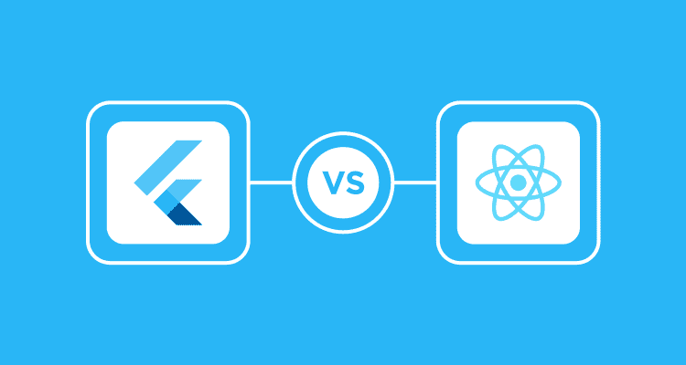
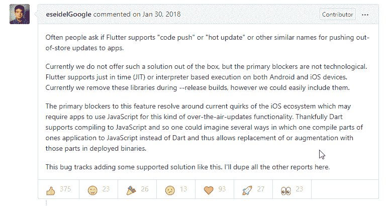
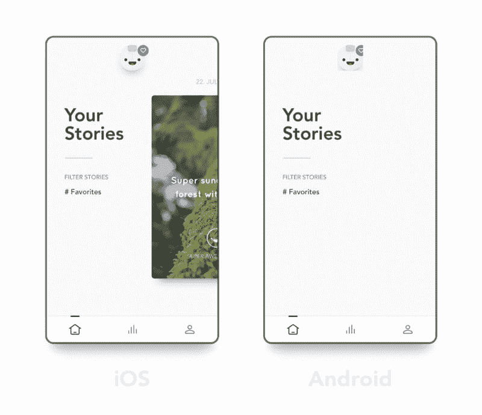

# 反应原生 v/s 颤动:以下是如何在辩论中不被压倒

> 原文:[https://dev . to/溶质实验室/react-native-v-s-flutter-here-s-how-not-to-get-overwritten-in-the-debate-1 lac](https://dev.to/solutelabs/react-native-v-s-flutter-here-s-how-not-to-get-overwhelmed-in-the-debate-1lac)

答案并不像向左或向右那么简单。但是，探索不同的方法牢记你的商业目标&产品目标，可以引导你做出正确的选择。

有时候，老实说，当我跟不上科技发展的步伐时，我会很生气。

作为一名管理 25 名产品开发人员团队的解决方案架构师兼首席执行官，有无数次这样的情况，当我们第二天早上回到办公室，看到一个更新，就像-

[T2】](https://res.cloudinary.com/practicaldev/image/fetch/s--8U0vc1tH--/c_limit%2Cf_auto%2Cfl_progressive%2Cq_66%2Cw_880/http://giphygifs.s3.amazonaws.com/media/TseBjMu53JgWc/giphy.gif)

也有这样的例子，当一个新的技术框架进入市场时，我们都很兴奋，因为它为我们、客户和最终用户解决了很多问题。

对于有抱负的企业家或产品所有者来说，在不同的可用框架和技术之间进行选择时不知所措并不罕见。此外，它可能会变得有压力，因为你不想犯一个代价高昂的错误。你想尽可能快地进入市场，同时控制你的开销。

最近，React Native 和 Flutter 迅速成为开发混合和跨平台移动应用程序的首选。如果你是一家初创公司的所有者、产品经理或开发人员，你可能已经成为会议室里永无休止的 React Native v/s 争论的一部分。

我看到人们无休止地陷入这场 v/s React Native tech 戏剧中，这正是为什么我想快速为萌芽和现有产品所有者写下这篇文章，并帮助他们仔细权衡这些选择。

仅仅知道利弊是不够的。每个产品都不一样，用户也不一样。在你的情况下可能是专家的东西在你朋友的情况下可能是骗子。

## **扑 v/s React Native——什么才是适合你的产品？**

<figure> 

<figcaption>来源:the droids sonroids</figcaption>

</figure>

原生狂热者总是会争辩说，除非应用是原生的，否则你无法在两个平台(iOS 和 Android)上获得最佳体验。然而，管理费用可能是一个杀手，招聘可能是困难的。此外，如果你是一家需要同时在这两个平台上接触更多受众的初创公司，那么跨平台应用是一个不错的选择。而且，它既省时又省钱。

那些熟悉 React for Web 开发的人可以走 RN 的路来开发跨平台的应用程序。对于那些讨厌 JavaScript 的人来说，你可能想在开始之前看一下 Flutter，因为它不会让你失望。

使用 RN 的最大缺点之一是当谷歌或苹果改变一些东西时，这些东西会破坏你的应用程序中的组件。然而，用 Flutter(因为你用的是它自己的渲染系统)，这种情况不会发生。

*那么，你如何选择？*

从在纸上写下你的应用想法开始。考虑它需要的功能，并对它们进行优先排序。列出所有的功能。现在，看看 RN 或 Flutter，看看他们是否得到了很好的支持。比较一下再做决定。如果这些都不支持将成为你的应用程序的主要部分的功能(就像成功/失败取决于它)，你可能需要走本地的路。

例如，假设你正在开发一款像优步一样的拼车应用。现在，背景位置跟踪是这类应用的重要组成部分。并且，在不使用该应用程序时，请考虑此功能。这类应用程序非常耗费资源和电力。这样一个用 RN 搭建的 app，会消耗大量电池，影响 CPU 周期。

虽然我知道这可能会使人们更加困惑，但这总比陷入混乱的代码要好。看看这个。如果你的应用程序中不止一小部分需要原生代码，那么你最好使用原生代码。

### 尽管如此，对于需要按钮、文本、列表、图片等简单控件的简单应用来说，RN 可能是一个很好的选择。对集成视频功能也有相当多的支持。

你可能会爱上 RN 的简单。但是坚持住。不要让它愚弄你。对于复杂的应用程序，你需要更多的时间来润色应用程序。你很容易忘记状态变化发生在哪里。对于这一点，我认为，你使用一个可信的架构，并坚持下去。当复杂性增加时，比如达到 60fps，你将不得不知道如何以及何时进行状态/UI 更新。精确度在这里非常重要。

优化可能需要时间。

浏览树中的组件，手动禁用不必要的重新渲染，或者在某些动画完成后延迟重新渲染。不要在这里使用 React-Router。对于本地需求来说，这是不可取的，因为它会使堆栈中所有以前的视图保持活动状态，从而引发问题。

与构建原生应用相比，RN 非常快速和高效。所以，当你不需要原生模块的时候，RN 应该是你的选择。

我不喜欢 RN 处理问题的方式。这是我的看法。你的可能不同。通常，如果我有问题，我会在网上查一下，然后去找一份可能有我问题答案的报告。这只会让我更加沮丧，因为线程因为不活动而被关闭。评论会很活跃，人们会要求重新打开它。这导致它作为一个新的问题打开。这场追逐继续下去，却意识到后来本土是唯一的出路。

JavaScript 的能效降低了 2 倍。重复我之前提出的观点，基于 RN 的应用程序消耗的电量将是其原生应用程序的两倍。此外，在 JS 层之下会有更多的开销。这是游戏或 Slack 等需要不断刷新的应用程序的问题，而不是只有当用户与之交互时才运行代码的应用程序的问题。在这里，你将不得不花时间测试和优化。

我并不是说在这种情况下你要完全避开注册护士。如果你有时间和资源投入，无论如何，注册护士可以很棒。例如，有[插件可用](https://github.com/transistorsoft/react-native-background-geolocation)来优化性能。你可能不得不购买许可证，但它非常值得。

[https://www.youtube.com/embed/aR6r8qV1TI8](https://www.youtube.com/embed/aR6r8qV1TI8)

延伸阅读-

> [比较原生 iOS (Swift)和 React-Native 的性能](https://medium.com/the-react-native-log/comparing-the-performance-between-native-ios-swift-and-react-native-7b5490d363e2)
> 
> [2017 年系统性红斑狼疮结果](https://sites.google.com/view/energy-efficiency-languages/results?source=post_page-----f6b10b8fed6d----------------------)

React Native 存在稳定性和性能问题，这可能很棘手。这些会浪费你的时间。另外，正如我所说的，在开始的时候，保持在更新的顶端是很烦人的。然而，如果你想以最快的方式进入市场，RN 是你最安全的选择。

这些会浪费你的时间。另外，正如我所说的，在开始的时候，保持在更新的顶端是很烦人的。然而，如果你想以最快的方式进入市场，RN 是你最安全的选择。

您可能面临的一些性能问题包括-

当有超过 100 个条目需要重新排序、添加或删除时，事情会变得非常耗费资源。渲染也可能受到影响。

使用 redux 更新状态时要格外小心。这里重新渲染可能会很昂贵。

Android 和 iOS 之间的动画行为可能会有所不同。

*-当控制台日志记录确保从生产中删除所有 JS 日志时。*

提到这些问题，你一定也知道 RN Fabric 正在开发中。这可以显著地解决大列表呈现问题。这种新的架构将极大地解决 RN v/s 的颤振困境。请参见本次演讲，了解更多信息。

[https://www.youtube.com/embed/UcqRXTriUVI](https://www.youtube.com/embed/UcqRXTriUVI)

代码推送可能是你们中一些人更喜欢 RN 而不是 Flutter 的原因。向你的用户实时推送 bug 修复是很神奇的。我们称之为“热更新”或“代码推送”,它允许开发人员应用补丁，而无需在应用商店发布过程中花费时间。 [Flutter 不支持“代码推送”](https://github.com/flutter/flutter/issues/14330#issuecomment-485565194)，该功能已被无限期推迟。

[T2】](https://res.cloudinary.com/practicaldev/image/fetch/s--JCyZs5gm--/c_limit%2Cf_auto%2Cfl_progressive%2Cq_auto%2Cw_880/https://miro.medium.com/max/770/1%2AcZIsws8nySQrZ8kTxIWofw.png)

然而，重要的是要注意，有些人可能会担心苹果拒绝一些具有“热代码推送”功能的应用程序。这类应用的问题在于，它们会通过无线方式更新本机代码。RN 不是这里的罪魁祸首。所以，那些认为苹果拒绝使用代码推送的应用的人可以放心，事实并非如此。**记住，原生代码推送是禁止的。**

*这是什么意思？*

开发人员逐字修改应用程序的 swift/objective C 内容。在获得苹果公司的批准后，这些应用程序将会有明显的不同。这应该可以解释禁令。

您可以使用 MS App Center 的代码推送功能。这是苹果允许的。然而，再次新手审查你的应用程序可以偶尔标记它。

对 JS 使用代码推送的主要限制是，你不应该通过 OTA(空中下载)对应用程序的功能进行实质性的更改。

社区让 RN 成为赢家。由于 RN 已经存在了一段时间，显然，与 Flutter 相比，它有更多的支持和现有的解决方案。

### **反过来的案例分析——从反动本土转向颤振**

当你开始成长时，注册护士会有严重的问题。这是 Reflectly 在 2017 年发生的事情。它是使用 React Native 构建的。该应用在 iOS 上发展，该团队希望将其应用到 Android 上。RN 是跨平台的吧？

<figure> 

<figcaption>来源:丹尼尔维斯特加德 via Medium</figcaption>

</figure>

这款应用在安卓系统上推出。发生了什么事？

用户体验很差。缺少滚动元素、阴影、缓慢的交互等等。该团队花了 6 个月的时间试图首先在 iOS 上构建，然后为 Android 修复应用程序。这似乎不是跨平台的，对吗？

### **2018 年初，团队决定一劳永逸地解决问题。**

### **问题——下一个平台/框架应该依靠什么？**

### **他们偶然发现了旋舞。**

### **几个实验和选择就清楚了。**

<figure> 

<figcaption>动画横跨 iOS 和 Android。来源:丹尼尔·维斯特加德通过媒体</figcaption>

</figure>

**从热重装到跨平台一致性，**reflectively 团队对 Flutter 印象深刻，决定冒险一试。他们决定将 50 万用户从 RN 转移到 Flutter。在 iOS 和 Android 上都设置绝对不痛不痒。

**学习曲线很小**因为 Dart 与其他编程语言紧密相关。我个人喜欢 Flutter 中的热重装。另外，工具是不可思议的。

然后是 **VSCode Integration** ，它为开发人员简化了很多事情。其性能不亚于原生。不用再处理奇怪的编译器黑客/分裂代码库。在 Android 前端，你可以轻而易举地为模拟器安装几个映像，并使用构建工具在它们之间进行切换。

鉴于最近的受欢迎程度，与 RN 的 [80K](https://github.com/facebook/react-native) 恒星相比，Flutter 已经有了 [73K 恒星](https://github.com/flutter/flutter)。我的预感是，它将在未来一年左右迅速超过 RN。因此，Flutter 移动开发将是必由之路。

点击这里阅读案例研究-

> [反射-从自然反应到颤振](https://medium.com/reflectly-engineering/reflectly-from-react-native-to-flutter-2e3dffced2ea)

当我让我的一个 React 本地开发者尝试一下 Flutter 时，他很困惑。尽管如此，他还是在一个周末尝试了一下，并被这种体验所震撼。一次热重装的尝试足以说服他在下一个项目中使用 Flutter。更不用说**组织的文档和来自社区的专业支持**。

您通过 Flutter beat React Native 实现的效率和性能。改变，保存&嘣！更新你的应用只需 0.5 秒。试试 RN，你会明白我在说什么。

Flutter 也有自己的问题，因为它仍处于成长阶段。

当人们说有了 Flutter，你仍然可以使用像 GPS 这样的原生功能，而不必在 Dart 之外编写代码时，我要说这仍然是有争议的。这里的问题与注册护士是一样的。你将不得不依靠一个社区插件。

例如，要集成后台地理定位功能，你可能需要使用一个昂贵的插件，如下所示。

[T2】](https://res.cloudinary.com/practicaldev/image/fetch/s--3SzmJE5M--/c_limit%2Cf_auto%2Cfl_progressive%2Cq_auto%2Cw_880/https://cdn-images-1.medium.com/max/800/1%2AfVMolCXEaX1GJew5ZWZCIg.png)

> [颤动背景地理定位](https://www.transistorsoft.com/shop/products/flutter-background-geolocation?source=post_page-----f6b10b8fed6d----------------------)

也有解决这个问题的开源解决方案。看看这些-

> [base flow it/flutter-地理定位器](https://github.com/BaseflowIT/flutter-geolocator?source=post_page-----f6b10b8fed6d----------------------)
> 
> [Lyokone/flutterlocation](https://github.com/Lyokone/flutterlocation?source=post_page-----f6b10b8fed6d----------------------)

**Flutter 不能直接与原生平台 API 交互。**这意味着对于高度定制的场景，您必须编写本地代码。

如果我要为 watchOS、tvOS、Android Auto 和 CarPlay 开发应用，我会避免使用 Flutter。原生是这些 app 的正确路线。

第三方库的可用性降低可能会让你感到沮丧。 Flutter 仍在发展，如果你正在寻找一个完全定制的解决方案，你可能会失望。据我所知，你应该可以找到 95%的基本特性的库。

从我所看到的和与我的社区中的人交流来看，他们倾向于选择 Flutter 而不是 RN，主要有四个原因。

*   令人印象深刻的表演图形。

*   UI 作为代码。这大大加快了这个过程，怎么强调都不为过。

*   谷歌的支持。

*   与 RN 相比，升级是轻而易举的事情。

很久以前，我写过一篇文章，关于为什么 Flutter 是你下一个产品创意的好选择。在这里阅读。

# **结束语**

我强烈建议你应该先了解你的目标受众和他们的需求。然后，盘点自己的资源。对于面向消费者的应用程序，如上图所示，混合方法可能并不合适，因为你必须获得正确的 UX，包括性能。

在这种情况下，许多人可能会建议走原路，但我认为你应该尝试迂回路线。查看您需要的功能，并查看社区中的支持。RN 在可扩展性和性能上得分很低。但是，当你想要一个具有最少、简单特性的快速 MVP 时，RN 可能是一个很好的选择。否则，尝试一下 Flutter。因为 native 会耗费你的时间和金钱。

当谈到 B2B 应用程序时，这些通常相对于美国是灵活的。我们的主要目标是完成任务。所以，混合动力可以是这里的路线。

*你对 React 原生开发和 [Flutter 应用开发](https://www.solutelabs.com/flutter-app-development-services)有什么体验？你从颤振转到别的了吗？React Native 是否实现了你的业务目标，还是你永远离开了它？请在下面的评论中分享你的经验，以帮助产品所有者。*