# 面向网络开发人员的 PhotoShop

> 原文:[https://dev . to/nabe NDU 82/Photoshop-for-web-developers-2-5429](https://dev.to/nabendu82/photoshop-for-web-developers-2-5429)

欢迎来到本系列的第 2 部分。

### 使用色相改变颜色

接下来我们将学习使用色调来改变物体的颜色。这是一个非常有用的技巧，可以在我们创建电子商务网站项目时使用。有时候我们会有不同颜色的 t 恤。这就要求我们让模特穿不同颜色的 t 恤，摆同样的姿势。但大多数时候用 photoshop 就能轻松搞定。

我将在这一部分使用红色 t 恤图片。

[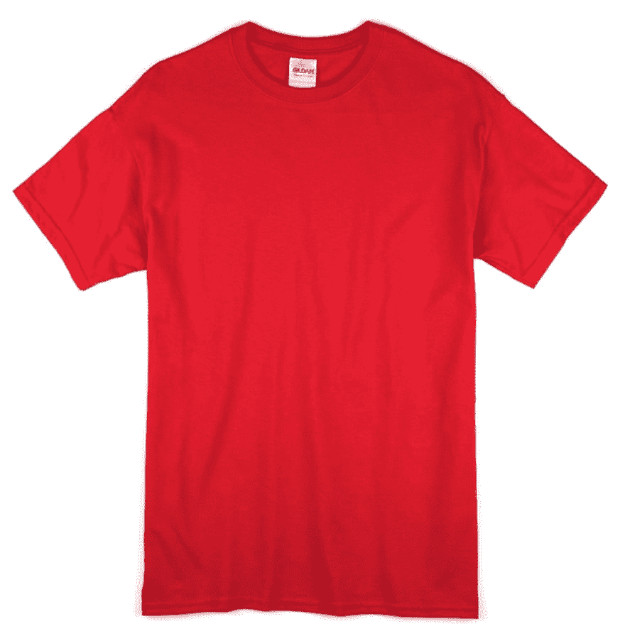 ](https://res.cloudinary.com/practicaldev/image/fetch/s--h4BWLzp0--/c_limit%2Cf_auto%2Cfl_progressive%2Cq_auto%2Cw_880/https://cdn-images-1.medium.com/max/2400/1%2ACLjMdAPPsMwcK9C_Fo4kLA.jpeg) *经典红色 t 恤*

现在，在 photoshop 中打开它。然后打开调整面板，将鼠标放在**色调/饱和度**上点击。

[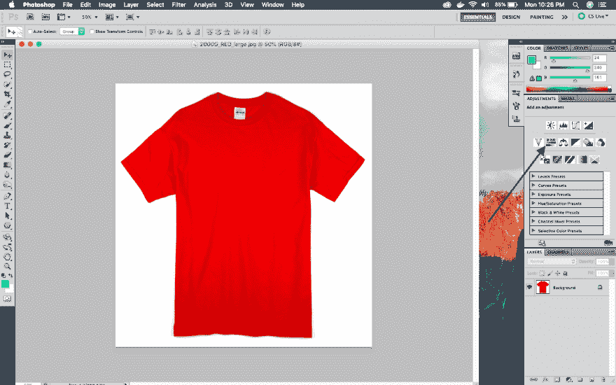 ](https://res.cloudinary.com/practicaldev/image/fetch/s--fKXFBV8J--/c_limit%2Cf_auto%2Cfl_progressive%2Cq_auto%2Cw_880/https://cdn-images-1.medium.com/max/2880/1%2AwS9PdjCdY0W80sEF00gszg.png) *色相/饱和度*

现在，拖动色调滑块就是魔法开始的地方。你也可以增加一点饱和度来增强颜色。但是滑动色调会改变颜色。

下面，我们创建一个橙色的 t 恤。

[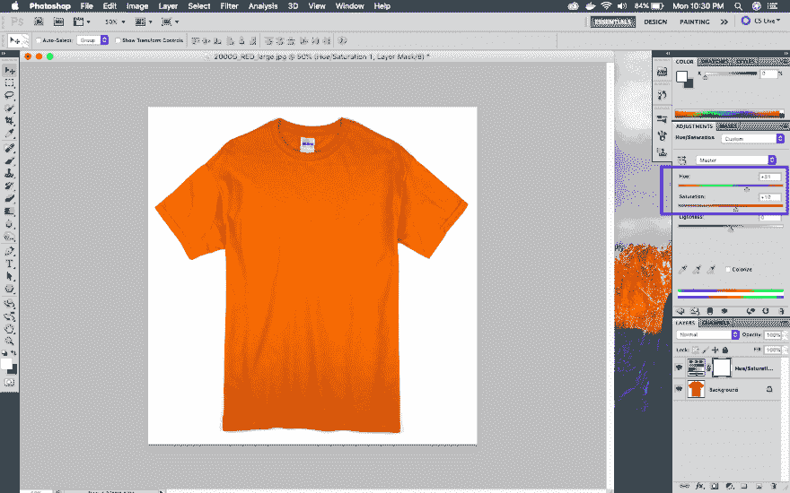 ](https://res.cloudinary.com/practicaldev/image/fetch/s--mI2bJXJE--/c_limit%2Cf_auto%2Cfl_progressive%2Cq_auto%2Cw_880/https://cdn-images-1.medium.com/max/2880/1%2AovGlxRxOzYjMYJFkMOxvHg.png) *橙色 t 恤*

接下来是绿色 t 恤。

[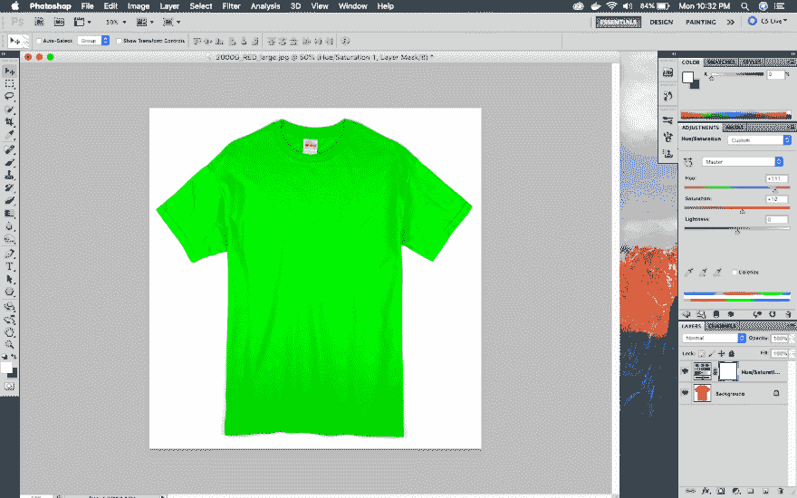 ](https://res.cloudinary.com/practicaldev/image/fetch/s--aOH3CO7U--/c_limit%2Cf_auto%2Cfl_progressive%2Cq_auto%2Cw_880/https://cdn-images-1.medium.com/max/2880/1%2AGPYkTsFUrfKoDNzzrfE5XA.png) *绿色 t 恤*

接下来是粉色 t 恤

[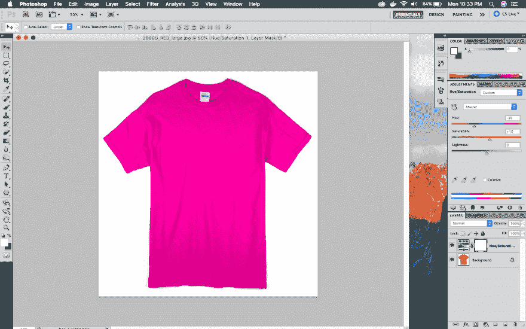 ](https://res.cloudinary.com/practicaldev/image/fetch/s--smfLWakl--/c_limit%2Cf_auto%2Cfl_progressive%2Cq_auto%2Cw_880/https://cdn-images-1.medium.com/max/2880/1%2Ae4j7m5ccBSy3_y-5ASx_EQ.png) *粉色 t 恤*

最后一件是蓝色 t 恤

[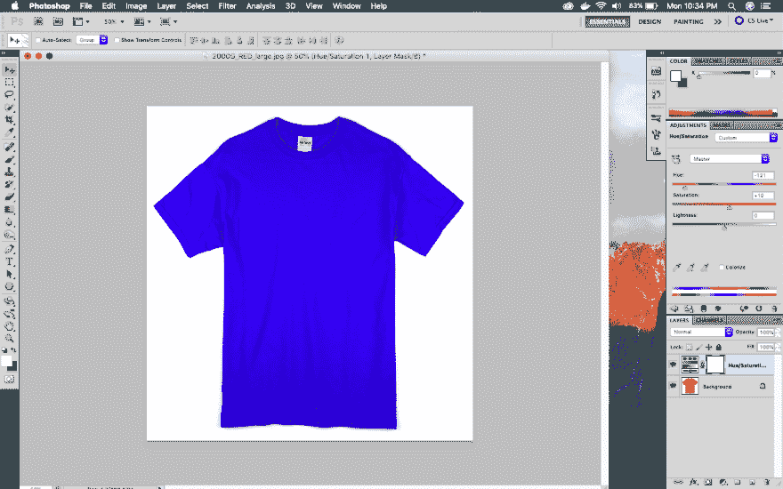 ](https://res.cloudinary.com/practicaldev/image/fetch/s--HzKWtL8b--/c_limit%2Cf_auto%2Cfl_progressive%2Cq_auto%2Cw_880/https://cdn-images-1.medium.com/max/2880/1%2A956w350IctJ-rKKmQkE-zA.png) *蓝色 t 恤*

### 使用色相只改变一种颜色

接下来我们将学习使用色调来改变图像中的一种颜色。有这样的情况，当一个图像有许多彩色的项目，但我们想改变一个项目的颜色。

考虑下图，我们有 3 种不同颜色的物品。

[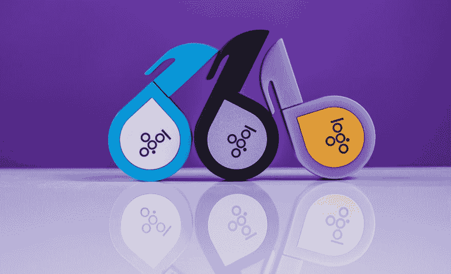 ](https://res.cloudinary.com/practicaldev/image/fetch/s--WOETaoEm--/c_limit%2Cf_auto%2Cfl_progressive%2Cq_auto%2Cw_880/https://cdn-images-1.medium.com/max/2400/1%2A5ea52frPrg2EN9pTK3M4fg.jpeg) *不同颜色物品*

现在，如果我们使用先前的技术，它将改变所有三个项目的颜色。让我们先检查一下。

[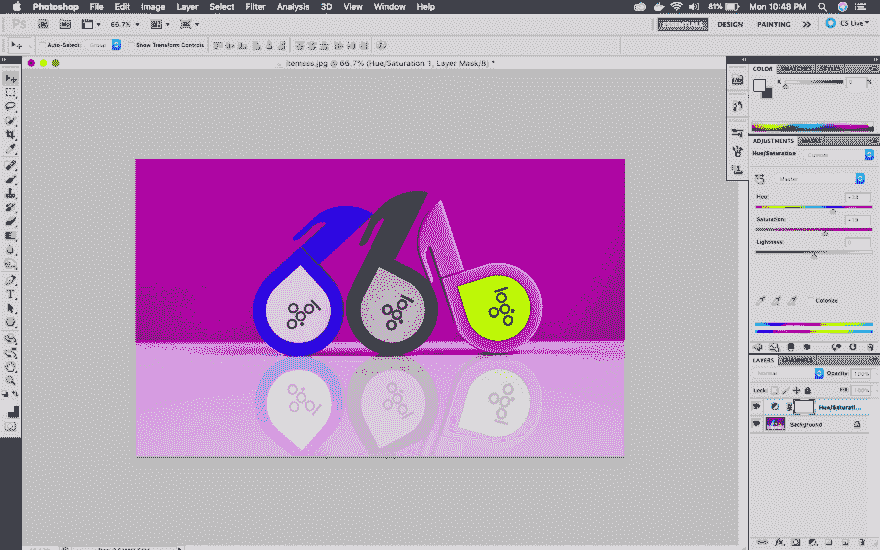 ](https://res.cloudinary.com/practicaldev/image/fetch/s--HC4ZBJw6--/c_limit%2Cf_auto%2Cfl_progressive%2Cq_auto%2Cw_880/https://cdn-images-1.medium.com/max/2880/1%2ACmSPgMTMkgfDjr5KgVTvzg.png) *改变所有颜色——不需要的*

我们只想改变最左边青色项目的颜色。为此，我们必须点击下面的下拉菜单，显示主。它将显示页面上所有可用的颜色。点击青色。

[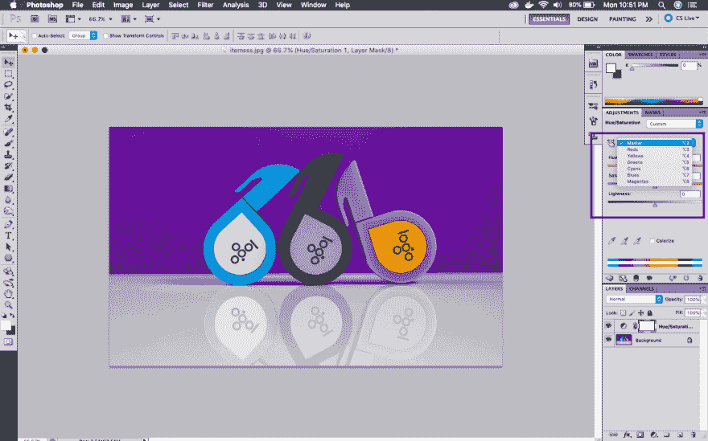 ](https://res.cloudinary.com/practicaldev/image/fetch/s--XmL4sZQU--/c_limit%2Cf_auto%2Cfl_progressive%2Cq_auto%2Cw_880/https://cdn-images-1.medium.com/max/2880/1%2AWbcKpsaBpzr7lyz43evb1A.png) *选择青色*

现在，滑动色调滑块，它将只改变青色项目的颜色。

[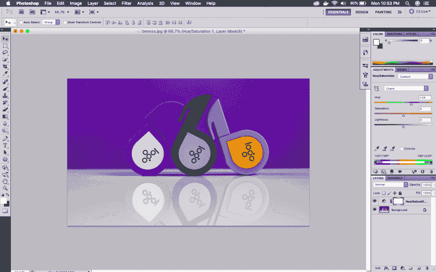 ](https://res.cloudinary.com/practicaldev/image/fetch/s--4uwlHlIQ--/c_limit%2Cf_auto%2Cfl_progressive%2Cq_auto%2Cw_880/https://cdn-images-1.medium.com/max/2880/1%2A2qTW9JGXA98Hsc7pQiLXaQ.png) *青色项变为蓝色*

下面我们把它改成粉色。

[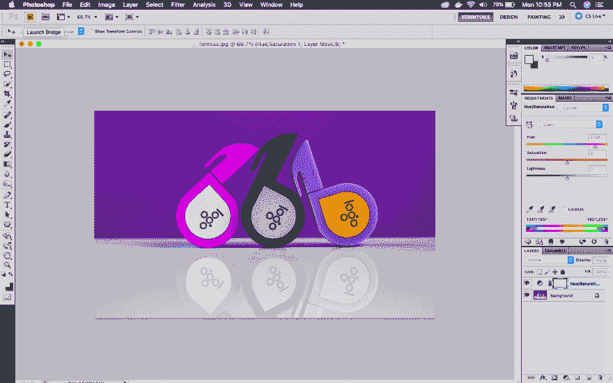 ](https://res.cloudinary.com/practicaldev/image/fetch/s--y8dutRPO--/c_limit%2Cf_auto%2Cfl_progressive%2Cq_auto%2Cw_880/https://cdn-images-1.medium.com/max/2880/1%2AFEEACvjRo5dAgPstfbGi0g.png) *青色项变为粉红色*

本系列的第 2 部分到此结束。