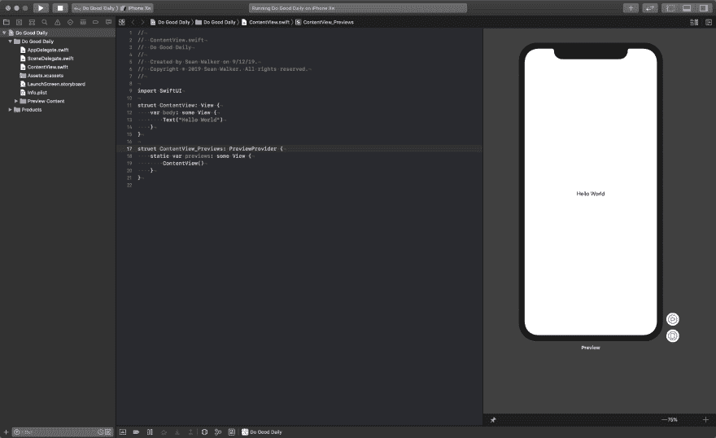

# 每天做好事第一天

> 原文：<https://dev.to/swlkr/do-good-daily-day-1-2g7k>

📅2019 年 9 月 12 日
🔥连续一天
📱每日行善
💰0.99 美元的价格
🤑0 美元收入
❌ 0 应用商店拒绝
📈0 销售额
📉0 张赞成票
⌚️花了 0 个小时
😄0 重写
🛬 0 登陆页面
💻12 个文件被更改，693 个插入(+)，0 个删除(-)
✅今天的目标:创建 swift UI 项目

## [T1】简介](#intro)

现在是月中，秋天就要来了。我不确定是这个夏天让我疯了，还是我只是默认自己疯了，但我将重拾去年(和今年早些时候)的荒谬计划，每个月制作一个新的应用程序，只是这次我制作的是真正的 ios 和 mac 应用程序，而不是网站。

这意味着有史以来最好的简历正在刷新:

~~远足🏔创建网站👨‍💻~~

对此

**午睡制作应用**

不，我是在开玩笑，尽管考虑到我现在的资历，这可能是准确的。

好了，就是这样:

🚢12 个月 12 个应用…因为世界需要更多的应用

## 九月的 App

现在这个问题已经解决了，让我们来看看本质，亲爱的读者们，9 月 30 日苹果应用商店会推出什么样的应用呢？

**做好日常**，就是这样。

好吧，这个非常简单，主要是因为我有 15 天左右的时间来完成它并放入应用程序商店，包括今天。

## 特性

*   设定一个早晨提醒时间，它会提醒你并问“今天我该做什么好事？”
*   设定一个晚间提醒时间，它会提醒你并问“我今天做了什么好事？”
*   一个大的文本字段，用于保存您当天是否完成了目标或“做了好事”的想法

这值 0.99 美元吗？我不知道。让我们找出答案。

## 启动你的 xcodes

那很容易。我要为今天的进步自我表扬一下。