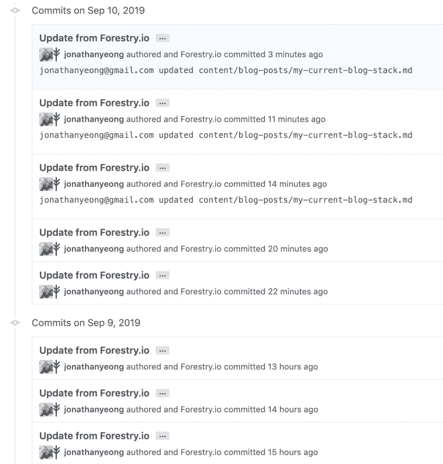

# 2019 博客刷新

> 原文:[https://dev.to/jonoyeong/2019-blog-refresh-2a20](https://dev.to/jonoyeong/2019-blog-refresh-2a20)

我喜欢不时刷新我的博客。部分是因为我想更新 UI，但主要是因为我忘记了我最初是如何构建它的。我已经完成了这周的复习，是时候写点东西了。从我以前的博客帖子来看，我已经很久没有在博客上做任何事情了。

对于未来的我和那些感兴趣的人来说，这里是我的博客和我一路上做的一些决定。

这个博客是一个运行在 Hugo 上的静态网站。我喜欢静态网站有几个原因:

*   它们的加载和构建速度都非常快。
*   写内容简单。降价写作是金。
*   可主题化。
*   你可以像对待其他 Github 项目一样对待它。
*   容易上手。

这是我的博客在 Github 上的位置。

接下来是[林业](https://forestry.io/)，即“提交的静态 CMS”。首先，林业是免费的，但你可以为更多的用户付费。林业通过连接到您在 Github 上的站点来工作。从那时起，你发表或编辑的任何帖子都会在你的 Github repo 上显示为提交。这是一个看起来像什么的例子:

<figure>

[T2】](https://res.cloudinary.com/practicaldev/image/fetch/s--gUKU58Ut--/c_limit%2Cf_auto%2Cfl_progressive%2Cq_auto%2Cw_880/https://thepracticaldev.s3.amazonaws.com/i/ryxaihnhth3m6f31t9iv.png)

<figcaption>Yes the commit history is ugly. Am I going to write an angry letter to Forestry, probably not.</figcaption>

</figure>

林业也有一个很好的文本编辑器，支持所见即所得和降价。你也可以添加“片段”,这就是你如何在你的帖子中获得 [Hugo shortcodes](https://gohugo.io/content-management/shortcodes/) 。林业背后的真正力量是它的可定制性。它可以钩到前面的问题模板，这意味着你可以设置任何类型的职位。如果你想发布一个网页，而不是一篇博客，林业可以为你做到这一点。如果您想加载配置并在 CMS 中编辑它们，Forestry 也可以为您完成。一个小烦恼是，我希望它在我写博客的时候自动保存。但总的来说我是个超级粉丝。

我使用了一个林业入门模板来快速入门。这次我不想玩用户界面了。尝试构建一个自定义主题是最耗时的部分。以我的设计技巧，这很不值得。最后我用了 [Brevifolia 雨果主题](https://github.com/emilkovacs/brevifolia-hugo-forestry)。

最后，为了服务我的站点，我使用了 [Netlify](https://www.netlify.com/) 。也是免费的！这是另一个连接到博客 Github repo 的应用程序。它跟踪任何提交到主服务器上的提交。当提交被推送时，它将运行一个部署脚本来构建和发布站点。它是帮助您构建和部署静态站点的一个很好的工具。它有一吨的功能，如 A/B 测试，简单的 HTTPS 支持，分析(付费)。根据这篇[博客文章](https://www.netlify.com/blog/2017/03/28/why-you-dont-need-cloudflare-with-netlify/)，Netlify 应该也有一个相当强大的 CDN。所以我知道我的网站可以处理负载，如果它曾经达到这一点。

就是这样！在基础设施方面，拥有一个静态站点让我的生活变得简单了。这种堆栈的优势在于:

*   唯一的成本是支付域名。其他都是免费的！
*   网站加载速度非常快。
*   跟着别人的主题走让我放下了思想负担。虽然我做了一些定制，但该网站开箱后看起来不错。
*   这整个堆栈都是关于设置和遗忘的(直到我需要再次刷新)。

去我的博客看看成品:[https://www.jonathanyeong.com/](https://www.jonathanyeong.com/)。