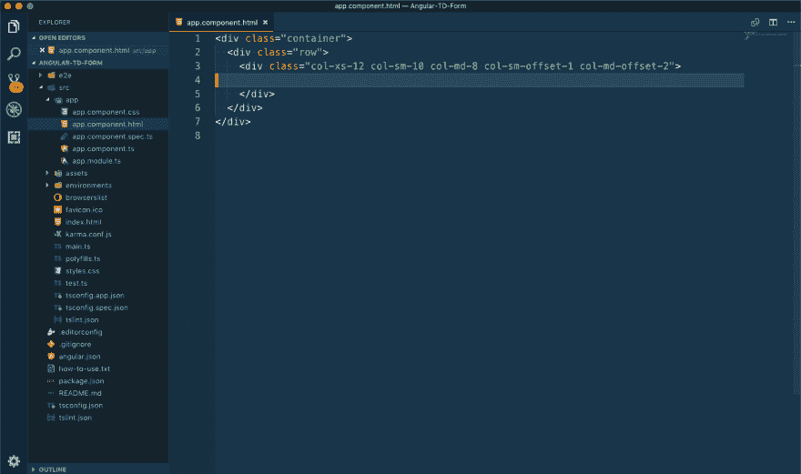
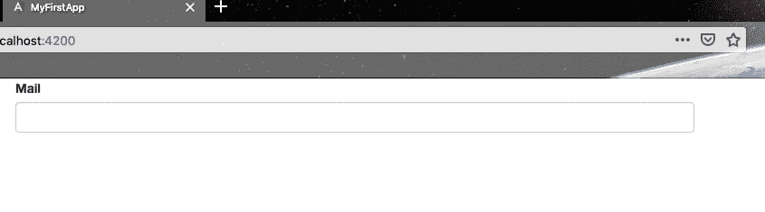
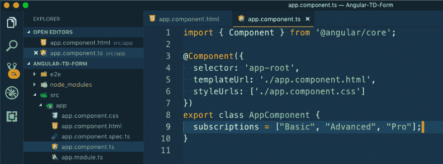
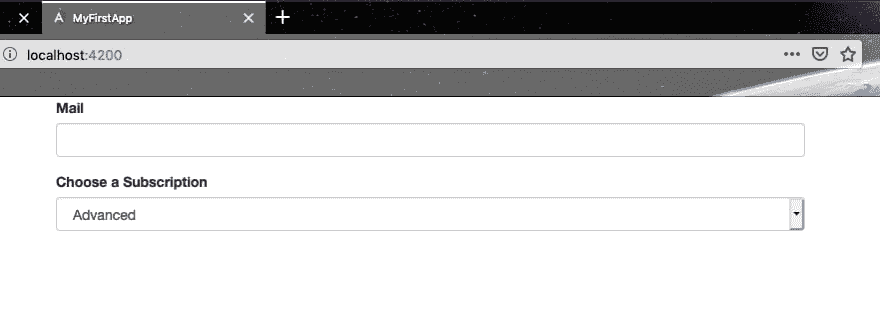
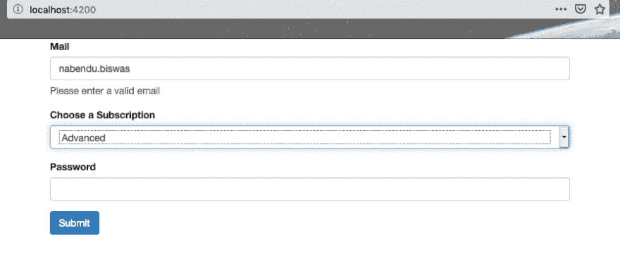
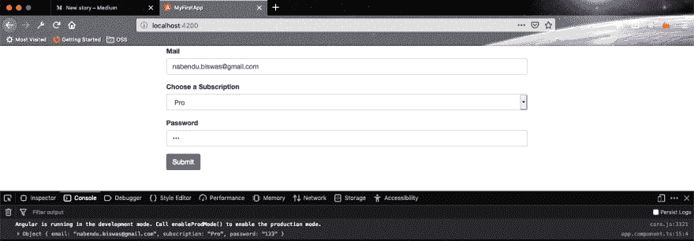

# 简单角度形式-模板驱动

> 原文:[https://dev . to/nabe NDU 82/simple-angular-form-template-driven-gjg](https://dev.to/nabendu82/simple-angular-form-template-driven-gjg)

在 React 工作了一段时间后，我最近搬到 Angular 工作。与 React 不同，我们通常使用像 Redux Forms 这样的第三方表单组件，angular 拥有开箱即用的所有东西。它有两种形式——模板驱动和反应式。我们将在这里创建一个简单的模板驱动。

我们需要建立一个具有以下说明的表单。

*添加一个具有以下输入(和验证器)的表单
1)邮件地址(不应为空，应为电子邮件地址)
2)下拉菜单，允许用户从三个不同的订阅中进行选择(“基本”、“高级”、“专业”)
将“高级”设置为默认
3)密码字段(不应为空)
4)提交按钮
如果表单无效并被触摸，将显示警告消息。如果输入无效，在每个输入下面显示一条警告消息。
提交表单后，您应该简单地将表单的值打印到控制台。*

我们有一个基本的 Angular 6 项目作为我们的起点。

[ ](https://res.cloudinary.com/practicaldev/image/fetch/s--HyqDwVaa--/c_limit%2Cf_auto%2Cfl_progressive%2Cq_auto%2Cw_880/https://cdn-images-1.medium.com/max/2880/1%2AO4Nnh7bat_vdg1A48-dT0w.png) *基本设置*

让我们从创建电子邮件字段开始。注意，我们在项目中使用了 bootstrap，所以使用了 form-group 和其他 bootstrap 样式。

```
 <form>
         <div class="form-group">
            <label for="email">Mail</label>
            <input type="email" id="email">
         </div>
    </form> 
```

这是一个普通的 HTML 电子邮件字段。为了将它注册为 Angular 表单中的控件，我们将向它添加 ngModel。我们还需要给它起一个名字。所以，我们的表单现在变成如下图。

```
 <form>
        <div class="form-group">
            <label for="email">Mail</label>
            <input 
                type="email" 
                id="email" 
                ngModel 
                name="email">
        </div>
    </form> 
```

我们还应该有验证器。因此，我们将添加所需的 HTML 验证器和 Angular 验证器电子邮件。还将添加一个引导类 form-control，使它看起来更好。

```
 <form>
        <div class="form-group">
            <label for="email">Mail</label>
            <input 
                type="email" 
                id="email" 
                ngModel 
                name="email"
                required
                email
                class="form-control">
        </div>
    </form> 
```

现在，随着我们的 **ng serve** 运行，我们的形式看起来像现在这样。

[ ](https://res.cloudinary.com/practicaldev/image/fetch/s--r4zTyGWp--/c_limit%2Cf_auto%2Cfl_progressive%2Cq_auto%2Cw_880/https://cdn-images-1.medium.com/max/2000/1%2Auk1w7ZHDe1bPq39Zufk55w.png) *基本布局*

我们现在将进入下一个任务，创建一个下拉菜单。首先让我们用上面学到的 angular 来写基本代码。

```
 <div class="form-group">
      <label for="subscription">Choose a Subscription</label>
      <select name="subscription" id="subscription" ngModel class="form-control"></select>
    </div> 
```

我们现在需要添加选项，我们可以硬编码，但有一个替代方案。我们将转到我们的 ts 文件并创建一个订阅阵列。

[ ](https://res.cloudinary.com/practicaldev/image/fetch/s--hk8GFI2M--/c_limit%2Cf_auto%2Cfl_progressive%2Cq_auto%2Cw_880/https://cdn-images-1.medium.com/max/2000/1%2AHjRTIzaQYsgbkG8QuFvHOw.png) *订阅阵*

现在，我们将在 html 中使用 ngFor 来遍历三个选项的数组。然后，我们将通过属性绑定将值绑定到当前迭代。并输出给用户看。

```
 <div class="form-group">
      <label for="subscription">Choose a Subscription</label>
      <select name="subscription" id="subscription" ngModel class="form-control">
    **    <option
            *ngFor="let subscription of subscriptions"
            [value]="subscription">{{subscription}}</option>**
    </select>
    </div> 
```

按照说明，我们还需要为下拉列表设置一个默认值。我们将在 ts 文件中再次这样做。

```
 export class AppComponent {
      subscriptions = ["Basic", "Advanced", "Pro"];
      selectedSubscription = "Advanced";
    } 
```

现在，为了显示它，我们必须在 select 中使用 ngModel 上的属性绑定来指向默认值。我们完成的 select 代码如下所示。

```
 <div class="form-group">
        <label for="subscription">Choose a Subscription</label>
        <select
            name="subscription"
            id="subscription"
            **[ngModel]="selectedSubscription"**
            class="form-control">
                <option
                  *ngFor="let subscription of subscriptions"
                  [value]="subscription">{{subscription}}</option>
        </select>
    </div> 
```

我们的表单现在包含了带有默认值的下拉列表。

[ ](https://res.cloudinary.com/practicaldev/image/fetch/s--A9cOSBCD--/c_limit%2Cf_auto%2Cfl_progressive%2Cq_auto%2Cw_880/https://cdn-images-1.medium.com/max/2000/1%2ASEjWonpmwj9Nk-TiOjil6A.png) *表单带默认值*

现在，让我们快速添加密码和按钮字段。

```
 <div class="form-group">
        <label for="password">Password</label>
        <input
            type="password"
            id="password"
            ngModel
            name="password"
            class="form-control">
    </div>
    <button class="btn btn-primary" type="submit">Submit</button> 
```

现在，我们将添加警告消息。我们会在 email 下面加一条消息，只有在 mail 输入无效被触碰的情况下才会看到。帮助块只是一个引导程序。

```
 <span class="help-block">Please enter a valid email</span> 
```

然后，我们将添加一个本地引用#email，并将其绑定到 ngModel 以访问该控件。然后会添加*ngIf 来显示消息，当电子邮件无效和感动。我们完整的电子邮件代码如下所示。

```
 <div class="form-group">
        <label for="email">Mail</label>
        <input
            type="email"
            id="email"
            ngModel
            name="email"
            required
            email
            class="form-control"
            #email="ngModel">
        <span
            class="help-block"
            *ngIf="!email.valid && email.touched">Please enter a valid email</span>
    </div> 
```

它显示了给一个无效的电子邮件的信息。

[ ](https://res.cloudinary.com/practicaldev/image/fetch/s--l50H8agY--/c_limit%2Cf_auto%2Cfl_progressive%2Cq_auto%2Cw_880/https://cdn-images-1.medium.com/max/2000/1%2AMfIvBDIvPSlx-LbbiChz2w.png) *无效邮件*

我们现在还将向密码字段添加类似的代码。

```
 <div class="form-group">
        <label for="password">Password</label>
        <input
          type="password"
          id="password"
          name="password"
          ngModel
          required
          class="form-control"
          #password="ngModel">
        <span
          class="help-block"
          *ngIf="!password.valid && password.touched">Please enter a password</span>
    </div> 
```

现在，让我们给整个表单添加验证。为此，我们必须将本地引用添加到表单

```
 <form #signupForm="ngForm"> 
```

然后在按钮
上方显示一条消息

```
 <p *ngIf="!signupForm.valid && signupForm.touched">The form is invalid!</p>
    <button class="btn btn-primary" type="submit">Submit</button> 
```

现在，我们将添加提交表单时显示消息的逻辑。我们将在提交时添加一个点击处理程序。

```
 <form #signupForm="ngForm" (ngSubmit)="onSubmit()"> 
```

现在，我们将转到 ts 文件来实现这个方法。要访问表单元素，我们必须使用 ViewChild。然后在控制台中显示它。我们完整的 ts 文件如下。

```
 import { Component, **ViewChild** } from '[@angular/core](http://twitter.com/angular/core)';
    import { NgForm } from '[@angular/forms](http://twitter.com/angular/forms)';

    [@Component](http://twitter.com/Component)({
      selector: 'app-root',
      templateUrl: './app.component.html',
      styleUrls: ['./app.component.css']
    })
    export class AppComponent {
      subscriptions = ["Basic", "Advanced", "Pro"];
      selectedSubscription = "Advanced";
      [@ViewChild](http://twitter.com/ViewChild)('signupForm') sgForm: NgForm;

    onSubmit() {
        console.log(this.sgForm.value);
      }
    } 
```

现在，我们的表格完成了，我们满足了所有的标准。是时候测试表单并单击 submit 按钮了。

[ ](https://res.cloudinary.com/practicaldev/image/fetch/s--VWrRpkaY--/c_limit%2Cf_auto%2Cfl_progressive%2Cq_auto%2Cw_880/https://cdn-images-1.medium.com/max/2880/1%2A5cSwfh_MZO_vgU0LnHoBqw.png) *最终产品*

相同的完整代码可以在[这里](https://github.com/nabendu82/TD-Angular-ex)找到。

希望你喜欢用 Angular 创建模板驱动的表单。