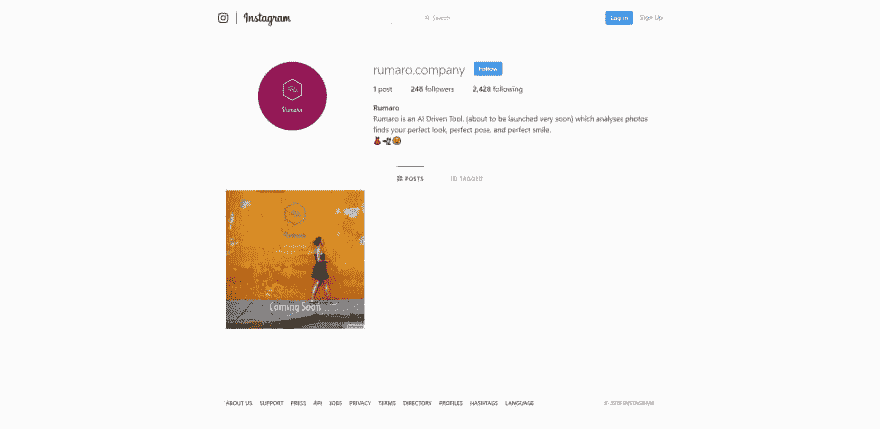
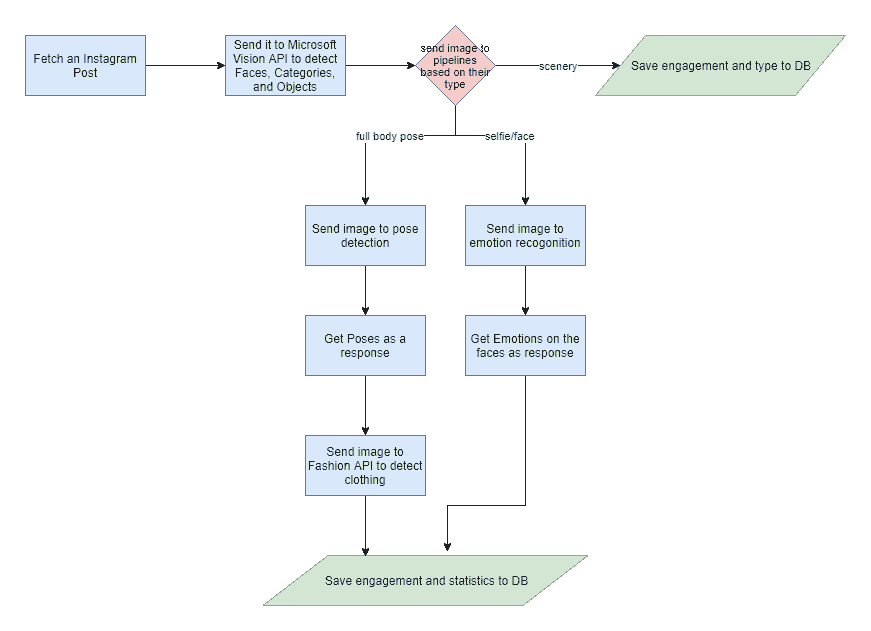
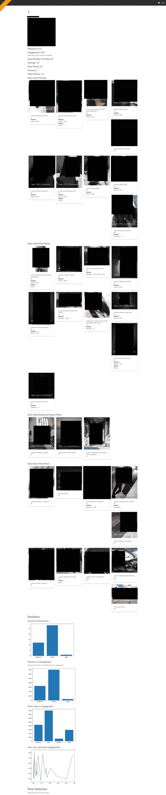
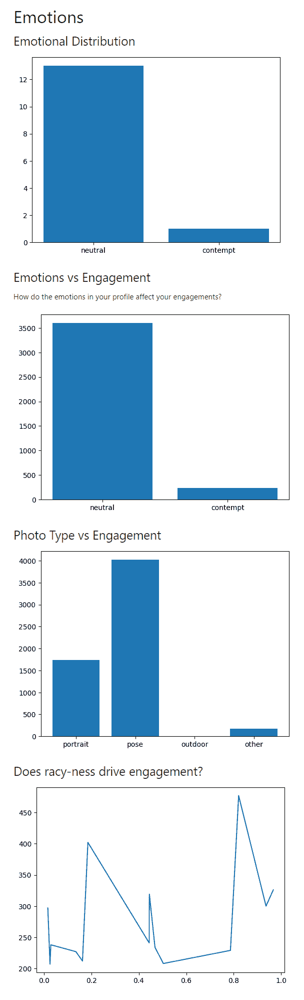

# 我建立了一个人工智能来识别 Instagram - Rumaro 上图像中的情绪、服装、身体姿势和活动

> 原文:[https://dev . to/rohan sawant/failed-ru maro-an-ai-to-recognize-emotions-apparel-body-pose-and-activity-in-images-on-insta gram-10k 5](https://dev.to/rohansawant/failed-rumaro-an-ai-to-recognize-emotions-apparel-body-pose-and-activity-in-images-on-instagram-1ok5)

## 【ru maro-AI】识别图像中的情绪、服装、身体姿势和活动 

[T2】](https://res.cloudinary.com/practicaldev/image/fetch/s--VYV-o5gP--/c_limit%2Cf_auto%2Cfl_progressive%2Cq_auto%2Cw_880/https://raw.githubusercontent.com/CT83/Rumaro/mastimg/rumaro-insta.png)

Rumaro 使用人工智能来识别图像中的情绪、服装、身体姿势和活动，并测量它们如何影响观众的参与度。即。喜欢和评论。

### 在 [Github](https://github.com/CT83/Rumaro) 上查看一下。

> 这开始是我的一个周末兼职，最初是作为一个付费的 SAAS 推出的。但是，在进一步研究隐私问题、Instagrams 限制性 API 和初步测试的混合结果后，我决定放弃这个想法，直接开源。

## 设置

1.  设置 MS 认知服务 API 密钥、DeepFashion 和 Instagram 凭据
2.  安装依赖项`pip install -r requirements.txt`
3.  运行实际分析`python run_rumaro.py --instagram_id <INSTA_ID>`

棘手的部分来了，现在拿起你的调试护目镜，开始挖掘`data_groomer`对象的各种属性，寻找有用的东西。我现在正迫不及待地想给它添加图形和 UI
。

### 这个为什么？

> 和 Rumaro 一起，我试着找出*到底是什么*让照片变得特别！🦄

我假设-用户喜欢的照片，即更令人满意的照片可以使用 AI
模型来识别，并且使得它们特别的关键*特征*可以因此被识别。

我认为使用深度学习可以很容易地识别活泼、身体姿势和
服装，这些将是推动
社交媒体参与的*唯一的*特征。

### 该如何？

##### 概述

[T2】](https://res.cloudinary.com/practicaldev/image/fetch/s--cUkwjxlE--/c_limit%2Cf_auto%2Cfl_progressive%2Cq_auto%2Cw_880/https://raw.githubusercontent.com/CT83/Rumaro/mastimg/block_db.png)

用户的所有 Instagram 帖子都会被下载下来进行分析，然后这些帖子会被发送到几个深度学习模型
以从中产生洞察力，了解它们的特殊之处。

##### 步骤

[T2】](https://res.cloudinary.com/practicaldev/image/fetch/s--7LHDIXlL--/c_limit%2Cf_auto%2Cfl_progressive%2Cq_auto%2Cw_880/https://raw.githubusercontent.com/CT83/Rumaro/mastimg/algo_dg.png)

1.  获取 Instagram 帖子并存储图片的公共 URL
2.  它被发送到 Microsoft Vision API 以被分类为风景/其他图像、全身/姿势图像或肖像或自拍。
3.  如果图像是风景，则不发送它进行任何进一步的分析
4.  身体姿势图像被发送到 OpenCV 上运行的姿势检测模型，然后发送到 Algorithmia 的 DeepFashion API 进行服装检测。
5.  这些肖像或自拍帖子被发送到微软的情感 API。
6.  所有的见解然后被存储到数据库中，用户被重定向到支付页面
7.  向用户展示对其个人资料的精选分析。

> 是啊！我甚至创建了一个 Instagram 页面，试图找到一个目标受众——有影响力的人，他们真的愿意付费使用这个产品

### 远景

我们的愿景是创建一个大规模的 SAAS 公司，向查看个人资料的人收取 10 美元。我想象着有可能由此创造出一个可持续发展的企业。

我有一个愿景，即所产生的见解将非常有用，它将允许用户显著增加他们的社交媒体档案
,我想象深度学习模型将超级准确，并将预测真实人类感知的一切。

#### 我实际上领先了多远？

*   我成功地用 MaterializeCSS 创建了一个外观不错的前端，后端是 Flask。
*   我设法创建了项目的核心人工智能组件——与所有的 API 对话，深度学习部分
*   我设法创建添加认证和数据库。

我认为发布整个代码库的精简版是有意义的，没有 Web 框架代码和 Flask 包。

##### 截图

[T2】](https://res.cloudinary.com/practicaldev/image/fetch/s--Ophh25AF--/c_limit%2Cf_auto%2Cfl_progressive%2Cq_auto%2Cw_880/https://raw.githubusercontent.com/CT83/Rumaro/mastimg/full_ui.png)

> 分析随机 Instagram 账户后生成的报告。是的，我必须审查所有的图片，是的，这有点违背了截图的目的🤷🏽‍♂️

[T2】](https://res.cloudinary.com/practicaldev/image/fetch/s--dQ-3HcPp--/c_limit%2Cf_auto%2Cfl_progressive%2Cq_auto%2Cw_880/https://raw.githubusercontent.com/CT83/Rumaro/mastimg/graphs.png)

> 分析随机 Instagram 个人资料后生成的统计数据

### ⚓跳下沉船...

不幸的是，当我推进项目时，我发现不同特性
和参与度之间的相关性非常弱。此外，这个项目有噩梦般的隐私问题，这使得它极难赚钱和营销。

回想起来，这个计划显然从一开始就有一点缺陷。
🤷🏽‍♂️

Ehh...我确实尝试了很多深度学习 API，所以一切都很好。

### 伸手给我！

如果你有兴趣自己制作类似的东西，或者想要帮助制作和运行它，或者如果你是
*计划把它拍成电影！！！*在`rohansawantct83@gmail.com`在 Google Hangouts 上联系我