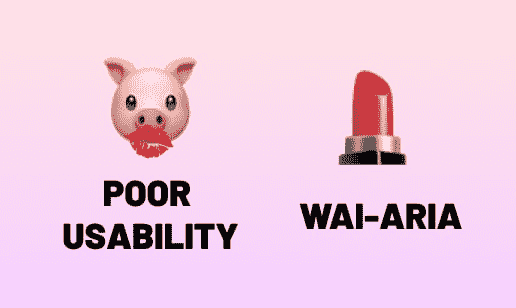

# 什么是 WAI-ARIA？(WAI-ARIA 介绍第一部分)

> 原文:[https://dev . to/kayla/what-is-wai-aria-introduction-to-wai-aria-part-1-3303](https://dev.to/kayla/what-is-wai-aria-introduction-to-wai-aria-part-1-3303)

##### [](#waiaria-stands-for-web-accessibility-initiative-accessible-rich-internet-applications-what-a-mouthful-waiaria-is-a-technical-specification-written-by-the-world-wide-web-consortium-w3c-that-specifies-how-to-improve-the-accessibility-of-a-website-or-web-application-with-supplemental-html-attributes-it-helps-us-add-more-context-to-ui-elements-that-browsers-and-assistive-technologies-can-use-to-assist-the-user-in-understanding-the-content-of-a-site-or-application-over-the-coming-posts-well-discuss-waiaria-a-little-more-in-depth)WAI-ARIA 代表网络无障碍倡议——无障碍丰富互联网应用...多拗口啊！WAI-ARIA 是由万维网联盟(W3C)编写的技术规范，它指定了如何通过补充 HTML 属性来提高网站或 Web 应用程序的可访问性。它帮助我们向 UI 元素添加更多的上下文，浏览器和辅助技术可以使用这些上下文来帮助用户理解站点或应用程序的内容。在接下来的文章中，我们会更深入地讨论 WAI-ARIA。

# 语义 HTML 的补充

语义 HTML 是为其内容提供上下文的标记。关于语义 HTML 的更多信息，请查看我的文章“语义 HTML 的重要性”WAI-ARIA 绝不是要取代语义 HTML。就其本身而言，语义 HTML 和一般良好的可用性实践在可访问性方面可以提供很多。有时候，我们可以做得更多，为辅助技术的用户提供更好的上下文。这就是 WAI-ARIA 的用武之地。它有助于填补语义 HTML 留下的空白。

让我重申一下: **WAI-ARIA 不是语义 HTML** 的替代品。它也不是**对可用性差或易访问性实践的快速解决方案**。你不能把 WAI-ARIA 放到一个不可用的应用程序中，然后期望它变得更可用...哪怕是“WCAG 兼容！”有点像给猪涂口红。我推荐阅读 T4 的文章，Jared Smith 的“可用性猪上的可访问性口红”。

# [规格中的](#in-the-spec)

WAI-ARIA 规范谈到了三个主要特性:角色、状态和属性。角色告诉浏览器和辅助技术元素是什么或者它做什么。状态定义了元素的当前状态，并且可以在应用程序的整个生命周期中改变。属性赋予 UI 元素额外的含义或语义。我们将在本系列中更详细地讨论每一个问题。

##### 我很期待这个系列的上线！如果你想让我写一个关于 WAI-ARIA 的特定话题，请在评论中告诉我！

[未画](https://undraw.co)的标题插图。