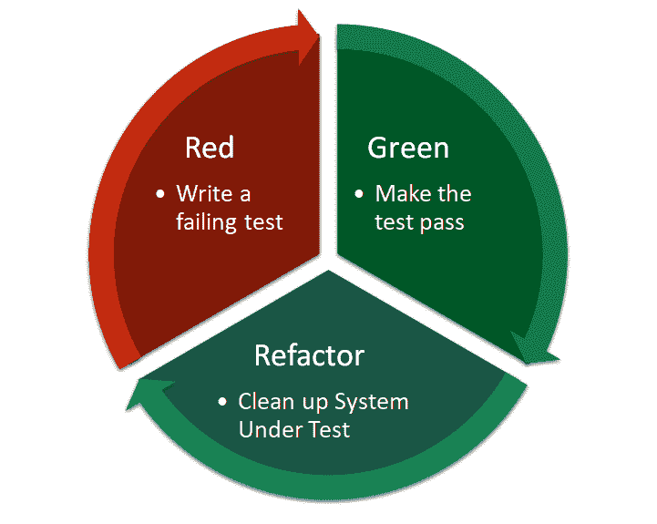

# 确认偏差:你的大脑想如何破坏你的代码

> 原文:[https://dev . to/tech elevator/confirmation-bias-how-your-brain-want-wreck-your-code-337h](https://dev.to/techelevator/confirmation-bias-how-your-brain-wants-to-wreck-your-code-337h)

我们不擅长测试自己的代码。我们在这方面做得太差了，以至于它导致了像质量保证分析师和测试工程师这样的整个职业。我们不一定不擅长编码，但是我们出了名的不擅长发现自己的错误。

这是为什么呢？你如何把一些最聪明的人带出去，找到一些最明显的遗漏和缺陷？

# 确认偏差

答案在于确认偏差:

> 确认偏见是一种倾向，即以肯定一个人先前的信念或假设的方式来搜索、解释、偏爱和回忆信息。
> 
> *   [维基百科](https://en.wikipedia.org/wiki/Confirmation_bias)

本质上，当我们开发特性时，我们在评估我们的代码是否有效。我们运行我们的应用程序，以确保它满足我们能想到的每一个规定的和每一个没有规定的需求。当所有的框都被检查时，我们把代码交给 QA，他们告诉我们所有我们错过的东西。

这是因为我们偏向于确认我们的代码像我们期望的那样工作。我们用一组有限的步骤进行测试，每次都重复这些步骤，直到我们的代码适用于该工作流，然后我们对该功能进行一些粗略的测试，并转移到它的下一个方面或下一个功能。我们很少停下来质疑我们对测试数据、环境设置甚至业务规则的边缘案例的核心假设。

这并不是说我们不好，而是我们太专注于以最好的方式(最快、最干净、最简单、最安全、最有趣等)实现新功能的技术杂草。)很可能我们没有考虑功能的实际森林或它在更大的产品供应中的完整上下文。

# 测试驱动开发呢？

但是[测试驱动开发(TDD)](https://en.wikipedia.org/wiki/Test-driven_development) 呢？这应该是为了提高质量和防止错误，对不对？这不应该是解决办法吗？毕竟，在 TDD 中，您首先编写测试，然后编写应用程序来通过这些测试。通过把需求放在前面，这不是绕过了确认偏差吗？

[T2】](https://res.cloudinary.com/practicaldev/image/fetch/s--8SUJwTz2--/c_limit%2Cf_auto%2Cfl_progressive%2Cq_auto%2Cw_880/https://thepracticaldev.s3.amazonaws.com/i/1zk768buijur06qxi8e3.png)

当然，TDD 确实提高了质量，并且降低了软件以同样方式崩溃两次的几率，但是它没有解决确认偏差的核心问题。问题是，由于各种各样的因素，我们事先并不知道所有的需求。

也许你在看到一个工作原型之前没有意识到一些需求，或者可能你在一个敏捷的环境中，时间太紧，不能为进入 sprint 的所有事情写一套全面的需求。不管是什么原因，你很少有一套完整的需求来保护你的代码免受任何潜在的 bug。

公平地说，这肯定比编写代码并验证它看起来能工作要好得多，但我们仍然支持代码匹配一系列需求，无论是通过单元测试还是手动测试软件。

# 求解确认偏差

那么，如果专业开发人员如此不善于发现他们自己代码的问题，为什么质量保证专业人员在发现 bug 方面要好得多呢？部分原因是因为他们的专业技能和训练，以及他们的经验，但我认为还有更深的原因。

就像确认偏差使得开发人员倾向于确认他们的代码是有效的一样，测试人员经常会有确认偏差，即错误隐藏在系统的深处，所以他们会挖掘，直到发现尽可能多的错误。

想想看:如果你是一名开发人员，并且渴望看到你的辛勤工作是否得到了回报，并转移到下一个任务以保持项目如期进行，那么你将拥有一种完全不同的测试方法，而不是一个将代码视为寻找等待破坏用户一天的 bug 的测试人员。测试人员以发现每一个错误、边缘情况、可用性问题或缺失的验证规则为荣，这是一件非常好的事情。

# 我不是测试员怎么办？

好吧，所以理解软件开发的有动机和有才华的质量保证专业人员是确认偏差的很大一部分答案，但是如果你没有测试人员或者雇不起呢？在将代码交给测试人员或交付生产之前，您能做些什么来消除 bug 呢？

我有一些想法可以帮助开发人员表现得更像高技能的测试人员:

### 一边验证代码一边骗你的大脑

当你完成一系列的改变时，你需要向你的大脑发出信号，表明你正在从一个全新的、不同的角度看待事物。尽一切努力让你的大脑看起来不一样——搬到你家或办公室的不同位置，改变照明或装饰，戴上一顶字面上的帽子，站着而不是坐着——尽可能多地发出信号，表明这不是照常工作，然后检查你正在提交的更改后的代码，期望找到 bug。没找到吗？很好，启动你的应用程序，尽你所能给它随机输入。真的试着打破它。

### 测试最让你害怕的东西

当您进行更改时，可能会有一些事情突然出现在您的脑海中，让您担心您正在更改的代码区域。一些挥之不去的恐惧或不确定性——可能会打破一些你不理解的东西。停下来研究一下，直到你的焦虑减轻。尽管我们的大脑试图欺骗我们，但它们也非常擅长背景处理和建立联系，而且有可能它们已经瞄准了你领域中一些较大的风险领域。

### 设定一个最低时限，并坚持下去

如果你坐下来说“我将测试 15 分钟试图打破它，直到计时器到期或我发现一些问题，我不会停下来”，你把时间花在测试变化上，这是把确认偏见放在它的头上。你想让这段时间过得有成效，所以你实际上是在心理上激励自己去发现代码中的问题。

### 透过一组固定的“镜头”来看你的代码

这类似于[我对代码审查的建议](https://dev.to/integerman/code-review-and-your-team-294h)，但是你可以在测试时多次通过你的应用程序。这意味着专注于特定的风险领域，并针对该风险从上到下测试代码。

 [## 代码评审和你的团队

### matt Eland Aug 31 ' 195min read

#management #codereview #codequality](/integerman/code-review-and-your-team-294h)

透镜的一些例子包括:

*   寻找验证问题
*   测试安全问题，如 SQL 注入
*   仅使用键盘工作
*   仅在平板电脑或触摸板上工作
*   使用某个让你害怕到晚上睡不着觉的浏览器
*   作为匿名用户进行测试
*   作为认证用户进行测试
*   作为管理员进行测试
*   查看一个功能如何与其他主要功能配合工作(针对每个主要功能重复)

* * *

不管你是不是测试人员，你都有能力对抗确认偏见。当然，如果我们能够努力[消除尽可能多的缺陷类别就更好了](https://dev.to/integerman/making-defects-impossible-16c)，但是在某种程度上，我们总是需要测试，因此，我们需要找到最好的方法来消除或解决我们的偏见，并且*真正地*测试我们的代码。

 [## 使缺陷成为不可能

### matt Eland Aug 31 ' 195min read

#testing #dotnet #javascript #codequality](/integerman/making-defects-impossible-16c)