# 提高工作效率的文本编辑器提示和技巧

> 原文：<https://dev.to/alebian/text-editor-tips-and-tricks-to-boost-your-productivity-2gc5>

最近，我在工作中进行对等编程，不经意间，我开始使用一些不久前学到的编辑器技巧。我的同事很惊讶，拿起了一些。起初我认为这没什么大不了的，但几天后我开始观察到有很多人不知道这些技巧。既然我们使用的工具有很多功能可以让我们更有效率，那么我们糟蹋了它们就太可惜了。这就是为什么我认为这将是一个很好的机会来传递这些有用的知识，并帮助他人提高生产力。

## 积木

我要展示给你的所有技巧都是一些小片段的组合，这些小片段乍一看似乎微不足道，但组合起来就非常强大。最后，我将向您展示一些例子，展示这些技巧是多么有用。

这些示例是在 mac 上使用 VS 代码创建的，但是所有这些功能应该在每个编辑器和 IDE 中都可用。

### 移动光标

让我们缓慢而坚定地开始。

使用键盘上的箭头一次移动光标一步:

[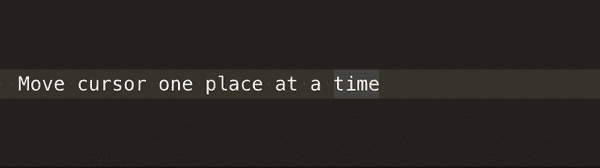](https://res.cloudinary.com/practicaldev/image/fetch/s--G1Fmibyu--/c_limit%2Cf_auto%2Cfl_progressive%2Cq_66%2Cw_880/http://alebian.github.io/asseimg/editor_tips/1_move_cursor.gif)

使用*选项+光标*在单词间移动光标:

[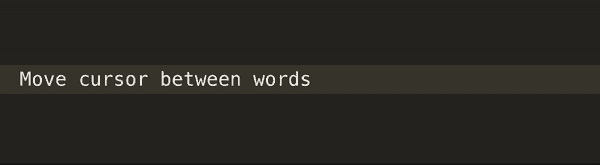](https://res.cloudinary.com/practicaldev/image/fetch/s--dHpsbyE_--/c_limit%2Cf_auto%2Cfl_progressive%2Cq_66%2Cw_880/http://alebian.github.io/asseimg/editor_tips/2_move_cursor.gif)

用户 *cmd +光标*将光标移动到行尾或行首:

[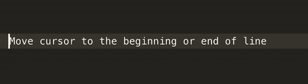](https://res.cloudinary.com/practicaldev/image/fetch/s--Y0JBVplv--/c_limit%2Cf_auto%2Cfl_progressive%2Cq_66%2Cw_880/http://alebian.github.io/asseimg/editor_tips/3_move_cursor.gif)

使用*选项*键，可以移动任何一行:

[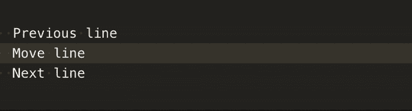](https://res.cloudinary.com/practicaldev/image/fetch/s--yhLBLAsn--/c_limit%2Cf_auto%2Cfl_progressive%2Cq_66%2Cw_880/http://alebian.github.io/asseimg/editor_tips/4_move_line.gif)

我使用 *cmd + x* 来删除一行，这实际上删除了它，但我并不在乎(如果你在乎，请使用 *cmd + shift + k* ):

[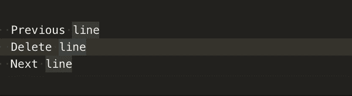](https://res.cloudinary.com/practicaldev/image/fetch/s--nzFVYtGJ--/c_limit%2Cf_auto%2Cfl_progressive%2Cq_66%2Cw_880/http://alebian.github.io/asseimg/editor_tips/5_delete_line.gif)

### 高亮显示

这看起来也很傻，但重要的是我们都知道它们。

使用 *shift +光标*我们可以一个字符一个字符地突出显示单词:

[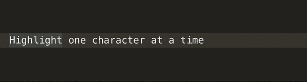](https://res.cloudinary.com/practicaldev/image/fetch/s--XEBDHPHR--/c_limit%2Cf_auto%2Cfl_progressive%2Cq_66%2Cw_880/http://alebian.github.io/asseimg/editor_tips/6_highlight.gif)

为了改善这一点，我们可以使用 *shift + option +光标*来突出显示整个单词:

[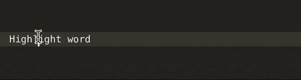](https://res.cloudinary.com/practicaldev/image/fetch/s--9arp-Tpr--/c_limit%2Cf_auto%2Cfl_progressive%2Cq_66%2Cw_880/http://alebian.github.io/asseimg/editor_tips/7_highlight.gif)

我们可以使用 *shift * cmd + cursor* 来选择整行:

[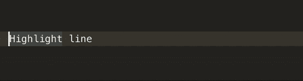](https://res.cloudinary.com/practicaldev/image/fetch/s--2OjYk6M---/c_limit%2Cf_auto%2Cfl_progressive%2Cq_66%2Cw_880/http://alebian.github.io/asseimg/editor_tips/8_highlight.gif)

### 多重光标魔法

在我看来，现在我们开始做最重要的事情，控制多个光标。

首先让我们创建它们，我们可以使用鼠标使用 *cmd + click* 或仅使用键盘使用 *cmd + option +上/下光标*:

通常，每个光标的选择是单独复制的，您可以将它们复制并粘贴到任何地方。如果您的游标数量与复制时相同，则会发生以下情况:

[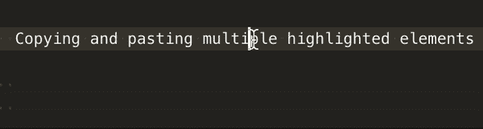](https://res.cloudinary.com/practicaldev/image/fetch/s--0Nt8010t--/c_limit%2Cf_auto%2Cfl_progressive%2Cq_66%2Cw_880/http://alebian.github.io/asseimg/editor_tips/10_copy_multiple_elements.gif)

如果您的光标数量比复制时少或多，所有复制的选择将被粘贴到您当前拥有的每个光标上。

我经常用下一个。当你选择某样东西时，你可以使用 *cmd + d* 来选择下一个匹配的选择。这非常有用，我们将在最后的一个例子中看到。每个选择都会为其创建一个光标:

[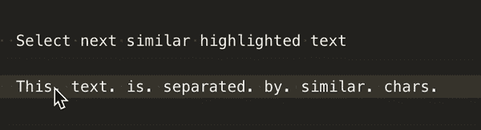](https://res.cloudinary.com/practicaldev/image/fetch/s--OgApHE2W--/c_limit%2Cf_auto%2Cfl_progressive%2Cq_66%2Cw_880/http://alebian.github.io/asseimg/editor_tips/11_similar_highlighted.gif)

### 自动关闭字符

这类似于 HTML 自动结束标签功能(我也推荐)，但是字符有一个结束对，例如:

[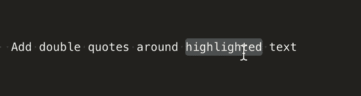](https://res.cloudinary.com/practicaldev/image/fetch/s--c8Ae2RXl--/c_limit%2Cf_auto%2Cfl_progressive%2Cq_66%2Cw_880/http://alebian.github.io/asseimg/editor_tips/12_double_quote.gif)

[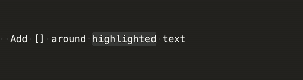](https://res.cloudinary.com/practicaldev/image/fetch/s--geeBw1b---/c_limit%2Cf_auto%2Cfl_progressive%2Cq_66%2Cw_880/http://alebian.github.io/asseimg/editor_tips/13_square_brackets.gif)

[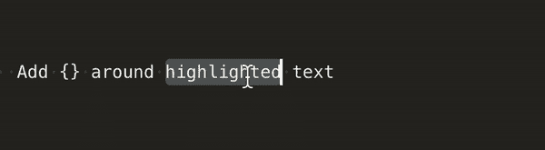](https://res.cloudinary.com/practicaldev/image/fetch/s--D9Ubrr3N--/c_limit%2Cf_auto%2Cfl_progressive%2Cq_66%2Cw_880/http://alebian.github.io/asseimg/editor_tips/14_brackets.gif)

[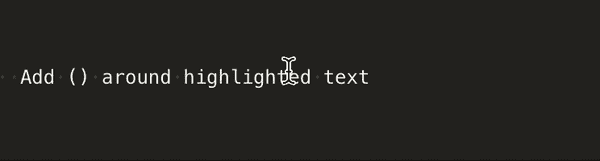](https://res.cloudinary.com/practicaldev/image/fetch/s--JXaPfJ7a--/c_limit%2Cf_auto%2Cfl_progressive%2Cq_66%2Cw_880/http://alebian.github.io/asseimg/editor_tips/15_parenthesis.gif)

### 例子

所有前面的块在 90%的时间里(或多或少)都是有用的。我将向您展示的示例是简化的真实案例场景，我希望动画是不言自明的(如果有不寻常的事情，我会尝试解释我所做的)。

[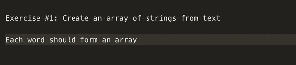](https://res.cloudinary.com/practicaldev/image/fetch/s--crTQVnKW--/c_limit%2Cf_auto%2Cfl_progressive%2Cq_66%2Cw_880/http://alebian.github.io/asseimg/editor_tips/exercise_1.gif)

在这里，我在开头添加了一个空格，这样我就可以在我想要的地方找到一个光标(这是你从实践中学到的另一个技巧)。

[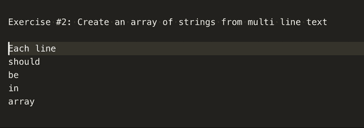](https://res.cloudinary.com/practicaldev/image/fetch/s--fYQL5SGe--/c_limit%2Cf_auto%2Cfl_progressive%2Cq_66%2Cw_880/http://alebian.github.io/asseimg/editor_tips/exercise_2.gif)

[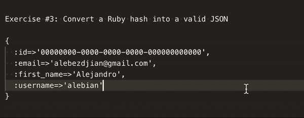](https://res.cloudinary.com/practicaldev/image/fetch/s--7vsXFuIt--/c_limit%2Cf_auto%2Cfl_progressive%2Cq_66%2Cw_880/http://alebian.github.io/asseimg/editor_tips/exercise_3.gif)

[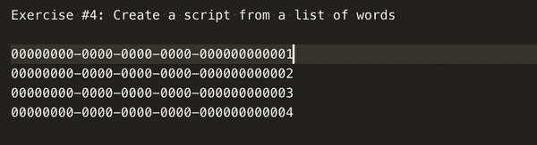](https://res.cloudinary.com/practicaldev/image/fetch/s--1Sp_1hyy--/c_limit%2Cf_auto%2Cfl_progressive%2Cq_66%2Cw_880/http://alebian.github.io/asseimg/editor_tips/exercise_4.gif)

[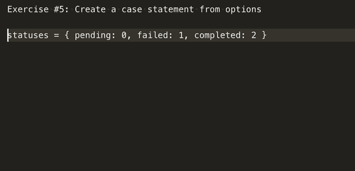](https://res.cloudinary.com/practicaldev/image/fetch/s--IrT8kYJD--/c_limit%2Cf_auto%2Cfl_progressive%2Cq_66%2Cw_880/http://alebian.github.io/asseimg/editor_tips/exercise_5.gif)

[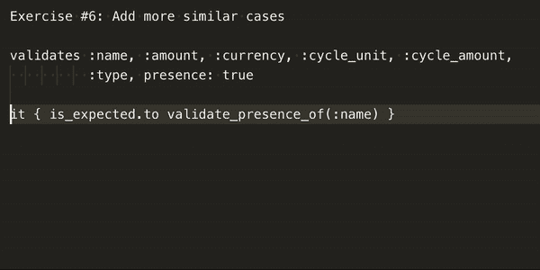](https://res.cloudinary.com/practicaldev/image/fetch/s--ryFICrX5--/c_limit%2Cf_auto%2Cfl_progressive%2Cq_66%2Cw_880/http://alebian.github.io/asseimg/editor_tips/exercise_6.gif)

当然还有其他方法来解决它们，你的创造力是你的极限！

## 加贺

编辑器还有其他一些特性，您绝对应该知道:

*   通过名字找到并打开一个文件:在我的例子中是 *cmd + d* ，但是其他编辑器和 ide 有不同的映射。
*   使用自动补全:如果你用 Java 或类似语言开发，你可能已经习惯了，但是编辑器有很多其他语言的插件可以帮助你。
*   使用正则表达式在文件中查找单词。这个有点难(因为你必须知道正则表达式),但有时非常有用:

[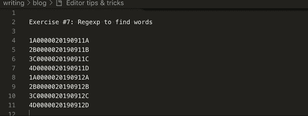](https://res.cloudinary.com/practicaldev/image/fetch/s--aCPyCV4S--/c_limit%2Cf_auto%2Cfl_progressive%2Cq_66%2Cw_880/http://alebian.github.io/asseimg/editor_tips/exercise_7.gif)

一旦你用你的正则表达式找到你想要的文本，使用 *shift + cmd + L* 来选择它。

我希望这些技巧对你有用，并帮助你更有效率！

