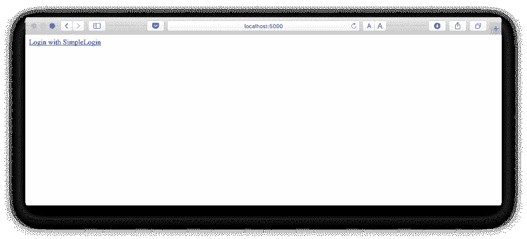
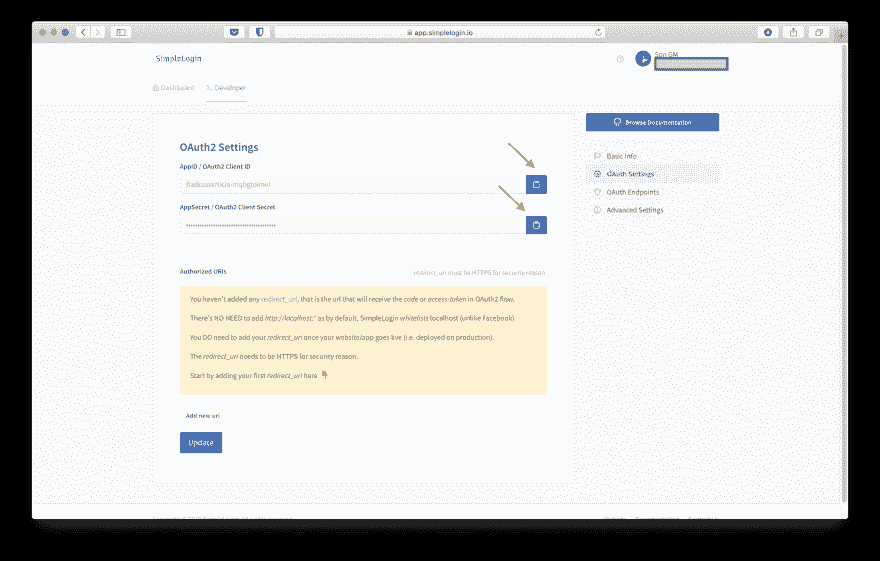
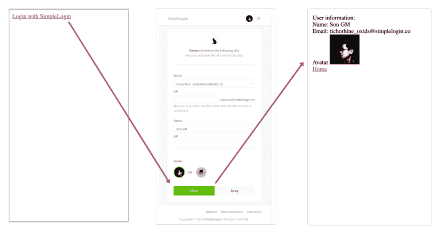
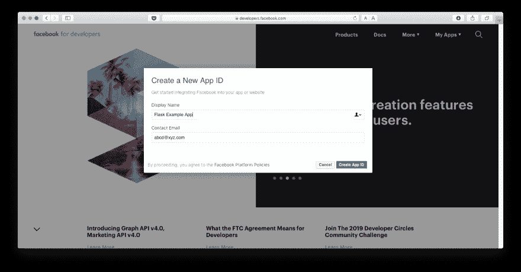
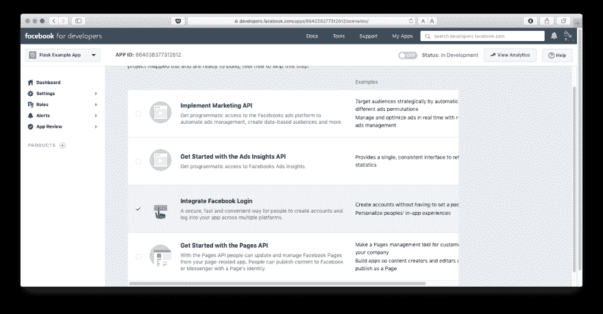
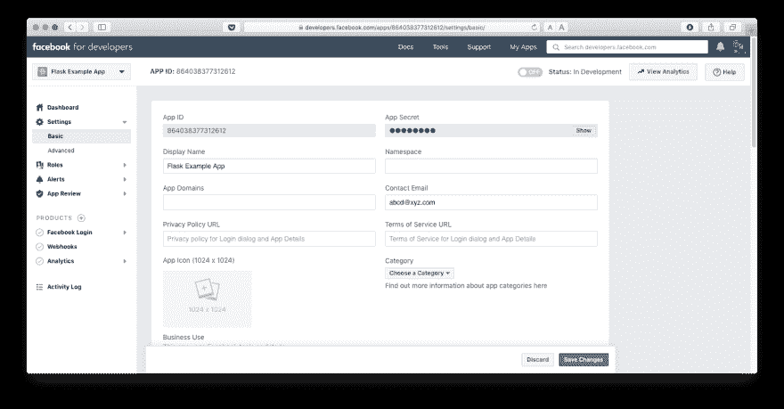
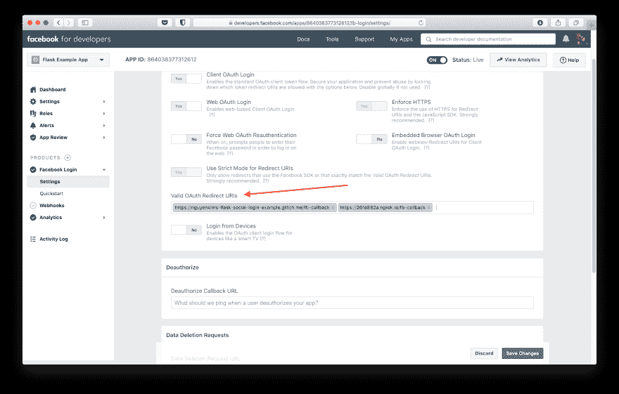

# 使用 SSO 登录创建 Flask 应用程序

> 原文:[https://dev . to/simple log in/create-a-flask-application-with-SSO-log in-f9m](https://dev.to/simplelogin/create-a-flask-application-with-sso-login-f9m)

应用程序中通常需要某种登录功能，以便用户可以保存数据或创建自己的个人资料。或者可能只有经过身份验证的用户才能访问保留的内容。在现代应用中，用户希望拥有标准的登录相关功能，如电子邮件验证、密码重置、多因素身份验证等。这些功能虽然必要，但不容易做好，通常也不是应用的主要业务。

在用户方面，他们也不想经历冗长的注册过程，因为他们需要创建并记住另一个电子邮件/密码。如果没有适当的密码管理器，用户往往会重复使用同一个密码，这在安全性方面是非常糟糕的。

SSO(单点登录)，通常为公众所知的是使用脸书/谷歌/推特按钮的随处**登录，被发明出来作为这个问题的解决方案。对于用户来说，他们不必经历痛苦的注册过程:只需一次点击。对于开发者来说，为用户消除摩擦总是一个巨大的胜利，此外，所有与登录相关的功能现在都被*委托给**身份提供商**(即脸书/谷歌/推特)。您的应用程序只需*信任*身份提供者来完成验证用户身份的工作。***

SSO 通常由 OIDC (OpenId Connect)或 SAML 协议提供支持。SAML 主要用于企业应用程序。OIDC 建立在 OAuth2 之上，由脸书、谷歌等社交身份提供商使用。在本帖中，我们将重点关注 OIDC/OAuth2 协议。

这篇文章提供了一个分步指南，使用简单登录和脸书作为身份提供者，将 SSO 登录按钮添加到 Flask 应用程序中。这可以在不使用任何外部库的情况下完成，但是为了不太担心 OAuth 细节，我们将使用 [Requests-OAuthlib](https://github.com/requests/requests-oauthlib) ，一个集成 OAuth 提供者的库。如果你有兴趣从头开始实现单点登录，请查看[以原始方式实现单点登录](https://docs.simplelogin.io/docs/code-flow/)。

在本文结束时，您应该有一个包含以下页面的 Flask 应用程序:

*   主页:只有**登录**按钮
*   用户信息页面:成功登录后，用户将能够看到姓名，电子邮件，头像等信息。

本教程的所有步骤都可以在[flask-social-log in-example repository](https://github.com/nguyenkims/flask-social-login-example)上找到。

在[https://nguyenkims-flask-social-log in-example . Glitch . me](https://nguyenkims-flask-social-login-example.glitch.me)上也有演示，可以随意**重新混合 [Glitch](https://glitch.com/~nguyenkims-flask-social-login-example) 上的代码😉。**

## [](#step-1-bootstrap-flask-app)第一步:自举烧瓶 app

安装`flask`和`Requests-OAuthlib`。你也可以用`virtualenv`或者`pipenv`来隔离环境。

> pip 安装烧瓶请求 _oauthlib

创建`app.py`和在主页显示登录按钮的路线:

```
import flask

app = flask.Flask(__name__)

@app.route("/")
def index():
    return """
    <a href="/login">Login</a>
    """

if __name__ == '__main__':
    app.run(debug=True) 
```

<svg viewBox="0 0 448 512" class="highlight-action highlight-action--fullscreen-on"><title>Enter fullscreen mode</title></svg> <svg viewBox="0 0 448 512" class="highlight-action highlight-action--fullscreen-off"><title>Exit fullscreen mode</title></svg>

让我们运行这个应用程序，验证一切正常:

> python app.py

打开 [http://localhost:5000](http://localhost:5000) 应该会看到这个页面。完整代码在 [step1.py](https://github.com/nguyenkims/flask-social-login-example/blob/master/step1.py) 上

[T2】](https://res.cloudinary.com/practicaldev/image/fetch/s--WSc7hRZn--/c_limit%2Cf_auto%2Cfl_progressive%2Cq_auto%2Cw_880/https://thepracticaldev.s3.amazonaws.com/i/o6ydih137sm0cmzz6joc.png)

## [](#step-2-identity-provider-credential)第二步:身份提供商凭证

目前有数百家(如果不是数千家)身份提供商，最受欢迎的是脸书、谷歌、Github、Instagram 等。对于这篇文章， [SimpleLogin](https://simplelogin.io) 被选中是因为它的**开发者友好性**。相同的代码将与任何 OAuth2 身份提供商(脸书，谷歌等)虽然工作。声明:我碰巧是 SimpleLogin 的联合创始人，所以这个选择显然是主观的。

由于要经历脸书、谷歌、Twitter 的设置，登录有点复杂(每个使用谷歌云控制台的人都能感受到这种痛苦😅)并需要额外的步骤，如设置 SSL、选择正确的范围等，这些超出了本文的范围。与脸书的**登录一节是作为文章结尾的附录提供的。**

请前往[简单登录](https://app.simplelogin.io)并创建一个帐户(如果您还没有)，然后在**开发者**选项卡中创建一个新应用。

在应用程序详细信息页面，请复制您的 AppID 和 AppSecret，并将其保存到变量环境中。在 OAuth 术语中， **client** 实际上是指第三方 app，也就是你的 app。我们可以将这些值直接放在代码中，但是将凭证保存到**变量环境**中是一个很好的做法。这也是[中的第三个因素](https://12factor.net)十二个因素。

[](https://res.cloudinary.com/practicaldev/image/fetch/s--2APvGsmG--/c_limit%2Cf_auto%2Cfl_progressive%2Cq_auto%2Cw_880/https://thepracticaldev.s3.amazonaws.com/i/zeymjg5a5areaoh39dtw.png)T3】

```
export CLIENT_ID={your AppID}
export CLIENT_SECRET={your AppSecret} 
```

<svg viewBox="0 0 448 512" class="highlight-action highlight-action--fullscreen-on"><title>Enter fullscreen mode</title></svg> <svg viewBox="0 0 448 512" class="highlight-action highlight-action--fullscreen-off"><title>Exit fullscreen mode</title></svg>

在`app.py`中，请将这些行添加到文件的顶部，以获得`client id`和`client secret`T3】

```
import os
CLIENT_ID = os.environ.get("CLIENT_ID")
CLIENT_SECRET = os.environ.get("CLIENT_SECRET") 
```

<svg viewBox="0 0 448 512" class="highlight-action highlight-action--fullscreen-on"><title>Enter fullscreen mode</title></svg> <svg viewBox="0 0 448 512" class="highlight-action highlight-action--fullscreen-off"><title>Exit fullscreen mode</title></svg>

也请将这些 OAuth URLs 添加到`app.py`的顶部，它们将在下一步中使用。它们也可以在 **OAuth 端点**页面上复制。

```
AUTHORIZATION_BASE_URL = "https://app.simplelogin.io/oauth2/authorize"
TOKEN_URL = "https://app.simplelogin.io/oauth2/token"
USERINFO_URL = "https://app.simplelogin.io/oauth2/userinfo" 
```

<svg viewBox="0 0 448 512" class="highlight-action highlight-action--fullscreen-on"><title>Enter fullscreen mode</title></svg> <svg viewBox="0 0 448 512" class="highlight-action highlight-action--fullscreen-off"><title>Exit fullscreen mode</title></svg>

由于我们现在不想担心设置 SSL，所以让我们告诉`Requests-OAuthlib`使用普通 HTTP:
是可以的

```
# This allows us to use a plain HTTP callback os.environ["OAUTHLIB_INSECURE_TRANSPORT"] = "1" 
```

<svg viewBox="0 0 448 512" class="highlight-action highlight-action--fullscreen-on"><title>Enter fullscreen mode</title></svg> <svg viewBox="0 0 448 512" class="highlight-action highlight-action--fullscreen-off"><title>Exit fullscreen mode</title></svg>

像往常一样，这一步的代码在 [step2.py](https://github.com/nguyenkims/flask-social-login-example/blob/master/step2.py) 上

## [](#step-3-login-redirection)第三步:登录重定向

当用户点击登录按钮时:

1.  用户将被重定向至**身份登录提供商**授权页面，询问用户是否希望与您的应用共享其信息。

2.  在用户批准后，他们将被重定向回你的应用程序的页面，同时在 URL 中有一个`code`，你的应用程序将使用它来交换一个`access token`，以便你稍后从服务提供商那里获得用户信息。

因此，我们需要两条路由:一条是将用户重定向到身份提供者的`login`路由，另一条是接收`code`并交换`access token`的`callback`路由。回调路由还负责显示用户信息。

```
@app.route("/login")
def login():
    simplelogin = requests_oauthlib.OAuth2Session(
        CLIENT_ID, redirect_uri="http://localhost:5000/callback"
    )
    authorization_url, _ = simplelogin.authorization_url(AUTHORIZATION_BASE_URL)

    return flask.redirect(authorization_url)

@app.route("/callback")
def callback():
    simplelogin = requests_oauthlib.OAuth2Session(CLIENT_ID)
    simplelogin.fetch_token(
        TOKEN_URL, client_secret=CLIENT_SECRET, authorization_response=flask.request.url
    )

    user_info = simplelogin.get(USERINFO_URL).json()
    return f"""
    User information: <br>
    Name: {user_info["name"]} <br>
    Email: {user_info["email"]} <br>
    Avatar  <br>
    <a href="/">Home</a>
    """ 
```

<svg viewBox="0 0 448 512" class="highlight-action highlight-action--fullscreen-on"><title>Enter fullscreen mode</title></svg> <svg viewBox="0 0 448 512" class="highlight-action highlight-action--fullscreen-off"><title>Exit fullscreen mode</title></svg>

点击**登录**按钮将引导您完成以下流程。完整的代码可以在 [Github - step3.py](https://github.com/nguyenkims/flask-social-login-example/blob/master/step3.py) 上找到

[T2】](https://res.cloudinary.com/practicaldev/image/fetch/s--bEwtCm7f--/c_limit%2Cf_auto%2Cfl_progressive%2Cq_auto%2Cw_880/https://thepracticaldev.s3.amazonaws.com/i/f23w5cnhuhqbjej12nak.png)

## [](#conclusion)结论

恭喜🎉您已成功将 **SSO 登录**集成到 Flask app 中！

为了简单起见，本教程没有提及其他 OAuth 概念，如[范围](https://oauth.net/2/scope/)和[状态](https://spring.io/blog/2011/11/30/cross-site-request-forgery-and-oauth2)，这对于防御* *跨站点请求伪造** 攻击很重要。您可能还需要将用户信息存储在一个数据库中，这在本文中没有涉及。

该应用程序还需要在 https 上提供服务，这在今天可以很容易地通过[让我们加密](https://letsencrypt.org)来完成。

祝你写作愉快！

* * *

## [](#appendix-login-with-facebook)附录:登录脸书

如前所述，请在下面找到将**登录与脸书**按钮整合的步骤🙂。除了相当复杂的用户界面，集成脸书最困难的部分可能是找到一种方法在本地 https 上服务你的 web 应用，因为脸书 SDK 的新版本不允许本地普通 HTTP。我推荐使用 [Ngrok](https://ngrok.com) ，这是一个可以快速获得 https URL 的免费工具。

### [](#step-1-create-a-facebook-app)第一步:创建脸书 app:

请前往[https://developers.facebook.com](https://developers.facebook.com)创建一个新应用

[T2】](https://res.cloudinary.com/practicaldev/image/fetch/s--D26o89Y2--/c_limit%2Cf_auto%2Cfl_progressive%2Cq_auto%2Cw_880/https://thepracticaldev.s3.amazonaws.com/i/pi7i5raswmt9nwqpn01s.png)

然后在下一个屏幕上选择“集成脸书登录”

[T2】](https://res.cloudinary.com/practicaldev/image/fetch/s--3M9DJ1cm--/c_limit%2Cf_auto%2Cfl_progressive%2Cq_auto%2Cw_880/https://thepracticaldev.s3.amazonaws.com/i/n4vvf2y1vq6mi2adboit.png)

### [](#step-2-facebook-oauth-credential)第二步:脸书 OAuth 凭证

点击左侧的“设置/基本”，复制*应用 ID* 和*应用秘密*，它们实际上是 OAuth 客户端 ID 和客户端秘密。

[T2】](https://res.cloudinary.com/practicaldev/image/fetch/s--WQmzcZ3c--/c_limit%2Cf_auto%2Cfl_progressive%2Cq_auto%2Cw_880/https://thepracticaldev.s3.amazonaws.com/i/8u6jlnoakwpc2ut28ll1.png)

更新客户端 id 和客户端密码

```
export FB_CLIENT_ID={your facebook AppId}
export FB_CLIENT_SECRET={your facebook AppSecret} 
```

<svg viewBox="0 0 448 512" class="highlight-action highlight-action--fullscreen-on"><title>Enter fullscreen mode</title></svg> <svg viewBox="0 0 448 512" class="highlight-action highlight-action--fullscreen-off"><title>Exit fullscreen mode</title></svg>

更新授权 _ 基础 _URL 和令牌 _URL:

```
FB_AUTHORIZATION_BASE_URL = "https://www.facebook.com/dialog/oauth"
FB_TOKEN_URL = "https://graph.facebook.com/oauth/access_token" 
```

<svg viewBox="0 0 448 512" class="highlight-action highlight-action--fullscreen-on"><title>Enter fullscreen mode</title></svg> <svg viewBox="0 0 448 512" class="highlight-action highlight-action--fullscreen-off"><title>Exit fullscreen mode</title></svg>

首页

```
@app.route("/")
def index():
    return """
    <a href="/fb-login">Login with Facebook</a>
    """ 
```

<svg viewBox="0 0 448 512" class="highlight-action highlight-action--fullscreen-on"><title>Enter fullscreen mode</title></svg> <svg viewBox="0 0 448 512" class="highlight-action highlight-action--fullscreen-off"><title>Exit fullscreen mode</title></svg>

### [](#step-3-login-and-callback-endpoints)第三步:登录和回叫端点

如果使用`ngrok http 5000`命令在`ngrok`之后提供应用程序，我们需要将当前 url 设置为 ngrok url

```
# Your ngrok url, obtained after running "ngrok http 5000" URL = "https://abcdefgh.ngrok.io" 
```

<svg viewBox="0 0 448 512" class="highlight-action highlight-action--fullscreen-on"><title>Enter fullscreen mode</title></svg> <svg viewBox="0 0 448 512" class="highlight-action highlight-action--fullscreen-off"><title>Exit fullscreen mode</title></svg>

请确保将 URL[https://abcdefgh.ngrok.io/fb-callback](https://abcdefgh.ngrok.io/fb-callback)添加到您的脸书登录/设置中，有效的 OAuth 重定向 URIs 设置:

[T2】](https://res.cloudinary.com/practicaldev/image/fetch/s--EBpo2ptd--/c_limit%2Cf_auto%2Cfl_progressive%2Cq_auto%2Cw_880/https://thepracticaldev.s3.amazonaws.com/i/vzs5e4lywrq0vasirw0x.png)

为了访问用户邮箱，您需要将`email`添加到`scope`

```
FB_SCOPE = ["email"]

@app.route("/fb-login")
def login():
    facebook = requests_oauthlib.OAuth2Session(
        FB_CLIENT_ID, redirect_uri=URL + "/fb-callback", scope=FB_SCOPE
    )
    authorization_url, _ = facebook.authorization_url(FB_AUTHORIZATION_BASE_URL)

    return flask.redirect(authorization_url) 
```

<svg viewBox="0 0 448 512" class="highlight-action highlight-action--fullscreen-on"><title>Enter fullscreen mode</title></svg> <svg viewBox="0 0 448 512" class="highlight-action highlight-action--fullscreen-off"><title>Exit fullscreen mode</title></svg>

`callback`路线稍微复杂一点，因为脸书需要一个合规修正:

```
from requests_oauthlib.compliance_fixes import facebook_compliance_fix

@app.route("/fb-callback")
def callback():
    facebook = requests_oauthlib.OAuth2Session(
        FB_CLIENT_ID, scope=FB_SCOPE, redirect_uri=URL + "/fb-callback"
    )

    # we need to apply a fix for Facebook here
    facebook = facebook_compliance_fix(facebook)

    facebook.fetch_token(
        FB_TOKEN_URL,
        client_secret=FB_CLIENT_SECRET,
        authorization_response=flask.request.url,
    )

    # Fetch a protected resource, i.e. user profile, via Graph API 
    facebook_user_data = facebook.get(
        "https://graph.facebook.com/me?fields=id,name,email,picture{url}"
    ).json()

    email = facebook_user_data["email"]
    name = facebook_user_data["name"]
    picture_url = facebook_user_data.get("picture", {}).get("data", {}).get("url")

    return f"""
    User information: <br>
    Name: {name} <br>
    Email: {email} <br>
    Avatar  <br>
    <a href="/">Home</a>
    """ 
```

<svg viewBox="0 0 448 512" class="highlight-action highlight-action--fullscreen-on"><title>Enter fullscreen mode</title></svg> <svg viewBox="0 0 448 512" class="highlight-action highlight-action--fullscreen-off"><title>Exit fullscreen mode</title></svg>

现在，当用脸书点击**登录时，你应该能够浏览整个流程。**

[T2】](https://res.cloudinary.com/practicaldev/image/fetch/s--44GneNu6--/c_limit%2Cf_auto%2Cfl_progressive%2Cq_auto%2Cw_880/https://thepracticaldev.s3.amazonaws.com/i/do5acziteu8fwxb5oesc.png)

完整代码在 [facebook.py](https://github.com/nguyenkims/flask-social-login-example/blob/master/facebook.py)

整合`Login with Google/Twitter/...`挺像的。请让我知道在评论中，如果你想有这些社会登录提供商类似的部分！