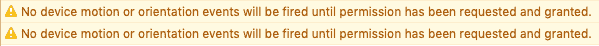
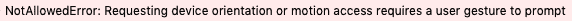

# 如何在 iOS 13+中请求 devicemotion 和 deviceorientation 事件的权限

> 原文：<https://dev.to/li/how-to-requestpermission-for-devicemotion-and-deviceorientation-events-in-ios-13-46g2>

## 背景

从 iOS 12.2 开始，苹果决定出于[隐私原因](https://www.macrumors.com/2019/02/04/ios-12-2-safari-motion-orientation-access-toggle/)，默认关闭对设备运动和方向事件的浏览器内访问。现在，也许他们意识到这可能是一个错误，所以在 iOS 13 中，他们[改变了](https://developer.apple.com/documentation/safari_release_notes/safari_13_release_notes#3314664.)权限请求行为，类似于相机权限的请求方式。

所以现在，当我们试图将`addEventListener`切换到`devicemotion`或`deviceorientation`时，我们会在控制台中看到这条警告:

[](https://res.cloudinary.com/practicaldev/image/fetch/s--zmpliB6m--/c_limit%2Cf_auto%2Cfl_progressive%2Cq_auto%2Cw_880/https://thepracticaldev.s3.amazonaws.com/i/xd3rs4z30dmaqrgztkj0.png)

要请求许可，我们只需要调用`DeviceMotionEvent`或`DeviceOrientationEvent` : `requestPermission`上的方法😂它将返回一个总是解析为`PermissionState`的承诺，T3 可以是`granted`或`denied`(所以基本上是`Promise<'granted'|'denied'>`)。

## 还有一件事

需要记住的另一件事是`requestPermission`只能在用户手势下被调用(比如点击)。这也是合理的 UX，因为我们想告诉用户为什么我们要求这样的权限，并让他们在提示之前确认，以便他们看到它的到来。

否则，您会得到以下错误:

[](https://res.cloudinary.com/practicaldev/image/fetch/s--bac-nE0v--/c_limit%2Cf_auto%2Cfl_progressive%2Cq_auto%2Cw_880/https://thepracticaldev.s3.amazonaws.com/i/af0b5s5t110v4e618t0n.png)

## 代码要复制

对于`devicemotion`事件:

```
 function onClick() {
    // feature detect
    if (typeof DeviceMotionEvent.requestPermission === 'function') {
      DeviceMotionEvent.requestPermission()
        .then(permissionState => {
          if (permissionState === 'granted') {
            window.addEventListener('devicemotion', () => {});
          }
        })
        .catch(console.error);
    } else {
      // handle regular non iOS 13+ devices
    }
  } 
```

Enter fullscreen mode Exit fullscreen mode

对于`deviceorientation`事件:

```
 function onClick() {
    // feature detect
    if (typeof DeviceOrientationEvent.requestPermission === 'function') {
      DeviceOrientationEvent.requestPermission()
        .then(permissionState => {
          if (permissionState === 'granted') {
            window.addEventListener('deviceorientation', () => {});
          }
        })
        .catch(console.error);
    } else {
      // handle regular non iOS 13+ devices
    }
  } 
```

Enter fullscreen mode Exit fullscreen mode

就是这样。感谢您的阅读！