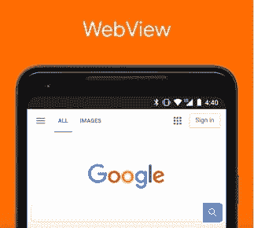

# 可信网络活动

> 原文:[https://dev.to/kimuradev/trusted-web-activities-54lc](https://dev.to/kimuradev/trusted-web-activities-54lc)

一种将您的 web 应用程序与您的 Android 集成的新方法！

[T2】](https://res.cloudinary.com/practicaldev/image/fetch/s--D-7fGwQx--/c_limit%2Cf_auto%2Cfl_progressive%2Cq_auto%2Cw_880/https://thepracticaldev.s3.amazonaws.com/i/9l17mlfzv9ers5nkoywh.jpeg)

嘿，伙计们，今天我会告诉你们更多关于环球航空的事情。

但毕竟，**什么是 TWA，为什么以及何时使用？**

# 今天有什么？

嗯，首先，值得记住的是，即使在 **TWA** 之前，**还有另外两种方式**将我们的网络内容整合到 Android 应用程序中:

**网络浏览量:**

WebView 是使用最多的组件，主要是因为市场上有一些成功的框架，如 Ionic，就是以这种格式工作的。有了它，你可以全屏支持你的应用程序，使用 T2 cookies，将 Javascript 代码链接到 Android 代码。缺点是它的**性能受到影响**，并且随着每个操作系统的不同而不同。

[T2】](https://res.cloudinary.com/practicaldev/image/fetch/s--Yg3CqP06--/c_limit%2Cf_auto%2Cfl_progressive%2Cq_auto%2Cw_880/https://thepracticaldev.s3.amazonaws.com/i/7eknd5nkt1g50z5gld7i.png)

**Chrome 自定义标签:**

Chrome 自定义标签，或称 **CCT** ，在版本 45 中被引入 Chrome。与 WebView 不同，它看起来不像一个全屏的应用程序，用户会把它看作一个带有自定义工具栏的**活动**。然而，这种定制是**有限的**，用户将始终看到内容的网址。最后，您的应用程序将无法访问网络状态，如 cookie、存储等…

[T2】](https://res.cloudinary.com/practicaldev/image/fetch/s--8kba2LNY--/c_limit%2Cf_auto%2Cfl_progressive%2Cq_auto%2Cw_880/https://thepracticaldev.s3.amazonaws.com/i/50cwkiipkk9hq4qpsfqc.png)

# 爽，那么跟 TWA 有什么变化？

嗯，首先你的 TWA 会全屏运行 Chrome。**那是什么意思？**这意味着对用户来说是透明的。感觉就像一个**本地应用**正在运行。这是因为有能力**验证**你的站点和应用是**数字认证的**到 [**数字链接资产**](https://developers.google.com/digital-asset-links/v1/getting-started) (我们在 PWA 文章中讨论过)，因此是可靠的。

TWA 还可以访问所有 Chrome 功能的**，并可以执行某些在 WebViews 中不可能的**功能**。例如，这些功能包括推送通知、Chrome 中的自动填充表单、后台同步等。**

就像 CCT 一样，TWA 可以**共享存储在 Chrome 中的**数据，包括 cookies，以及共享会话状态等。

# 好吧，但是什么时候用，为什么用？

有几种情况下，应用程序不一定是您公司披露的主要产品。一个典型的例子是购物网站或市场。结帐系统通常有点复杂，并且通常值得以 web 格式保存。这就是环球航空带来的**多功能性**所在。

在签出之前，您可以继续使用本机应用程序。在那里，你可以通过**可信网络活动**调用你的网站，执行今天已经运行的每一个结账操作，如果你愿意，还可以返回原生应用完成用户购买。

嗯，这个想法是真正解释多一点什么是环球航空公司，它的优势是什么。

欢迎提问、疑惑或建议！只需在 Twitter 上 ping 我的 [**@kimuradev**](http://twitter.com/kimuradev)

再见！