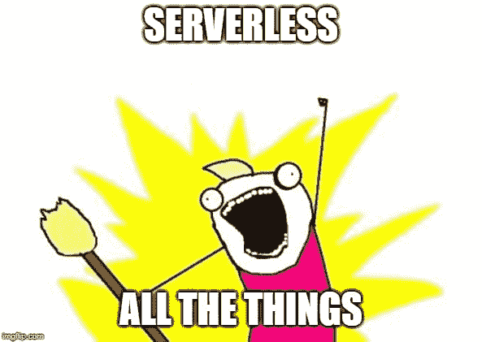
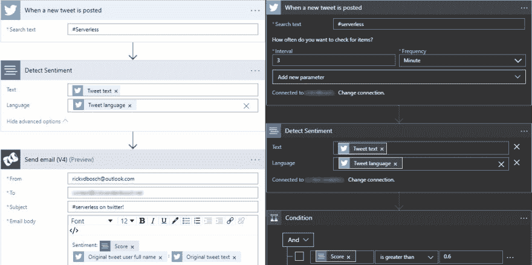
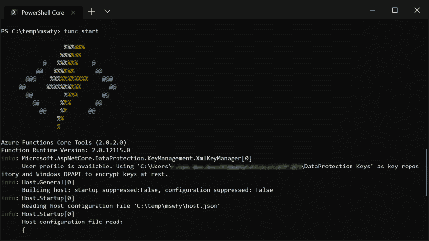
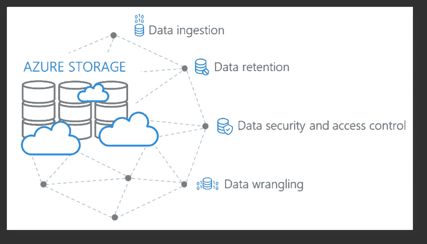
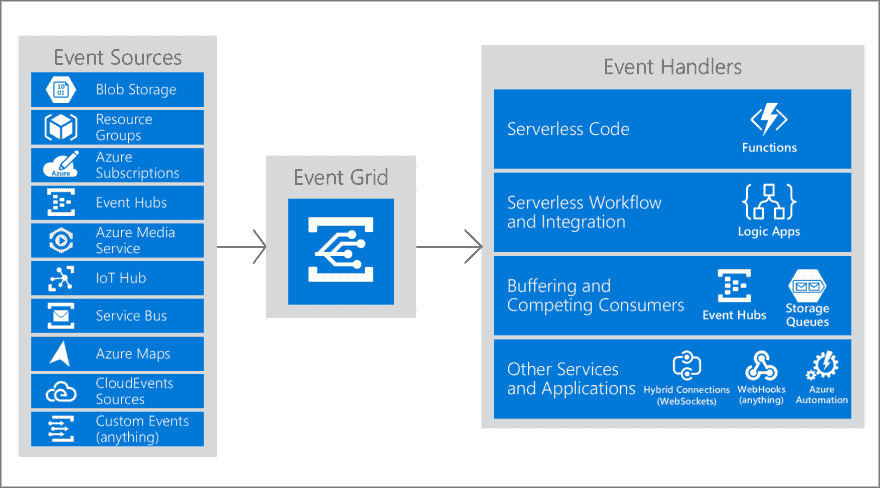

# 让无服务器为您工作

> 原文:[https://dev . to/rickvdbosch/making-server less-do-the-work-for-you-1 ha8](https://dev.to/rickvdbosch/making-serverless-do-the-work-for-you-1ha8)

# [](#introduction)简介

本文是 [#ServerlessSeptember](https://dev.to/azure/serverless-september-content-collection-2fhb) 的一部分。在这个无服务器的内容集合中，您可以找到其他有用的文章、详细的教程和视频。9 月份，每天都有来自社区成员和云倡导者的新文章发布，没错，每天都有。

在[https://docs.microsoft.com/azure/azure-functions/](https://docs.microsoft.com/azure/azure-functions/?WT.mc_id=servsept_devto-blog-cxa)了解更多关于微软 Azure 如何实现你的无服务器功能。

## [](#serverless)无服务器

[T2】](https://res.cloudinary.com/practicaldev/image/fetch/s--oYUN5rhF--/c_limit%2Cf_auto%2Cfl_progressive%2Cq_auto%2Cw_880/https://thepracticaldev.s3.amazonaws.com/i/k368cct16hov4c6zj97u.jpg)

无服务器*热*。如果你用谷歌搜索“无服务器”这个词，你会得到[将近 950 万个结果](https://www.google.com/search?q=serverless)。[无服务器计算维基百科页面](https://en.wikipedia.org/wiki/Serverless_computing)创建于 2016 年 7 月 10 日，目前共有 289 次编辑。平均每 4 天就有一次编辑。三大云供应商(亚马逊、谷歌和微软)都有一个无服务器登录页面。如果你看一下谷歌趋势图中“无服务器”一词的全球搜索，你会发现自 2016 年初以来，它一直在稳步上升。

[T2】](https://res.cloudinary.com/practicaldev/image/fetch/s--3SN4kRLt--/c_limit%2Cf_auto%2Cfl_progressive%2Cq_auto%2Cw_880/https://thepracticaldev.s3.amazonaws.com/i/symyq8f4xc5avrq9jvmh.png)

无服务器并不意味着没有任何服务器。这并不意味着少了*台*服务器。这只是意味着你不必*管理*它们，因为它们被平台抽象掉了。从开发和运营的角度来看，T4 没有服务器。但是我们都知道他们就在那里...

> 就像无线互联网在某处有电线一样，无服务器架构在某处仍然有服务器。
> 
> “无服务器”的真正含义是，作为开发者，你不必考虑那些服务器。你只需要专注于代码。
> 
> ——[serverless.com](https://serverless.com/learn/overview/)

## Azure 中的无服务器

我的个人经验更倾向于 Azure，所以我对那里如何实现无服务器有更深入的了解。微软 Azure 提供的最明显的无服务器服务是 [Azure Functions](https://azure.microsoft.com/en-us/services/functions/) 。这些旨在“用无服务器计算加速和简化应用程序开发”。他们就是这么做的。

看看 Azure 无服务器社区库,在我写这篇文章的时候，它有 98 个例子说明用 Azure 函数完成事情是多么简单。总共有 115 个无服务器示例。

但是微软 Azure 中的 Serverless 并没有以 Azure 函数结束。问题是....还不完全清楚*在哪里结束。azure.com 的不同页面对所有无服务器服务有不同的总结。*

如果你看一下 [Azure 无服务器](https://azure.microsoft.com/en-us/solutions/serverless/)页面上的列表，他们为他们的无服务器服务定义了这些类别:

*   计算
*   工作流和集成
*   DevOps 和开发工具
*   人工智能和机器学习
*   数据库ˌ资料库
*   储存；储备
*   监视
*   分析学

例如，您可能会问存储或监控是无服务器还是 PaaS。或者甚至是 SaaS…？但是，当您查看计算类别时，您会发现一些我认为是错误的东西。Azure 应用服务被称为无服务器产品。使用 App Service 时，您可以指定运行应用程序的层。确定内核数量、可用内存和....等一下...！我在指定一台服务器来运行这个东西！！！

[T2】](https://res.cloudinary.com/practicaldev/image/fetch/s--6bw9mijW--/c_limit%2Cf_auto%2Cfl_progressive%2Cq_auto%2Cw_880/https://thepracticaldev.s3.amazonaws.com/i/dglq6rxfjiq7wu1v3fzc.jpeg)

因为无服务器是热门的，我们把所有的东西都命名为无服务器，这就是 T2。

我们已经看到 Azure 上有很多无服务器服务或产品。我想深入探讨其中的几个...

### [](#flow-amp-logic-apps)流程&逻辑应用程序

[微软 Flow](https://flow.microsoft.com/en-us/) 和 [Azure Logic Apps](https://azure.microsoft.com/en-us/services/logic-apps/) 颇为相似。他们都是*配置优先集成服务*。他们也使用同一个设计师。事实上，微软的 Flow 是建立在逻辑应用之上的*。

“微软流程”*使任何办公室工作人员能够执行简单的集成*，“逻辑应用”*支持高级或关键任务集成*”并且是 Azure 的一部分。*

流和逻辑应用程序的设计者都表现出了一点区别。下图中，左边亮的部分是 Microsoft Flow，右边暗的部分是 Logic App。这两种情况都是通过一条文本为“#Serverless”的推文触发的。他们都使用认知服务进行情感检测。但是在流程只显示基础的地方，Logic Apps 已经显示了更多的定制选项。

[T2】](https://res.cloudinary.com/practicaldev/image/fetch/s--upAoQfYn--/c_limit%2Cf_auto%2Cfl_progressive%2Cq_auto%2Cw_880/https://thepracticaldev.s3.amazonaws.com/i/xbj8vctdyswsaxc6lcc6.jpg)

这些简单的代码，即*逻辑*，由您选择的连接器或时间表触发，并且非常容易创建。我听人把它比作 [IFTTT](https://ifttt.com/) 。

### [](#azure-functions)Azure 函数

在广泛使用 Azure 函数之后，我可以说:它们兑现了自己的承诺。开始的时候。开发函数只适合那些能够在文档和大量示例代码中找到方法的人。在过去的几年中，整个开发生命周期已经被简化了，包括任何与(本地)调试有关的东西。Azure Functions 核心工具使你能够在本地运行你的函数，并像调试其他应用程序一样调试它们。它也有 ASCII 艺术！

[T2】](https://res.cloudinary.com/practicaldev/image/fetch/s--shrw-ioD--/c_limit%2Cf_auto%2Cfl_progressive%2Cq_auto%2Cw_880/https://thepracticaldev.s3.amazonaws.com/i/p2pafvpm1ga8ayhjvtj9.png)

只要你在 [Azure 门户](https://portal.azure.com)中创建一个 Azure Function 应用程序，并点击加号添加一个功能，就可以看到 Azure Function 的不同开发环境。可以选择 *Visual Studio* 、 *VS Code* 、*任意编辑器+核心工具*或 *In-Portal* 。

门户内体验让你可以做任何你需要做的事情，让 Azure 功能在 Azure 门户中启动并运行*。在您选择了 In-Portal 后，系统会询问您希望使用哪种模板。下一步是编写函数所需的代码。同样，这可以完全在 Azure 门户中使用 [C#脚本来完成。csx)](https://docs.microsoft.com/en-us/azure/azure-functions/functions-reference-csharp) 。*

> 的。csx 格式允许您编写更少的“样板文件”,并专注于编写一个 C#函数。不用把所有东西都包装在名称空间和类中，只需定义一个 *Run* 方法。

这种体验接近于您在使用 Microsoft Flow 和 Azure Logic 应用程序时获得的体验，尽管在这种情况下，您实际上需要一些编程知识来让函数做您想要它做的事情，因为您需要自己编写代码。

#### [](#triggers-amp-bindings)触发&绑定

无服务器计算为您抽象出底层基础设施，使用触发器和绑定抽象出您正在连接的*外部资源*。

考虑这个代码:

```
public static async Task Run(
    [BlobTrigger("upload/{name}", Connection = "scs")]Stream addedBlob,
    [Blob("copied/{name}", FileAccess.Write, Connection = "scs")]Stream stream,
    string name, ILogger log)
 {
    await addedBlob.CopyToAsync(stream);
 } 
```

<svg width="20px" height="20px" viewBox="0 0 24 24" class="highlight-action crayons-icon highlight-action--fullscreen-on"><title>Enter fullscreen mode</title></svg> <svg width="20px" height="20px" viewBox="0 0 24 24" class="highlight-action crayons-icon highlight-action--fullscreen-off"><title>Exit fullscreen mode</title></svg>

在这个例子中只有一行代码(即 **1** ) *，其余的只是*配置*触发器和绑定。虽然它只是一行代码，但是会发生很多事情:当一个新的 blob 被添加到一个特定的容器中时，这个代码会被自动触发，使得到新 blob 的流立即可用。如果添加了 blob，您还可以获得其名称，并在一个单独的容器中获得一个新的流，该流指向一个与上传的 blob 同名的 blob。当然，一个 blob 的内容被复制到另一个 blob 中。现在想象一下，如果你想在没有云的情况下开发它，你将不得不编写样板代码。还是 5 年前...😲*

让我们分解代码。

*   `BlobTrigger`行声明:当“上传”容器中有一个新的 Blob 时触发这个函数，并将它的`name`和一个`Stream 'addedBlob'`传递给这个函数。
*   `Blob`绑定声明:在“复制的”容器中创建一个同名的 blob，并将它的一个`Stream 'stream'`传递给函数。
*   `string 'name'`包含导致触发的添加的 blob 的名称，`ILogger log`是平台传入的日志记录机制。
*   对`CopyToAsync`的调用是*的一行实际代码*。

这里发生了这么多事情，却只有这么少的代码。这个平台为你管理大量的东西，让你专注于重要的事情。这还有更多的来源，使开发人员能够*最终*专注于向代码添加业务价值，而不是编写样板代码，例如，连接到资源。有关支持的绑定的完整和最新列表，请参见.....[支持的绑定](https://docs.microsoft.com/en-us/azure/azure-functions/functions-triggers-bindings#supported-bindings)🤭

#### [](#sidenote)*旁注*

顺便说一下，谈论平台为你管理的东西...如果你正在使用密钥库存储应用程序机密，看看使用 Azure Resources 的[托管身份来连接到密钥库。更好的是，看看](https://docs.microsoft.com/en-us/azure/active-directory/managed-identities-azure-resources/overview)[的关键金库参考资料](https://docs.microsoft.com/en-us/azure/app-service/app-service-key-vault-references)。它使你能够在应用服务或 Azure Functions 应用*中使用来自 Azure Key Vault 的秘密，而不需要任何代码更改*。

### [](#azure-storage)天蓝色储物

> Azure Storage 是微软托管的服务，提供高度可用、安全、持久、可扩展和冗余的云存储。Azure 存储包括 Azure Blobs(对象)、Azure 数据湖存储 Gen2、Azure 文件、Azure 队列和 Azure 表。

所以 Azure 存储不仅仅是 blobs。Azure 存储使您能够从任何地方接收数据，甚至在边缘。有几种经济高效的方法可以保留数据。您可以部署安全功能来保护数据和控制访问，当然也可以利用广泛的支持工具库来处理数据。

[T2】](https://res.cloudinary.com/practicaldev/image/fetch/s--biGa1p3l--/c_limit%2Cf_auto%2Cfl_progressive%2Cq_auto%2Cw_880/https://thepracticaldev.s3.amazonaws.com/i/lpwkkelpgmmm3kn0wksr.png)

#### [](#static-website-hosting)静态网站托管

除了 Azure Storage 提供的常规功能，它还有一个很好的附加功能:[静态网站托管](https://docs.microsoft.com/en-us/azure/storage/blobs/storage-blob-static-website)。

> 您可以直接从名为$web 的存储容器中提供静态内容(HTML、CSS、JavaScript 和图像文件)。在 Azure 存储中托管您的内容使您能够使用包括 Azure 功能和其他平台即服务(PaaS)服务的无服务器架构。

*$web* 容器中的内容通过匿名请求提供，只能通过对象读取操作和**区分大小写**获得。

静态网站托管是免费的。当然，你需要为你的站点所使用的 blob 存储和运营成本付费。

#### [](#sidenote)*旁注*

*我们已经把 Azure Storage 提供的一切都称为“正常”。但事实并非如此。阅读 [Azure 存储帐户的可扩展性和性能目标](https://docs.microsoft.com/en-us/azure/storage/common/storage-scalability-targets)，然后确定它是否正常...😲

### [](#azure-event-grid)Azure 事件网格

下一个(逻辑？)无服务器架构中步骤是基于事件的架构。Event Grid 让 events 成为 Azure 的一等公民。触发器可能会变得懒惰(因为它们依赖于某种形式的轮询)，而事件是即时的。事件网格出现了:它内置了对来自 Azure 服务的事件的支持，比如存储 blobs 和资源组。事件网格还支持您自己的事件，使用自定义主题。

事件网格内部的流程如下:

1.  发布者决定将事件发送到事件网格
2.  事件发生在事件源中
3.  源将事件发送到一个主题
4.  订阅一个主题意味着你对特定类型的事件感兴趣

[T2】](https://res.cloudinary.com/practicaldev/image/fetch/s--o2BfoUmq--/c_limit%2Cf_auto%2Cfl_progressive%2Cq_auto%2Cw_880/https://thepracticaldev.s3.amazonaws.com/i/c5d277nwj43capuy1zok.png)

事件网格支持事件网格事件和[云事件](https://cloudevents.io/)，后者是一种以通用方式描述事件数据的规范。

> Azure Event Grid 是首批支持 CloudEvents 的公共云服务之一，因此您现在可以使用 CloudEvents 和 Azure 原生事件模式发布和消费事件。这意味着今天你可以将 CloudEvents 格式的 Azure 存储事件泵入你选择的无服务器平台进行处理，或者你可以从其他云平台的服务中将 CloudEvents 发布到 Azure 平台，并在你心爱的 Azure 功能或已经连接到事件网格的逻辑应用上处理它们。所有这些都是本机完成的，不涉及自定义代码。

## [](#conclusion)结论

在写这篇文章的时候，我已经想到了很多其他值得一提的东西，因为在(Azure)云中有很多很酷的东西。尤其是在无服务器和开发人员生产力方面。作为开发人员，平台为我们管理越来越多的东西，使我们能够专注于真正增加价值。

因此,“让无服务器为您工作”这个标题实际上意味着两件事:

1.  无服务器支持您的*应用*快速扩展，前期成本很少甚至没有
2.  无服务器使您的*开发者*能够利用平台的力量，使他们(甚至)更有生产力

我不知道你，但我让无服务器为我工作...😉

* * *

## [](#resources)资源

你可以在 GitHub repo [中找到一些让无服务器为你工作的例子](https://github.com/rickvdbosch/mswfy)。更多的上下文可以在我的文章中找到[在 Azure 函数中使用触发器&绑定 V2](https://www.rickvandenbosch.net/blog/using-triggers-bindings-in-azure-functions-v2/) 和[在 Azure 函数中使用动态输出绑定](https://dev.toe)。

### [](#disclaimer)*免责声明*

本文数字已于 2019 年 9 月 12 日<sup>周四</sup>更新。它们给出了数量级的一般感觉。我的目的不是让它们保持更新，所以如果你在(很)晚的时候读到这篇文章，确保在做出重要的(商业)决策之前检查这些数字。🤓

另一件事:如果*适合*就做无服务器。不要因为时髦就去做。不要用它，因为其他人都在用。使用它，因为它是这种情况下的最佳选择。如果不是，就不要！