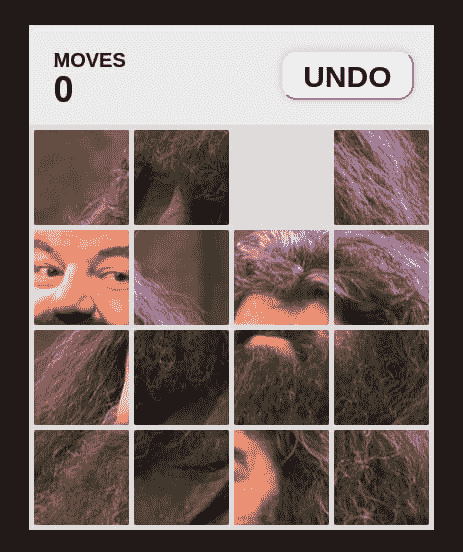

# 使用 React 钩子制作 15 个谜题的游戏

> 原文:[https://dev . to/gnsp/making-a-15-puzzle-game-using-react-hooks-3110](https://dev.to/gnsp/making-a-15-puzzle-game-using-react-hooks-3110)

### [](#we-are-making-a-what-)我们在做一个什么！

在本文中，我们将使用 React 钩子制作一个简单的 15 拼图，但是首先什么是 15 拼图呢？

正如维基百科所定义的，

*15 拼图(也称为宝石拼图、Boss 拼图、十五人游戏、神秘方块和许多其他拼图)是一种滑动拼图，由一帧随机排列的编号方块组成，其中缺少一个方块。*

然而，这个谜题的数字变体或多或少是它的数学版本。玩具店卖的一般都是游戏的形象变种。在这种变体中，每个瓦片都是图像的一个小正方形片段，当瓦片以正确的顺序排列时，完整的图像就形成了。就像下面这张图(这里拼图处于加扰状态)，

[T2】](https://res.cloudinary.com/practicaldev/image/fetch/s--vuFJSwnz--/c_limit%2Cf_auto%2Cfl_progressive%2Cq_auto%2Cw_880/https://thepracticaldev.s3.amazonaws.com/i/lsbr6v203vqcauqz2tym.png)

我们将在本文中构建这个特殊的谜题变体。当这个谜题的瓷砖排列成正确的顺序时，我们将得到鲁伯·海格的图像，他是猎场看守人，也是霍格沃茨的钥匙和场地的保管人。

### [](#a-few-observations)几点观察

在我们开始编码这个谜题之前，让我们注意一些关于这个谜题的事情；

1.  只能移动与网格中的空白方块相邻(即共享一条边)的方块。
2.  它们只能移动到空方块的位置。
3.  如果我们认为空方块是空方块，那么将相邻方块移动到空方块可以被建模为将方块的位置与空方块交换。
4.  当方块处于正确的顺序时，`i-th`方块占据网格中第`Math.floor(i / 4)`行和第`i % 4`列的方块。
5.  在任何时间点，最多只能向一个方向移动一个牌。

记住这些观察结果，让我们开始拼图。

### [](#scaffolding-and-constants)脚手架和常数

首先，让我们键入一个简单的网页，react 应用程序将在其中呈现。为简单起见，让我们用帕格比写。

```
html
  head
    title 15 Puzzle (Using React Hooks)
    meta(name='viewport', content='initial-scale=1.0')
    link(rel='stylesheet', href='/style.css')

  body
    #root
    script(type='text/javascript', src='https://cdnjs.cloudflare.com/ajax/libs/react/16.8.6/umd/react.production.min.js')
    script(type='text/javascript', src='https://cdnjs.cloudflare.com/ajax/libs/react-dom/16.8.6/umd/react-dom.production.min.js')
    script(type='text/javascript', src='/index.js') 
```

<svg width="20px" height="20px" viewBox="0 0 24 24" class="highlight-action crayons-icon highlight-action--fullscreen-on"><title>Enter fullscreen mode</title></svg> <svg width="20px" height="20px" viewBox="0 0 24 24" class="highlight-action crayons-icon highlight-action--fullscreen-off"><title>Exit fullscreen mode</title></svg>

有了这个网页结构，让我们在`index.js`中定义一些常量和实用程序。

```
const NUM_ROWS = 4;
const NUM_COLS = 4;
const NUM_TILES = NUM_ROWS * NUM_COLS;
const EMPTY_INDEX = NUM_TILES - 1;
const SHUFFLE_MOVES_RANGE = [60, 80];
const MOVE_DIRECTIONS = ['up', 'down', 'left', 'right'];

function rand (min, max) {
  return min + Math.floor(Math.random() * (max - min + 1));
} 
```

<svg width="20px" height="20px" viewBox="0 0 24 24" class="highlight-action crayons-icon highlight-action--fullscreen-on"><title>Enter fullscreen mode</title></svg> <svg width="20px" height="20px" viewBox="0 0 24 24" class="highlight-action crayons-icon highlight-action--fullscreen-off"><title>Exit fullscreen mode</title></svg>

这里，`rand`函数生成一个介于`min`和`max`之间的随机整数。常数`SHUFFLE_MOVES_RANGE`定义了为了打乱拼图板，我们想要执行的随机移动的最小和最大数量。`EMPTY_INDEX`是空瓦的索引。当所有的方块都处于正确的顺序时，右下角的方块，即第 16 个方块(数组索引 15)将是空的。

### [](#defining-the-raw-gamestate-endraw-)定义`GameState`

现在让我们为这个难题编写逻辑，并将其封装在一个名为`GameState`的类中。这个`GameState`类应该是一个[单例](https://en.wikipedia.org/wiki/Singleton_pattern)，因为在任何时候都应该只有一个游戏在应用程序中运行。所以，让我们先写一点逻辑。

为了使该类成为单例类，我们将定义一个名为`instance`的静态属性，它将保存对该类的当前实例的引用，以及一个静态方法`getInstance`，如果当前实例存在，它将返回当前实例，否则它将创建一个新实例并将其返回给我们。

```
class GameState {
  static instance = null;

  static getInstance () {
    if (!GameState.instance) GameState.instance = new GameState();
    return GameState.instance;
  }
} 
```

<svg width="20px" height="20px" viewBox="0 0 24 24" class="highlight-action crayons-icon highlight-action--fullscreen-on"><title>Enter fullscreen mode</title></svg> <svg width="20px" height="20px" viewBox="0 0 24 24" class="highlight-action crayons-icon highlight-action--fullscreen-off"><title>Exit fullscreen mode</title></svg>

在`GameState`中，我们希望跟踪棋盘的当前状态，用户已经走了多少步，以及先前棋盘状态的一个[堆栈](https://en.wikipedia.org/wiki/Stack_(abstract_data_type))，这样用户就可以撤销他/她当前的移动并回到先前的状态。

这里，我们存储的最重要的信息是拼图板的状态。先建模吧。

拼图板是一套 16 块的拼图(包括空的那块)。在任何时间点，每个图块都位于网格中的某个位置。瓦片的位置可以由表示`row index`和`column index`的两个整数来表示。我们可以将此建模为一个整数对数组，如下所示(以下是瓷砖排列顺序正确的棋盘表示):

```
[
  [0, 0], // 1st tile is at 1st row, 1st column
  [0, 1], // 2nd tile is at 1st row, 2nd column
  [0, 2],
  [0, 3], // 4th tile is at 1st row, 4th column
  [1, 0], // 5th tile is at 2nd row, 1st column
  [1, 1],
  ...
  [3, 2],
  [3, 3], // 16th tile is at 4th row, 4th column (this is the empty tile)
] 
```

<svg width="20px" height="20px" viewBox="0 0 24 24" class="highlight-action crayons-icon highlight-action--fullscreen-on"><title>Enter fullscreen mode</title></svg> <svg width="20px" height="20px" viewBox="0 0 24 24" class="highlight-action crayons-icon highlight-action--fullscreen-off"><title>Exit fullscreen mode</title></svg>

让我们编写一个静态方法来生成一个棋盘状态，在这个状态下，瓷砖的顺序是正确的，记住当瓷砖的顺序正确时，`i-th`瓷砖位于`Math.floor(i / 4) th`行和`i % 4`列。

此外，当拼图被解决时，瓷砖的顺序是正确的。因此，让我们定义一个名为`solvedBoard`的静态属性，它将存储棋盘的求解状态。

```
class GameState {
  // ...

  static getNewBoard () {
    return Array(NUM_TILES).fill(0).map((x, index) => [
      Math.floor(index / NUM_ROWS), 
      index % NUM_COLS
    ]);
  }

  static solvedBoard = GameState.getNewBoard();
} 
```

<svg width="20px" height="20px" viewBox="0 0 24 24" class="highlight-action crayons-icon highlight-action--fullscreen-on"><title>Enter fullscreen mode</title></svg> <svg width="20px" height="20px" viewBox="0 0 24 24" class="highlight-action crayons-icon highlight-action--fullscreen-off"><title>Exit fullscreen mode</title></svg>

当游戏开始时，

1.  移动计数器被设置为 0，
2.  先前状态的堆栈为空，并且
3.  棋盘处于有序状态。

然后从这种状态开始，我们在将棋盘呈现给用户解决之前对其进行洗牌/打乱。让我们写下来。此时，我们将跳过编写洗牌/打乱棋盘的方法。我们将暂时在它的位置写一个存根。

```
class GameState {
  // ...

  constructor () {
    this.startNewGame();
  }

  startNewGame () {
    this.moves = 0;
    this.board = GameState.getNewBoard();
    this.stack = [];
    this.shuffle(); // we are still to define this method, 
                    // let's put a stub in its place for now
  }

  shuffle () {
    // set a flag that we are to shuffle the board
    this.shuffling = true;

    // Do some shuffling here ...

    // unset the flag after we are done
    this.shuffling = false;
  }
} 
```

<svg width="20px" height="20px" viewBox="0 0 24 24" class="highlight-action crayons-icon highlight-action--fullscreen-on"><title>Enter fullscreen mode</title></svg> <svg width="20px" height="20px" viewBox="0 0 24 24" class="highlight-action crayons-icon highlight-action--fullscreen-off"><title>Exit fullscreen mode</title></svg>

现在，让我们定义移动瓷砖的方法。首先，我们需要确定某块瓷砖是否可以移动。让我们假设`i-th`块现在位于位置`(r, c)`。然后，仅当空图块，即`16th`图块当前与其相邻时，才可以移动`i-th`图块。要相邻，两个图块必须在同一行或同一列，如果它们在同一行，则它们的列索引的差必须等于 1，如果它们在同一列，则它们的行索引的差必须等于 1。

```
class GameState {
  // ...

  canMoveTile (index) {
    // if the tile index is invalid, we can't move it
    if (index < 0 || index >= NUM_TILES) return false;

    // get the current position of the tile and the empty tile
    const tilePos = this.board[index];
    const emptyPos = this.board[EMPTY_INDEX];

    // if they are in the same row, then difference in their 
    // column indices must be 1 
    if (tilePos[0] === emptyPos[0])
      return Math.abs(tilePos[1] - emptyPos[1]) === 1;

    // if they are in the same column, then difference in their
    // row indices must be 1
    else if (tilePos[1] === emptyPos[1])
      return Math.abs(tilePos[0] - emptyPos[0]) === 1;

    // otherwise they are not adjacent
    else return false;
  }
} 
```

<svg width="20px" height="20px" viewBox="0 0 24 24" class="highlight-action crayons-icon highlight-action--fullscreen-on"><title>Enter fullscreen mode</title></svg> <svg width="20px" height="20px" viewBox="0 0 24 24" class="highlight-action crayons-icon highlight-action--fullscreen-off"><title>Exit fullscreen mode</title></svg>

实际上，将方块移动到空方块要容易得多，我们只需要交换方块和空方块的位置。而且，我们需要做一些簿记工作，也就是说，在移动到堆栈中之前，增加移动计数器，并推送棋盘的状态。(如果我们处于洗牌阶段，我们不想计算移动数或把状态推入堆栈)。

如果棋盘已经解决，我们希望冻结棋盘，不允许进一步移动方块。但是在这一点上，我们不会实现方法来检查棋盘是否已经解决了。我们将编写一个存根来代替实际的方法。

```
class GameState {
  // ...

  moveTile (index) {
    // if we are not shuffling, and the board is already solved, 
    // then we don't need to move anything
    // Note that, the isSolved method is not defined yet
    // let's stub that to return false always, for now
    if (!this.shuffling && this.isSolved()) return false;

    // if the tile can not be moved in the first place ...
    if (!this.canMoveTile(index)) return false;

    // Get the positions of the tile and the empty tile
    const emptyPosition = [...this.board[EMPTY_INDEX]];
    const tilePosition = [...this.board[index]];

    // copy the current board and swap the positions
    let boardAfterMove = [...this.board];    
    boardAfterMove[EMPTY_INDEX] = tilePosition;
    boardAfterMove[index] = emptyPosition;

    // update the board, moves counter and the stack
    if (!this.shuffling) this.stack.push(this.board);
    this.board = boardAfterMove;
    if (!this.shuffling) this.moves += 1;

    return true;
  }

  isSolved () {
    return false; // stub
  }
} 
```

<svg width="20px" height="20px" viewBox="0 0 24 24" class="highlight-action crayons-icon highlight-action--fullscreen-on"><title>Enter fullscreen mode</title></svg> <svg width="20px" height="20px" viewBox="0 0 24 24" class="highlight-action crayons-icon highlight-action--fullscreen-off"><title>Exit fullscreen mode</title></svg>

通过观察，我们知道，在任何时间点，最多有一块瓷砖可以向任何一个方向移动。因此，如果我们知道移动的方向，我们就可以决定移动哪块瓷砖。例如，如果我们知道移动的方向是向上的，那么只有空方块正下方的瓷砖可以移动。类似地，如果给定的移动方向是向左的，那么空方块右边的方块将被移动。让我们写一个方法，从给定的移动方向推断出要移动哪块瓷砖，并移动它。

```
class GameState {
  // ...

  moveInDirection (dir) {
    // get the position of the empty square
    const epos = this.board[EMPTY_INDEX];

    // deduce the position of the tile, from the direction
    // if the direction is 'up', we want to move the tile 
    // immediately below empty, if direction is 'down', then 
    // the tile immediately above empty and so on 
    const posToMove = dir === 'up' ? [epos[0]+1, epos[1]]
      : dir === 'down' ? [epos[0]-1, epos[1]]
      : dir === 'left' ? [epos[0], epos[1]+1]
      : dir === 'right' ? [epos[0], epos[1]-1]
      : epos;

    // find the index of the tile currently in posToMove
    let tileToMove = EMPTY_INDEX;
    for (let i=0; i<NUM_TILES; i++) {
      if (this.board[i][0] === posToMove[0] && this.board[i][1] === posToMove[1]) {
        tileToMove = i;
        break;
      }
    }

    // move the tile
    this.moveTile(tileToMove);
  }
} 
```

<svg width="20px" height="20px" viewBox="0 0 24 24" class="highlight-action crayons-icon highlight-action--fullscreen-on"><title>Enter fullscreen mode</title></svg> <svg width="20px" height="20px" viewBox="0 0 24 24" class="highlight-action crayons-icon highlight-action--fullscreen-off"><title>Exit fullscreen mode</title></svg>

现在我们已经有了瓷砖移动的逻辑，让我们写方法来撤销之前的移动。这很简单，我们只需要从堆栈中弹出以前的状态并恢复它。此外，我们需要减少移动计数器。

```
class GameState {
  // ...

  undo () {
    if (this.stack.length === 0) return false;
    this.board = this.stack.pop();
    this.moves -= 1;
  }
} 
```

<svg width="20px" height="20px" viewBox="0 0 24 24" class="highlight-action crayons-icon highlight-action--fullscreen-on"><title>Enter fullscreen mode</title></svg> <svg width="20px" height="20px" viewBox="0 0 24 24" class="highlight-action crayons-icon highlight-action--fullscreen-off"><title>Exit fullscreen mode</title></svg>

在这一点上，我们已经有了大部分的游戏逻辑，除了`shuffle`和`isSloved`方法，它们目前是存根。让我们现在写那些方法。为了简单起见，我们将在棋盘上执行一些随机的移动来洗牌。为了检查棋盘是否已解，我们只需将棋盘的当前状态与我们之前定义的静态属性`solvedBoard`进行比较。

```
class GameState {
  // ...

  shuffle () {
    this.shuffling = true;
    let shuffleMoves = rand(...SHUFFLE_MOVES_RANGE);
    while (shuffleMoves --> 0) {
      this.moveInDirection (MOVE_DIRECTIONS[rand(0,3)]);
    }
    this.shuffling = false;
  }

  isSolved () {
    for (let i=0; i<NUM_TILES; i++) {
      if (this.board[i][0] !== GameState.solvedBoard[i][0] 
          || this.board[i][1] !== GameState.solvedBoard[i][1]) 
        return false;
    }
    return true;
  }
} 
```

<svg width="20px" height="20px" viewBox="0 0 24 24" class="highlight-action crayons-icon highlight-action--fullscreen-on"><title>Enter fullscreen mode</title></svg> <svg width="20px" height="20px" viewBox="0 0 24 24" class="highlight-action crayons-icon highlight-action--fullscreen-off"><title>Exit fullscreen mode</title></svg>

现在，为了方便起见，让我们编写一个方法，以一个普通对象的形式给出游戏的当前状态。

```
class GameState {
  // ...

  getState () { 
    // inside the object literal, `this` will refer to 
    // the object we are making, not to the current GameState instance.
    // So, we will store the context of `this` in a constant called `self`
    // and use it.
    // Another way to do it is to use GameState.instance instead of self.
    // that will work, because GameState is a singleton class.

    const self = this;    

    return {
      board: self.board,
      moves: self.moves,
      solved: self.isSolved(),
    };
  }
} 
```

<svg width="20px" height="20px" viewBox="0 0 24 24" class="highlight-action crayons-icon highlight-action--fullscreen-on"><title>Enter fullscreen mode</title></svg> <svg width="20px" height="20px" viewBox="0 0 24 24" class="highlight-action crayons-icon highlight-action--fullscreen-off"><title>Exit fullscreen mode</title></svg>

至此，我们的`GameState`类的实现就完成了。我们将在自定义的 react 挂钩中使用它来驱动游戏的 react 应用程序。

### `useGameState`自定义挂钩

现在让我们将 GameState 功能包装在一个自定义的 React 挂钩中，以便我们可以在 React 应用程序中使用它。在这个钩子中，我们希望为按键注册事件处理程序，以便用户可以使用键盘的方向键来玩拼图，生成单击处理程序函数，以便用户可以单击瓷砖来移动它们，我们还希望创建助手函数来撤消移动并开始新的游戏。

我们将把 keyup 事件处理程序附加到文档对象上。这仅需要在应用程序被装载时进行一次，并且在应用程序被卸载时需要移除事件处理程序。

这个钩子的主要目的是将 GameState 实例包装成 React 状态，React 组件可以使用和更新它。当然，我们不会向组件公开原始的 setState 方法。相反，我们将把像`newGame`、`undo`和`move`这样的函数暴露给组件，这样当用户想要开始一个新游戏或者撤销一个移动或者移动一个特定的方块时，它们可以触发状态更新。我们将只公开使用钩子的组件绝对需要的那部分状态和更新逻辑。(键盘事件将由附加到文档对象的侦听器处理。组件不需要访问这些事件处理程序。)

```
function useGameState () {
  // get the current GameState instance
  const gameState = GameState.getInstance();

  // create a react state from the GameState instance
  const [state, setState] = React.useState(gameState.getState());

  // start a new game and update the react state
  function newGame () {
    gameState.startNewGame();
    setState(gameState.getState());
  }

  // undo the latest move and update the react state
  function undo () {
    gameState.undo();
    setState(gameState.getState());
  }

  // return a function that will move the i-th tile 
  // and update the react state 
  function move (i) {
    return function () {
      gameState.moveTile(i);
      setState(gameState.getState());
    }
  }

  React.useEffect(() => {
    // attach the keyboard event listeners to document
    document.addEventListener('keyup', function listeners (event) {

      if (event.keyCode === 37) gameState.moveInDirection('left');
      else if (event.keyCode === 38) gameState.moveInDirection('up');
      else if (event.keyCode === 39) gameState.moveInDirection('right');
      else if (event.keyCode === 40) gameState.moveInDirection('down');

      setState(gameState.getState());
    });

    // remove the evant listeners when the app unmounts
    return (() => window.removeEventListener(listeners));
  }, [gameState]); 
  // this effect hook will run only when the GameState instance changes.
  // That is, only when the app is mounted and the GameState instance
  // is created

  // expose the state and the update functions for the components 
  return [state.board, state.moves, state.solved, newGame, undo, move];
} 
```

<svg width="20px" height="20px" viewBox="0 0 24 24" class="highlight-action crayons-icon highlight-action--fullscreen-on"><title>Enter fullscreen mode</title></svg> <svg width="20px" height="20px" viewBox="0 0 24 24" class="highlight-action crayons-icon highlight-action--fullscreen-off"><title>Exit fullscreen mode</title></svg>

### [](#the-react-components-of-the-puzzle)拼图的 React 组件

现在我们有了一个谜题的概念模型和在用户交互事件上更新该模型的函数，让我们编写一些组件来在屏幕上显示游戏。这里的游戏显示非常简单，它有一个显示用户移动次数的标题部分和撤销按钮。下面是拼图板，上面有瓷砖。当谜题被解开时，谜题板还会显示一个`PLAY AGAIN`按钮。

在拼图板上，我们不需要渲染第 16 块瓷砖，因为那代表空瓷砖。在显示中，它将保持为空。在每个显示的磁贴上，我们将添加一个`onClick`事件处理程序，这样当用户点击一个磁贴时，如果它可以移动，它就会移动。

拼图板的尺寸为`400px * 400px`，拼块将相对于拼图板绝对定位。每块瓷砖的尺寸为`95px * 95px`，瓷砖之间的间距为`5px`。

下面的函数实现了`App`组件。这是应用程序的基本布局。

```
function App () {
  const [board, moves, solved, newGame, undo, move] = useGameState();

  return (
    <div className='game-container'>
      <div className='game-header'>
        <div className='moves'>
          {moves}
        </div>
        <button className='big-button' onClick={undo}> UNDO </button>
      </div>
      <div className='board'>
      {
        board.slice(0,-1).map((pos, index) => ( 
          <Tile index={index} pos={pos} onClick={move(index)} />
        ))
      }
      { solved &&
          <div className='overlay'>
            <button className='big-button' onClick={newGame}>
              PLAY AGAIN 
            </button>
          </div>
      }
      </div>
    </div>
  );
}

ReactDOM.render(<App />, document.getElementById('root')); 
```

<svg width="20px" height="20px" viewBox="0 0 24 24" class="highlight-action crayons-icon highlight-action--fullscreen-on"><title>Enter fullscreen mode</title></svg> <svg width="20px" height="20px" viewBox="0 0 24 24" class="highlight-action crayons-icon highlight-action--fullscreen-off"><title>Exit fullscreen mode</title></svg>

现在，让我们实现`Tile`组件，它将在棋盘上显示和定位每个单独的方块。如前所述，方块将相对于棋盘绝对定位。给定一个方块的`row index`和`column index`，我们可以找到它在棋盘上的位置。我们知道网格上的每个方块的尺寸为`100px * 100px`，瓦片之间的间距为`5px`。因此，我们可以简单地将图块的`row index`和`column index`乘以 100 并加上 5，以获得图块的顶部和左侧位置。

类似地，我们可以通过找到当以正确的顺序放置时显示的背景图像的部分，来导出每个图块的背景图像的位置。首先，我们需要计算瓷砖的位置，如果摆放的顺序正确的话。我们知道`i-th`块以正确的顺序位于第`Math.floor(i / 4)`行和第`i % 4`列。由此，我们可以通过将行和列的索引乘以 100，然后再加上 5，来以从顶部开始的像素和从左侧开始的像素的形式计算位置。背景位置将是这些值的负值。

```
function Tile ({index, pos, onClick}) {
  const top = pos[0]*100 + 5;
  const left = pos[1]*100 + 5;
  const bgLeft = (index%4)*100 + 5;
  const bgTop = Math.floor(index/4)*100 + 5;

  return <div 
    className='tile'
    onClick={onClick}
    style={{top, left, backgroundPosition: `-${bgLeft}px -${bgTop}px`}} 
  />;
} 
```

<svg width="20px" height="20px" viewBox="0 0 24 24" class="highlight-action crayons-icon highlight-action--fullscreen-on"><title>Enter fullscreen mode</title></svg> <svg width="20px" height="20px" viewBox="0 0 24 24" class="highlight-action crayons-icon highlight-action--fullscreen-off"><title>Exit fullscreen mode</title></svg>

### [](#styling-the-puzzle)造型拼图

在设计拼图之前，我们需要找到一个好的`400px * 400px`图像作为我们拼图的背景图像。或者，我们也可以用数字来解谜(就像维基百科中提到的 15 道谜题)。无论如何，让我们看看设计这个应用程序的一些重要部分。

#### [](#positioning-the-board-and-the-tiles)定位木板和瓷砖

板子的实际宽度和高度将是`400px + 5px`，因为 4 列或 4 行需要 5 个槽。然而，这并不影响瓷砖的尺寸，因为我们可以放心地认为第 5 槽在板的外面。棋盘需要将 position 声明为`relative`,这样方块就可以相对于它绝对定位。

对于瓷砖，尺寸将为`95px * 95px`以考虑到`5px`排水沟。然而，它们的`background-size`应该是`400px * 400px`，因为每个区块只显示全尺寸`400px * 400px`图像中的一个特定方块。react 组件将背景位置设置为 inline 样式。

为了让磁贴的移动看起来流畅自然，我们可以使用 css 过渡。这里我们使用了 0.1 秒的渐变效果。

```
.board {
  width: 405px;
  height: 405px;
  position: relative;
  background: #ddd;
}

.tile {
  width: 95px;
  height: 95px;
  position: absolute;
  background: white;
  transition: all 0.1s ease-in-out;
  border-radius: 2px;
  background-image: url('@{bg-img}');
  background-size: 400px 400px;
} 
```

<svg width="20px" height="20px" viewBox="0 0 24 24" class="highlight-action crayons-icon highlight-action--fullscreen-on"><title>Enter fullscreen mode</title></svg> <svg width="20px" height="20px" viewBox="0 0 24 24" class="highlight-action crayons-icon highlight-action--fullscreen-off"><title>Exit fullscreen mode</title></svg>

#### [](#positioning-the-overlay)定位叠加

覆盖图是棋盘的另一个直接子棋盘。它需要在游戏结束时盖住棋盘。因此，我们将赋予它与棋盘相同的尺寸，并将其绝对放置在`(0, 0)`。它需要在瓷砖上，所以我们给它一个高的`z-index`。我们也会给它一个半透明的深色背景色。它将包含位于中心的`PLAY AGAIN`按钮，所以我们将使它成为一个伸缩容器，同时将`align-items`和`justify-content`设置为`center`。

```
.overlay {
  width: 405px;
  height: 405px;
  position: absolute;
  top: 0;
  left: 0;
  z-index: 10;
  background: #0004;
  display: flex;
  align-items: center;
  justify-content: center;
} 
```

<svg width="20px" height="20px" viewBox="0 0 24 24" class="highlight-action crayons-icon highlight-action--fullscreen-on"><title>Enter fullscreen mode</title></svg> <svg width="20px" height="20px" viewBox="0 0 24 24" class="highlight-action crayons-icon highlight-action--fullscreen-off"><title>Exit fullscreen mode</title></svg>

这支笔包含了本文中描述的所有内容。

*(原谅我在 less 文件的开头嵌入了 base64 编码格式的图像。在 codepen 上添加资源文件是一个专业版的特性，很遗憾，我是一个免费用户。)*

[https://codepen.io/gnsp/embed/YzKvWPj?height=600&default-tab=result&embed-version=2](https://codepen.io/gnsp/embed/YzKvWPj?height=600&default-tab=result&embed-version=2)

希望你喜欢阅读这个小项目，并从中学习到一些东西。你可以在的 [gnsp .找到更多关于我的信息。](https://gnsp.in)

**感谢阅读！**