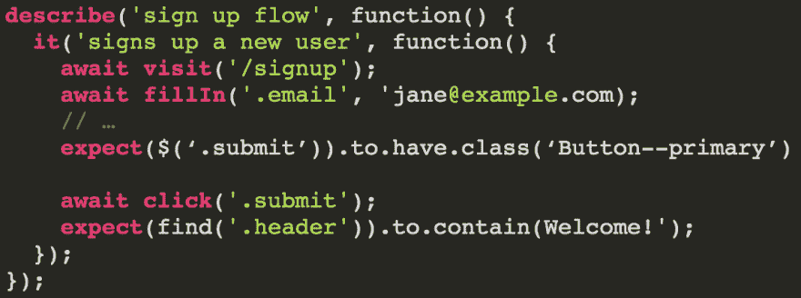
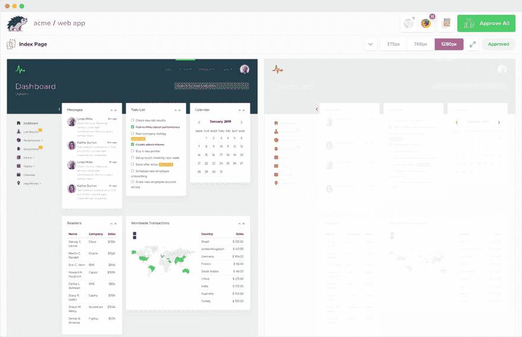

# 功能测试与视觉测试:有什么区别？

> 原文:[https://dev . to/Percy-io/functional-vs-visual-testing-what-s-the-difference-4am 5](https://dev.to/percy-io/functional-vs-visual-testing-what-s-the-difference-4am5)

如果你不知道[视觉测试](https://percy.io/visual-testing)是什么，或者你听说过它，但不确定它与你现有的测试有何不同，这篇文章就是为你准备的。

请继续阅读，了解功能测试和视觉测试之间的差异(和重叠)，视觉测试带来的好处和挑战，以及我们如何在 [Percy](https://percy.io/) 实现视觉测试。

## 视觉测试和功能测试有什么不同？

功能测试——从单元和集成测试到验收和端到端测试——检查软件的行为是否符合预期。

这些类型的测试对照期望的结果检查断言。您构建软件以特定的方式运行，并且您编写测试以确保它继续这样运行，即使在您的应用程序增长时也是如此。

自动化测试已经成为现代团队中健康软件开发实践的关键部分——但是它有其局限性。

随着软件的增长，我们中的许多人试图扩展我们的测试套件，超越那些限制，不仅检查*行为*结果，还检查*视觉元素*。在发现(或最终用户发现)一个视觉错误后，您可能试图编写功能测试来防止它再次发生。

[T2】](https://res.cloudinary.com/practicaldev/image/fetch/s--VmlP_5Zz--/c_limit%2Cf_auto%2Cfl_progressive%2Cq_auto%2Cw_880/https://miro.medium.com/max/2294/0%2AXYyygPosMzTmy0P5.png)

我们都编写了测试来检查类或其他纯视觉元素

每个人都希望确信他们的代码不会破坏某些东西。但是编写功能测试来确保视觉稳定性或捕捉视觉退化并不是解决问题的方法，而且会陷入很多陷阱。

## 对视觉元素使用功能测试的陷阱

功能测试对于对照期望的输出检查已知的输入非常有用，但是几乎不可能断言代码的视觉“正确性”。

我们应该断言什么？

应用了特定的 CSS 类。或者按钮上存在一种计算出来的样式，或者文本是一种特殊的颜色？

即使有了这些类型的断言，您实际上并没有在视觉上测试任何东西，而且有很多事情可以让您的测试“通过”，同时导致视觉上的回归。类属性可以改变；可以应用其他覆盖类，等等。也很难解释不同浏览器和设备呈现元素的方式所导致的视觉错误。

当浏览器和设备成为等式的一部分时，在测试中断言想要的结果变得更加困难。试图断言所有这些边缘情况只会加剧上面的挑战，而不会给你一个测试新出现的视觉元素的方法。

这种测试文化产生了难以驾驭的脆弱的测试套件，无论何时您实现任何类型的设计或布局更改，都需要不断地重写。

视觉测试旨在克服这些挑战。

很像功能测试，[视觉测试](https://percy.io/visual-testing)是代码审查过程的一部分。每当引入代码变更时，您可以系统地监控您的用户*实际看到了什么以及与*交互了什么，并保持您的功能测试集中在行为上。

## 视觉测试的好处和挑战

当你真正测试你的代码的视觉效果——你的用户界面——时，底层发生了什么变化并不重要。输入是相同的，但是它不是用测试断言来检查特定的输出，而是检查人眼是否能察觉到发生了什么变化。

视觉测试的工作原理是分析软件浏览器的视觉变化。然后，通过将渲染的快照与先前确定的基线进行比较，视觉测试检测两者之间的视觉变化。这些差异被称为视觉差异。

在 Percy，我们率先使用 [*DOM 快照*](https://docs.percy.io/docs/percy-platform-basics#section-snapshot-rendering-and-asset-discovery) 来获得您的 web 应用程序、静态站点或组件的最确定版本。

它们面向对象的表示允许我们操纵文档的结构、样式和内容，以便在我们自己的环境中跨浏览器和屏幕宽度重建页面。我们不需要重放任何网络请求，不需要进行任何测试设置，不需要插入模拟数据，也不需要让您的 UI 处于正确的状态。DOM 快照让我们能够更好地控制输出的可预测性。

视觉测试也有自己的挑战。视觉快照和差异本质上是静态的，这意味着使网站有趣的东西——如动画——也可能使视觉测试非常困难。

在设计 Percy 时，我们内置了几个核心功能，以使视觉测试尽可能有用。[冻结 CSS 动画和 gif](https://docs.percy.io/docs/animations)，帮助稳定[动态数据](https://docs.percy.io/docs/freezing-dynamic-data)，或者简单地[隐藏或改变 UI 元素](https://docs.percy.io/docs/percy-specific-css)有助于最小化误报。

## 带视觉检查的非判断性测试

我们的可视化测试工作流程旨在与您的功能测试套件和代码审查一起运行。

我们从功能分支中提取代码变更，并将生成的快照与您的应用之前的样子进行比较——通常是您的主分支上的任何东西。确定性渲染，加上精确的基线选取，有助于我们准确地检测和突出显示要查看的视觉变化。

[T2】](https://res.cloudinary.com/practicaldev/image/fetch/s--mormz_nM--/c_limit%2Cf_auto%2Cfl_progressive%2Cq_auto%2Cw_880/https://miro.medium.com/max/5756/1%2AJBNNyKf79fIRwCloFmmcgQ.png)

这导致了视觉测试和功能测试之间最大的意识形态差异。功能测试是为了通过或失败而编写的，而视觉测试是非判断性的——它们不会“通过”或“失败”

辨别视觉退化和有意的视觉变化总是需要人的判断。这就是为什么珀西被称为“视觉测试和审查平台。”我们既促进了视觉变化的检测，又使得对这些变化的审查协作、高效且快速。

当事情发生意外变化时得到提醒是很好的——你可能会说这是一个“失败”的测试。但是持续洞察预期的视觉变化也是非常有价值的。(我们在最近的一篇文章中写了所有关于它的内容[。)](https://blog.percy.io/why-visual-testing-is-more-than-catching-bugs-db0e817b84ed)

最终目标是让团队对每一个代码变更都充满信心，知道它们在视觉上的全部影响。如今，视觉测试是应对这一挑战的最佳解决方案。

* * *

尽管视觉“正确性”经常与功能相关，但归根结底，功能测试并不是为了检查视觉元素而设计的。视觉测试也不适合取代所有的功能测试。然而，它可以取代“可视化”回归测试，并帮助您编写更小、更集中的测试。

要了解有关 Percy 视觉测试的更多信息，请查看以下资源:

*   [视觉测试基础知识](https://docs.percy.io/docs/visual-testing-basics)
*   [珀西基础知识](https://docs.percy.io/docs/percy-platform-basics)
*   [珀西 SDK](https://docs.percy.io/docs/sdks)
*   [免费注册珀西](https://percy.io/signup)