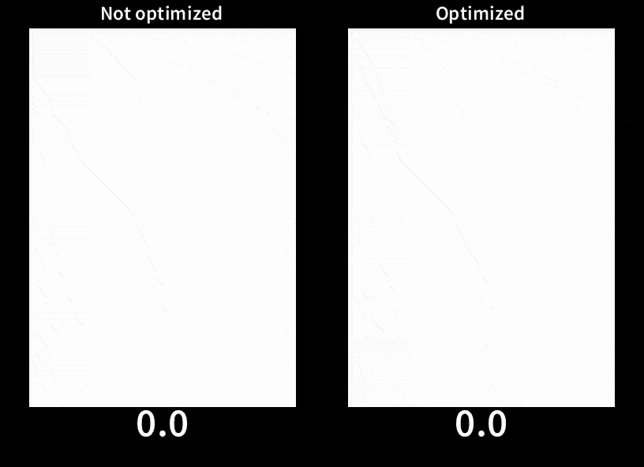
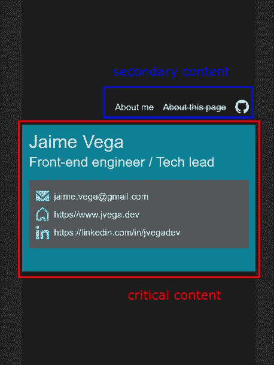
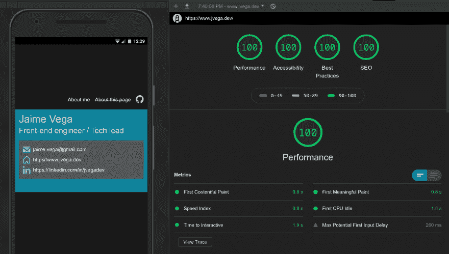

# 让网站“快”:优化页面关键渲染路径。

> 原文：<https://dev.to/jvegadev/making-the-website-fast-optimizing-the-page-critical-rendering-path-3g88>

当我开始构建 jvega.dev 时，我的主要目标之一就是确保它遵循了业界所有的最佳实践。在之前的一篇文章中，我解释了我的目标是如何获得顶级的安全性，现在，在接下来的几篇文章中，我将解释我采取了哪些技术或设计决策来使网站尽可能的*快速*。

在我进入更多细节之前，让我说两件事:

*   我确信还有改进的余地。因此，如果你有任何建议或你看到任何错误，请让我知道。代码是公开的，可以在这个库中找到。
*   我在网站上添加的一些功能肯定会被认为是矫枉过正。但是我正在使用这个网站来学习和实践我在过去 10 年中学到的东西。还有为了自我宣传:)。

从一开始，我就试图将 [PRPL 模式](https://web.dev/apply-instant-loading-with-prpl/)牢记在心，确保页面保持[【快速】](https://web.dev/what-is-speed/)。然而，定义一个网站何时“快”并不像看起来那么简单。传统上，只使用页面加载时间或`DOMContentLoaded`等指标来衡量性能，但这些指标并不有效，原因有二:

1.  它们非常不可靠，因为当这些事件被触发时，页面可能没有被完全加载。
2.  更重要的是，这些价值可能与访问者的用户体验不匹配。

为了解释第二点，让我们先来看一下这个比较:

[](https://res.cloudinary.com/practicaldev/image/fetch/s--Js4HjrFc--/c_limit%2Cf_auto%2Cfl_progressive%2Cq_66%2Cw_880/https://thepracticaldev.s3.amazonaws.com/i/0ik7qu9l28dkkhwigcc4.gif) 
**(用[WebPageTest.org 测量](https://www.webpagetest.org/)用摩托罗拉 G4 装置测量)**

*优化的*和*未优化的*版本包含完全相同数量的代码和功能。但是正如您所看到的，在优化版本中，内容是逐步加载的。在未优化的版本中，尽管它加载得更快，但在完全加载之前没有显示任何进展，因此*感知的性能*实际上可能更差，因为用户可能会认为该网站已损坏，什么也没有发生。

这是`user-centric performance metrics`背后的关键思想，确保用户*认为你的页面加载更快。*

然而，衡量绩效总是一项艰巨的任务。但幸运的是，谷歌制作了 [Lighthouse](https://developers.google.com/web/tools/lighthouse/) ，这是一个可以测量任何网站性能的工具，只需点击一下就能给你以用户为中心的价值。它甚至会给你如何改善结果的建议。

> **重要！**。要使用 Lighthouse 或任何其他工具测量性能，请确保您在匿名模式下使用您的浏览器或使用不带扩展名的配置文件*，因为它们会对结果产生重大影响。*

我的理想目标是保持 80 分以上的成绩，尽可能接近 100 分。现在，我将解释我是如何优化网站的。

这个想法是考虑你的站点中的哪些内容对你的用户更重要，并尽可能地优化该区域的加载(*关键渲染路径*)以尽可能快地显示给用户。把剩下的事情推迟。再举一个例子，Youtube 先加载视频，之后加载评论和其他部分。

所以对于我的网站，我做了如下决定:

[](https://res.cloudinary.com/practicaldev/image/fetch/s--cfAvlQpI--/c_limit%2Cf_auto%2Cfl_progressive%2Cq_auto%2Cw_880/https://thepracticaldev.s3.amazonaws.com/i/ir193j0hshfo1pet4wg2.jpg)

为了优化关键的渲染路径，我做了以下工作:

*   尽管这个网站是用 ReactJS 创建的，我还是有意识地决定只用纯 HTML+CSS 来创建关键部分。这样，我可以推迟加载 react 和相关的库。
*   我也很懒的在临界区加载图标。
*   我使用 Babel 将 ES6+编译成 ES5，但是我选择在入口点不使用*异步函数*，所以不需要`regenerator-runtime` polyfill。

这是引导页面的代码摘录:

```
import 'core-js';
import './Theme.css';
import './main.css';

function loadApp() {
  import(
    /* webpackPreload: true, webpackChunkName: 'ReactApp' */ './components/App');
}

function loadCriticalPathResources() {
  Promise.all([
    import(
      /* webpackPreload: true, webpackChunkName: 'email-icon' */ '../static/icons/email.svg'
    ),
    import(
      /* webpackPreload: true, webpackChunkName: 'home-icon' */ '../static/icons/home.svg'
    ),
    import(
      /* webpackPreload: true, webpackChunkName: 'linkedin-icon' */ '../static/icons/linkedin.svg'
    ),
  ]).then(function onSvgIconsLoaded([
    { default: emailIcon },
    { default: homeIcon },
    { default: linkedinIcon },
  ]) {
    document.getElementById('emailIcon').src = emailIcon;
    document.getElementById('homeIcon').src = homeIcon;
    document.getElementById('linkedinIcon').src = linkedinIcon;

    // Continue loading with the rest of the resouces
    setTimeout(loadApp, 100);
  });
}

// Bootstrap
// Delay loading icons as are not critical for the user experience. I aim to reduce the time to first content paint.
setTimeout(loadCriticalPathResources, 20); 
```

([链接到代码](https://github.com/jhuesos/jvega.dev/blob/loading-performance-comparison-multi-module/src/index.js))

我之前提到过一个简单的方法来评估你的网站是否*快*就是使用 Lighthouse 并确保分数超过 80。但是除此之外，为你的站点建立一个 [*性能预算*](https://web.dev/performance-budgets-101/) 也是一个好主意，例如，检查你的入口点和其他资产的捆绑大小不要超过某个阈值。

设置为最大入口包和资产大小的一个好值是`170KB`，如果您通过设置以下设置超过该值，您可以很容易地配置 Webpack 来中断构建:

```
module.exports = {
   // ...
  performance: {
    maxAssetSize: 170000,
    maxEntrypointSize: 170000,
    hints: 'error',
  }
} 
```

我希望这能给你一些技巧，你可以在构建下一个网站/应用时使用。还有很多:)。请务必查看我在本文末尾列出的一些参考网站。

啊！该网站目前的灯塔得分为...

[](https://res.cloudinary.com/practicaldev/image/fetch/s--yEcImr4P--/c_limit%2Cf_auto%2Cfl_progressive%2Cq_auto%2Cw_880/https://thepracticaldev.s3.amazonaws.com/i/d9j1hbwvza7ry3w62lyb.png)

## 优化关键渲染路径和 CSP 的挑战

我没有应用的一个重要优化是在`index.html`中内嵌属于关键路径的 JavaScript 和 CSS。这很重要，因为将加载站点所需的 HTTP 请求数量减少到最小是非常重要的。

不幸的是，具有推荐值的*内容安全策略*不允许在站点中有内嵌的`<script>`或`<style>`标签。您可以使用一些选项以安全的方式实现这一点，但是这要求每个请求的`index.html`和 HTTP 头都是动态值。由于我在[Netlify](https://www.netlify.com/)主持网站，所以这是不可能的。而在稍微差一点的性能和更好的安全性之间，我选择了后者。在以后的文章中，我将解释如何做到这一点。

## 资源

*   [Web.dev](https://web.dev/fast)
*   [PRPL 模式](https://developers.google.com/web/fundamentals/performance/prpl-pattern/)
*   [以用户为中心的绩效指标](https://developers.google.com/web/fundamentals/performance/user-centric-performance-metrics)
*   [WebPageTest.org](https://www.webpagetest.org/)