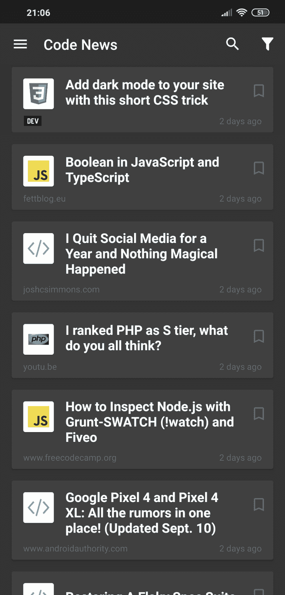
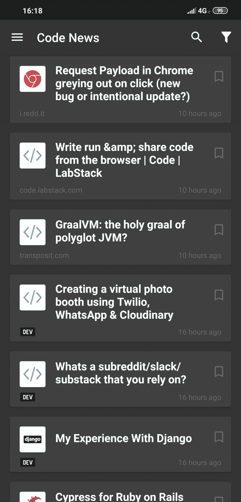

# 我们将开发人员的文章添加到我们的编码新闻应用程序中

> 原文：<https://dev.to/romeoonisim/we-added-dev-articles-into-our-coding-news-app-5b2c>

***揭秘**:这是我在这里写的第一篇文章，最近发现**开发到**社区*😊

**历史:**
作为一名 HackerNews、Reddit 和 ProductHunt 的活跃读者，有一天我想在我工作的领域——Web 开发——寻找一些关于编码和编程语言的新闻。

由于我当时在用手机，所以我搜索了 GooglePlay marketplace，看看是否有我可以每天使用的应用程序来保持更新。令我惊讶的是，我找不到任何我能用的。🤔

所以我和一个同事合作开发了这个应用。我做了后端，用 RESTful API 聚合多个 RSS/JSON 源，他做了 Android 应用。💪

我们把这个 app 简单的叫做 [*【代码新闻-程序员新闻】*](https://play.google.com/store/apps/details?id=ro.crxapps.codenews) 。因为我在寻找不同的来源来整合新的新闻到应用程序中。我遇到了 dev.to 社区。我立刻爱上了它的设计和他们的精彩文章。

我联系了他们，他们给了我一个 RSS 源，让我添加到应用程序中。谢谢大家！❤️

我们还为应用程序中的 dev.to 文章做了一个小的定制:

| img1 | img2 |
| --- | --- |
|  |  |

我们希望你们能给我们的项目一些反馈。我们还和另一个朋友聊过，他也在开发 iOS 版本😄所以来了！你可以在这里查看安卓版本[。](https://play.google.com/store/apps/details?id=ro.crxapps.codenews)

感谢 **DEV** 社区提供的精彩文章！🙇‍♂️