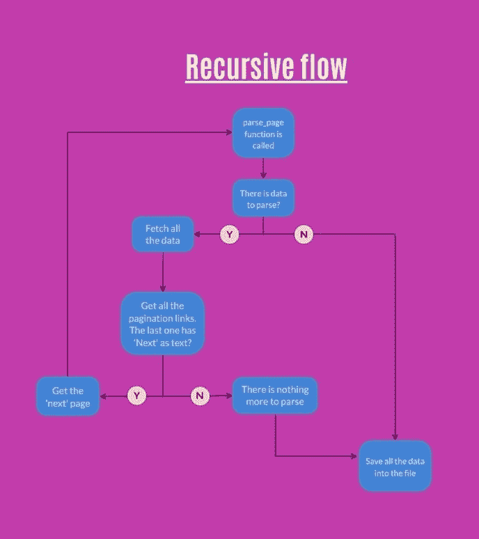
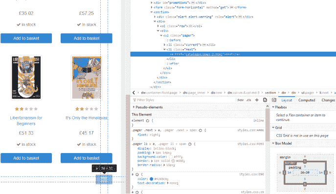
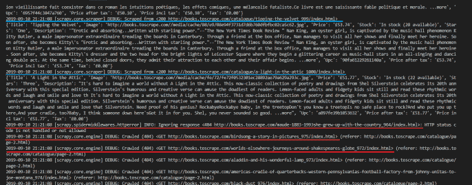
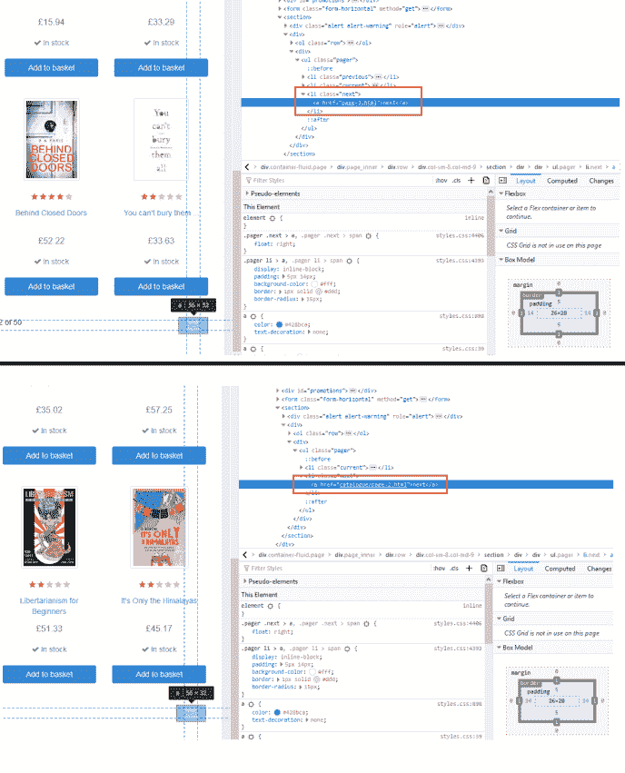

# 如何进入下一页- 03 - Python scrapy 初学者教程

> 原文：<https://dev.to/davidmm1707/how-to-go-to-the-next-page-03-python-scrapy-tutorial-for-beginners-33if>

原帖 [Python Scrapy 初学者教程–03–如何进入下一页](https://letslearnabout.net/tutorial/python-scrapy-tutorial-for-beginners-03-how-to-go-to-the-next-page/)

# Python 初学者剪贴簿教程- 03

[](https://res.cloudinary.com/practicaldev/image/fetch/s--0FQ_5-tP--/c_limit%2Cf_auto%2Cfl_progressive%2Cq_auto%2Cw_880/https://i2.wp.com/letslearnabout.net/wp-content/uploads/2019/09/image-8.png%3Fw%3D688%26ssl%3D1)

在上一课中，[用 Scrapy 提取所有数据，](https://letslearnabout.net/tutorial/python-scrapy-tutorial-for-beginners-02-extract-all-the-data/)我们设法获取了所有书籍的 URL，然后从每本书中提取数据。我们被限制在主页上的书籍，因为我们不知道如何使用 Scrapy 进入下一页。

直到现在。

在这篇文章中，你将学习如何:

*   导航到“下一页”
*   解决路由问题
*   提取每本书的所有数据

[https://www.youtube.com/embed/mDUCyn6pxwQ](https://www.youtube.com/embed/mDUCyn6pxwQ)

* * *

### 我们的游戏计划

[](https://res.cloudinary.com/practicaldev/image/fetch/s--2rarzD95--/c_limit%2Cf_auto%2Cfl_progressive%2Cq_auto%2Cw_880/https://i0.wp.com/www.hondurassoccer.com/wp-content/uploads/2014/06/pizarra-estrategia.png%3Fw%3D688)

最初，我们只是列出所有书籍的网址，然后，一个接一个，我们提取数据。

因为我们有 20 本书，所以我们只列出了 20 本书的 URL，然后解析这 20 个 URL，产生结果。

我们只需要再增加一个步骤。

现在，我们将列出 20 个图书 URL，解析它们，然后，如果有“下一页”,我们将导航到它以重复这个过程，列出并产生新的 20 个图书 URL，直到没有更多的页面。

在我们的[美汤教程](https://letslearnabout.net/python/beautiful-soup/your-first-web-scraping-script-with-python-beautiful-soup/)中，我们使用了相同的策略:

[](https://res.cloudinary.com/practicaldev/image/fetch/s--i66qgwk1--/c_limit%2Cf_auto%2Cfl_progressive%2Cq_auto%2Cw_880/https://i0.wp.com/letslearnabout.net/wp-content/uploads/2019/08/Untitled-Project.jpg%3Fw%3D688%26ssl%3D1)

这就是我们现在要开始使用的。

* * *

### 检查是否有“下一页”

让我们从第二课中使用的代码开始，[提取所有数据](https://letslearnabout.net/tutorial/python-scrapy-tutorial-for-beginners-02-extract-all-the-data/):

```
# -*- coding: utf-8 -*-
import scrapy

class SpiderSpider(scrapy.Spider):
    name = 'spider'
    allowed_domains = ['books.toscrape.com']
    start_urls = ['http://books.toscrape.com/']
    base_url = 'http://books.toscrape.com/'

    def parse(self, response):
        all_books = response.xpath('//article[@class="product_pod"]')

        for book in all_books:
            book_url = self.start_urls[0] + 
                book.xpath('.//h3/a/@href').extract_first()

            yield scrapy.Request(book_url, callback=self.parse_book)

    def parse_book(self, response):
        title = response.xpath('//div/h1/text()').extract_first()

        relative_image = response.xpath('//div[@class="item active"]/img/@src').extract_first()
        final_image = self.base_url + relative_image.replace('../..', '')

        price = response.xpath(
            '//div[contains(@class, "product_main")]/p[@class="price_color"]/text()').extract_first()
        stock = response.xpath(
            '//div[contains(@class, "product_main")]/p[contains(@class, "instock")]/text()').extract()[1].strip()
        stars = response.xpath(
            '//div/p[contains(@class, "star-rating")]/@class').extract_first().replace('star-rating ', '')
        description = response.xpath(
            '//div[@id="product_description"]/following-sibling::p/text()').extract_first()
        upc = response.xpath(
            '//table[@class="table table-striped"]/tr[1]/td/text()').extract_first()
        price_excl_tax = response.xpath(
            '//table[@class="table table-striped"]/tr[3]/td/text()').extract_first()
        price_inc_tax = response.xpath(
            '//table[@class="table table-striped"]/tr[4]/td/text()').extract_first()
        tax = response.xpath(
            '//table[@class="table table-striped"]/tr[5]/td/text()').extract_first()

        yield {
            'Title': title,
            'Image': final_image,
            'Price': price,
            'Stock': stock,
            'Stars': stars,
            'Description': description,
            'Upc': upc,
            'Price after tax': price_excl_tax,
            'Price incl tax': price_inc_tax,
            'Tax': tax,
        } 
```

由于这目前正在工作，我们只需要在 for 循环结束后检查是否有“下一步”按钮。右键单击下一步按钮:

[](https://res.cloudinary.com/practicaldev/image/fetch/s--mYK_Wn8e--/c_limit%2Cf_auto%2Cfl_progressive%2Cq_auto%2Cw_880/https://i0.wp.com/letslearnabout.net/wp-content/uploads/2019/09/image-9.png%3Ffit%3D688%252C398%26ssl%3D1)

下一页的 URL 在一个*一个*标签里面，在一个*李*标签里面。你知道如何提取它，所以创建一个 _next_page_url _ 我们可以导航到。请注意，它是一个部分 URL，所以您需要添加基本 URL。就像我们以前做的那样，你可以自己做。试试看。

我是这样做的:

```
 for book in all_books:
            book_url = self.start_urls[0] + 
                book.xpath('.//h3/a/@href').extract_first()

            yield scrapy.Request(book_url, callback=self.parse_book)

        # New code:
        next_page_partial_url = response.xpath(
            '//li[@class="next"]/a/@href').extract_first()

        next_page_url = self.base_url + next_page_partial_url
        yield scrapy.Request(next_page_url, callback=self.parse) 
```

用*scrapy crawl spider-o next _ page . JSON*运行代码，检查结果。

这是怎么回事？文件中只有 20 个元素！让我们检查日志，看看发生了什么事。

[](https://res.cloudinary.com/practicaldev/image/fetch/s--j9XG-OLf--/c_limit%2Cf_auto%2Cfl_progressive%2Cq_auto%2Cw_880/https://i2.wp.com/letslearnabout.net/wp-content/uploads/2019/09/image-10.png%3Ffit%3D688%252C269%26ssl%3D1)

我们设法弄到了第一批 20 本书，但是突然之间，我们再也买不到更多的书了…

*books.toscrape.com*是由[抓取中心](https://scrapinghub.com/)制作的一个网站，用来训练人们抓取网页，他们有一些你需要注意的小陷阱。比较成功的 URL(蓝色下划线)和失败的 URL(红色下划线)。每个路由上都有 _/catalogue _missing。他们添加它不是为了让你失败。

让我们解决这个问题。

* * *

### 解决‘书’的路由问题

由于有些 URL 缺少*/目录*，我们来检查一下:如果路由没有，我们就把它加到部分 URL 的前缀上。就这么简单。

继续之前，请自行尝试。你可以在这里查看我的代码:

```
 for book in all_books:
            book_url = book.xpath('.//h3/a/@href').extract_first()

            if 'catalogue/' not in book_url:
                book_url = 'catalogue/' + book_url

            book_url = self.base_url + book_url 
```

让我们再次运行代码！应该管用吧？*scrapy crawl spider-o next _ page . JSON*

现在我们有更多的书了！但只有 40 岁。我们设法得到了第一个 20，然后是下一个 20。然后，发生了一件事。我们没有从第二页拿到第三页。让我们转到第二页，看看“下一步”按钮是怎么回事，并将其与第一个按钮(及其到第二个按钮的链接)进行比较

[](https://res.cloudinary.com/practicaldev/image/fetch/s--qa74aM2W--/c_limit%2Cf_auto%2Cfl_progressive%2Cq_auto%2Cw_880/https://i1.wp.com/letslearnabout.net/wp-content/uploads/2019/09/image-11.png%3Ffit%3D688%252C851%26ssl%3D1)

我们遇到了与书籍相同的问题:有些链接有*/目录*，有些没有。

* * *

### 解决‘下一个’路由问题

因为我们有同样的问题，所以我们有同样的解决方案。一个你可以轻松解决的问题。你为什么不试试？同样，你只需要检查链接和前缀*/目录*，以防子字符串不存在。

如果你不能解决它，这是我的解决方案:

```
next_page_partial_url = response.xpath(
            '//li[@class="next"]/a/@href').extract_first()

        if next_page_partial_url:
            if 'catalogue/' not in next_page_partial_url:
                next_page_partial_url = "catalogue/" + next_page_partial_url

            next_page_url = self.base_url + next_page_partial_url
            yield scrapy.Request(next_page_url, callback=self.parse) 
```

您可以看到这种模式:我们获取部分 URL，检查是否缺少*/catalog*，如果缺少，我们添加它。然后，我们添加 base_url，我们就有了我们的绝对 url。

再次运行蜘蛛: *scrapy 抓取蜘蛛-o next_page.json* 。

现在我们有 1000 本书了。每一个都是。🙂

这是最后的代码:

```
# -*- coding: utf-8 -*-
import scrapy

class SpiderSpider(scrapy.Spider):
    name = 'spider'
    allowed_domains = ['books.toscrape.com']
    start_urls = ['http://books.toscrape.com/']
    base_url = 'http://books.toscrape.com/'

    def parse(self, response):
        all_books = response.xpath('//article[@class="product_pod"]')

        for book in all_books:
            book_url = book.xpath('.//h3/a/@href').extract_first()

            if 'catalogue/' not in book_url:
                book_url = 'catalogue/' + book_url

            book_url = self.base_url + book_url

            yield scrapy.Request(book_url, callback=self.parse_book)

        next_page_partial_url = response.xpath(
            '//li[@class="next"]/a/@href').extract_first()

        if next_page_partial_url:
            if 'catalogue/' not in next_page_partial_url:
                next_page_partial_url = "catalogue/" + next_page_partial_url

            next_page_url = self.base_url + next_page_partial_url
            yield scrapy.Request(next_page_url, callback=self.parse)

    def parse_book(self, response):
        title = response.xpath('//div/h1/text()').extract_first()

        relative_image = response.xpath(
            '//div[@class="item active"]/img/@src').extract_first()
        final_image = self.base_url + relative_image.replace('../..', '')

        price = response.xpath(
            '//div[contains(@class, "product_main")]/p[@class="price_color"]/text()').extract_first()
        stock = response.xpath(
            '//div[contains(@class, "product_main")]/p[contains(@class, "instock")]/text()').extract()[1].strip()
        stars = response.xpath(
            '//div/p[contains(@class, "star-rating")]/@class').extract_first().replace('star-rating ', '')
        description = response.xpath(
            '//div[@id="product_description"]/following-sibling::p/text()').extract_first()
        upc = response.xpath(
            '//table[@class="table table-striped"]/tr[1]/td/text()').extract_first()
        price_excl_tax = response.xpath(
            '//table[@class="table table-striped"]/tr[3]/td/text()').extract_first()
        price_inc_tax = response.xpath(
            '//table[@class="table table-striped"]/tr[4]/td/text()').extract_first()
        tax = response.xpath(
            '//table[@class="table table-striped"]/tr[5]/td/text()').extract_first()

        yield {
            'Title': title,
            'Image': final_image,
            'Price': price,
            'Stock': stock,
            'Stars': stars,
            'Description': description,
            'Upc': upc,
            'Price after tax': price_excl_tax,
            'Price incl tax': price_inc_tax,
            'Tax': tax,
        } 
```

* * *

### 结论

你今天达到了一个里程碑。现在你可以从一个网站中提取每一个元素。

你已经知道了你需要得到第一页上的所有元素，单独地删除它们，以及如何转到下一页重复这个过程。让我再一次展示这张图表:

[](https://res.cloudinary.com/practicaldev/image/fetch/s--i66qgwk1--/c_limit%2Cf_auto%2Cfl_progressive%2Cq_auto%2Cw_880/https://i0.wp.com/letslearnabout.net/wp-content/uploads/2019/08/Untitled-Project.jpg%3Fw%3D688%26ssl%3D1)

不仅如此。这个例子很棘手，因为我们必须检查部分 URL 是否有*/catalog*来添加它。

通常情况下，用 Scrapy 对网站进行分页更容易，因为“下一步”按钮包含完整的 URL，所以这个例子比正常情况下更难，但你还是成功了！

但是…如果我告诉你这比我们以前做的更容易呢？

与其拿着你的干草叉直奔我家，不如去参加第四课，在那里你将学会如何使用爬行器以更简单的方式刮每一件物品。

* * *

[我的 Youtube 教程视频](https://www.youtube.com/channel/UC9OLm6YFRzr4yjlw4xNWYvg?sub_confirmation=1)

[Github 上的最终代码](https://github.com/david1707/scrapy_tutorial/tree/03_lesson)

[在 Twitter 上联系我](https://twitter.com/DavidMM1707)

[上一课:02–创建您的第一个蜘蛛](https://letslearnabout.net/tutorial/python-scrapy-tutorial-for-beginners-02-extract-all-the-data/)