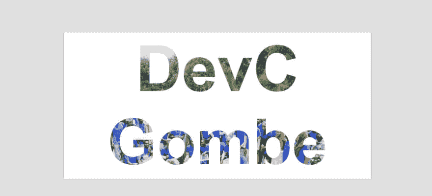

# 使用 HTML 和 CSS 创建“用图像填充文本”效果。

> 原文：<https://dev.to/iamdejean/creating-a-fill-text-with-image-effect-using-html-and-css-ekc>

[](https://res.cloudinary.com/practicaldev/image/fetch/s--S-jO-OgD--/c_limit%2Cf_auto%2Cfl_progressive%2Cq_auto%2Cw_880/https://thepracticaldev.s3.amazonaws.com/i/z3mw2wo6bktkcfkmch3p.JPG)

在图片上添加文字可以让你的网站看起来很棒。这对于获得读者的关注非常重要。这是一种流行的技术，也是 Adobe Photoshop/Illustrator 中的经典效果，这要归功于剪辑蒙版的强大功能。它将图像剪辑到文本中，这意味着只有直接位于实际文本上方的图像区域保持可见，从而产生图像位于文本内部的错觉。图像的其余部分现在从视图中隐藏，这创建了一个实心填充层。使用 CSS 也可以达到同样的效果。这是我如何创建它的。
首先，我创建了一个 index.html 文件，标记有一个带有 ID“title”的 h1 标签。
其次，我创建了一个 style.css 文件，并将其链接到我的 index.html。CSS 有来自我的 index.html 的标签、类和 id，给它们一些基本的属性。
因为 ID `title`是我的 `h1` 所在的位置，我给它添加了一个背景剪辑属性。
background-clip CSS 属性设置元素的背景是否延伸到其边框、填充框或内容框之下。

```
 background-clip: text;
-webkit-background-clip: text;
-webkit-text-fill-color: transparent; 
```

<svg width="20px" height="20px" viewBox="0 0 24 24" class="highlight-action crayons-icon highlight-action--fullscreen-on"><title>Enter fullscreen mode</title></svg> <svg width="20px" height="20px" viewBox="0 0 24 24" class="highlight-action crayons-icon highlight-action--fullscreen-off"><title>Exit fullscreen mode</title></svg>

如果元素没有背景图像或背景颜色，则该属性仅在边框有透明区域或部分不透明区域(由于边框样式或边框图像)时才有视觉效果。

codepen:[https://codepen.io/iamdejean/pen/wvwjjer](https://codepen.io/iamdejean/pen/wvwjjer)github:[https://github.com/iamdejean/Fill-text-with-image-using-CSS](https://github.com/iamdejean/Fill-text-with-image-using-CSS)